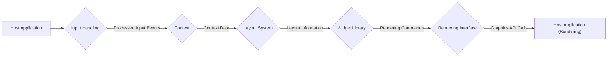
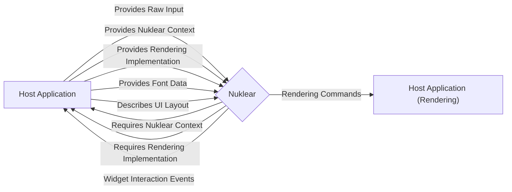
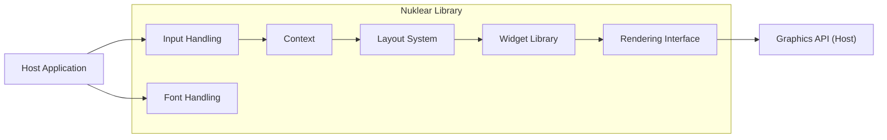
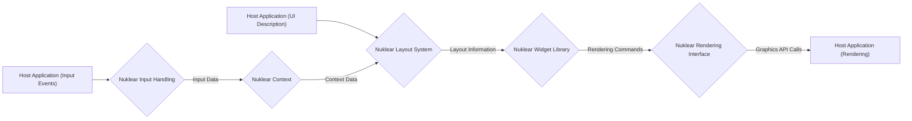

# Project Design Document: Nuklear UI Library

**Version:** 1.1
**Date:** October 26, 2023
**Author:** Gemini (AI Language Model)
**Project Repository:** https://github.com/vurtun/nuklear

## 1. Introduction

This document provides a detailed design overview of the Nuklear immediate-mode graphical user interface (GUI) library. The primary purpose of this document is to serve as a foundational resource for subsequent threat modeling activities. It meticulously outlines the key components, the intricate flow of data, and the critical interaction points within the Nuklear library and its integration with host applications. This detailed understanding is essential for identifying potential security vulnerabilities.

## 2. Goals and Objectives

*   To furnish a comprehensive and easily understandable architectural overview of the Nuklear library.
*   To clearly identify the core components of Nuklear and delineate their specific responsibilities within the system.
*   To meticulously describe the flow of data within the library, with a particular emphasis on the journey of user input and the generation of rendering output.
*   To explicitly outline the various interaction points and interfaces between the Nuklear library and the host application it is embedded within.
*   To establish a precise understanding of the system's boundaries, interfaces, and internal workings to facilitate effective and targeted threat modeling.

## 3. System Overview

Nuklear is characterized as a single-header, ANSI C-based immediate-mode GUI library, specifically engineered for high portability and straightforward integration into diverse projects. A defining characteristic of immediate-mode GUIs like Nuklear is that they do not maintain persistent internal state for UI elements. Instead, the host application is responsible for describing the desired UI layout and the current state of its elements in every frame that needs to be rendered. Nuklear's role is then to process this frame-by-frame description and generate the necessary low-level rendering commands that the host application can use to draw the UI.

**Key Characteristics:**

*   **Immediate Mode Paradigm:** UI elements are described and rendered anew in each frame. This contrasts with retained-mode GUIs where the library maintains the UI state. This paradigm has implications for state management and potential vulnerabilities.
*   **Single Header Implementation:** The entire library is contained within a single header file, significantly simplifying the process of integrating Nuklear into existing projects.
*   **Standard ANSI C:**  The use of standard ANSI C ensures a high degree of portability across a wide range of operating systems, hardware architectures, and compilers.
*   **Minimal External Dependencies:** Nuklear is designed to have very few external dependencies, which reduces the overall complexity of the system and minimizes the potential attack surface introduced by third-party libraries.
*   **Focus on Rendering Command Generation:**  Nuklear's primary responsibility is to take the UI description provided by the host application and translate it into a series of rendering commands. It does not handle application state management or event loop processing.

## 4. Architecture and Components

The Nuklear library can be conceptually decomposed into the following distinct yet interconnected components:

*   **Input Handling Component:**
    *   **Responsibility:** This component is responsible for receiving raw input events, such as mouse movements, mouse button presses, keyboard key presses, and text input, directly from the host application.
    *   **Functionality:** It processes these raw events to interpret user interactions with the various UI elements defined for the current frame. This involves determining which widget is being interacted with and the nature of the interaction.
    *   **State Management:**  It maintains transient internal state related to input, such as the current mouse position, the state of mouse buttons (pressed or released), and keyboard modifiers. This state is typically short-lived and relevant only to the current frame.
*   **Context Component:**
    *   **Responsibility:** The Nuklear context is the central data structure that encapsulates the complete state of the UI for the currently being processed frame.
    *   **Data Storage:** It holds critical information about active windows, the current layout hierarchy, the properties of individual widgets, and the current input state.
    *   **Host Management:**  Crucially, the Nuklear context is typically allocated and managed directly by the host application. This means the host application has direct access to and control over this critical data structure.
*   **Layout System Component:**
    *   **Responsibility:** This component provides the API and logic for defining the structural arrangement and spatial relationships of UI elements within windows.
    *   **Functionality:** It offers functions that allow the host application to specify how widgets should be positioned, sized, and aligned relative to each other within a window. This includes concepts like rows, columns, and groups.
    *   **No Persistent State:** The layout system itself does not maintain persistent state between frames. The host application must describe the layout anew in each frame.
*   **Widget Library Component:**
    *   **Responsibility:** This component comprises a collection of pre-built, reusable UI elements, such as buttons, sliders, text boxes, labels, and checkboxes.
    *   **Functionality:** Each widget in the library has associated logic for:
        *   Detecting and responding to user input events relevant to that specific widget type.
        *   Generating the necessary rendering commands to draw the widget based on its current state and user interactions.
        *   Potentially updating the Nuklear context based on user interactions (e.g., a button press).
*   **Rendering Interface Component:**
    *   **Responsibility:** This component defines an abstract interface that specifies the set of primitive drawing operations required to render the UI.
    *   **Abstraction Layer:** It acts as an abstraction layer, decoupling the core Nuklear logic from the specifics of any particular graphics API.
    *   **Host Implementation:** The concrete implementation of this interface is provided by the host application. This allows Nuklear to be used with various rendering backends (e.g., OpenGL, DirectX, Vulkan, software renderers).
    *   **Primitive Operations:**  The interface typically includes functions for drawing basic shapes (rectangles, circles, lines), text, and images.
*   **Font Handling Component:**
    *   **Responsibility:** This component is responsible for managing the loading, storage, and utilization of fonts for rendering text within the UI.
    *   **Functionality:** It provides mechanisms for:
        *   Loading font data from various sources.
        *   Accessing glyph information (metrics, bitmaps/outlines).
        *   Measuring the dimensions of text strings for layout purposes.

## 5. Data Flow

The typical flow of data within Nuklear during the processing of a single frame can be visualized as follows:

**Detailed Breakdown of Data Flow:**

1. **Host Application Provides Input:** The host application is the initial source of all user interaction data. It captures raw input events from the underlying operating system or input devices (e.g., mouse, keyboard, touchscreens) and then feeds these raw events into the appropriate functions provided by Nuklear's Input Handling component.
    *   **Examples of Input Data:** Mouse cursor coordinates, mouse button states (pressed/released), keyboard key presses and releases, text input from the keyboard.
2. **Input Handling Updates Context:** The Input Handling component receives the raw input events from the host application. It then processes these events to determine the nature of the user interaction and updates the relevant fields within the Nuklear Context to reflect this interaction.
    *   **Examples of Context Updates:** Setting the currently active window based on mouse clicks, updating the mouse cursor position within the context, marking buttons as being pressed or released, storing text input.
3. **Host Application Describes UI using Layout System and Widgets:**  In each frame, the host application uses Nuklear's API, specifically the functions provided by the Layout System and Widget Library, to describe the desired structure and content of the user interface for that frame. This involves:
    *   **Window Creation and Management:** Creating windows and defining their properties (e.g., title, position, size, flags).
    *   **Layout Definition:** Utilizing layout functions (e.g., `nk_layout_row_dynamic`, `nk_layout_space_begin`) to arrange widgets within the created windows.
    *   **Widget Instantiation and Configuration:** Calling functions from the Widget Library (e.g., `nk_button_label`, `nk_slider_float`, `nk_edit_string`) to instantiate specific UI elements and configure their properties (e.g., button labels, slider ranges, text box content).
    *   **Context Interaction:** Widget functions internally interact with the Context to determine their current state and to generate the necessary rendering commands based on that state and any user interactions.
4. **Widget Library Generates Rendering Commands:** Based on the current state of the UI elements (as determined by the Context) and any user interactions, the Widget Library generates a series of abstract rendering commands. These commands are intentionally abstract and independent of any specific underlying graphics API.
    *   **Examples of Rendering Commands:** Draw a filled rectangle at coordinates (x, y) with width w and height h and color c, draw text string "Hello" at position (tx, ty) using font f and color tc.
5. **Rendering Interface Translates to Graphics API Calls:** The Rendering Interface component, whose concrete implementation is provided by the host application, takes the abstract rendering commands generated by the Widget Library and translates them into specific function calls appropriate for the chosen graphics API being used by the host application.
    *   **Examples of Graphics API Calls:** If using OpenGL, the abstract "draw rectangle" command might be translated into a series of `glVertexAttribPointer` and `glDrawArrays` calls. If using DirectX, it might be translated into calls to `DrawIndexedPrimitive`.
6. **Host Application Renders the UI:** Finally, the host application executes the translated graphics API calls to actually draw the user interface to the screen, completing the rendering process for the current frame.

## 6. Key Interactions with Host Application

Nuklear's functionality is deeply intertwined with the host application. The following highlights the key areas of interaction:

*   **Input Provision:** The host application bears the responsibility of capturing raw input events from the operating system or input devices and subsequently providing these events to Nuklear through its input handling API.
*   **Context Management:**  The host application is typically responsible for allocating and managing the lifecycle of the central Nuklear context structure. This includes initialization and destruction.
*   **Rendering Implementation:** A crucial interaction point is the provision of the concrete implementation for Nuklear's abstract rendering interface. The host application must supply the functions that translate Nuklear's rendering commands into API calls for the chosen graphics library (e.g., OpenGL, DirectX).
*   **Font Loading and Management:** The host application is responsible for loading font data from files or other sources and making this font data available to Nuklear for text rendering.
*   **Memory Management (Beyond Context):** While Nuklear has its own internal memory management mechanisms for transient allocations, the host application controls the allocation of the main context and may also provide custom memory allocators to Nuklear if needed.
*   **Event Handling (Application Logic):** Nuklear provides mechanisms for detecting user interactions with widgets (e.g., button clicks, slider changes). However, the host application is responsible for implementing the actual application logic that should be executed in response to these events. Nuklear primarily *detects* the interaction; the host *reacts* to it.
*   **UI Description:** In each frame, the host application actively describes the desired UI layout and state to Nuklear using its API. This is a continuous interaction that happens every time the UI needs to be rendered.

## 7. Security Considerations (For Threat Modeling)

Based on the architectural design and data flow described above, several potential security considerations emerge that should be carefully examined during threat modeling:

*   **Insufficient Input Validation:**
    *   **Threat:** Malicious or malformed input provided by the host application could potentially exploit vulnerabilities within Nuklear's input handling logic.
    *   **Examples:**
        *   **Buffer Overflows:**  If Nuklear doesn't properly validate the size of text input provided by the host, it could lead to buffer overflows when copying this data internally.
        *   **Integer Overflows:**  Large or negative values for mouse coordinates or other input parameters could cause integer overflows in calculations, leading to unexpected behavior or crashes.
        *   **Format String Vulnerabilities:** If Nuklear uses input strings directly in formatting functions without proper sanitization, it could be vulnerable to format string attacks.
*   **Resource Exhaustion:**
    *   **Threat:** A malicious host application or carefully crafted user interactions could potentially cause Nuklear to consume excessive system resources, leading to a denial-of-service condition.
    *   **Examples:**
        *   **Excessive Widget Creation:** A malicious host could continuously create a large number of UI elements, consuming excessive memory.
        *   **Complex Layouts:**  Extremely complex or deeply nested UI layouts could lead to excessive CPU usage during layout calculations.
        *   **Large Text Input:**  Providing extremely large strings as input to text editing widgets could consume significant memory.
*   **Nuklear Context Manipulation:**
    *   **Threat:** Since the host application typically manages the Nuklear context, a compromised or malicious host application could directly manipulate the context data in ways that lead to security vulnerabilities.
    *   **Examples:**
        *   **Bypassing Security Checks:**  A malicious host could directly modify context flags or variables to bypass intended security checks or limitations within Nuklear.
        *   **Injecting Malicious State:**  The host could inject malicious data into the context that is later used by Nuklear, leading to unexpected or harmful behavior.
*   **Vulnerabilities in Host Rendering Implementation:**
    *   **Threat:** While Nuklear generates abstract rendering commands, the actual rendering is performed by the host application. Vulnerabilities in the host's rendering implementation could be exploited.
    *   **Examples:**
        *   **Shader Vulnerabilities:** If the host uses shaders to render Nuklear's output, vulnerabilities in those shaders could be exploited.
        *   **Graphics Driver Bugs:** Bugs in the underlying graphics drivers could be triggered by specific rendering commands generated by Nuklear.
        *   **Resource Leaks:** The host's rendering implementation might have resource leaks when handling Nuklear's rendering commands.
*   **Font Handling Vulnerabilities:**
    *   **Threat:** Vulnerabilities could exist in the way Nuklear or the host application loads and processes font data.
    *   **Examples:**
        *   **Buffer Overflows in Font Parsers:**  Parsing malicious font files could lead to buffer overflows.
        *   **Denial of Service:**  Loading specially crafted font files could cause excessive memory consumption or processing time.
*   **Integer Overflows/Underflows in Internal Calculations:**
    *   **Threat:**  Calculations within Nuklear related to layout, sizing, or rendering could be susceptible to integer overflows or underflows, potentially leading to memory corruption or incorrect behavior.
*   **Buffer Overflows in Internal Data Structures:**
    *   **Threat:**  Areas where Nuklear copies data into internal fixed-size buffers without proper bounds checking could be vulnerable to buffer overflows.

## 8. Diagrams

### 8.1. Component Diagram

### 8.2. Data Flow Diagram (Detailed)

## 9. Assumptions and Constraints

*   It is assumed that the host application will generally provide valid and well-formed input data to the Nuklear library. However, threat modeling must consider scenarios where this assumption is violated.
*   The security of the overall system is partially dependent on the correctness and security of the host application's rendering implementation.
*   The host application is responsible for the proper initialization and management of the Nuklear context.
*   This design document primarily focuses on the core Nuklear library itself and does not delve into the specifics of particular language bindings or integrations with external libraries or frameworks.

## 10. Future Considerations

*   Conduct a detailed code review of specific widget implementations to identify potential vulnerabilities within their logic.
*   Perform a thorough examination of Nuklear's internal memory management routines to identify any potential weaknesses.
*   Analyze the security implications of allowing custom rendering implementations and explore potential attack vectors.
*   Investigate potential vulnerabilities related to complex text shaping algorithms and the handling of internationalized text.
*   Explore the feasibility of adding security-focused features to Nuklear, such as input sanitization or bounds checking, without significantly impacting performance or portability.

This document provides a significantly enhanced and more detailed understanding of the Nuklear UI library's architecture, components, and data flow. This comprehensive information is essential for conducting a thorough and effective threat model to proactively identify and mitigate potential security risks associated with the use of the Nuklear library.
