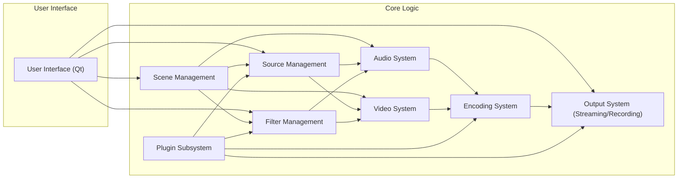
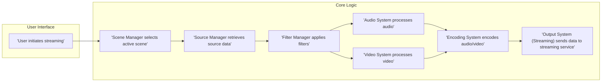
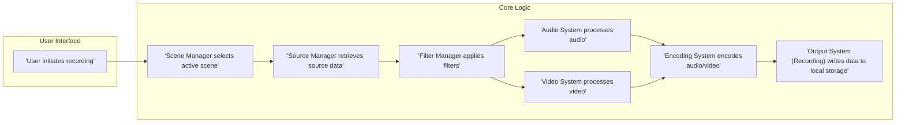

# Project Design Document: OBS Studio

**Version:** 1.1
**Date:** October 26, 2023
**Author:** AI Software Architect

## 1. Introduction

This document provides a detailed architectural design of the OBS Studio project, an open-source software suite for video recording and live streaming. This document aims to provide a comprehensive understanding of the system's components, their interactions, and data flows. This information will be crucial for subsequent threat modeling activities to identify potential security vulnerabilities and design appropriate mitigations. This version includes minor clarifications and improvements based on the initial draft.

## 2. Goals and Objectives

The primary goals of OBS Studio are to:

*   Capture audio and video from various sources (e.g., webcams, screen captures, application windows, microphones).
*   Compose scenes by arranging and transforming these sources.
*   Encode the composed scenes into various video and audio formats.
*   Stream the encoded output to various online platforms (e.g., Twitch, YouTube, Facebook Live).
*   Record the encoded output to local storage.
*   Provide a user-friendly interface for configuration and control.
*   Offer extensibility through a plugin architecture.

This design document aims to clearly articulate the architecture that enables these goals.

## 3. System Architecture Overview

OBS Studio follows a modular architecture, allowing for flexibility and extensibility. The core of the application manages the capture, processing, and output of audio and video. Plugins extend the functionality by providing new sources, filters, encoders, and streaming services.

Here's a high-level overview of the system's architecture:

## 4. Key Components

This section details the major components of OBS Studio and their responsibilities.

*   **User Interface (Qt):**
    *   Provides the graphical interface for user interaction, built using the Qt framework.
    *   Allows users to configure scenes, sources, settings, and controls through menus, panels, and dialogs.
    *   Handles user input and translates it into actions within the core logic.
    *   Responsible for displaying the preview of the output and providing feedback to the user.

*   **Scene Management:**
    *   Manages the collection of sources that make up a scene, acting as a container for visual and audio elements.
    *   Allows users to create, duplicate, rename, and delete scenes.
    *   Handles the transitions between different scenes, allowing for smooth changes during streaming or recording.
    *   Stores the configuration of each scene, including the arrangement, visibility, and properties of its sources.

*   **Source Management:**
    *   Responsible for managing various input sources, abstracting the underlying implementation details.
    *   Supports a wide range of source types, including:
        *   Window Capture: Captures the content of specific application windows.
        *   Display Capture: Captures the entire screen or a specific monitor.
        *   Video Capture Devices: Captures input from webcams and other video devices.
        *   Images: Displays static image files.
        *   Text (FreeType 2): Renders text overlays.
        *   Game Capture: Captures the output of games, often with optimized performance.
        *   Audio Input/Output Capture: Captures audio from microphones or system audio.
        *   Browser Source: Embeds web pages using Chromium Embedded Framework (CEF).
    *   Provides a unified interface for accessing and controlling the data flow from these diverse sources.
    *   Handles source-specific configurations, such as selecting the target window for window capture or the device for video capture.

*   **Filter Management:**
    *   Allows users to apply audio and video filters to individual sources or entire scenes, enabling real-time modifications.
    *   Provides a mechanism for chaining multiple filters together in a specific order to achieve complex effects.
    *   Includes a variety of built-in filters, such as:
        *   Color Correction: Adjusts brightness, contrast, gamma, etc.
        *   Chroma Keying: Removes a specific color (usually green or blue) to create transparency.
        *   Noise Suppression: Reduces background noise in audio.
        *   Gain: Adjusts the volume of audio sources.
        *   Scroll: Creates scrolling text or image effects.
    *   Supports filters provided by plugins, extending the available options.

*   **Audio System:**
    *   Manages the capture, processing, mixing, and monitoring of audio from various sources.
    *   Handles audio routing, allowing users to direct audio to different outputs (e.g., desktop speakers, headphones, stream).
    *   Provides audio mixing capabilities, allowing users to adjust the volume levels of individual sources.
    *   Applies audio filters to individual sources or the master audio output.
    *   Supports features like audio monitoring (hearing specific sources) and push-to-talk/mute functionality.

*   **Video System:**
    *   Manages the capture, processing, composition, and rendering of video frames from various sources.
    *   Handles video scaling, cropping, rotation, and other transformations applied to sources within a scene.
    *   Composites the video frames from different sources according to the scene layout and layering order.
    *   Applies video filters to individual sources or the entire scene output.
    *   Manages the frame rate and resolution of the output video.

*   **Encoding System:**
    *   Responsible for encoding processed audio and video data into specified formats suitable for streaming or recording.
    *   Utilizes various software encoders (e.g., x264, libopus, FDK AAC) and hardware encoders (e.g., NVENC, AMD AMF, Intel Quick Sync Video).
    *   Manages encoding settings such as bitrate, resolution, frame rate, keyframe interval, and audio codec.
    *   Provides options for different encoding profiles and presets to optimize for quality, performance, or bandwidth.

*   **Output System (Streaming/Recording):**
    *   Handles the final stage of processing and delivers the encoded audio and video data to the intended destination.
    *   **Streaming:**
        *   Establishes connections to configured streaming platforms using protocols like RTMP, RTMPS, SRT, or custom streaming endpoints.
        *   Manages authentication credentials and stream keys.
        *   Transmits the encoded data in real-time over the network.
        *   Handles network buffering and potential connection issues.
    *   **Recording:**
        *   Writes the encoded data to local storage in various container formats (e.g., MP4, MKV, FLV, MOV).
        *   Allows users to configure recording paths, filenames, and recording quality settings.
        *   May support features like automatic file splitting or recording pauses.

*   **Plugin Subsystem:**
    *   Provides a robust and extensible architecture for adding new features and functionalities to OBS Studio.
    *   Allows developers to create plugins for:
        *   New Source Types:  Integrating with new hardware or software data sources.
        *   New Filters (Audio and Video): Implementing custom processing effects.
        *   New Encoders: Supporting different encoding algorithms or hardware.
        *   New Streaming Services: Adding support for additional streaming platforms or custom endpoints.
        *   Custom UI Elements: Extending the user interface with new panels or controls.
        *   Scripting: Automating tasks and adding dynamic behavior using languages like Lua or Python.
    *   Plugins interact with the core system through a well-defined Application Programming Interface (API).

## 5. Detailed Component Interactions and Data Flow

This section describes the flow of data through the system during typical operations like streaming and recording.

### 5.1. Streaming Workflow

**Detailed Steps:**

1. **User initiates streaming:** The user interacts with the User Interface, clicking the "Start Streaming" button or a similar control.
2. **Scene Manager selects active scene:** The Scene Manager determines the currently active scene based on user selection or configuration.
3. **Source Manager retrieves source data:** For each source within the active scene, the Source Manager retrieves the raw audio and video data. This involves interacting with the specific source implementation (e.g., querying the operating system for window content, accessing webcam data).
4. **Filter Manager applies filters:**  The Filter Manager iterates through the configured audio and video filters for each source and applies them sequentially to the retrieved data.
5. **Audio System processes audio:** The Audio System mixes the processed audio streams from different sources according to their volume levels and routing configurations. It also applies any scene-level audio filters.
6. **Video System processes video:** The Video System composites the processed video frames from different sources based on their position, size, and layering within the scene. It applies transformations and scene-level video filters.
7. **Encoding System encodes audio/video:** The processed audio and video data are passed to the Encoding System. The system selects the appropriate encoders based on user settings and encodes the data into the desired formats (e.g., H.264 video, AAC audio).
8. **Output System (Streaming) sends data to streaming service:** The encoded data is encapsulated into packets and transmitted by the Output System to the configured streaming service. This involves establishing a network connection, authenticating with the service (using provided credentials), and adhering to the streaming protocol's specifications.

### 5.2. Recording Workflow

**Detailed Steps:**

The recording workflow mirrors the streaming workflow up to the encoding stage.

1. **User initiates recording:** The user interacts with the User Interface, clicking the "Start Recording" button or a similar control.
2. **Scene Manager selects active scene:** The Scene Manager identifies the currently active scene.
3. **Source Manager retrieves source data:** The Source Manager retrieves raw audio and video data from the sources in the active scene.
4. **Filter Manager applies filters:** Configured audio and video filters are applied to the source data.
5. **Audio System processes audio:** The Audio System mixes and processes audio streams, applying filters.
6. **Video System processes video:** The Video System composites video frames, applying transformations and filters.
7. **Encoding System encodes audio/video:** The processed audio and video data are encoded into the desired formats.
8. **Output System (Recording) writes data to local storage:** The encoded data is written to a file on the local storage. The Output System handles file creation, writing data in the selected container format, and closing the file upon completion of the recording.

## 6. Security Considerations (Initial)

This section outlines initial security considerations based on the architecture. A more detailed threat model will be developed based on this document.

*   **Plugin Security:** Plugins, due to their ability to extend core functionality, represent a significant attack surface. Malicious or poorly written plugins could:
    *   Execute arbitrary code with the privileges of the OBS Studio process.
    *   Access sensitive user data or system resources.
    *   Introduce vulnerabilities that could be exploited by remote attackers.
    *   Compromise the integrity of the streaming or recording output.
    *   The plugin API and its security mechanisms are critical areas for scrutiny.
*   **Network Security (Streaming):** Streaming involves transmitting potentially sensitive audio and video data over the network. Security concerns include:
    *   **Man-in-the-middle attacks:** Interception of the stream content.
    *   **Data injection:** Injecting malicious data into the stream.
    *   **Authentication and authorization:** Ensuring only authorized users can stream to specific platforms.
    *   Vulnerabilities in the implementation of streaming protocols (e.g., RTMP, SRT, WebRTC).
    *   Exposure of stream keys or credentials.
*   **User Input Validation:**  The application must rigorously validate all user-provided input to prevent various attacks, including:
    *   **Command injection:**  If user input is used to construct system commands.
    *   **Path traversal:** If user-provided file paths are not properly sanitized.
    *   **Cross-site scripting (XSS) via browser sources:** If embedded web pages are not handled securely.
    *   Malicious URLs or data provided for streaming endpoints or custom commands.
*   **Resource Management:**  Improper resource management can lead to denial-of-service (DoS) conditions or other stability issues:
    *   Excessive memory consumption due to memory leaks or inefficient data handling.
    *   CPU exhaustion due to computationally intensive filters or encoding settings.
    *   Disk space exhaustion due to uncontrolled recording.
*   **Data Storage (Recording):**  Recorded files may contain sensitive information, requiring appropriate security measures:
    *   Access control to prevent unauthorized access to recordings.
    *   Potential for information leakage if temporary files are not securely handled.
    *   Risk of data corruption or loss if file writing operations are not robust.
*   **Update Mechanism:** A compromised update mechanism could allow attackers to distribute malicious versions of OBS Studio:
    *   Lack of secure communication channels for updates.
    *   Absence of digital signatures to verify the authenticity of updates.
    *   Vulnerabilities in the update process itself.
*   **Third-Party Libraries:** OBS Studio relies on numerous third-party libraries, which can introduce vulnerabilities:
    *   Outdated or vulnerable versions of libraries.
    *   Security flaws within the libraries themselves.
    *   Supply chain attacks targeting the distribution of these libraries.
*   **Browser Source Security:** The Browser Source component, based on CEF, introduces the security considerations of a web browser:
    *   Exposure to web-based vulnerabilities.
    *   Potential for malicious scripts to access local resources or interact with OBS Studio.
    *   Need for proper sandboxing and security policies for the embedded browser.

## 7. Assumptions and Constraints

*   This design document is based on the current understanding of the OBS Studio architecture as of the date of writing and the information available in the public repository.
*   The focus is on the core functionality and major components. Less frequently used or highly specialized features may not be explicitly detailed.
*   The plugin architecture is treated as a modular system with defined interfaces. The internal implementation details and security of individual plugins are largely the responsibility of the plugin developers, though the core OBS Studio provides the framework and API.
*   Performance considerations are not a primary focus of this design document, although they are an important aspect of the actual implementation.
*   The document assumes a standard desktop operating system environment (Windows, macOS, Linux) for OBS Studio.

## 8. Future Considerations

*   Detailed design specifications for the plugin API, including security best practices and potential sandboxing mechanisms.
*   In-depth analysis of the security implications of different encoders and streaming protocols.
*   Exploration of cloud-based integrations for features like remote control or stream management and their associated security considerations.
*   Formal threat modeling exercises based on this design document to identify and prioritize potential vulnerabilities.

This improved document provides a more detailed and comprehensive overview of the OBS Studio architecture, enhancing its value for subsequent threat modeling activities.
