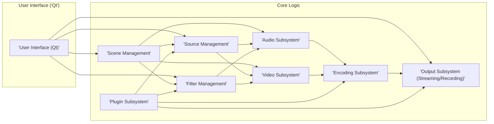
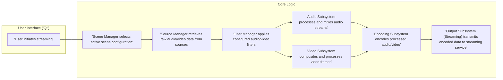
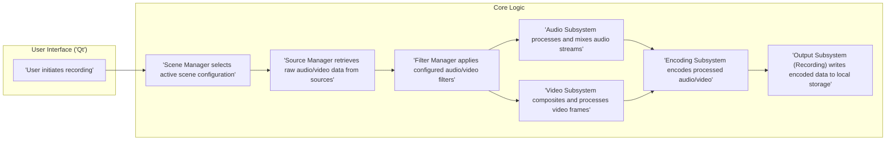

# Project Design Document: OBS Studio

**Version:** 1.1
**Date:** October 26, 2023
**Author:** AI Software Architect

## 1. Introduction

This document provides an enhanced architectural design of the OBS Studio project, an open-source software suite for video recording and live streaming. This revised document aims to provide a more granular and security-focused understanding of the system's components, their interactions, and data flows. The increased detail will be invaluable for subsequent threat modeling activities, enabling a more thorough identification of potential security vulnerabilities and the design of targeted mitigations.

## 2. Goals and Objectives

The primary goals of OBS Studio are to:

*   Capture audio and video from a diverse range of sources, including webcams, screen captures, application windows, and microphones.
*   Facilitate the composition of complex scenes by arranging, layering, and transforming these captured sources.
*   Encode the composed scenes into various industry-standard video and audio formats suitable for streaming and recording.
*   Enable seamless streaming of the encoded output to numerous online platforms, such as Twitch, YouTube, and Facebook Live.
*   Support local recording of the encoded output to persistent storage.
*   Offer an intuitive and user-friendly interface for comprehensive configuration and real-time control.
*   Provide a robust and extensible architecture through a well-defined plugin system.

This design document aims to clearly and comprehensively articulate the architecture that underpins these core functionalities, with a particular emphasis on aspects relevant to security.

## 3. System Architecture Overview

OBS Studio employs a modular architecture, promoting flexibility, maintainability, and extensibility. The core of the application orchestrates the capture, processing, and output of multimedia data. Plugins augment the base functionality by introducing new source types, filters, encoders, and streaming service integrations.

Here's a refined high-level overview of the system's architecture, highlighting key interactions:

## 4. Key Components

This section provides a more detailed examination of the major components of OBS Studio, emphasizing their responsibilities and potential security implications.

*   **User Interface ('Qt'):**
    *   Provides the primary graphical interface for user interaction, built using the Qt framework.
    *   Responsible for presenting configuration options for scenes, sources, settings, and application controls.
    *   Handles user input and translates it into actions within the core logic.
    *   **Security Relevance:**  Vulnerabilities in the UI framework or its interaction with the core could be exploited. Improper input sanitization here could lead to issues.

*   **Scene Management:**
    *   Manages the collection of individual sources that constitute a scene.
    *   Allows users to create, modify, and switch between different scene configurations.
    *   Handles the spatial arrangement (layering, positioning, transformations) of sources within a scene.
    *   **Security Relevance:**  Scene configurations could potentially be manipulated to display unintended content or trigger unexpected behavior if not handled securely.

*   **Source Management:**
    *   Central component responsible for managing a variety of input sources, including window capture, display capture, video capture devices (webcams), images, text overlays, and browser sources.
    *   Provides a unified abstraction layer for accessing data from diverse source types.
    *   Manages source-specific configurations and settings.
    *   **Security Relevance:**  Source implementations might have vulnerabilities (e.g., buffer overflows in device drivers, cross-site scripting risks in browser sources). Improper handling of source data could lead to information leaks or crashes.

*   **Filter Management:**
    *   Enables users to apply a range of audio and video filters to individual sources and entire scenes.
    *   Provides a mechanism for chaining filters to achieve complex processing pipelines.
    *   Examples include color correction, chroma keying (green screen), noise suppression, and gain control.
    *   **Security Relevance:**  Vulnerabilities in filter implementations could lead to crashes or unexpected behavior. Maliciously crafted filter configurations could potentially be used for denial-of-service.

*   **Audio Subsystem:**
    *   Manages the capture, processing, mixing, and routing of audio streams from various sources.
    *   Handles audio monitoring for the user.
    *   Provides audio filters and effects (e.g., noise gates, compressors).
    *   **Security Relevance:**  Issues in audio processing could lead to audio leaks or the injection of malicious audio.

*   **Video Subsystem:**
    *   Manages the capture, processing, and composition of video frames from different sources.
    *   Handles video scaling, cropping, transformations, and alpha blending.
    *   Provides video filters and effects (e.g., blur, sharpen).
    *   **Security Relevance:**  Vulnerabilities in video processing could lead to crashes, visual artifacts, or the injection of malicious video content.

*   **Encoding Subsystem:**
    *   Crucial component responsible for encoding processed audio and video data into specified formats (e.g., H.264, H.265/HEVC, AV1 for video; AAC, MP3 for audio).
    *   Leverages various software and hardware encoders available on the system.
    *   Manages encoding parameters such as bitrate, resolution, frame rate, and codec-specific settings.
    *   **Security Relevance:**  Vulnerabilities in the underlying encoders (which might be third-party libraries) could be exploited. Incorrect encoding settings could lead to performance issues or compatibility problems.

*   **Output Subsystem (Streaming/Recording):**
    *   Handles the final output of the encoded audio and video data.
    *   **Streaming:** Transmits the encoded data to configured streaming platforms using network protocols like RTMP, RTMPS, SRT, or WebRTC. This involves establishing network connections, handling authentication, and managing data transmission.
    *   **Recording:** Writes the encoded data to local storage in various container formats (e.g., MP4, MKV, FLV, MOV). This involves file system operations and managing file access permissions.
    *   **Security Relevance:**  Streaming credentials need to be stored and handled securely. Vulnerabilities in the streaming protocols or their implementation could lead to data interception or unauthorized access. File system permissions and secure storage practices are important for recordings.

*   **Plugin Subsystem:**
    *   Provides a powerful mechanism for extending OBS Studio's capabilities.
    *   Allows developers to create plugins for introducing new source types, filters, encoders, streaming service integrations, and UI elements.
    *   Plugins interact with the core system through a defined Application Programming Interface (API).
    *   **Security Relevance:**  Plugins operate with the same privileges as the main application. Malicious or poorly written plugins represent a significant security risk and could compromise the entire system. The plugin API needs to be carefully designed to prevent security issues.

## 5. Detailed Component Interactions and Data Flow

This section provides a more granular view of the data flow during typical streaming and recording operations, highlighting key interaction points.

### 5.1. Streaming Workflow

**Detailed Steps:**

1. **'User initiates streaming'**: The user interacts with the UI to start the streaming process.
2. **'Scene Manager selects active scene configuration'**: The Scene Manager retrieves the configuration for the currently active scene, specifying the included sources and their properties.
3. **'Source Manager retrieves raw audio/video data from sources'**: For each source in the active scene, the Source Manager interacts with the corresponding source implementation to obtain raw audio and video data. This might involve:
    *   Accessing webcam drivers for video frames.
    *   Querying the operating system for window or display content.
    *   Reading data from capture devices.
    *   Fetching content from network resources (for browser sources).
4. **'Filter Manager applies configured audio/video filters'**: The Filter Manager applies any configured audio and video filters to the raw data obtained from the sources. This involves invoking the filter implementations with the appropriate parameters.
5. **'Audio Subsystem processes and mixes audio streams'**: The Audio Subsystem receives the filtered audio streams, mixes them according to the scene configuration, and applies any master audio effects.
6. **'Video Subsystem composites and processes video frames'**: The Video Subsystem receives the filtered video frames from different sources, composites them based on the scene layout (layering, transformations), and performs any scene-level video processing.
7. **'Encoding Subsystem encodes processed audio/video'**: The processed audio and video data are passed to the Encoding Subsystem. The subsystem selects appropriate encoders based on user settings and encodes the data into the desired formats.
8. **'Output Subsystem (Streaming) transmits encoded data to streaming service'**: The Output Subsystem establishes a connection with the configured streaming service (e.g., Twitch, YouTube) using the specified protocol (e.g., RTMP, RTMPS, SRT). It handles authentication and transmits the encoded audio and video data packets to the streaming server.

### 5.2. Recording Workflow

**Detailed Steps:**

The recording workflow mirrors the streaming workflow up to the encoding stage.

1. **'User initiates recording'**: The user interacts with the UI to start the recording process.
2. **'Scene Manager selects active scene configuration'**: The Scene Manager retrieves the configuration for the currently active scene.
3. **'Source Manager retrieves raw audio/video data from sources'**: The Source Manager obtains raw audio and video data from the configured sources.
4. **'Filter Manager applies configured audio/video filters'**: Configured filters are applied to the source data.
5. **'Audio Subsystem processes and mixes audio streams'**: Audio streams are processed and mixed.
6. **'Video Subsystem composites and processes video frames'**: Video frames are composited and processed.
7. **'Encoding Subsystem encodes processed audio/video'**: The processed audio and video data are encoded into the desired formats.
8. **'Output Subsystem (Recording) writes encoded data to local storage'**: The Output Subsystem writes the encoded data to a file on the local storage system in the specified container format. This involves creating or opening the file, writing the data, and managing file metadata.

## 6. Security Considerations

This section expands on the initial security considerations, providing more specific examples and potential attack vectors.

*   **Plugin Security:**
    *   **Threat:** Malicious plugins could execute arbitrary code, access sensitive user data, or compromise the system.
    *   **Vulnerabilities:** Lack of input validation in plugin APIs, insufficient sandboxing, insecure communication channels between plugins and the core.
    *   **Mitigation Strategies:**  Implement a robust plugin signing and verification mechanism. Enforce strict API usage policies. Consider sandboxing plugins to limit their access to system resources. Regularly audit popular plugins for vulnerabilities.

*   **Network Security (Streaming):**
    *   **Threat:** Interception of streaming data, man-in-the-middle attacks, unauthorized access to streaming accounts.
    *   **Vulnerabilities:** Use of insecure protocols (e.g., plain RTMP), weak or default credentials, vulnerabilities in the streaming protocol implementations.
    *   **Mitigation Strategies:**  Encourage the use of secure protocols like RTMPS and SRT. Implement secure credential storage and management. Validate server certificates.

*   **User Input Validation:**
    *   **Threat:** Injection attacks (e.g., command injection, path traversal), denial-of-service through malformed input.
    *   **Vulnerabilities:** Insufficient validation of user-provided configurations for streaming services (URLs, API keys), file paths for recordings, filter parameters, and custom commands.
    *   **Mitigation Strategies:**  Implement strict input validation and sanitization for all user-provided data. Use parameterized queries or equivalent mechanisms when interacting with external systems.

*   **Resource Management:**
    *   **Threat:** Denial-of-service due to excessive resource consumption (CPU, memory, network bandwidth).
    *   **Vulnerabilities:**  Memory leaks, inefficient algorithms, unbounded resource allocation, failure to handle large or malformed input gracefully.
    *   **Mitigation Strategies:**  Implement resource limits and quotas. Employ efficient algorithms and data structures. Perform thorough memory management. Implement rate limiting for network operations.

*   **Data Storage (Recording):**
    *   **Threat:** Unauthorized access to recorded files, data breaches.
    *   **Vulnerabilities:**  Inadequate file permissions, storing sensitive information in plain text, lack of encryption for recorded files.
    *   **Mitigation Strategies:**  Enforce appropriate file system permissions. Consider encrypting recorded files, especially if they contain sensitive information.

*   **Update Mechanism:**
    *   **Threat:**  Installation of malicious updates, compromising the integrity of the application.
    *   **Vulnerabilities:**  Downloading updates over insecure channels (HTTP), lack of signature verification for updates.
    *   **Mitigation Strategies:**  Use HTTPS for update downloads. Implement robust signature verification for all updates.

*   **Third-Party Libraries:**
    *   **Threat:** Vulnerabilities in third-party libraries used by OBS Studio could be exploited.
    *   **Vulnerabilities:**  Outdated libraries with known vulnerabilities, insecure configurations of libraries.
    *   **Mitigation Strategies:**  Regularly update third-party libraries to their latest stable versions. Perform security audits of dependencies. Use dependency management tools to track and manage library versions.

## 7. Assumptions and Constraints

*   This design document reflects the understanding of OBS Studio's architecture at the time of writing and may not encompass all edge cases or less common configurations.
*   The primary focus is on the core functionalities and major components relevant to security analysis.
*   The internal implementation details of individual plugins are considered outside the immediate scope, although their interaction with the core system is acknowledged as a critical security boundary.
*   Performance optimization and non-functional requirements are not the primary focus of this document.

## 8. Trust Boundaries

Identifying trust boundaries is crucial for effective threat modeling. Key trust boundaries within OBS Studio include:

*   **Between the OBS Studio application and the operating system:** OBS Studio relies on the OS for resource allocation, device access, and network communication.
*   **Between the OBS Studio core and plugins:** Plugins operate with significant privileges and represent a major trust boundary.
*   **Between OBS Studio and external streaming services:** Communication with streaming platforms involves exchanging sensitive credentials and data over the network.
*   **Between OBS Studio and user-provided input:** User configurations, file paths, and other inputs need to be treated as potentially untrusted.
*   **Between OBS Studio and third-party libraries:** The security of OBS Studio is dependent on the security of its dependencies.

## 9. Future Considerations

*   Detailed security analysis of the plugin API and the implementation of security best practices for plugin development.
*   In-depth examination of the security implications of specific encoders and streaming protocols used by OBS Studio.
*   Exploration of potential integrations with cloud-based security services for enhanced threat detection and mitigation.
*   Formal threat modeling workshops and penetration testing based on this design document.

This enhanced design document provides a more detailed and security-focused understanding of OBS Studio's architecture, serving as a valuable resource for subsequent threat modeling activities.