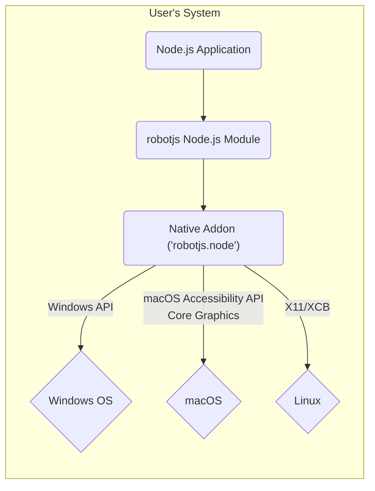
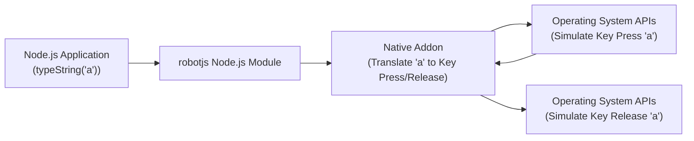
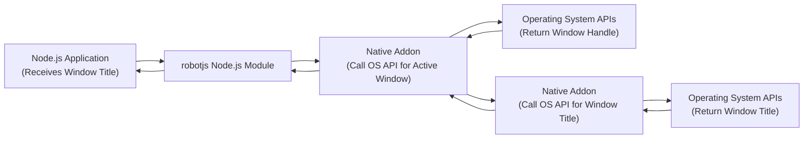

# Project Design Document: robotjs

**Version:** 1.1
**Date:** October 26, 2023
**Author:** Gemini (AI Language Model)

## 1. Introduction

This document provides an enhanced and more detailed design overview of the `robotjs` project, a Node.js library enabling cross-platform native desktop automation. The primary goal is to offer a clear and comprehensive understanding of `robotjs`'s architecture, components, and data flow, specifically tailored to facilitate robust threat modeling and security analysis. This revised document aims to provide greater depth and clarity compared to the previous version.

## 2. Project Overview

*   **Project Name:** robotjs
*   **Project Repository:** [https://github.com/octalmage/robotjs](https://github.com/octalmage/robotjs)
*   **Project Description:** `robotjs` is a powerful Node.js library that provides cross-platform native desktop automation capabilities. It allows Node.js applications to programmatically control the mouse, keyboard, and screen of the operating system on which it is running. This enables a wide range of automation tasks.
*   **Key Features:**
    *   Precise mouse control: movement, single and double clicks, button presses and releases, dragging, and scrolling.
    *   Comprehensive keyboard control: simulating key presses, key releases, and typing strings with support for special characters and modifiers.
    *   Screen interaction: retrieving the color of a pixel at a specific coordinate, capturing regions of the screen as images.
    *   Window management: obtaining a list of open windows, getting information about the active window.
*   **Target Audience:** Primarily Node.js developers seeking to implement desktop automation functionalities within their applications. This includes developers working on UI testing frameworks, automation scripts for repetitive tasks, accessibility tools, and other applications requiring programmatic control of the desktop environment.

## 3. System Architecture

The `robotjs` library acts as an intermediary layer, bridging the gap between JavaScript code running within a Node.js environment and the native operating system's APIs responsible for desktop interaction. This is achieved through the use of a native addon, written in C++, which is compiled specifically for each target operating system.

*   **Components:**
    *   **Node.js Application:** The user-developed JavaScript application that integrates and utilizes the functionalities provided by the `robotjs` library. This application contains the core automation logic and orchestrates the interactions with `robotjs`.
    *   **`robotjs` Node.js Module:** This is the JavaScript interface exposed by the `robotjs` npm package. It provides a set of user-friendly functions that developers can call from their Node.js application to initiate automation actions. These functions internally communicate with the native addon.
    *   **Native Addon (`robotjs.node`):** A pre-compiled C++ module (a `.node` file) that is dynamically loaded by Node.js. This addon contains the platform-specific implementations for interacting with the operating system's native desktop automation APIs. It acts as the core execution engine for `robotjs`'s functionalities.
    *   **Operating System APIs:** These are the platform-specific application programming interfaces provided by the underlying operating system. The native addon utilizes these APIs to perform the actual desktop automation tasks. Examples include:
        *   **Windows:** Windows API (specifically functions related to mouse and keyboard input, and screen capture).
        *   **macOS:** Accessibility API (requires enabling accessibility permissions), Core Graphics framework.
        *   **Linux:** X11 libraries (Xlib, XCB) and potentially input event devices (`/dev/input`).

*   **Architecture Diagram:**

*   **Component Interaction - Detailed Breakdown:**
    1. The developer's Node.js application invokes functions exposed by the `robotjs` Node.js module. For instance, calling `robot.moveMouse(x, y)` to move the mouse cursor.
    2. The `robotjs` Node.js module receives this function call and its parameters. It then uses Node.js's Addons API (specifically N-API, which provides a stable ABI across Node.js versions) to communicate with the compiled native addon (`robotjs.node`). This involves marshalling the JavaScript data types into a format understandable by the C++ addon.
    3. The native addon receives the automation request and its parameters. Based on the function called and the operating system it's running on, it translates this request into a sequence of calls to the appropriate operating system APIs. For example, on Windows, `moveMouse(x, y)` might translate to calls to the `SetCursorPos` function from the Windows API.
    4. The operating system APIs execute the requested action. In the mouse movement example, the OS updates the position of the mouse cursor on the screen.
    5. In scenarios where data retrieval is involved (e.g., `getPixelColor`), the operating system APIs return the requested information (e.g., the RGB value of the pixel).
    6. The native addon receives the results from the operating system APIs. It then marshals this data back into a format that can be understood by the Node.js module.
    7. The `robotjs` Node.js module receives the results from the native addon and passes them back to the original calling function in the Node.js application.

## 4. Data Flow

The data flow within `robotjs` primarily involves the transmission of commands to perform automation tasks and the retrieval of data related to the desktop environment.

*   **Command Flow (Example: Typing a String):**
    1. Node.js Application: Calls `robot.typeString("Hello");`.
    2. `robotjs` Node.js Module: Receives the string "Hello".
    3. Native Addon: Iterates through the string, translating each character into a sequence of key press and release events using the operating system's input simulation APIs.
    4. Operating System API: Simulates the individual key presses and releases, resulting in the string "Hello" being typed into the currently focused application.

*   **Data Retrieval Flow (Example: Capturing a Screen Region):**
    1. Node.js Application: Calls `robot.screen.capture(x, y, width, height);`.
    2. `robotjs` Node.js Module: Receives the coordinates and dimensions of the region to capture.
    3. Native Addon: Utilizes operating system-specific APIs for screen capture (e.g., `BitBlt` on Windows, `CGImageCreateWithCopyInRect` on macOS, Xlib functions on Linux) to capture the specified screen region.
    4. Operating System API: Returns the raw image data of the captured region.
    5. Native Addon: Processes the raw image data, potentially converting it to a more usable format, and passes it back to the Node.js module.
    6. `robotjs` Node.js Module: Returns the image data (often as a buffer) to the Node.js application.

*   **Data Types:**
    *   **Automation Commands:** Represented as function calls with specific parameters (e.g., `mouseClick("left")`, `keyPress("A")`).
    *   **Screen Coordinates:** Numerical values defining positions on the screen (x, y).
    *   **Key Codes/Strings:** Represent keyboard keys, either as numerical codes or string representations.
    *   **Pixel Color Data:** Typically represented in RGB or hexadecimal formats.
    *   **Image Data:** Raw pixel data or encoded image formats (e.g., PNG, JPEG) representing captured screen regions.
    *   **Window Handles/Identifiers:** Unique identifiers used by the operating system to reference specific windows.
    *   **Window Properties:** Data structures containing information about windows, such as their title, position, and size.

*   **Data Flow Diagram (Example: Typing a Character):**

*   **Data Flow Diagram (Example: Getting Active Window Title):**

## 5. Security Considerations

Given its direct interaction with the operating system's input and display mechanisms, `robotjs` presents several security considerations that are crucial for both developers using the library and the security of the systems where it's deployed.

*   **Elevated Privileges and Permissions:** `robotjs` often requires elevated privileges or specific permissions (like Accessibility permissions on macOS or access to the X server on Linux) to function correctly. If an application using `robotjs` is compromised, these elevated privileges could be abused by an attacker to perform malicious actions on the user's system.
*   **Malicious Input Injection:** The core functionality of `robotjs` involves simulating user input. If an attacker can control the input passed to `robotjs` functions, they could inject arbitrary keystrokes or mouse events into other applications. This could lead to various attacks, including:
    *   **Data Exfiltration:** Injecting keystrokes to copy and paste sensitive information.
    *   **Application Manipulation:**  Automating actions within other applications to perform unauthorized tasks.
    *   **Credential Theft:**  Simulating input to interact with login prompts or other security-sensitive interfaces.
*   **Screen Content Capture and Privacy:** The ability to capture screen contents raises significant privacy concerns. Malicious actors could leverage this to:
    *   **Record Sensitive Information:** Capture screenshots containing personal data, financial information, or confidential communications.
    *   **Monitor User Activity:**  Silently record user interactions with their desktop.
*   **Vulnerabilities in the Native Addon:** Security vulnerabilities within the C++ code of the native addon could be exploited to achieve arbitrary code execution at the privilege level of the Node.js process. This could allow attackers to bypass security measures and gain full control of the system. Common vulnerabilities to consider include buffer overflows, memory corruption issues, and improper handling of external data.
*   **Dependency Chain Security:** The security of `robotjs` also depends on the security of its dependencies, both for the Node.js module and the native addon's build process. Compromised dependencies could introduce vulnerabilities that are difficult to detect.
*   **Inter-Process Communication (Implicit):** While `robotjs` doesn't directly perform IPC, its actions inherently interact with other running processes by simulating user input or capturing their output (screen). This interaction surface needs careful consideration from a security perspective.
*   **Lack of Input Sanitization in `robotjs`:** If `robotjs` does not properly sanitize or validate input parameters before passing them to the operating system APIs, it could be vulnerable to injection attacks. For example, specially crafted strings passed to `typeString()` might be interpreted in unintended ways by the underlying OS.

## 6. Deployment Considerations

*   **Target Operating Systems:** Windows, macOS, and Linux (primarily X11-based systems). The native addon needs to be compiled separately for each target platform.
*   **Installation Process:** Typically installed using npm (`npm install robotjs`). This process involves:
    *   Downloading the `robotjs` package and its dependencies.
    *   Using `node-gyp` (or similar tools) to compile the native addon for the specific operating system and architecture where the installation is taking place. This requires having the necessary build tools (like compilers and headers) installed on the system.
*   **Runtime Dependencies:** Requires Node.js to be installed. The compiled native addon (`robotjs.node`) is a runtime dependency.
*   **Platform-Specific Permissions:** Applications using `robotjs` may require specific permissions granted by the operating system at runtime.
    *   **Windows:** Generally requires no special permissions for basic functionality, but User Account Control (UAC) might prompt for elevation for actions affecting other processes.
    *   **macOS:** Requires explicit user granting of Accessibility permissions for the application using `robotjs` to control the mouse, keyboard, and screen of other applications.
    *   **Linux:** Typically requires access to the X server. This might involve ensuring the user running the Node.js application has the necessary permissions to interact with the X display (e.g., through `xhost` or similar mechanisms). In some cases, access to input event devices (`/dev/input`) might be required.
*   **Build Environment:** Compiling the native addon requires a suitable build environment with tools like a C++ compiler (e.g., Visual Studio Build Tools on Windows, Xcode on macOS, GCC/Clang on Linux) and Python.

## 7. Assumptions and Limitations

*   **Trusted Application Context:** This design document assumes that the Node.js application utilizing `robotjs` is developed and deployed by a trustworthy entity. Security vulnerabilities within the calling application itself are considered outside the direct scope of analyzing `robotjs`. However, the potential for misuse through a compromised application is a key security consideration.
*   **Underlying OS Security:** The security of the underlying operating system is assumed. `robotjs` relies on the OS to enforce security boundaries and access controls. Vulnerabilities in the operating system could potentially be exploited, even if `robotjs` itself is secure.
*   **Focus on `robotjs` Library Functionality:** The primary focus is on the design and security aspects of the `robotjs` library itself, rather than the broader ecosystem of applications that might use it.
*   **No Inherent Network Communication:** `robotjs` in its core functionality does not perform network operations. However, applications built using `robotjs` might have network communication capabilities, which introduces separate security considerations.
*   **Limited Scope of Threat Modeling (This Document):** This document serves as a foundation for threat modeling. A comprehensive threat model would involve further analysis, including identifying specific threat actors, attack vectors, and potential mitigations.

## 8. Future Considerations

*   **Regular Security Audits:** Conducting regular security audits of the native addon's C++ code is essential to proactively identify and address potential vulnerabilities. This should include static analysis, dynamic analysis, and penetration testing.
*   **Input Sanitization and Validation:** Implementing robust input sanitization and validation within the native addon before interacting with operating system APIs would mitigate the risk of input injection attacks. This should cover all input parameters to `robotjs` functions.
*   **Principle of Least Privilege:** Explore opportunities to design the library and its interactions with the OS APIs to operate with the minimum necessary privileges. This could involve offering more granular control over permissions or functionalities.
*   **Secure Defaults and Configuration:** Ensure that default configurations and behaviors are secure. Provide clear guidance to developers on how to configure `robotjs` securely.
*   **Sandboxing or Isolation:** Investigate the feasibility of sandboxing the native addon or isolating its operations to limit the potential impact of vulnerabilities. This could involve using OS-level sandboxing mechanisms or containerization technologies.
*   **Memory Safety:** Employ memory-safe programming practices in the native addon to prevent memory corruption vulnerabilities. Consider using tools and techniques for detecting memory leaks and buffer overflows.
*   **Code Signing:** Signing the native addon binaries can help ensure their integrity and authenticity, reducing the risk of using tampered versions.
*   **Community Engagement and Bug Bounty Program:** Encouraging community contributions and establishing a bug bounty program can help identify and address security vulnerabilities more effectively.

This enhanced design document provides a more in-depth understanding of the `robotjs` project, offering a stronger foundation for conducting thorough threat modeling and security assessments.