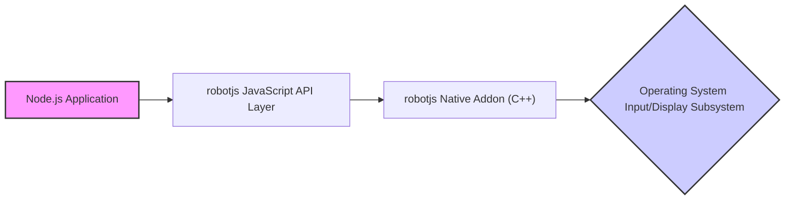
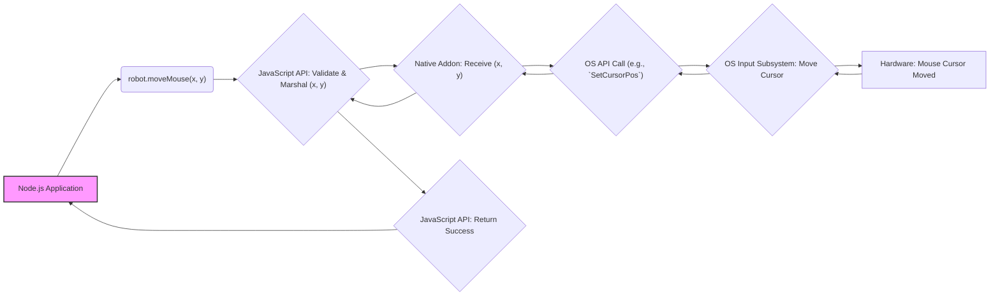

## Project Design Document: robotjs (Improved)

**1. Introduction**

This document provides a detailed design overview of the `robotjs` project, a critical Node.js library enabling native desktop automation. `robotjs` grants applications the ability to programmatically control user input devices (mouse, keyboard) and interact with the display, making it a powerful tool but also one with significant security implications. Understanding its architecture and data flow is paramount for identifying potential vulnerabilities and conducting thorough threat modeling. This document serves as the foundational reference for such security analysis.

**2. Goals**

*   Clearly articulate the architectural layers and components of `robotjs`.
*   Precisely define the responsibilities and interactions of each component.
*   Illustrate the flow of control and data within the system for various actions.
*   Explicitly highlight inherent security considerations arising from the design.
*   Provide a structured basis for subsequent threat modeling exercises.
*   Serve as a living document to be updated with significant architectural changes.

**3. Non-Goals**

*   In-depth analysis of the source code implementation details.
*   Performance metrics or optimization strategies for the library.
*   User guides or tutorials on how to utilize the `robotjs` API.
*   An exhaustive list of every available feature or API endpoint.
*   A fully realized threat model or vulnerability assessment (this document *informs* those).

**4. Architectural Overview**

`robotjs` bridges the gap between JavaScript code executing within a Node.js process and the operating system's low-level input and display management systems. This interaction is facilitated by a native addon, written in C++, which directly interfaces with platform-specific APIs. The library's architecture can be visualized as a layered model:

*   **Node.js Application:** The user's JavaScript application that imports and utilizes the `robotjs` library.
*   **robotjs JavaScript API Layer:**  Provides the public interface for developers to interact with `robotjs`. This layer handles argument validation and marshals data for the native addon.
*   **robotjs Native Addon (C++):** The core component, responsible for interacting directly with the operating system. It receives commands from the JavaScript layer and translates them into OS-specific API calls.
*   **Operating System Input/Display Subsystem:** The underlying OS components that manage user input (mouse, keyboard) and the display output.

**5. Component Design**

*   **robotjs JavaScript API Layer:**
    *   **Purpose:** Exposes a high-level, platform-agnostic API for desktop automation.
    *   **Responsibilities:**
        *   Provides functions for mouse control (e.g., `moveMouse`, `click`, `scroll`).
        *   Provides functions for keyboard input (e.g., `keyTap`, `typeString`).
        *   Provides functions for screen interaction (e.g., `screen.capture`, `getPixelColor`).
        *   Performs basic input validation and type checking on arguments.
        *   Marshals JavaScript data types into formats suitable for the native addon (e.g., converting JavaScript numbers to C++ integers).
        *   Handles callbacks and returns data from the native addon to the application.
    *   **Potential Security Considerations:**  Insufficient input validation could allow malicious data to be passed to the native addon.

*   **robotjs Native Addon (C++):**
    *   **Purpose:**  Bridges the JavaScript API with the operating system's native functionalities.
    *   **Responsibilities:**
        *   Receives commands and data from the JavaScript API layer.
        *   Translates these commands into platform-specific API calls.
        *   **Windows:** Utilizes functions like `SendInput` for keyboard/mouse events, `GetCursorPos` for mouse position, `GetDC` and `GetPixel` for screen information.
        *   **macOS:** Employs Core Graphics framework functions such as `CGEventPost` for events, `CGWarpMouseCursorPosition` for mouse movement, and `CGDisplayCreateImage` for screen capture.
        *   **Linux (X11):** Leverages X11 libraries like `XTestFakeKeyEvent`, `XTestFakeButtonEvent` for input simulation, `XQueryPointer` for mouse position, and `XGetImage` for screen capture.
        *   Marshals data received from the OS back to the JavaScript layer.
        *   Handles potential errors returned by the OS APIs.
    *   **Potential Security Considerations:**
        *   Vulnerabilities in the C++ code (e.g., buffer overflows, memory leaks) could be exploited.
        *   Incorrect usage of OS APIs could lead to unexpected behavior or security issues.
        *   Lack of proper error handling could expose sensitive information or lead to crashes.
        *   Platform-specific API vulnerabilities could be inherited.

*   **Operating System Input/Display Subsystem:**
    *   **Purpose:**  Manages all user input and display output for the operating system.
    *   **Responsibilities:**
        *   Receives input events from hardware devices (mouse, keyboard).
        *   Updates the display based on application requests.
        *   Provides APIs for applications to interact with input and display functionalities.
    *   **Potential Security Considerations:**
        *   Operating system vulnerabilities could be exploited through the `robotjs` interface.
        *   Insufficient access controls could allow unauthorized actions.

**6. Data Flow**

Let's examine the data flow for a typical user interaction, such as moving the mouse cursor:

Detailed breakdown:

1. **Action Initiation:** The Node.js application calls a function in the `robotjs` JavaScript API, for example, `robot.moveMouse(100, 200)`.
2. **JavaScript API Processing:** The JavaScript API layer receives the call.
    *   It performs basic validation on the input parameters (e.g., ensuring `x` and `y` are numbers).
    *   It marshals the data (e.g., the integer values of `x` and `y`) into a format suitable for the native addon.
3. **Native Addon Invocation:** The JavaScript engine calls a corresponding function in the native addon, passing the marshaled data.
4. **OS API Interaction:** The native addon receives the data.
    *   Based on the operating system, it calls the appropriate OS API function (e.g., `SetCursorPos` on Windows, `CGWarpMouseCursorPosition` on macOS, `XWarpPointer` on Linux).
    *   It passes the received coordinates (`x`, `y`) to the OS API.
5. **OS Action Execution:** The operating system's input subsystem receives the API call.
    *   It updates the mouse cursor position on the screen.
6. **Acknowledgement (Implicit):**  In most cases for simple actions like mouse movement, there isn't explicit data returned from the OS API. The success is often implied by the API call not returning an error.
7. **Native Addon Return:** The native addon returns control to the JavaScript API layer, potentially indicating success.
8. **JavaScript API Return:** The JavaScript API layer returns control to the Node.js application, possibly with a success indication.

For actions that retrieve data (e.g., `screen.getPixelColor`), the data flow includes the OS returning the requested information back through the native addon to the JavaScript API.

**7. Security Considerations**

`robotjs`, by its very nature, operates with a high level of privilege, directly controlling user input and screen output. This necessitates careful consideration of the following security aspects:

*   **Privilege Escalation:** Applications using `robotjs` inherently require the same level of access as the user running the application. If the Node.js process is compromised, an attacker could leverage `robotjs` to perform actions with the user's privileges, potentially leading to significant system compromise.
*   **Malicious Input to Native Addon:**  Vulnerabilities in the native addon's handling of data received from the JavaScript layer could allow attackers to execute arbitrary code or cause unexpected behavior. This includes insufficient validation of data types, ranges, and formats.
*   **Native Code Vulnerabilities:**  Standard security concerns for native code apply, such as buffer overflows, format string bugs, and memory corruption issues within the C++ addon. These could be exploited to gain control of the process.
*   **Exposure of Sensitive Information:**  The screen capture functionality could inadvertently expose sensitive data if not used carefully. For example, capturing the entire screen might reveal passwords or confidential information displayed in other applications.
*   **Keylogging and Mousejacking Potential:** The ability to simulate keyboard and mouse input could be abused for malicious purposes, such as logging keystrokes or taking control of the user's mouse.
*   **Dependency Vulnerabilities:**  The native addon relies on system libraries and potentially other dependencies. Vulnerabilities in these dependencies could be exploited through `robotjs`.
*   **Installation-Time Vulnerabilities:** The compilation process of the native addon using `node-gyp` could introduce vulnerabilities if the build environment is compromised or if dependencies are fetched from untrusted sources.
*   **Inter-Process Communication (Implicit):** While not explicit IPC, the communication between the Node.js process and the OS kernel through system calls needs to be considered from a security perspective. OS-level security mechanisms are crucial here.

**8. Dependencies**

*   **Node.js:** The JavaScript runtime environment. Specific version requirements may exist. Security vulnerabilities in Node.js itself could impact applications using `robotjs`.
*   **node-gyp:** A tool for compiling native Node.js addons. Vulnerabilities in `node-gyp` or its dependencies could be exploited during the installation process.
*   **Python:**  `node-gyp` often requires Python for its build process. The version of Python used could have security implications.
*   **C++ Compiler Toolchain:**  A C++ compiler (like GCC, Clang, or Visual Studio Build Tools) is necessary to compile the native addon. Vulnerabilities in the compiler itself are a concern, though less likely.
*   **Operating System Specific SDKs/Libraries:**
    *   **Windows:** Windows SDK (Software Development Kit).
    *   **macOS:** Xcode Command Line Tools (including SDKs).
    *   **Linux:** Development packages for X11 (e.g., `libxtst-dev`, `libxdo-dev`). The specific packages and their versions can vary across distributions. Vulnerabilities in these system libraries are a concern.

**9. Deployment**

`robotjs` is typically deployed as a dependency within a Node.js application.

*   **Installation:** Developers install `robotjs` using npm or yarn. This triggers the compilation of the native addon using `node-gyp`.
    *   **Security Consideration:** The compilation process requires a trusted build environment. If the environment is compromised, malicious code could be injected into the native addon.
    *   **Security Consideration:**  Dependencies fetched during the build process should be from trusted sources to prevent supply chain attacks.
*   **Usage:** The application imports and uses the `robotjs` module.
    *   **Security Consideration:**  Applications using `robotjs` should be carefully reviewed to ensure they are not exposing the library's powerful capabilities in a way that could be exploited.
*   **Distribution:** Applications using `robotjs` are distributed like any other Node.js application.
    *   **Security Consideration:**  The distributed application includes the compiled native addon. Ensuring the integrity of this addon is crucial. Code signing can help with this.

**10. Future Considerations**

*   **Enhanced Input Sanitization:** Implement more rigorous input validation and sanitization in both the JavaScript API and the native addon to prevent injection attacks and unexpected behavior.
*   **Address Space Layout Randomization (ASLR) and Data Execution Prevention (DEP):** Ensure that the native addon is compiled with ASLR and DEP enabled to mitigate memory corruption vulnerabilities.
*   **Regular Security Audits:** Conduct periodic security audits and penetration testing of the native addon code by security experts.
*   **Principle of Least Privilege:**  Explore ways to reduce the privileges required by the `robotjs` library or the applications using it. This might involve breaking down functionality into smaller, more isolated components.
*   **Code Signing for Native Addon:** Implement code signing for the native addon to ensure its authenticity and integrity, protecting against tampering.
*   **Consider Sandboxing Technologies:** Investigate the feasibility of running applications that use `robotjs` within sandboxed environments to limit the potential impact of security breaches.
*   **Explore Alternative APIs:**  Evaluate if there are more secure or restricted APIs provided by operating systems that could achieve similar automation goals with less risk.
*   **Community Engagement for Security:** Encourage security researchers to review the code and report potential vulnerabilities through a responsible disclosure process.