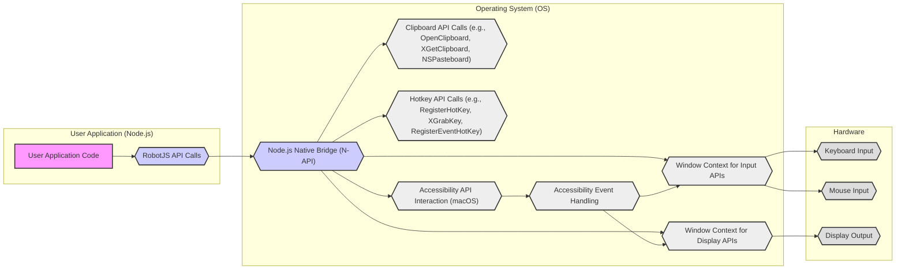

# Project Design Document: RobotJS for Threat Modeling

**Project Name:** RobotJS

**Project Repository:** [https://github.com/octalmage/robotjs](https://github.com/octalmage/robotjs)

**Document Version:** 1.1
**Date:** October 27, 2023
**Author:** Gemini (AI Expert)

## 1. Project Overview

RobotJS is a powerful Node.js library enabling desktop automation across Windows, macOS, and Linux. It provides programmatic control over user interface elements, allowing developers to simulate keyboard and mouse actions, capture screen regions, and interact with the system clipboard. This capability makes RobotJS valuable for various applications, including automated testing, UI-based scripting, accessibility tools, and robotic process automation (RPA).

**Key Features:**

*   **Comprehensive Mouse Control:** Precise mouse movement, click simulation (single, double, right), scrolling, and retrieval of mouse cursor position.
*   **Extensive Keyboard Control:** Simulating key presses and releases, typing Unicode strings, retrieving key states (pressed or not), and handling special keys (modifiers, function keys).
*   **Advanced Screen Capture:** Capturing the entire screen or specific regions, obtaining screen dimensions, and retrieving the RGB color value of individual pixels.
*   **Clipboard Management:** Reading and writing text and potentially other data formats to the system clipboard.
*   **Global Hotkey Registration:** Registering and unregistering system-wide keyboard shortcuts that trigger actions even when the application is not in the foreground.

**Purpose of this Document:**

This document serves as a detailed architectural blueprint of RobotJS, specifically tailored for threat modeling exercises. It outlines the system's components, data flow pathways, and inherent security considerations. By providing a clear understanding of RobotJS's internal workings and interactions with the operating system, this document aims to facilitate the identification of potential security vulnerabilities and risks associated with its use in applications. This document is intended to be used as input for structured threat modeling methodologies like STRIDE.

## 2. Architecture Overview

RobotJS employs a layered architecture to bridge Node.js applications with low-level operating system functionalities. It leverages native modules written in C++ to interact directly with OS-specific APIs for input simulation, screen access, and clipboard management. This native layer is crucial for performance and direct system interaction, while the JavaScript layer provides a user-friendly API for Node.js developers.

**High-Level Architecture Diagram (Mermaid):**

**Component Description (Enhanced):**

*   **"User Application Code"**: The Node.js application leveraging RobotJS. Responsible for defining automation logic and handling data. Security risks primarily stem from application-level vulnerabilities and misuse of RobotJS APIs.
*   **"RobotJS Library (Node.js Module)"**: The JavaScript API layer.  Handles input validation, API abstraction, and communication with the native module via Node-API (formerly N-API).  Crucial for preventing common JavaScript-based vulnerabilities and ensuring safe interaction with the native layer.
*   **"RobotJS Native Module (C++)"**: The core native component. Implemented in C++ for performance and direct OS API interaction.  Responsible for translating RobotJS commands into OS-specific system calls.  This layer is a critical security boundary due to its direct access to system resources and potential for native code vulnerabilities.
*   **"OS Input APIs"**: Operating System APIs for simulating and monitoring user input. Examples include:
    *   **Windows:** `SendInput`, `mouse_event`, `keybd_event`
    *   **Linux (X11):** XTest extension functions (e.g., `XTestFakeKeyEvent`, `XTestFakeMotionEvent`), `XSendEvent`
    *   **macOS:**  `CGEventPost`, Core Graphics Event System
*   **"OS Display APIs"**: Operating System APIs for accessing screen content and display information. Examples include:
    *   **Windows:** `BitBlt`, Desktop Window Manager APIs
    *   **Linux (X11):** XShm extension, `XGetImage`, `XCopyArea`
    *   **macOS:** `CGDisplayCreateImage`, Core Graphics APIs
*   **"OS Clipboard APIs"**: Operating System APIs for interacting with the system clipboard. Examples include:
    *   **Windows:** `OpenClipboard`, `GetClipboardData`, `SetClipboardData`
    *   **Linux (X11):** X Window System Clipboard mechanisms, selection atoms
    *   **macOS:** `NSPasteboard`
*   **"OS Hotkey APIs"**: Operating System APIs for registering global hotkeys. Examples include:
    *   **Windows:** `RegisterHotKey`, `UnregisterHotKey`
    *   **Linux (X11):** `XGrabKey`, `XUngrabKey`
    *   **macOS:** `RegisterEventHotKey`, `UnregisterEventHotKey`
*   **"OS Accessibility Services (macOS)"**: On macOS, RobotJS often relies on Accessibility APIs to perform input simulation and screen capture, especially in sandboxed environments or when standard APIs are restricted. This introduces additional security considerations related to accessibility permissions.
*   **"Windowing System (X11, Windows Window Manager, macOS WindowServer)"**: The underlying windowing system manages window interactions and input routing. RobotJS interacts with the windowing system indirectly through OS APIs. Security vulnerabilities in the windowing system itself could potentially be exploited, though this is less directly related to RobotJS.
*   **"Hardware (Keyboard, Mouse, Display)"**: Physical hardware devices. Security concerns are primarily related to physical access and hardware-level attacks, which are outside the direct scope of RobotJS software security but relevant to the overall security context.

## 3. Component Details and Security Considerations (Enhanced)

This section provides a more detailed breakdown of each component, emphasizing specific security vulnerabilities and risks.

### 3.1. User Application Code

*   **Functionality:** Implements the automation logic using RobotJS APIs.
*   **Security Considerations:**
    *   **Command Injection:** If application logic dynamically constructs strings passed to `robotjs.typeString()` or other APIs based on untrusted input, it could lead to command injection vulnerabilities, potentially executing arbitrary commands on the system. **Example:** `robotjs.typeString("rm -rf /")` if input is not properly sanitized.
    *   **Cross-Site Scripting (XSS) via Clipboard (Less Direct):** If the application reads data from the clipboard using `robotjs.clipboard.get()` and displays it in a web context without proper sanitization, it could indirectly contribute to XSS vulnerabilities if the clipboard contains malicious scripts.
    *   **Insecure Data Handling:** Mishandling sensitive data obtained via screen capture or clipboard access within the application can lead to data leaks or unauthorized access.
    *   **Logic Flaws and Unintended Actions:**  Errors in application logic using RobotJS could result in unintended and potentially harmful actions being automated, such as deleting files, modifying system settings, or disrupting other applications.

### 3.2. RobotJS Library (Node.js Module)

*   **Functionality:** Provides the JavaScript API, input validation, and bridges communication to the native module.
*   **Security Considerations:**
    *   **Insufficient Input Validation:**  Lack of robust input validation in the JavaScript layer could allow malicious or malformed data to be passed to the native module, potentially triggering vulnerabilities there. Validation should cover data types, ranges, and formats.
    *   **Dependency Vulnerabilities (npm Packages):** RobotJS relies on npm packages. Vulnerabilities in these dependencies (e.g., in libraries used for argument parsing, utility functions) could be exploited. Regular dependency scanning and updates are crucial.
    *   **API Design Flaws:**  Poorly designed APIs could make it easier for developers to misuse RobotJS in insecure ways. Clear, secure-by-default API design is important.
    *   **Denial of Service (DoS):**  If the JavaScript layer is vulnerable to resource exhaustion (e.g., through excessive memory allocation or CPU usage due to malformed input), it could lead to DoS attacks.

### 3.3. RobotJS Native Module (C++)

*   **Functionality:** Core logic interacting with OS APIs. Performance-critical operations.
*   **Security Considerations:**
    *   **Memory Safety Vulnerabilities:** C++ is prone to memory safety issues like buffer overflows, use-after-free, and double-free vulnerabilities. These can be exploited for code execution or DoS.  Careful memory management and use of memory-safe coding practices are essential.
    *   **Race Conditions and Concurrency Issues:** If RobotJS uses multi-threading or asynchronous operations incorrectly in the native module, race conditions could lead to unpredictable behavior and potential security vulnerabilities.
    *   **Integer Overflows/Underflows:**  Integer overflow or underflow vulnerabilities in calculations within the native module, especially when dealing with sizes or offsets related to memory or OS API parameters, could lead to buffer overflows or other memory corruption issues.
    *   **OS API Misuse and Privilege Escalation:** Incorrectly using OS APIs or failing to handle API errors properly could lead to vulnerabilities.  For example, improper permission handling when accessing input devices or screen regions could lead to unauthorized access or privilege escalation if vulnerabilities in OS API interactions are present.
    *   **Path Traversal/Injection (Less Likely but Possible):**  While less directly applicable to typical RobotJS functions, if file paths or system commands are ever constructed within the native module based on external input (even indirectly), path traversal or command injection vulnerabilities could theoretically arise.
    *   **Platform-Specific Native Vulnerabilities:**  Due to differences in OS APIs and their implementations, vulnerabilities might be platform-specific. Thorough platform-specific testing and secure coding practices are necessary.

### 3.4. OS Input APIs, Display APIs, Clipboard APIs, Hotkey APIs, Accessibility Services

*   **Functionality:**  OS-provided interfaces for system interaction.
*   **Security Considerations:**
    *   **OS API Vulnerabilities:** While less frequent, vulnerabilities can exist in OS APIs themselves. RobotJS's security is partially dependent on the security of these underlying APIs. Keeping the OS updated with security patches is important.
    *   **Access Control and Permissions (OS Level):** Operating systems enforce access control mechanisms for input devices, screen, and clipboard. RobotJS must operate within these permissions.  Incorrect permission handling by the OS or vulnerabilities in permission enforcement could be exploited, though this is generally outside RobotJS's direct control.
    *   **Accessibility API Abuse (macOS):** On macOS, reliance on Accessibility APIs introduces risks if accessibility permissions are granted to malicious applications or if vulnerabilities exist in the Accessibility API implementation itself.  Over-reliance on accessibility should be carefully considered.
    *   **Input Event Injection Risks:**  Simulating input events can be abused by malicious software.  Operating systems generally have security measures to mitigate this, but vulnerabilities in input event handling could still be exploited.

### 3.5. Hardware (Keyboard, Mouse, Display)

*   **Functionality:** Physical devices.
*   **Security Considerations:**
    *   **Physical Access and Hardware Keyloggers:** Physical access to the machine allows for hardware keyloggers or screen recording devices to be installed, bypassing software-level security measures.  Physical security is a prerequisite for software security.
    *   **Evil Maid Attacks:**  An attacker with physical access could modify the system or hardware to compromise security, potentially affecting RobotJS's environment.

## 4. Data Flow (Enhanced)

The data flow descriptions are enhanced to highlight sensitive data and potential interception points.

*   **Input Data Flow (Keyboard/Mouse Control):**
    1.  User Application calls RobotJS API (e.g., `robotjs.moveMouse(x, y)`, `robotjs.typeString("SensitivePassword")`). **Sensitive Data:** Potentially sensitive keyboard input.
    2.  RobotJS JavaScript module validates and marshals the command and data.
    3.  The command is passed to the RobotJS Native Module.
    4.  The Native Module translates the command into OS-specific API calls (e.g., `SendInput` on Windows).
    5.  OS Input APIs send signals to the hardware (keyboard/mouse) or simulate input events. **Potential Interception Point:** OS-level input monitoring, hardware keyloggers.
    6.  The OS updates the UI based on the simulated input.

*   **Output Data Flow (Screen Capture/Pixel Reading):**
    1.  User Application calls RobotJS API (e.g., `robotjs.screen.capture()`, `robotjs.getPixelColor(x, y)`). **Sensitive Data:** Screen content, potentially containing passwords, personal information, confidential data.
    2.  RobotJS JavaScript module prepares the request.
    3.  The request is passed to the RobotJS Native Module.
    4.  The Native Module uses OS Display APIs to capture screen regions or read pixel data.
    5.  The screen data (image buffer or color value) is returned to the Native Module. **Potential Interception Point:** OS-level screen recording, malicious processes intercepting API calls.
    6.  The Native Module marshals the data back to the JavaScript module.
    7.  The JavaScript module returns the data to the User Application. **Sensitive Data:** Screen content is now accessible within the application.

*   **Clipboard Data Flow:**
    1.  User Application calls RobotJS API (e.g., `robotjs.clipboard.set("Confidential Text")`, `robotjs.clipboard.get()`). **Sensitive Data:** Clipboard content, which can be arbitrary text, images, or other data.
    2.  RobotJS JavaScript module prepares the clipboard operation.
    3.  The request is passed to the RobotJS Native Module.
    4.  The Native Module uses OS Clipboard APIs to set or get clipboard content.
    5.  Clipboard data is transferred between the Native Module and the OS Clipboard. **Potential Interception Point:** Clipboard monitoring software, other applications accessing the clipboard.
    6.  Data is marshalled back to the JavaScript module and then to the User Application. **Sensitive Data:** Clipboard content is now accessible within the application.

**Sensitive Data Flow Summary:**

*   **Keyboard Input:**  Directly handles potentially sensitive text.
*   **Screen Content:**  Provides access to all information displayed on the screen.
*   **Clipboard Content:**  Provides access to potentially sensitive data stored in the clipboard.

## 5. Security Considerations Summary (Enhanced)

Key security considerations, categorized for clarity and actionability:

*   **Native Code Security is Paramount:**  Prioritize secure coding practices in the C++ native module to prevent memory safety vulnerabilities, race conditions, and OS API misuse. Regular code reviews and static/dynamic analysis are essential.
*   **Robust Input Validation at All Layers:** Implement comprehensive input validation in both the JavaScript and Native modules to prevent injection attacks, DoS, and other input-related vulnerabilities.
*   **Minimize Privileges:**  Run applications using RobotJS with the minimum necessary privileges.  Explore if RobotJS can be configured to operate with reduced permissions where possible.
*   **Dependency Management and Security Scanning:**  Maintain up-to-date dependencies for the Node.js module and perform regular security scans to identify and address vulnerabilities in third-party libraries.
*   **Data Handling and Confidentiality:**  Applications using RobotJS must be designed to handle sensitive data (obtained from screen, clipboard, or keyboard input) securely. Implement appropriate data sanitization, encryption, and access control measures within the application.
*   **API Misuse Prevention:**  Provide clear and comprehensive documentation with security guidelines to educate developers on how to use RobotJS APIs securely and avoid common pitfalls. Include examples of secure and insecure usage patterns.
*   **Platform-Specific Security Testing:**  Conduct thorough security testing on all supported operating systems to identify and address platform-specific vulnerabilities and ensure consistent security across platforms.
*   **Consider Sandboxing and Isolation:**  If possible, explore sandboxing or containerization techniques to isolate applications using RobotJS and limit the potential impact of vulnerabilities.
*   **User Awareness and Consent (Accessibility Permissions):**  When using Accessibility APIs (especially on macOS), ensure users are fully aware of the permissions being requested and the security implications. Obtain explicit consent where necessary.

## 6. Technology Stack

*   **Programming Languages:** JavaScript (Node.js), C++ (Native Module)
*   **Runtime Environment:** Node.js (LTS versions recommended for stability and security updates)
*   **Operating System APIs:**
    *   Windows API (Win32 API, User32.dll, GDI32.dll)
    *   X11 (Xlib, XTest, XShm)
    *   macOS (Cocoa, Core Graphics, Accessibility APIs - `ApplicationServices.framework`, `CoreGraphics.framework`, `Carbon.framework`)
*   **Build Tools:** `node-gyp`, C++ compiler toolchain (platform-specific, e.g., Visual Studio for Windows, GCC/Clang for Linux/macOS)
*   **Package Manager:** npm (Node Package Manager)
*   **Native Module Bridge:** Node-API (N-API) - for stable ABI between Node.js and native modules.

## 7. Deployment Model (Enhanced Security Considerations)

RobotJS deployment scenarios and associated security implications:

*   **Desktop Applications (e.g., Electron, NW.js):**
    *   **Security Context:** Applications run with user privileges. Vulnerabilities in RobotJS or the application itself could be exploited within the user's security context.
    *   **Distribution:** Application distribution channels (e.g., app stores, direct downloads) should be secure to prevent malware injection. Code signing is crucial.
    *   **Update Mechanisms:** Secure and reliable update mechanisms are necessary to patch vulnerabilities in RobotJS and the application.
*   **Automation Scripts (Standalone Node.js):**
    *   **Security Context:** Scripts run with the privileges of the user executing them.  Care should be taken to run scripts with least privilege necessary.
    *   **Script Source and Integrity:** Ensure scripts are from trusted sources and their integrity is verified to prevent malicious script execution.
    *   **Environment Control:**  Control the environment where scripts are executed to limit potential damage from unintended actions or vulnerabilities.
*   **Server-Side Applications (Limited Use Cases, e.g., Cloud Desktops, VDI):**
    *   **Security Context:** Server environments may have stricter security policies and isolation mechanisms. RobotJS usage might be restricted or require specific configurations.
    *   **Remote Access and Control:**  If RobotJS is used in server environments accessible remotely, secure remote access controls and authentication are critical.
    *   **Multi-Tenancy Risks:** In multi-tenant server environments, ensure proper isolation between tenants to prevent cross-tenant attacks via RobotJS or related vulnerabilities.

This enhanced design document provides a more comprehensive and security-focused foundation for threat modeling RobotJS. The next step is to utilize this document to perform a structured threat modeling exercise (e.g., STRIDE) to identify specific threats, vulnerabilities, and risks, and subsequently develop appropriate mitigation strategies and security controls.