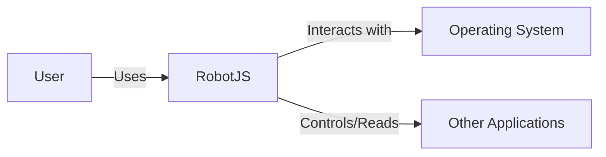
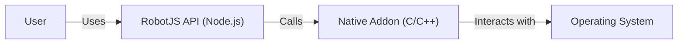
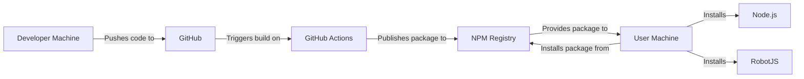
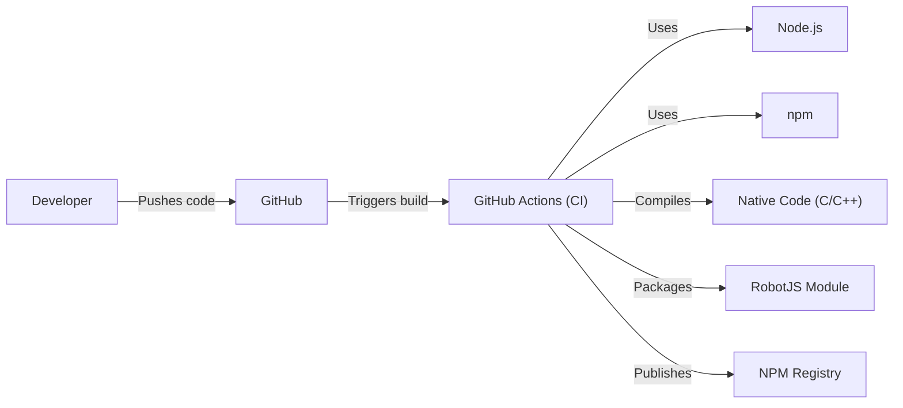

# Project Design Document: RobotJS

## BUSINESS POSTURE

RobotJS is a desktop automation library for Node.js. It allows developers to control the mouse, keyboard, and read the screen. This suggests a focus on utility and developer tooling, likely targeting individual developers or small teams building automation scripts or applications. The project is open-source, suggesting a community-driven development model.

Business Priorities:

*   Provide a stable and reliable API for desktop automation.
*   Maintain cross-platform compatibility (Windows, macOS, Linux).
*   Ensure ease of use and good documentation for developers.
*   Foster a community around the project for contributions and support.

Business Goals:

*   Enable developers to create desktop automation scripts and applications.
*   Provide a cross-platform solution for desktop automation.
*   Offer a free and open-source alternative to commercial desktop automation tools.

Most Important Business Risks:

*   Malicious use of the library for creating malware or spyware.
*   Security vulnerabilities that could allow attackers to gain control of the user's system.
*   Lack of maintenance and updates, leading to compatibility issues and security vulnerabilities.
*   Competition from other desktop automation libraries.

## SECURITY POSTURE

The repository doesn't explicitly detail a comprehensive security strategy. However, we can infer some aspects and recommend improvements.

Existing Security Controls:

*   security control: Code reviews (inferred from the pull request process on GitHub).
*   security control: Issue tracking (using GitHub Issues to manage bug reports and feature requests, some of which may be security-related).
*   security control: Cross-platform builds (GitHub Actions are used to build for Windows, macOS, and Linux, ensuring consistent behavior and potentially catching platform-specific vulnerabilities).

Accepted Risks:

*   accepted risk: The library inherently has extensive system access, which could be misused if compromised.
*   accepted risk: The project relies on native dependencies, which could introduce vulnerabilities outside the direct control of the RobotJS codebase.
*   accepted risk: The project is open source, meaning the source code is publicly available, which could aid attackers in finding vulnerabilities (but also aids in security auditing).

Recommended Security Controls:

*   security control: Implement Static Application Security Testing (SAST) in the CI/CD pipeline to automatically scan for common vulnerabilities.
*   security control: Implement Dynamic Application Security Testing (DAST) to test the running application for vulnerabilities.
*   security control: Conduct regular security audits and penetration testing.
*   security control: Develop a clear security policy and vulnerability disclosure process.
*   security control: Consider using a Software Bill of Materials (SBOM) to track dependencies and their vulnerabilities.
*   security control: Implement fuzzing to test the library with unexpected inputs.
*   security control: Sign releases to ensure integrity and authenticity.

Security Requirements:

*   Authentication: Not directly applicable, as RobotJS is a library, not a service. Authentication would be the responsibility of the application using RobotJS.
*   Authorization: Not directly applicable at the library level. Applications using RobotJS should implement appropriate authorization checks to prevent unauthorized actions.
*   Input Validation:
    *   The library should validate input parameters to prevent unexpected behavior or crashes. For example, mouse coordinates should be within screen bounds.
    *   String inputs should be checked for length and potentially disallowed characters to mitigate injection vulnerabilities.
*   Cryptography:
    *   If RobotJS handles sensitive data (e.g., passwords typed through the keyboard emulation), it should use appropriate cryptographic techniques to protect that data in transit and at rest (although ideally, applications using RobotJS should avoid handling sensitive data directly through the library).
    *   Any use of cryptography should adhere to current best practices and use well-vetted libraries.

## DESIGN

### C4 CONTEXT

Elements Description:

*   Element:
    *   Name: User
    *   Type: Person
    *   Description: A developer or end-user who utilizes RobotJS to automate tasks on their computer.
    *   Responsibilities: Writes and executes scripts that use the RobotJS library.
    *   Security controls: Implements security best practices in their own scripts, such as input validation and avoiding hardcoded credentials.

*   Element:
    *   Name: RobotJS
    *   Type: Software System
    *   Description: The Node.js desktop automation library.
    *   Responsibilities: Provides an API for controlling the mouse, keyboard, and screen.
    *   Security controls: Input validation, error handling, and potentially sandboxing (if feasible).

*   Element:
    *   Name: Operating System
    *   Type: Software System
    *   Description: The underlying operating system (Windows, macOS, or Linux).
    *   Responsibilities: Provides the core functionality that RobotJS interacts with, such as mouse and keyboard events, and screen access.
    *   Security controls: OS-level security features, such as access control lists, user permissions, and sandboxing.

*   Element:
    *   Name: Other Applications
    *   Type: Software System
    *   Description: Applications running on the user's system that RobotJS may interact with.
    *   Responsibilities: Perform their intended functions.
    *   Security controls: Application-specific security controls, such as input validation, authentication, and authorization.

### C4 CONTAINER

Elements Description:

*   Element:
    *   Name: User
    *   Type: Person
    *   Description: A developer or end-user who utilizes RobotJS to automate tasks on their computer.
    *   Responsibilities: Writes and executes scripts that use the RobotJS library.
    *   Security controls: Implements security best practices in their own scripts, such as input validation and avoiding hardcoded credentials.

*   Element:
    *   Name: RobotJS API (Node.js)
    *   Type: Container (Node.js module)
    *   Description: The JavaScript interface that developers interact with.
    *   Responsibilities: Provides a user-friendly API for desktop automation, handles input validation, and communicates with the native addon.
    *   Security controls: Input validation, error handling.

*   Element:
    *   Name: Native Addon (C/C++)
    *   Type: Container (Native Addon)
    *   Description: The native code that interacts directly with the operating system's APIs.
    *   Responsibilities: Implements the low-level functionality for controlling the mouse, keyboard, and screen.
    *   Security controls: Careful memory management, input validation, and adherence to secure coding practices to prevent buffer overflows and other vulnerabilities.

*   Element:
    *   Name: Operating System
    *   Type: Software System
    *   Description: The underlying operating system (Windows, macOS, or Linux).
    *   Responsibilities: Provides the core functionality that RobotJS interacts with, such as mouse and keyboard events, and screen access.
    *   Security controls: OS-level security features, such as access control lists, user permissions, and sandboxing.

### DEPLOYMENT

Possible deployment solutions:

1.  User installs Node.js and then installs RobotJS via npm.
2.  Bundling RobotJS with an application using a tool like pkg or nexe.

Chosen solution (1): User installs Node.js and then installs RobotJS via npm.

Elements Description:

*   Element:
    *   Name: Developer Machine
    *   Type: Infrastructure
    *   Description: The machine used by the RobotJS developers.
    *   Responsibilities: Writing code, running tests, and initiating the build and release process.
    *   Security controls: Secure coding practices, code reviews, and local security tools.

*   Element:
    *   Name: GitHub
    *   Type: Platform
    *   Description: The source code repository and collaboration platform.
    *   Responsibilities: Hosting the RobotJS source code, managing issues and pull requests, and triggering CI/CD pipelines.
    *   Security controls: Access controls, two-factor authentication, and code scanning (if enabled).

*   Element:
    *   Name: GitHub Actions
    *   Type: CI/CD Platform
    *   Description: The CI/CD service used to build and publish RobotJS.
    *   Responsibilities: Building the native addons for different platforms, running tests, and publishing the package to the NPM registry.
    *   Security controls: Secure configuration of workflows, use of secrets management, and regular updates to runner images.

*   Element:
    *   Name: NPM Registry
    *   Type: Package Registry
    *   Description: The public registry for Node.js packages.
    *   Responsibilities: Storing and distributing the RobotJS package.
    *   Security controls: Package signing, vulnerability scanning, and access controls.

*   Element:
    *   Name: User Machine
    *   Type: Infrastructure
    *   Description: The machine where RobotJS is installed and used.
    *   Responsibilities: Running the user's scripts that utilize RobotJS.
    *   Security controls: Operating system security features, user permissions, and potentially sandboxing of applications that use RobotJS.

*   Element:
    *   Name: Node.js
    *   Type: Runtime Environment
    *   Description: The JavaScript runtime environment.
    *   Responsibilities: Executing the RobotJS code and its dependencies.
    *   Security controls: Regular updates to Node.js to address security vulnerabilities.

*   Element:
    *   Name: RobotJS
    *   Type: Library
    *   Description: The installed RobotJS library.
    *   Responsibilities: Providing desktop automation functionality.
    *   Security controls: Input validation, error handling, and any security measures implemented in the native addon.

### BUILD

The build process for RobotJS involves compiling native C/C++ code for different operating systems and architectures. This is handled by `node-gyp` and is automated through GitHub Actions.

Security Controls in Build Process:

*   security control: Automated Builds: GitHub Actions provides consistent and reproducible builds, reducing the risk of manual errors or tampering.
*   security control: Cross-Platform Compilation: Builds are performed for Windows, macOS, and Linux, ensuring consistent behavior and catching platform-specific issues.
*   security control: Dependency Management: `npm` and `package-lock.json` manage dependencies, ensuring consistent versions are used across builds.
*   security control: (Recommended) SAST: Integrate a Static Application Security Testing tool into the GitHub Actions workflow to scan the C/C++ and JavaScript code for vulnerabilities.
*   security control: (Recommended) Dependency Scanning: Use a tool like `npm audit` or a dedicated dependency scanning service to identify known vulnerabilities in dependencies.
*   security control: (Recommended) Code Signing: Sign the compiled native addons to ensure their integrity and authenticity.

## RISK ASSESSMENT

Critical Business Processes:

*   Providing a reliable and functional desktop automation library.
*   Maintaining the trust of users and the developer community.

Data to Protect:

*   Source code: Sensitivity - Medium (public repository, but unauthorized modifications could introduce vulnerabilities).
*   User data (indirectly): Sensitivity - High (RobotJS can potentially access any data on the user's system if misused, but it doesn't directly store or transmit user data). The *risk* is high, but the *sensitivity* of data *handled by RobotJS* is low. The high risk comes from the *capability* of the tool.
*   Build artifacts: Sensitivity - Medium (tampering with build artifacts could lead to distribution of malicious code).

## QUESTIONS & ASSUMPTIONS

Questions:

*   Are there any specific compliance requirements (e.g., GDPR, HIPAA) that need to be considered, even though RobotJS doesn't directly handle personal data?
*   What level of support is provided for older operating system versions?
*   Are there any plans to implement sandboxing or other isolation mechanisms to limit the potential impact of vulnerabilities?
*   What is the process for handling security vulnerabilities reported by external researchers?
*   Are there any existing security audits or penetration tests that have been conducted on RobotJS?

Assumptions:

*   BUSINESS POSTURE: The primary users of RobotJS are developers building automation tools for their own use or for internal use within their organizations.
*   BUSINESS POSTURE: The project prioritizes ease of use and functionality over strict security controls.
*   SECURITY POSTURE: Users are responsible for securing their own systems and for using RobotJS responsibly.
*   SECURITY POSTURE: The project relies on the security of the underlying operating system and its APIs.
*   DESIGN: The current architecture, using a Node.js API and a native C/C++ addon, is the most appropriate approach for achieving cross-platform compatibility and performance.
*   DESIGN: The GitHub Actions CI/CD pipeline is sufficient for building and publishing RobotJS.