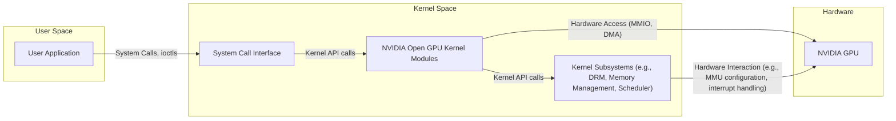
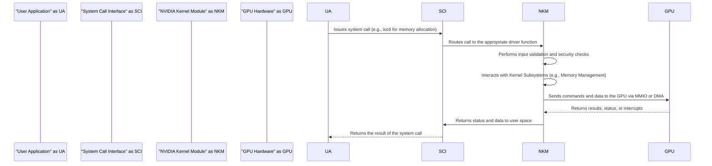

## Project Design Document: NVIDIA Open GPU Kernel Modules

**Version:** 1.1
**Date:** October 26, 2023
**Author:** AI Software Architect

### 1. Introduction

This document provides an enhanced high-level design overview of the NVIDIA Open GPU Kernel Modules project, as found on GitHub: [https://github.com/NVIDIA/open-gpu-kernel-modules](https://github.com/NVIDIA/open-gpu-kernel-modules). This revised document aims to provide a more detailed description of the architecture, key components, and data flow of the project to facilitate a more comprehensive threat modeling and security analysis. It is intended for security engineers, developers, and anyone involved in assessing the security posture of systems utilizing these kernel modules. This version includes more specific examples and clarifies certain aspects of the system.

### 2. Goals and Non-Goals

**Goals:**

* Provide open-source kernel modules for NVIDIA GPUs, fostering transparency and community involvement.
* Enable community contribution and collaboration in the development of GPU kernel drivers, leading to faster innovation and bug fixes.
* Offer a foundation for building and customizing GPU driver functionality to meet specific needs.
* Support a wide range of GPU functionalities, including display management, compute capabilities, and virtualization technologies.
* Facilitate deeper debugging and understanding of the underlying GPU driver mechanisms for developers and researchers.

**Non-Goals:**

* This document does not delve into the micro-architectural details of specific NVIDIA GPU hardware implementations.
* It does not detail the implementation specifics of user-space libraries or tools (e.g., CUDA Toolkit, OpenGL/Vulkan drivers) that interact with these kernel modules.
* It does not cover the internal workings of specific graphics APIs (e.g., Vulkan, OpenGL) or their rendering pipelines.
* It does not encompass the closed-source firmware or microcode that is integral to the operation of NVIDIA GPUs.

### 3. System Architecture

The NVIDIA Open GPU Kernel Modules project operates primarily within the operating system kernel space, acting as an intermediary between user-space applications and the NVIDIA GPU hardware.

#### 3.1. High-Level Architecture Diagram

#### 3.2. Key Components

The NVIDIA Open GPU Kernel Modules project comprises several interconnected components:

* **Core GPU Management Modules:**
    - **Initialization Module:** Responsible for the initial setup and configuration of the GPU device during system boot or module loading.
    - **Power Management Module:** Handles power states, clock frequencies, and thermal management of the GPU.
    - **Interrupt Management Module:** Manages hardware interrupts generated by the GPU and routes them to appropriate handlers.
    - **Error Handling Module:** Detects, logs, and attempts to recover from GPU errors.
* **Memory Management Modules:**
    - **Memory Allocation Module:** Manages the allocation and deallocation of memory on the GPU device.
    - **Address Space Management Module:** Controls the mapping of GPU memory into the address spaces of processes.
    - **Memory Protection Module:** Enforces memory access permissions and prevents unauthorized access.
* **Command Submission and Scheduling Modules:**
    - **Command Parser Module:** Interprets commands received from user space.
    - **Command Scheduler Module:** Manages the execution order of commands on the GPU.
    - **Command Queue Management Module:** Handles the queuing and prioritization of command buffers.
* **Display Management (DRM Integration) Modules:**
    - **Modesetting Module:** Controls display resolutions, refresh rates, and other display parameters.
    - **Framebuffer Management Module:** Manages the allocation and manipulation of framebuffers for rendering.
    - **DRM Interface Module:** Provides the interface to the Direct Rendering Manager (DRM) subsystem.
* **Compute Management Modules:**
    - **Compute Context Management Module:** Manages the creation and destruction of compute contexts on the GPU.
    - **Kernel Launch Module:** Handles the submission and execution of compute kernels.
    - **Synchronization Module:** Provides mechanisms for synchronizing compute operations.
* **Virtualization Support Modules (if enabled):**
    - **SR-IOV Management Module:** Manages the creation and configuration of virtual functions (VFs).
    - **Virtualization Interface Module:** Provides the necessary interfaces for GPU virtualization.
* **Firmware Communication Module:**
    - Facilitates communication with the closed-source firmware running on the GPU.
* **Tracing and Debugging Modules:**
    - **Logging Module:** Provides mechanisms for logging driver events and errors.
    - **Tracing Module:** Enables detailed tracing of driver execution for debugging purposes.

#### 3.3. Interfaces

The kernel modules interact with various parts of the system through well-defined interfaces:

* **System Call Interface:** User-space applications interact with the kernel modules primarily through standard Linux system calls, particularly `ioctl`.
* **ioctl Commands:** A specific set of `ioctl` commands are defined to provide fine-grained control and management of the GPU through the device driver interface (e.g., memory allocation, command submission, modesetting).
* **Kernel APIs:** The modules extensively utilize kernel APIs provided by core kernel subsystems, including:
    - **DRM API:** For display management and direct rendering.
    - **Memory Management API:** For allocating and managing physical and virtual memory.
    - **Interrupt Handling API:** For registering and handling hardware interrupts.
    - **Scheduler API:** For managing task scheduling and synchronization.
* **Hardware Interfaces:** The modules directly interact with the GPU hardware through:
    - **Memory-Mapped I/O (MMIO):** Accessing GPU registers and memory regions.
    - **Direct Memory Access (DMA):** Transferring data between system memory and GPU memory.
* **Procfs/Sysfs Interfaces:**  The modules may expose information and control mechanisms through files in the `/proc` and `/sys` file systems, allowing for monitoring and configuration.

### 4. Data Flow

The typical data flow involves a user-space application initiating a GPU operation, which is then processed by the kernel modules and executed on the GPU hardware.

**Detailed Data Flow Examples:**

* **GPU Memory Allocation:**
    - A user application requests GPU memory by issuing an `ioctl` call to the device driver.
    - The kernel module receives the request, validates the size and type of memory requested, and checks available resources.
    - The module interacts with the kernel's memory management subsystem to allocate contiguous physical memory.
    - The module then programs the GPU's Memory Management Unit (MMU) to map this allocated physical memory into the application's virtual address space, often using an IOMMU for security.
    - The file descriptor or handle to the allocated memory is returned to the user application.
* **GPU Command Submission for Rendering:**
    - A graphics application prepares a command buffer containing rendering instructions (e.g., drawing triangles, setting textures).
    - The application uses an `ioctl` call to submit this command buffer to the kernel module.
    - The kernel module validates the command buffer structure and contents to prevent malicious commands.
    - The command buffer is placed in a command queue managed by the kernel module.
    - The GPU scheduler within the kernel module dispatches the commands from the queue to the GPU's command processor.
    - The GPU executes the rendering commands, accessing textures and framebuffers in its memory.
* **Display Output Process:**
    - A user-space display server (e.g., Wayland compositor) configures display settings (resolution, refresh rate) via `ioctl` calls.
    - The kernel module interacts with the DRM subsystem to negotiate display modes with the connected monitor.
    - The display server renders the desktop or application windows into a framebuffer in GPU memory.
    - The kernel module configures the display controller on the GPU to scan out the framebuffer content and send it to the display output.

### 5. Security Considerations

This section highlights potential security considerations relevant to the NVIDIA Open GPU Kernel Modules, providing a basis for threat modeling.

* **Kernel Module Vulnerabilities:**
    - **Memory Corruption:** Bugs like buffer overflows, use-after-free, and out-of-bounds access within the kernel modules can lead to arbitrary code execution in the kernel.
    - **Logic Errors:** Flaws in the driver logic can lead to unexpected behavior, resource leaks, or security bypasses.
* **User-Space Input Validation:**
    - **ioctl Parameter Validation:** Insufficient validation of parameters passed through `ioctl` calls can allow malicious user-space applications to trigger vulnerabilities in the kernel module.
    - **Command Buffer Validation:** Lack of proper validation of command buffers submitted by user space can lead to GPU hangs, crashes, or potentially allow for GPU-based attacks.
* **Access Control and Privilege Escalation:**
    - **Insufficient Permission Checks:** Missing or incorrect permission checks on `ioctl` commands or access to GPU resources could allow unauthorized processes to control the GPU or access sensitive data.
    - **Privilege Escalation:** Vulnerabilities in the driver could be exploited by unprivileged processes to gain kernel-level privileges.
* **GPU Memory Management Security:**
    - **Memory Sharing Vulnerabilities:** Improper handling of shared GPU memory between processes could allow for information leakage or unauthorized modification.
    - **DMA Attacks:**  If DMA operations are not properly secured, malicious devices or compromised user-space applications could potentially access or corrupt system memory.
* **Hardware Interaction Security:**
    - **Firmware Vulnerabilities:** While the open-source modules interact with the firmware, vulnerabilities in the closed-source firmware itself could pose a security risk.
    - **Side-Channel Attacks:** Potential for side-channel attacks exploiting timing variations or power consumption during GPU operations.
* **Virtualization Security:**
    - **VM Escape:** Vulnerabilities in the virtualization support could allow a malicious guest VM to escape its isolation and compromise the host system or other guests.
    - **Inter-VM Interference:** Improper resource management in virtualized environments could allow one VM to negatively impact the performance or security of other VMs.
* **Denial of Service (DoS):**
    - **Resource Exhaustion:** Malicious user-space applications could attempt to exhaust GPU resources (memory, command queues) or trigger computationally expensive operations, leading to a denial of service.
    - **Driver Crashes:** Triggering bugs in the driver through crafted input could cause the driver to crash, potentially impacting system stability.

### 6. Deployment

The NVIDIA Open GPU Kernel Modules are deployed as an integral part of the operating system kernel.

* **Compilation Process:** The modules are compiled specifically for the target kernel version using the kernel's build system.
* **Installation Procedure:** The compiled kernel module files (`.ko`) are installed into the appropriate kernel module directory, typically `/lib/modules/$(uname -r)/kernel/drivers/gpu/nvidia/`.
* **Module Loading:** The modules are loaded into the kernel at boot time or on demand using tools like `modprobe`. Dependencies on other kernel modules are managed during this process.
* **Configuration Options:**  Configuration parameters for the modules can be set through module parameters passed during loading or via files in the `/sys/module/nvidia/parameters/` directory.

### 7. Assumptions and Constraints

* **Underlying Kernel Security:** The security of the NVIDIA Open GPU Kernel Modules relies on the security of the underlying operating system kernel.
* **Hardware Trust:** The integrity and security of the NVIDIA GPU hardware itself are assumed.
* **Closed-Source Firmware Boundary:** Interactions with the closed-source GPU firmware are a necessary part of the driver's operation, and the security of this firmware is a separate concern.
* **Standard Linux Environment:** The design assumes deployment within a standard Linux environment with typical kernel subsystems and user-space utilities.

### 8. Future Considerations

* **Continuous Development and Security Updates:** The project is expected to undergo continuous development, with ongoing security reviews and updates to address identified vulnerabilities.
* **Community Security Audits:** Encouraging and facilitating community security audits and penetration testing will be crucial for identifying potential weaknesses.
* **Integration with Security Frameworks:** Exploring integration with existing Linux security frameworks (e.g., SELinux, AppArmor) could enhance the overall security posture.
* **Formal Verification:**  Investigating the use of formal verification techniques for critical parts of the driver could provide a higher level of assurance.

This enhanced document provides a more detailed and structured understanding of the NVIDIA Open GPU Kernel Modules project's design, offering a solid foundation for conducting a comprehensive threat modeling exercise to identify and mitigate potential security risks.