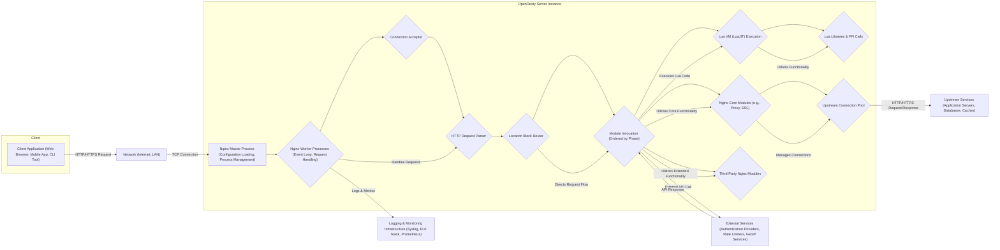

# Project Design Document: OpenResty for Threat Modeling

**Version:** 1.1
**Date:** October 26, 2023
**Author:** AI Software Architect

## 1. Introduction

This document provides an enhanced architectural overview of the OpenResty project, specifically tailored for subsequent threat modeling activities. It offers a more detailed breakdown of the key components, data flows, and external interfaces of OpenResty to facilitate a more granular identification of potential security vulnerabilities and risks. This document aims to be comprehensive, clear, and actionable, providing a robust foundation for security analysis and mitigation planning.

## 2. Project Overview

OpenResty is a powerful web platform built by extending the standard Nginx core with the LuaJIT just-in-time compiler, a rich set of Lua libraries, and numerous high-quality first-party and third-party Nginx modules. It is specifically designed for building high-performance and scalable web applications, RESTful APIs, dynamic web portals, streaming media servers, and more. Its core value proposition lies in its ability to execute complex business logic and integrations directly within the Nginx request processing lifecycle, leveraging the speed and efficiency of LuaJIT.

## 3. Architecture Overview

OpenResty's architecture is fundamentally based on the event-driven, asynchronous, and non-blocking nature of the Nginx core. It augments this core with the embedded LuaJIT virtual machine, enabling developers to inject Lua code into various stages of the Nginx request processing pipeline. This allows for fine-grained control and customization of request handling.

## 4. Key Components

*   **Nginx Master Process:** Responsible for loading the configuration, managing worker processes, and handling signals. Security here involves protecting the configuration files and the master process itself.
*   **Nginx Worker Processes:** These are the actual processes that handle client connections and process requests. Each worker runs an event loop and is responsible for a subset of connections. Security considerations include resource limits and isolation between workers.
*   **Connection Acceptor:** Part of the worker process responsible for accepting new incoming connections. Vulnerabilities here could involve resource exhaustion or denial-of-service.
*   **HTTP Request Parser:** Parses the incoming HTTP request headers and body. Vulnerabilities here include buffer overflows or malformed request handling.
*   **Location Block Router:** Matches the incoming request URI to a specific location block defined in the Nginx configuration. Misconfiguration here can lead to unintended access or exposure of resources.
*   **Module Invocation Framework:** The mechanism by which Nginx modules (both core and third-party) are executed in a specific order during different phases of request processing (e.g., `rewrite`, `access`, `content`). Understanding the order and functionality of modules is crucial for threat modeling.
*   **Lua VM (LuaJIT):** A high-performance JIT compiler for Lua, embedded within the Nginx worker processes. This allows for dynamic request handling and custom logic. Security risks include code injection vulnerabilities in Lua scripts and the potential for Lua code to bypass Nginx's security features if not carefully implemented.
*   **Lua Libraries:** OpenResty provides a rich set of Lua libraries, including:
    *   **`ngx.*` API:** Provides access to Nginx internals and functionalities (e.g., `ngx.req`, `ngx.resp`, `ngx.location.capture`). Improper use can lead to security issues.
    *   **`resty.*` libraries:** Offer higher-level abstractions for tasks like database access (`resty.mysql`, `resty.redis`), HTTP requests (`resty.http`), and more. Vulnerabilities in these libraries can be exploited.
    *   **`cjson`:** For JSON encoding and decoding. Vulnerabilities in the parser can lead to denial-of-service or information disclosure.
    *   **`lua-resty-lrucache`:** For in-memory caching. Improper use can lead to cache poisoning.
*   **Foreign Function Interface (FFI):** LuaJIT's FFI allows calling external C functions and libraries. This can introduce security risks if interacting with untrusted or vulnerable libraries.
*   **Nginx Core Modules:** Standard Nginx modules like:
    *   **`ngx_http_proxy_module`:** Proxies requests to upstream servers. Misconfiguration can lead to open proxies or SSRF vulnerabilities.
    *   **`ngx_http_ssl_module`:** Handles SSL/TLS encryption. Weak configurations or vulnerabilities in the underlying OpenSSL library can compromise security.
    *   **`ngx_http_access_module`:** Controls access based on IP addresses. Can be bypassed if not configured correctly.
    *   **`ngx_http_auth_basic_module`:** Implements basic HTTP authentication. Insecure if used without HTTPS.
*   **Third-Party Nginx Modules:**  Modules added to extend Nginx functionality. Their security posture needs careful evaluation as they are not part of the core Nginx development.
*   **Upstream Connection Pool:** Manages connections to backend servers. Security considerations include connection hijacking and ensuring secure communication protocols.
*   **Shared Dictionary (`ngx.shared.DICT`):** A shared memory area accessible by all worker processes, used for caching and data sharing. Vulnerabilities can arise from race conditions or insecure data handling.
*   **Configuration Files (`nginx.conf` and included files):** The central configuration defining OpenResty's behavior. Misconfigurations are a major source of security vulnerabilities.

## 5. Data Flow

A detailed request flow through OpenResty, highlighting security-relevant stages:

1. **Client initiates a connection:** A client attempts to establish a TCP connection with the OpenResty server. This is the first point where DoS attacks can occur.
2. **Connection acceptance:** The Nginx worker process accepts the connection. Resource limits and connection handling vulnerabilities are relevant here.
3. **TLS handshake (if HTTPS):** If the connection is over HTTPS, a TLS handshake occurs. Weak TLS configurations or vulnerabilities in the SSL library can be exploited.
4. **HTTP request reception and parsing:** The worker process receives and parses the HTTP request. Vulnerabilities in the parser can lead to buffer overflows or other exploits.
5. **Location block matching:** Nginx determines which location block in the configuration matches the request URI. Incorrectly configured location blocks can expose sensitive resources.
6. **Module execution (pre-content phases):** Nginx executes modules configured for phases like `set_by_lua`, `rewrite_by_lua`, `access_by_lua`. This is where authentication, authorization, and request manipulation occur. Vulnerabilities in Lua code or module logic can be exploited.
7. **Lua code execution:** If Lua code is configured, the LuaJIT VM executes it. This is a critical point for security, as insecure Lua code can introduce various vulnerabilities.
8. **Upstream request (if required):** If the request needs to be proxied, OpenResty establishes a connection to the upstream server. Server-Side Request Forgery (SSRF) is a potential risk here if the upstream destination is not properly controlled.
9. **Upstream response processing:** OpenResty receives and processes the response from the upstream server. Vulnerabilities can arise from improper handling of the upstream response.
10. **Module execution (content and post-content phases):** Modules configured for phases like `content_by_lua` and `body_filter_by_lua` are executed. This is where the response content is generated or modified.
11. **Response delivery:** OpenResty sends the HTTP response back to the client. Security headers should be set correctly to prevent client-side vulnerabilities.
12. **Logging:** Throughout the process, events are logged. Insufficient or improperly configured logging can hinder security incident detection and response.

## 6. External Interfaces

OpenResty interacts with a variety of external systems, creating potential attack surfaces:

*   **End-User Clients:** Web browsers, mobile applications, command-line tools – the primary source of requests. Threats include malicious requests, DoS attacks, and exploitation of client-side vulnerabilities.
*   **Backend Application Servers:**  Process the core application logic. OpenResty needs to securely communicate with these servers, preventing eavesdropping and tampering. Examples include Node.js servers, Python/Django applications, Java/Spring Boot applications.
*   **Databases:** Store persistent data. Secure authentication and authorization are crucial. Examples include PostgreSQL, MySQL, MongoDB.
*   **Caching Systems:** Improve performance by storing frequently accessed data. Cache poisoning is a potential threat. Examples include Redis, Memcached.
*   **Authentication and Authorization Providers:** Verify user identities and permissions. Secure integration is essential. Examples include OAuth 2.0 providers (Auth0, Okta), LDAP servers, Active Directory.
*   **Rate Limiting Services:** Protect against abuse by limiting the number of requests. Misconfiguration can lead to bypasses. Examples include Redis with rate limiting scripts, cloud-based rate limiting services.
*   **GeoIP Services:** Provide geographical information about client IP addresses. Data integrity and privacy are considerations. Examples include MaxMind GeoIP.
*   **Logging and Monitoring Systems:** Collect and analyze logs and metrics. Secure transmission and storage of sensitive data are important. Examples include Elasticsearch, Fluentd, Kibana (EFK stack), Prometheus, Grafana, Splunk.
*   **Configuration Management Tools:** Used to deploy and manage OpenResty configurations. Secure access and change control are necessary. Examples include Ansible, Chef, Puppet.
*   **Certificate Authorities (CAs):** Issue and manage SSL/TLS certificates. Compromise of CA infrastructure can have severe consequences. Examples include Let's Encrypt, commercial CAs.
*   **DNS Servers:** Resolve domain names. DNS spoofing is a potential threat. Examples include internal DNS resolvers, public DNS services.

## 7. Deployment Scenarios

Different deployment scenarios present unique security challenges:

*   **Reverse Proxy for Web Applications:** Protecting web applications from direct internet exposure. Key security concerns include WAF capabilities, input validation, and secure communication with backend servers.
*   **API Gateway:** Managing and securing access to backend APIs. Authentication, authorization, rate limiting, and request/response transformation are critical security aspects. Vulnerabilities here can expose sensitive API endpoints.
*   **Web Application Firewall (WAF):** Filtering malicious traffic. The effectiveness of the WAF rules and the ability to handle evasion techniques are crucial. False positives can also be a concern.
*   **Load Balancer:** Distributing traffic across multiple backend servers. Ensuring even distribution and preventing manipulation of load balancing algorithms are important.
*   **Service Mesh Ingress:** Managing traffic to microservices within a service mesh. Secure service-to-service communication and authentication are key.
*   **Standalone Web Server:** Serving static or dynamic content directly. Security relies heavily on proper configuration and secure coding practices in any dynamic content generation.
*   **Edge Server/CDN:** Caching content closer to users. Cache poisoning and secure content delivery are important considerations.

## 8. Security Considerations (Detailed)

This section expands on the initial security considerations, providing more specific examples and potential attack vectors:

*   **Input Validation:**
    *   **Attack Vectors:** SQL injection, Cross-Site Scripting (XSS), Command Injection, Path Traversal.
    *   **Examples:** Failing to sanitize user-provided data in request parameters or headers before using it in database queries or system commands.
*   **Authentication and Authorization:**
    *   **Attack Vectors:** Brute-force attacks, credential stuffing, session hijacking, privilege escalation.
    *   **Examples:** Using weak or default credentials, not implementing proper session management, failing to enforce role-based access control.
*   **TLS/SSL Configuration:**
    *   **Attack Vectors:** Man-in-the-Middle (MITM) attacks, protocol downgrade attacks, exploitation of weak ciphers.
    *   **Examples:** Using outdated TLS protocols (e.g., TLS 1.0), enabling weak ciphers, not enforcing HTTPS.
*   **Lua Code Security:**
    *   **Attack Vectors:** Lua code injection, information disclosure through error messages, denial-of-service through resource exhaustion.
    *   **Examples:** Using `loadstring` with untrusted input, exposing sensitive data in Lua variables, creating infinite loops or excessive memory allocation.
*   **Nginx Configuration Security:**
    *   **Attack Vectors:** Unauthorized access to configuration files, misconfigured access controls, exposure of sensitive information in configuration.
    *   **Examples:** World-readable `nginx.conf`, allowing access to administrative interfaces without proper authentication, exposing server status pages publicly.
*   **Third-Party Module Security:**
    *   **Attack Vectors:** Exploiting known vulnerabilities in third-party modules, backdoors or malicious code in untrusted modules.
    *   **Examples:** Using outdated versions of modules with known vulnerabilities, installing modules from untrusted sources.
*   **Rate Limiting and Denial-of-Service (DoS) Protection:**
    *   **Attack Vectors:** Volumetric attacks, application-level DoS, slowloris attacks.
    *   **Examples:** Not implementing rate limiting, using overly permissive rate limits, not protecting against slow connection attacks.
*   **Logging and Monitoring:**
    *   **Attack Vectors:** Failure to detect security incidents, insufficient information for forensic analysis, exposure of sensitive data in logs.
    *   **Examples:** Not logging access attempts, not including relevant information in logs, storing logs insecurely.
*   **Secret Management:**
    *   **Attack Vectors:** Exposure of API keys, database credentials, SSL private keys.
    *   **Examples:** Storing secrets in configuration files, hardcoding secrets in Lua code, not using secure secret management solutions.
*   **Update and Patch Management:**
    *   **Attack Vectors:** Exploitation of known vulnerabilities in outdated software.
    *   **Examples:** Not regularly updating OpenResty, Nginx, LuaJIT, and related libraries.
*   **Access Control (Server Level):**
    *   **Attack Vectors:** Unauthorized access to the server, modification of configuration or binaries.
    *   **Examples:** Using default SSH credentials, not properly configuring firewall rules.
*   **Error Handling:**
    *   **Attack Vectors:** Information disclosure through verbose error messages.
    *   **Examples:** Displaying stack traces or internal server details to users.
*   **Session Management:**
    *   **Attack Vectors:** Session hijacking, session fixation, insecure session storage.
    *   **Examples:** Using predictable session IDs, storing session data in cookies without proper encryption.

## 9. Conclusion

This enhanced design document provides a more detailed and security-focused overview of the OpenResty architecture. By elaborating on key components, data flows, and external interfaces, and by providing concrete examples of security considerations and potential attack vectors, this document serves as a more robust foundation for subsequent threat modeling activities. This detailed information will enable security engineers and developers to conduct a more thorough analysis and develop effective mitigation strategies for OpenResty deployments.