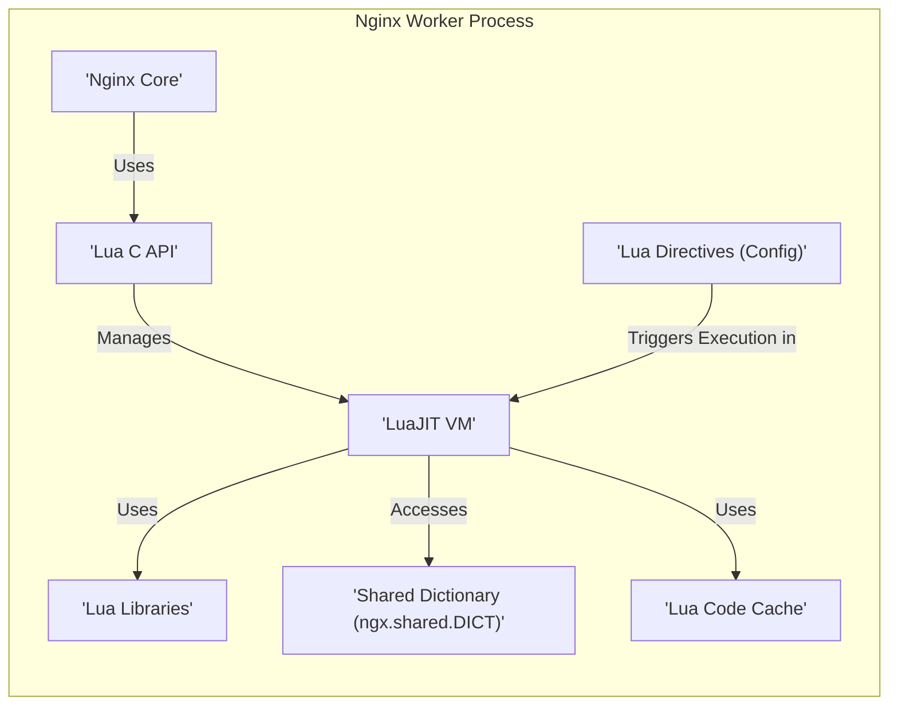
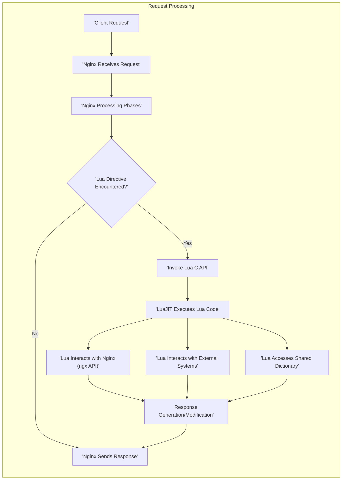

## Project Design Document: OpenResty Lua Nginx Module

**1. Introduction**

This document provides a detailed design overview of the OpenResty Lua Nginx Module (hereafter referred to as "the module"). This document is specifically created to serve as a foundational resource for subsequent threat modeling activities. It meticulously outlines the module's architecture, key components, data flow, and deployment considerations, with a strong emphasis on aspects relevant to security analysis.

**1.1. Purpose**

The primary purpose of this document is to establish a clear and comprehensive understanding of the module's internal workings and external interactions. This deep understanding is paramount for effectively identifying potential security vulnerabilities, attack surfaces, and associated risks during the threat modeling process. This document aims to provide the necessary context for security experts to analyze the module's security posture.

**1.2. Scope**

This document focuses exclusively on the design and architecture of the `lua-nginx-module` and its integration within the Nginx web server environment. The scope encompasses the core functionalities provided by the module, including the embedding and management of the LuaJIT interpreter, and the mechanisms that facilitate the execution of Lua code within the various stages of the Nginx request processing lifecycle. While acknowledging the existence of the Nginx core, this document will only delve into its specifics where directly relevant to the module's operation and security implications. Configuration aspects directly related to the module are also within scope.

**1.3. Goals**

*   To precisely describe the module's architecture, delineating its constituent components and their individual responsibilities.
*   To clearly illustrate the flow of data and control, specifically highlighting the execution paths involving Lua code within the Nginx environment.
*   To explicitly identify the critical interaction points and interfaces between the Nginx core and the embedded Lua environment.
*   To provide a level of detail sufficient for security engineers and threat modeling experts to conduct thorough and effective security assessments.

**2. Overview**

The `lua-nginx-module` is a powerful Nginx module that embeds the LuaJIT just-in-time compiler directly into the Nginx server. This integration allows Nginx configurations to be significantly extended and customized using the flexible and lightweight Lua scripting language. This capability empowers developers to implement complex application logic, directly access and manipulate Nginx internals, and seamlessly interact with external systems, all within the high-performance context of the Nginx server. The module achieves this through a set of specific Nginx configuration directives that trigger the execution of embedded Lua code at precisely defined stages of the Nginx request processing lifecycle. This enables fine-grained control over request handling and response generation.

**3. Architecture**

The module's architecture is centered around the tight integration of the LuaJIT runtime within the Nginx worker process. This close coupling allows for efficient execution of Lua code within the Nginx event loop. Key components include:

*   **Nginx Core:** The foundational web server responsible for handling incoming network requests, managing worker processes, and orchestrating the request processing lifecycle. It provides the underlying infrastructure upon which the module operates.
*   **LuaJIT Virtual Machine:** The embedded, high-performance just-in-time compiler and runtime environment for the Lua scripting language. It is responsible for interpreting and executing the Lua code provided in the Nginx configuration.
*   **Lua C API:** This is the crucial interface that enables bidirectional communication between the Nginx core and the LuaJIT VM. It provides a set of C functions that allow Nginx to:
    *   Load and execute Lua code snippets and files.
    *   Invoke specific Lua functions defined within the scripts.
    *   Expose Nginx request and response objects to the Lua environment, allowing manipulation of headers, body, and other attributes.
    *   Provide access to various Nginx subsystems, such as timers for asynchronous operations and the ability to initiate subrequests.
*   **Lua Directives (Nginx Configuration):** These are specific Nginx configuration directives that act as triggers for the execution of Lua code at designated phases of the request processing. Examples include:
    *   `set_by_lua`: Executes Lua code to dynamically set the value of an Nginx variable.
    *   `rewrite_by_lua`: Executes Lua code during the URI rewriting phase, allowing for complex URL manipulation.
    *   `access_by_lua`: Executes Lua code during the access control phase, enabling custom authentication and authorization logic.
    *   `content_by_lua`: Executes Lua code to generate the entire HTTP response content, bypassing Nginx's default content handling.
    *   `header_filter_by_lua`: Executes Lua code to modify or add response headers before they are sent to the client.
    *   `body_filter_by_lua`: Executes Lua code to process and modify the response body content as it is being sent.
    *   `log_by_lua`: Executes Lua code during the logging phase, allowing for customized logging behavior.
    *   `init_by_lua`: Executes Lua code once when the Nginx master process starts, useful for global initialization tasks.
    *   `init_worker_by_lua`: Executes Lua code each time an Nginx worker process is forked or started, useful for worker-specific initialization.
*   **Lua Libraries (Standard and Custom):** These are collections of pre-written Lua code that provide reusable functionalities. They can be standard Lua libraries or custom modules developed for specific application needs. Examples relevant to Nginx include:
    *   `lua-resty-mysql`: For interacting with MySQL databases. Potential security concerns include SQL injection if user input is not properly sanitized before being used in database queries.
    *   `lua-resty-redis`: For interacting with Redis data stores. Security considerations include potential for data breaches if access controls are not properly configured.
    *   `ngx.location.capture`: For making internal subrequests. This can introduce vulnerabilities if not used carefully, potentially leading to SSRF (Server-Side Request Forgery).
    *   `cjson`: For encoding and decoding JSON data. Vulnerabilities in the library itself could lead to parsing errors or unexpected behavior.
    *   `lua-resty-core`: Provides low-level Nginx API bindings. Improper use of these bindings could lead to instability or security issues.
*   **Shared Dictionary (ngx.shared.DICT):** A mechanism provided by the module for sharing data between different Nginx worker processes. This uses a shared memory segment and allows Lua code in different workers to access and modify the same data. Security concerns include race conditions and potential for data corruption if not managed carefully.
*   **Lua Code Cache:** To improve performance, the module caches compiled Lua code in memory. This avoids the overhead of recompiling the code on every request. Security considerations might involve ensuring the integrity of the cached code.

**4. Data Flow**

The execution of Lua code within Nginx is initiated by the presence of specific `*_by_lua` directives within the Nginx configuration. The typical flow of data and control for a request that involves Lua code execution is as follows:

1. **Client Request:** A client initiates an HTTP request targeting the Nginx server.
2. **Nginx Receives Request:** The Nginx server receives the incoming request and begins its standard processing workflow.
3. **Nginx Processing Phases:** Nginx proceeds through its various processing phases, such as server block selection, URI rewriting, and access control checks.
4. **Lua Directive Encountered:** During the processing phases, if Nginx encounters a configuration directive like `access_by_lua`, it recognizes the need to execute Lua code.
5. **Invoke Lua C API:** Nginx calls the appropriate functions within the Lua C API to initiate the Lua execution process.
6. **LuaJIT Executes Lua Code:** The Lua C API instructs the embedded LuaJIT VM to execute the specific Lua code block or file associated with the encountered directive.
7. **Lua Interacts with Nginx (ngx API):** The executing Lua code can interact with the Nginx environment through the `ngx` Lua API. This allows the Lua code to access and manipulate various aspects of the request and response, including headers, body, URI, and variables. It can also trigger actions within Nginx, such as setting response headers, generating response content, or initiating internal subrequests to other locations.
8. **Lua Interacts with External Systems:**  Lua code can utilize external Lua libraries to communicate with external systems. This might involve making HTTP requests to other services, querying databases, or interacting with caching layers.
9. **Lua Accesses Shared Dictionary:** The Lua code can read and write data to the shared dictionary, enabling communication and data sharing between different Nginx worker processes. This is often used for tasks like rate limiting or session management.
10. **Response Generation/Modification:** Based on the logic and actions performed by the executed Lua code, the HTTP response is either generated from scratch or the existing response is modified.
11. **Nginx Sends Response:** Finally, Nginx sends the generated or modified HTTP response back to the originating client.

**5. Security Considerations**

The integration of a dynamic scripting language like Lua directly into the web server introduces several important security considerations that must be carefully addressed:

*   **Code Injection Vulnerabilities:** If Lua code is dynamically generated or incorporates user-provided input without rigorous sanitization and validation, the system becomes susceptible to code injection attacks. Malicious actors could inject arbitrary Lua code, potentially gaining control over the server or accessing sensitive data.
*   **Resource Exhaustion Attacks:** Maliciously crafted or poorly written Lua code can consume excessive server resources, including CPU, memory, and network bandwidth. This can lead to denial-of-service (DoS) conditions, making the server unresponsive to legitimate requests. For example, infinite loops or computationally intensive operations within Lua scripts can quickly overwhelm the server.
*   **Information Disclosure Risks:** Lua code might inadvertently expose sensitive information through various channels, such as logging statements, error messages displayed in responses, or by directly leaking data in the response body or headers. Careful attention must be paid to what data is being processed and how it is being handled.
*   **Potential for Privilege Escalation:** Although Lua code typically runs within the context of the Nginx worker process's privileges, vulnerabilities within the `lua-nginx-module` itself or within the executed Lua code could potentially be exploited to escalate privileges or bypass security restrictions.
*   **Security of Used Lua Libraries:** The overall security of the application is heavily dependent on the security of the external Lua libraries being utilized. Vulnerabilities present in these third-party libraries could be exploited to compromise the Nginx server. Regular updates and security audits of these libraries are crucial.
*   **Access Control for Lua Code Management:** Robust mechanisms are essential to control who has the authority to modify and deploy Lua code to the Nginx server. Unauthorized changes to Lua scripts could introduce vulnerabilities or disrupt service. Version control and access control lists are important considerations.
*   **Shared Dictionary Security Concerns:**  When using the shared dictionary for inter-process communication, care must be taken to prevent race conditions, where multiple worker processes attempt to access or modify data simultaneously, leading to inconsistent or corrupted data. Proper locking mechanisms or atomic operations might be necessary. Unauthorized access to the shared dictionary could also lead to security breaches.
*   **Denial of Service through Algorithmic Complexity in Lua:**  Even without explicit loops, inefficient algorithms implemented in Lua can consume significant CPU time, leading to a slowdown or denial of service for other requests. Careful consideration of algorithmic complexity is important.

**6. Deployment Considerations**

The deployment process for the `lua-nginx-module` involves several key steps and considerations that impact security:

*   **Installation and Compilation:** The module typically needs to be compiled and linked with the Nginx binary during the Nginx build process. This often involves using the `--add-module` configuration option. Ensuring the build environment is secure and that the module source is from a trusted source is critical.
*   **Configuration Management:** Lua code is embedded within Nginx configuration files using the `*_by_lua` directives. Securely managing these configuration files is paramount. This includes controlling access to the files, using version control, and potentially encrypting sensitive data within the configurations.
*   **Lua Code Organization and Management:**  For larger deployments, it's best practice to store Lua code in separate files and include them in the Nginx configuration using directives like `lua_package_path` and `lua_package_cpath`. This improves organization and maintainability. Securely managing access to these Lua files is crucial.
*   **File System Permissions:**  Appropriate file system permissions must be set for Lua files and the directories containing them to prevent unauthorized reading, modification, or execution. Principle of least privilege should be applied.
*   **Logging and Monitoring of Lua Execution:**  Comprehensive logging of Lua execution, including any errors or exceptions, is essential for debugging and security monitoring. Integrating these logs with a security information and event management (SIEM) system can help detect suspicious activity.
*   **Limited Sandboxing Awareness:** While Lua itself provides some level of sandboxing, it's important to understand its limitations. The `lua-nginx-module` does not provide additional sandboxing layers. Therefore, relying solely on Lua's built-in sandboxing might not be sufficient for all security requirements. Consider the potential for sandbox escapes.
*   **Secrets Management:** If Lua code needs to access sensitive information like API keys or database credentials, secure secrets management practices should be employed. Avoid hardcoding secrets directly in the Lua code or Nginx configuration. Consider using environment variables or dedicated secrets management tools.

**7. Dependencies**

The `lua-nginx-module` has the following primary and critical dependencies:

*   **Nginx:** The core web server application. The module's functionality is entirely dependent on the presence and proper functioning of Nginx.
*   **LuaJIT:** The high-performance just-in-time compiler and runtime environment for the Lua language. The module directly embeds and relies on LuaJIT for executing Lua code.

**8. Future Considerations**

Potential future developments and considerations that could impact the design and security of the module include:

*   **Adoption of Newer Nginx Features and APIs:** As Nginx evolves, the module may need to be updated to integrate with new features and APIs. This could introduce new security considerations that need to be addressed.
*   **Enhancements to Security Features:** Exploring and implementing more robust security features, such as more granular control over Lua code execution permissions or enhanced sandboxing capabilities, could be beneficial.
*   **Performance Optimization Efforts:**  Continued efforts to optimize the performance of Lua code execution within the Nginx environment could lead to architectural changes that might have security implications.
*   **Development of Improved Debugging and Monitoring Tools:**  The availability of more sophisticated tools for debugging and monitoring Lua code running within Nginx would be valuable for identifying and resolving security issues more effectively.
*   **Community Security Audits:** Encouraging and participating in regular security audits by the open-source community is crucial for identifying and addressing potential vulnerabilities in the module.

This document provides a significantly enhanced and more detailed overview of the `lua-nginx-module`'s design, specifically tailored to facilitate effective threat modeling activities. The information presented here aims to equip security professionals with the necessary understanding to identify potential vulnerabilities, analyze attack vectors, and develop appropriate mitigation strategies.