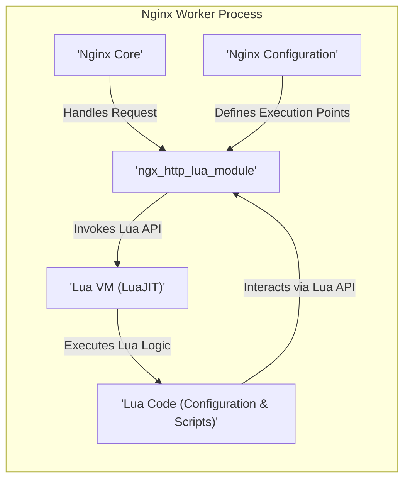
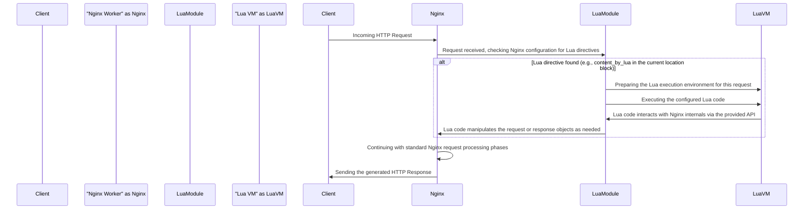

# Project Design Document: lua-nginx-module (Improved)

**Version:** 2.0
**Date:** October 26, 2023
**Author:** AI Software Architecture Expert

## 1. Introduction

This document provides an enhanced design overview of the `lua-nginx-module` project. This Nginx module empowers users to embed the Lua interpreter directly within the Nginx HTTP server. This integration allows for extending Nginx configurations and request handling logic using Lua scripting, offering significant flexibility and customization. This improved document aims for greater clarity and detail in articulating the architecture, components, and data flows, making it even more suitable for subsequent threat modeling activities.

## 2. Goals

*   To seamlessly integrate the Lua interpreter into the Nginx request processing lifecycle.
*   To offer a robust and well-documented API enabling Lua scripts to interact effectively with Nginx internals.
*   To provide a diverse set of Nginx directives for embedding and executing Lua code at various critical stages of request processing.
*   To maintain a high level of performance and efficiency within Nginx while leveraging the capabilities of Lua.
*   To establish reliable mechanisms for caching and sharing data between Lua scripts and the core Nginx environment.

## 3. Non-Goals

*   To replace the fundamental request processing engine or core functionalities of Nginx with Lua.
*   To develop a comprehensive application server framework entirely within the Nginx environment using Lua.
*   To completely abstract away the inherent complexities of the Nginx request processing model for Lua developers.
*   To support every single feature of the Lua language without any restrictions, as certain system-level operations might be intentionally restricted for security and stability.

## 4. High-Level Architecture

The `lua-nginx-module` acts as a crucial intermediary, bridging the core functionality of Nginx with the embedded Lua interpreter. It introduces specific Nginx directives that serve as triggers, initiating the execution of Lua code at precisely defined points during the lifecycle of processing client requests.

*   **Nginx Core:** The foundational HTTP server responsible for managing network connections, parsing incoming requests, and constructing and sending responses to clients.
*   **ngx\_http\_lua\_module:** This constitutes the heart of the `lua-nginx-module`. It's an Nginx module, developed in C, that embeds the Lua interpreter and meticulously provides the necessary API for Lua scripts to interact with the inner workings of Nginx.
*   **Lua VM (LuaJIT):** The high-performance Just-In-Time (JIT) compiler for the Lua language. It's deliberately chosen for its speed and efficiency. The module instantiates one or more Lua Virtual Machines within each Nginx worker process.
*   **Lua Code:** This encompasses Lua scripts that are either directly embedded within the Nginx configuration files or loaded from external files. These scripts contain the custom logic that will be executed to extend Nginx's capabilities.
*   **Nginx Configuration:** The standard Nginx configuration files (`nginx.conf`) where the specific directives provided by the `lua-nginx-module` are utilized to define when and how Lua code should be invoked during request processing.

## 5. Component Details

### 5.1. `ngx_http_lua_module`

*   **Purpose:** Serves as the primary communication and control interface between the Nginx core and the embedded Lua environment.
*   **Functionality:**
    *   Initializes and diligently manages the lifecycle of Lua VM(s) within each individual Nginx worker process.
    *   Provides a set of Nginx directives, such as `content_by_lua_block`, `access_by_lua_file`, and others, to facilitate the embedding and execution of Lua code at various stages.
    *   Implements the comprehensive Lua API, which empowers Lua scripts to access and manipulate critical Nginx request and response objects, headers, variables, and other internal data structures.
    *   Manages the execution context for Lua scripts, including the setup of the global environment, handling error conditions, and enforcing timeouts to prevent runaway scripts.
    *   Offers built-in mechanisms for caching compiled Lua code and other data to significantly improve performance and reduce overhead.
    *   Orchestrates the communication and efficient data transfer between the core Nginx process and the embedded Lua VM(s).
    *   Provides different Lua contexts (e.g., `init_by_lua`, `init_worker_by_lua`, request-based contexts) for executing Lua code at different phases of Nginx's lifecycle.

### 5.2. Lua VM (LuaJIT)

*   **Purpose:** To accurately parse, compile, and execute the Lua code provided either directly in the Nginx configuration or through external files.
*   **Functionality:**
    *   Parses and compiles Lua source code into bytecode for efficient execution.
    *   Executes Lua scripts based on the specific directives defined within the Nginx configuration.
    *   Provides access to standard Lua language features and built-in libraries.
    *   Interacts closely with the `ngx_http_lua_module` through the well-defined API to access Nginx functionalities.

### 5.3. Lua API

*   **Purpose:** To enable Lua scripts to effectively interact with and extend the functionalities of the Nginx environment.
*   **Key Features:**
    *   **Request Object Manipulation:** Allows Lua scripts to access and modify various aspects of the incoming request, including headers, URI, query arguments, and the request body.
    *   **Response Object Manipulation:** Enables Lua scripts to set and modify response headers, define HTTP status codes, and construct the response body.
    *   **Nginx Variable Access:** Provides the ability to read and set the values of Nginx variables, allowing for dynamic configuration and data sharing.
    *   **Subrequests:** Facilitates the initiation of internal subrequests to other locations defined within the Nginx configuration, enabling complex routing and processing logic.
    *   **Shared Memory Dictionary:** Offers access to a shared memory dictionary, allowing for efficient inter-process communication and caching of data across Nginx worker processes.
    *   **Cosockets:** Provides non-blocking network I/O capabilities, enabling Lua scripts to make external HTTP requests, connect to databases, and interact with other network services asynchronously.
    *   **Timers:** Allows for the scheduling of delayed execution of Lua functions, useful for background tasks and asynchronous operations.
    *   **Logging:** Provides functions for writing messages to the Nginx error log, aiding in debugging and monitoring.

### 5.4. Nginx Directives

The `lua-nginx-module` introduces a set of specialized directives that govern the execution of Lua code within the Nginx environment:

*   **`*_by_lua` directives (e.g., `content_by_lua`, `access_by_lua`, `header_filter_by_lua`, `body_filter_by_lua`):** These directives enable the execution of inline Lua code snippets at specific, well-defined phases of the request processing lifecycle.
*   **`*_by_lua_file` directives:** These directives instruct Nginx to execute Lua code contained within an external file, promoting better code organization and reusability.
*   **`lua_shared_dict`:** This directive is used to define a shared memory dictionary that can be accessed and manipulated by all Nginx worker processes, facilitating data sharing.
*   **`lua_package_path`, `lua_package_cpath`:** These directives allow for the configuration of the Lua module search paths, enabling the use of custom Lua libraries.
*   **`lua_code_cache`:** This directive controls whether Lua code is cached in memory after its initial execution, improving performance for subsequent requests.
*   **`lua_socket_log_errors`:** This directive controls the logging of errors that occur during cosocket operations.
*   **`init_by_lua`, `init_by_lua_file`:**  Execute Lua code when the Nginx master process starts.
*   **`init_worker_by_lua`, `init_worker_by_lua_file`:** Execute Lua code when each Nginx worker process starts.

## 6. Data Flow

The subsequent diagram illustrates the typical flow of data when a client request is processed by Nginx and involves the execution of Lua scripting:

1. **Client Request:** A client initiates an HTTP request destined for the Nginx server.
2. **Nginx Processing:** The designated Nginx worker process receives the incoming request and begins its processing journey through various defined phases (e.g., `server`, `location`).
3. **Lua Directive Encountered:** During the configuration processing for the current request phase, if a `*_by_lua` directive is encountered, Nginx invokes the `ngx_http_lua_module`.
4. **Lua Environment Setup:** The `ngx_http_lua_module` takes responsibility for setting up the necessary Lua execution environment within the designated Lua VM.
5. **Lua Code Execution:** The specific Lua code associated with the encountered directive (either embedded directly or referenced via a file path) is executed within the Lua VM.
6. **Lua API Interaction:** The executing Lua code interacts with the surrounding Nginx environment by utilizing the provided Lua API to access request data, modify response headers, initiate subrequests, and perform other Nginx-related operations.
7. **Nginx Integration:** The `ngx_http_lua_module` plays a crucial role in facilitating seamless communication between the Lua VM and the core Nginx process, ensuring that the actions performed by the Lua script are correctly integrated into Nginx's processing flow.
8. **Continued Nginx Processing:** Following the execution of the Lua code, Nginx continues its standard processing of the request, potentially with modifications or actions taken by the Lua script influencing subsequent phases.
9. **Response to Client:** Finally, Nginx constructs and sends the complete HTTP response back to the originating client.

## 7. Security Considerations

The integration of Lua scripting within Nginx introduces several important security considerations that must be thoroughly addressed during threat modeling exercises:

*   **Code Injection Vulnerabilities:** If Lua code is dynamically generated or includes user-provided input without proper sanitization, it can become susceptible to code injection attacks, allowing malicious code execution.
*   **Information Disclosure Risks:** Lua scripts might inadvertently expose sensitive information originating from the Nginx environment, internal configurations, or upstream systems if not carefully coded.
*   **Denial of Service (DoS) Potential:**
    *   **Resource Exhaustion:** Malicious or poorly written Lua code could consume excessive CPU resources, memory, or network bandwidth, leading to a denial of service for legitimate users.
    *   **Infinite Loops and Recursion:** Bugs or intentional malicious code within Lua scripts could cause infinite loops or excessive recursion, severely impacting server performance and potentially leading to crashes.
*   **Access Control and Privilege Escalation:** Ensuring that Lua scripts operate with the principle of least privilege and only have access to the necessary Nginx APIs and data is critical. Misconfigured scripts could potentially bypass security restrictions or gain unauthorized access.
*   **Vulnerabilities in External Lua Libraries:** If external Lua libraries are utilized, vulnerabilities present within those libraries could be exploited by attackers if not kept up-to-date and properly vetted.
*   **Cosocket Security Risks:** When employing cosockets for external communication, rigorous validation of both input and output data is paramount to prevent attacks such as SSRF (Server-Side Request Forgery) or injection vulnerabilities.
*   **Shared Memory Security Concerns:** Data stored within shared memory dictionaries requires careful management to prevent unauthorized access, modification, or corruption by malicious scripts.
*   **Timing Attack Vulnerabilities:** If the execution time of Lua code is dependent on sensitive data, it might become susceptible to timing attacks, potentially leaking information to attackers.
*   **Server-Side Request Forgery (SSRF):**  Improperly validated URLs or parameters used in Lua cosocket requests can create SSRF vulnerabilities, allowing attackers to make requests to internal or external resources on behalf of the server.
*   **Exposure of Nginx Internals:** Care must be taken to avoid exposing sensitive Nginx internal data or configurations through the Lua API.

## 8. Deployment Considerations

*   The `lua-nginx-module` is typically compiled as a dynamic shared object (DSO) and then loaded into Nginx using the `load_module` directive in the main Nginx configuration.
*   Lua code can be embedded directly within the Nginx configuration files using `*_by_lua_block` directives or stored in separate `.lua` files and referenced using `*_by_lua_file` directives.
*   Careful consideration must be given to the file system permissions and ownership of external Lua files to prevent unauthorized modification or access.
*   Configuration management tools (e.g., Ansible, Chef, Puppet) are highly recommended for deploying and managing Nginx configurations that include Lua integration, ensuring consistency and repeatability.
*   Comprehensive monitoring and logging of Lua script execution, including error conditions and performance metrics, are crucial for identifying potential issues and security incidents.
*   Regularly updating the `lua-nginx-module` and the underlying LuaJIT library is essential to patch any discovered security vulnerabilities and benefit from performance improvements.
*   Implementing input validation and output sanitization within Lua scripts is a critical security best practice.
*   Consider using a Lua linter and static analysis tools to identify potential security flaws or coding errors in Lua scripts before deployment.

This improved design document provides a more detailed and refined overview of the `lua-nginx-module`. It further clarifies the key components, data flows, and critically, the security considerations, making it a valuable resource for in-depth understanding and effective threat modeling of systems utilizing this powerful Nginx module.
