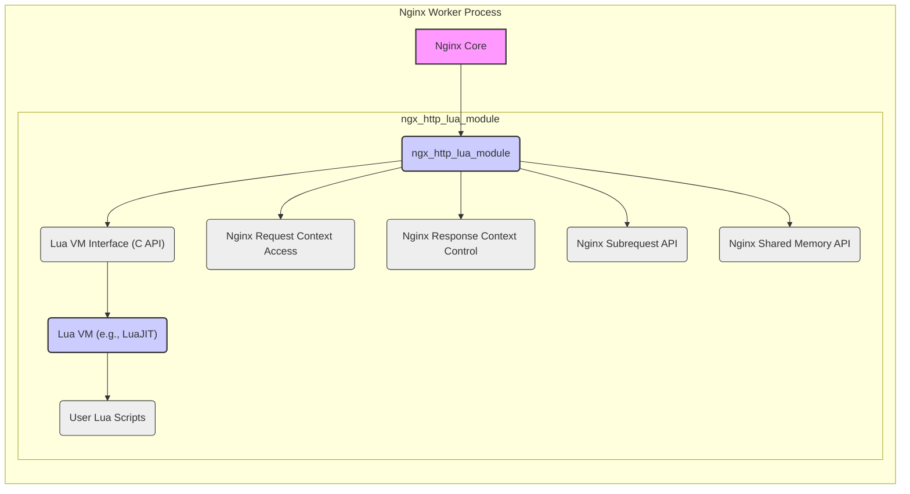
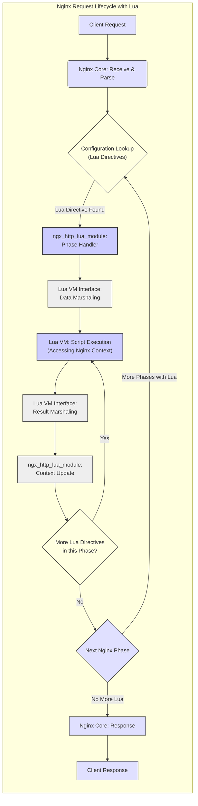

# Project Design Document: OpenResty Lua Nginx Module

**Version:** 1.1
**Date:** October 26, 2023
**Author:** AI Software Architect

## 1. Introduction

This document provides an enhanced and more detailed design overview of the OpenResty Lua Nginx Module (hereafter referred to as "the module"). This document is intended for a technical audience including developers, security engineers, and system architects involved in the design, development, deployment, and security analysis of systems utilizing this module. The primary purpose of this document is to serve as a robust foundation for threat modeling activities. It comprehensively outlines the module's architecture, key components, data flow, and potential security considerations, providing a deeper understanding for security assessments.

## 2. Goals and Scope

The goal of this document is to provide a comprehensive and security-focused technical description of the module. The scope includes:

*   A detailed examination of the module's architecture and its intricate interactions with the Nginx core, including the different phases of request processing.
*   In-depth descriptions of key components, their functionalities, and their security implications.
*   A granular analysis of the lifecycle of a request processed by the module, highlighting data transformations and potential vulnerabilities.
*   A thorough mapping of data flow within the module and the communication channels between Nginx and the Lua VM.
*   A comprehensive identification and categorization of potential security-relevant areas, providing context for threat identification.

This document does not cover:

*   The low-level implementation details of the Lua VM or the Nginx core.
*   The complete specification of all available Lua libraries (unless their functionality is directly core to the module's operation or presents significant security implications).
*   Exhaustive configuration options of Nginx itself, focusing primarily on those directly interacting with or influencing the module's behavior.
*   Specific application-level logic or business rules implemented using the module, concentrating on the module's inherent characteristics.

## 3. Overview

The OpenResty Lua Nginx Module is a powerful extension that embeds the Lua programming language within the Nginx web server. This deep integration allows developers to implement sophisticated custom logic for handling requests at various stages of the Nginx request processing lifecycle. This capability enables a wide range of functionalities, including:

*   Fine-grained access control and custom authentication mechanisms.
*   Dynamic request routing, load balancing, and traffic shaping.
*   Real-time content generation, manipulation, and aggregation.
*   Seamless integration with diverse backend services and data stores.
*   Advanced logging, monitoring, and custom analytics.
*   Implementation of custom web application firewalls (WAFs) and security policies.

The module functions by providing a rich set of Lua APIs that directly interact with the Nginx core's internal structures and functionalities. These APIs empower Lua code to access and manipulate Nginx request and response objects, manage connections, interact with upstream servers, and leverage other Nginx modules.

## 4. Architecture

The module's architecture is centered around the `ngx_http_lua_module`, which acts as a crucial intermediary between the Nginx core and the Lua VM.

Key architectural components with enhanced descriptions:

*   **Nginx Core:** The foundational component responsible for handling network events, managing connections, parsing HTTP requests, and orchestrating the request processing lifecycle.
*   **`ngx_http_lua_module`:** This Nginx module serves as the primary integration point for Lua. It handles the loading and execution of Lua scripts, manages the Lua VM lifecycle within the Nginx worker process, and provides the Lua API for interacting with Nginx.
    *   **Lua VM Interface (C API):** The C API within the module that facilitates communication between the Nginx core and the Lua VM. This interface handles the marshaling of data and the invocation of Lua functions.
    *   **Lua VM (e.g., LuaJIT):**  The embedded Lua Virtual Machine, typically LuaJIT for its performance benefits. It executes the user-provided Lua scripts. The security of the Lua VM itself is a consideration, although largely outside the scope of this module's design.
    *   **User Lua Scripts:** The custom Lua code written by developers to implement specific application logic. The security of these scripts is paramount.
    *   **Nginx Request Context Access:** The module provides Lua APIs to access and manipulate the Nginx request context, including headers, URI, query parameters, and body. Improper handling of this data can lead to vulnerabilities.
    *   **Nginx Response Context Control:** Lua APIs allow modification of the Nginx response context, including setting headers, status codes, and the response body. This area requires careful attention to prevent information leaks or manipulation.
    *   **Nginx Subrequest API:**  The module exposes functionality to make internal subrequests within Nginx, allowing Lua to orchestrate complex request flows. Improper use can lead to SSRF vulnerabilities.
    *   **Nginx Shared Memory API:**  Lua scripts can interact with Nginx shared memory dictionaries for inter-process communication and data sharing. Security considerations include access control and the potential for data corruption.

## 5. Data Flow

The processing of a request involving the Lua module involves a series of steps where data is passed between Nginx and the Lua VM.

Detailed data flow description:

*   **Client Request:** The client initiates an HTTP request.
*   **Nginx Core: Receive & Parse:** Nginx receives the request and parses its headers and body.
*   **Configuration Lookup (Lua Directives):** Nginx examines its configuration to determine if any Lua directives are associated with the current request phase (e.g., `access_by_lua`, `content_by_lua`).
*   **`ngx_http_lua_module`: Phase Handler:** If a Lua directive is found for the current phase, the `ngx_http_lua_module`'s corresponding phase handler is invoked.
*   **Lua VM Interface: Data Marshaling:** The module marshals relevant data from the Nginx request context (e.g., headers, URI) into a format accessible by the Lua VM. This involves copying data and converting data types.
*   **Lua VM: Script Execution (Accessing Nginx Context):** The Lua VM executes the configured Lua script. The script can access and manipulate the marshaled request data and use the Lua API to interact with Nginx functionalities.
*   **Lua VM Interface: Result Marshaling:** After execution, the Lua VM returns results (e.g., modified headers, response body) back to the module. This involves marshaling data from Lua types back to C types.
*   **`ngx_http_lua_module`: Context Update:** The module updates the Nginx request or response context based on the results returned by the Lua script. This might involve setting response headers, modifying the request URI, or setting variables.
*   **More Lua Directives in this Phase?:** The module checks if there are more Lua directives configured for the current Nginx processing phase.
*   **Next Nginx Phase:** If no more Lua directives are in the current phase, Nginx proceeds to the next phase of its request lifecycle.
*   **More Phases with Lua:** The process repeats if subsequent phases have associated Lua directives.
*   **No More Lua:** Once all relevant phases are processed, and no more Lua directives are encountered, Nginx proceeds with its standard response handling.
*   **Nginx Core: Response:** Nginx constructs and sends the HTTP response to the client.
*   **Client Response:** The client receives the response.

## 6. Key Components and Functionality

The module's functionality is exposed through a set of directives and a comprehensive Lua API.

*   **Lua Directives (with security implications):** These directives dictate when and how Lua code is executed within the Nginx request lifecycle. Improper use or insecure logic within the associated Lua blocks can introduce vulnerabilities.
    *   `init_by_lua(_block|_file)`: Executes during the Nginx master process initialization. Code executed here runs with higher privileges and errors can be critical.
    *   `init_worker_by_lua(_block|_file)`: Executes during worker process initialization. Useful for setting up shared resources but needs careful consideration for concurrency and security.
    *   `set_by_lua(_block|_file)`: Allows setting Nginx variables based on Lua code. If the Lua code relies on unsanitized user input, it can lead to injection vulnerabilities.
    *   `rewrite_by_lua(_block|_file)`: Executes during the rewrite phase. Incorrectly crafted rewrite rules or Lua logic can lead to open redirects or bypass security checks.
    *   `access_by_lua(_block|_file)`: Crucial for implementing authentication and authorization. Vulnerabilities here directly impact access control.
    *   `content_by_lua(_block|_file)`: Generates the response content using Lua. Improper handling of user input can lead to XSS or other injection attacks.
    *   `header_filter_by_lua(_block|_file)`: Modifies response headers. Can be used for security headers but also misused to leak information.
    *   `body_filter_by_lua(_block|_file)`: Filters the response body. Complex filtering logic might introduce vulnerabilities or performance issues.
    *   `log_by_lua(_block|_file)`: Customizes logging. Ensure sensitive information is not logged inappropriately.
*   **Lua API (with security considerations):** The module provides a rich API for interacting with Nginx internals. Secure usage of these APIs is essential.
    *   **`ngx.*` API:** Provides access to core Nginx functionalities.
        *   `ngx.exec()`: Executes a new request internally. Can be misused for privilege escalation or SSRF if not carefully controlled.
        *   `ngx.redirect()`: Performs a client-side redirect. Ensure redirects are to trusted destinations to prevent open redirects.
        *   `ngx.exit()`: Terminates the current request. Proper error handling and logging are important.
        *   `ngx.say()` and `ngx.print()`: Send output to the client. Ensure proper encoding and sanitization to prevent XSS.
        *   `ngx.log()`: Logs messages. Avoid logging sensitive information at inappropriate levels.
        *   `ngx.shared.DICT` API: Accesses Nginx shared memory dictionaries. Secure access control and data handling are crucial.
        *   `ngx.timer.*` API: Creates timers. Improperly managed timers can lead to resource exhaustion.
        *   `ngx.location.capture()`: Makes internal subrequests. Requires careful validation of the target location to prevent SSRF.
    *   **`request.*` API:** Provides access to the client request.
        *   `request.get_uri()`, `request.get_headers()`, `request.get_body_data()`: Accessing request data. Ensure proper sanitization and validation to prevent injection attacks.
    *   **`response.*` API:** Controls the response to the client.
        *   `response.set_header()`, `response.set_cookie()`: Setting response headers and cookies. Ensure security-related headers are set correctly and cookies are secure.
        *   `response.set_body()`: Setting the response body. Requires careful encoding and sanitization.
    *   **External Libraries:** Lua scripts often use external libraries. Security vulnerabilities in these libraries can impact the module's security. Examples include:
        *   `lua-resty-http`: For making HTTP requests. Vulnerabilities can lead to SSRF.
        *   `lua-resty-mysql`, `lua-resty-redis`: For database interactions. Improper use can lead to SQL injection or NoSQL injection.
        *   `lua-cjson`: For JSON handling. Vulnerabilities can lead to denial of service or code execution.

## 7. Security Considerations

This section provides a more detailed breakdown of potential security risks associated with the module.

*   **Lua Code Injection:** Occurs when unsanitized user input is directly embedded into Lua code executed by the module. This allows attackers to execute arbitrary Lua code within the Nginx worker process, potentially compromising the entire server.
    *   **Mitigation:**  Never directly embed user input into Lua code. Use parameterized queries or escape user input appropriately.
*   **Denial of Service (DoS):**  Malicious or poorly written Lua scripts can consume excessive server resources.
    *   **CPU Exhaustion:**  Infinite loops or computationally intensive operations in Lua.
    *   **Memory Exhaustion:**  Unbounded data structures or memory leaks in Lua scripts.
    *   **Network Resource Exhaustion:**  Excessive external requests or slowloris-style attacks implemented in Lua.
    *   **Mitigation:** Implement timeouts, resource limits (e.g., CPU time, memory usage), and carefully review Lua code for potential performance bottlenecks.
*   **Information Disclosure:** Sensitive information can be unintentionally exposed through Lua scripts.
    *   **Logging Sensitive Data:** Logging user credentials, API keys, or other sensitive information.
    *   **Error Messages:** Revealing internal server paths or configuration details in error messages.
    *   **Response Bodies:** Including sensitive data in the response when it shouldn't be.
    *   **Mitigation:**  Implement secure logging practices, sanitize error messages, and carefully control the data included in responses.
*   **Access Control Bypass:** Vulnerabilities in Lua scripts implementing authentication or authorization logic can allow unauthorized access.
    *   **Logic Errors:** Flaws in the conditional logic of access control checks.
    *   **Bypassable Checks:**  Conditions that can be easily manipulated by attackers.
    *   **Mitigation:**  Implement robust and well-tested authentication and authorization mechanisms. Follow the principle of least privilege.
*   **Server-Side Request Forgery (SSRF):** Lua scripts making external requests without proper validation can be exploited to make requests to internal or unintended external systems.
    *   **Unvalidated URLs:**  Allowing user-controlled URLs in `ngx.location.capture()` or HTTP client libraries.
    *   **Bypassing Restrictions:**  Not properly restricting the schemes or hostnames of outgoing requests.
    *   **Mitigation:**  Strictly validate and sanitize URLs used for external requests. Implement allow-lists for allowed destinations.
*   **Timing Attacks:**  Information can be leaked by observing the time it takes for certain operations to complete in Lua scripts.
    *   **Cryptographic Operations:**  Vulnerabilities in custom cryptographic implementations.
    *   **Authentication Checks:**  Revealing information about the validity of credentials based on response time.
    *   **Mitigation:**  Avoid implementing custom cryptography. Use constant-time algorithms where appropriate.
*   **Third-Party Library Vulnerabilities:**  Security flaws in external Lua libraries used by the scripts can introduce vulnerabilities.
    *   **Outdated Libraries:** Using versions of libraries with known vulnerabilities.
    *   **Unvetted Libraries:** Using libraries from untrusted sources.
    *   **Mitigation:**  Keep third-party libraries up-to-date. Use libraries from reputable sources and perform security reviews.
*   **Configuration Errors:** Incorrectly configured Lua directives or access permissions can create security loopholes.
    *   **Overly Permissive Access:**  Granting excessive permissions to Lua scripts.
    *   **Misconfigured Directives:**  Using directives in a way that exposes vulnerabilities.
    *   **Mitigation:**  Follow security best practices for Nginx configuration. Apply the principle of least privilege.
*   **Shared Dictionary Security:**  If shared dictionaries store sensitive information, improper access control can lead to data breaches.
    *   **Lack of Access Control:**  Any worker process can access sensitive data.
    *   **Data Corruption:**  One worker process can corrupt data used by others.
    *   **Mitigation:**  Carefully manage access to shared dictionaries. Consider encryption for sensitive data.
*   **Lua VM Sandboxing Limitations:** While Lua provides some isolation, it's important to understand the limitations and potential for escaping the sandbox, especially with custom C modules.
    *   **Resource Exhaustion:**  Malicious code might still be able to exhaust resources within the sandbox.
    *   **Sandbox Escapes:**  Potential vulnerabilities in the Lua VM or custom C modules could allow escaping the sandbox.
    *   **Mitigation:**  Stay updated with security patches for the Lua VM. Carefully vet any custom C modules.

## 8. Dependencies

The module's core dependency remains:

*   **LuaJIT:** The preferred high-performance Just-In-Time compiler for Lua. Its security is generally well-regarded, but staying updated with security patches is important.

Commonly used third-party Lua libraries (with security implications):

*   **`lua-resty-http`:** Requires careful handling of URLs and request parameters to prevent SSRF and other HTTP-related vulnerabilities.
*   **`lua-resty-mysql`:**  Susceptible to SQL injection if queries are not properly parameterized.
*   **`lua-resty-redis`:**  Potential for command injection if user input is directly used in Redis commands.
*   **`lua-cjson`:**  While generally safe, vulnerabilities have been found in the past, highlighting the need for updates.

## 9. Deployment Considerations

Secure deployment of the module involves several key aspects:

*   **Secure Configuration Management:**  Store Nginx configuration files securely, controlling access and using version control. Regularly audit configurations for security misconfigurations.
*   **Secure Lua Script Management:**  Store Lua scripts securely, limiting access and using version control. Implement code review processes to identify potential vulnerabilities before deployment.
*   **Resource Limits Enforcement:**  Configure appropriate resource limits (e.g., `worker_rlimit_nofile`, `worker_rlimit_core`) in Nginx to prevent resource exhaustion caused by runaway Lua scripts. Utilize OpenResty's `ngx_http_lua_module` specific directives for setting limits on Lua execution time and memory usage.
*   **Robust Monitoring and Logging:** Implement comprehensive monitoring of Nginx and Lua script execution to detect anomalies and potential attacks. Log relevant events, including errors and security-related actions, but avoid logging sensitive data.
*   **Regular Security Audits:** Conduct regular security audits of both Nginx configurations and Lua scripts, using static analysis tools and manual code reviews to identify potential vulnerabilities.
*   **Principle of Least Privilege:**  Run Nginx worker processes with the minimum necessary privileges. Avoid running Nginx as the root user.
*   **Input Validation and Sanitization:**  Implement rigorous input validation and sanitization in Lua scripts to prevent injection attacks.
*   **Secure Communication:**  Use HTTPS to encrypt communication between clients and the server. Enforce HTTPS redirects where appropriate.
*   **Web Application Firewall (WAF):** Consider using a WAF in conjunction with the Lua module to provide an additional layer of security against common web attacks. Lua scripts can even be used to implement custom WAF rules.

## 10. Future Considerations

Potential future improvements and areas for research include:

*   **Enhanced Lua Sandboxing:** Investigate and implement more robust sandboxing techniques for Lua code execution within the Nginx environment to further isolate scripts and limit the impact of potential vulnerabilities.
*   **Advanced Static Analysis Tools for Lua:** Develop or integrate with more sophisticated static analysis tools specifically designed for identifying security vulnerabilities in Lua code within the context of the Nginx module.
*   **Improved Error Handling and Security Logging:** Enhance the module's error handling capabilities to provide more detailed and security-relevant logging information without exposing sensitive data.
*   **Formal Security Verification:** Explore formal methods for verifying the security properties of Lua scripts and the module's core functionality.

This enhanced document provides a more in-depth understanding of the OpenResty Lua Nginx Module, with a strong focus on security considerations. This detailed information is crucial for effective threat modeling and the development of secure applications utilizing this powerful module.