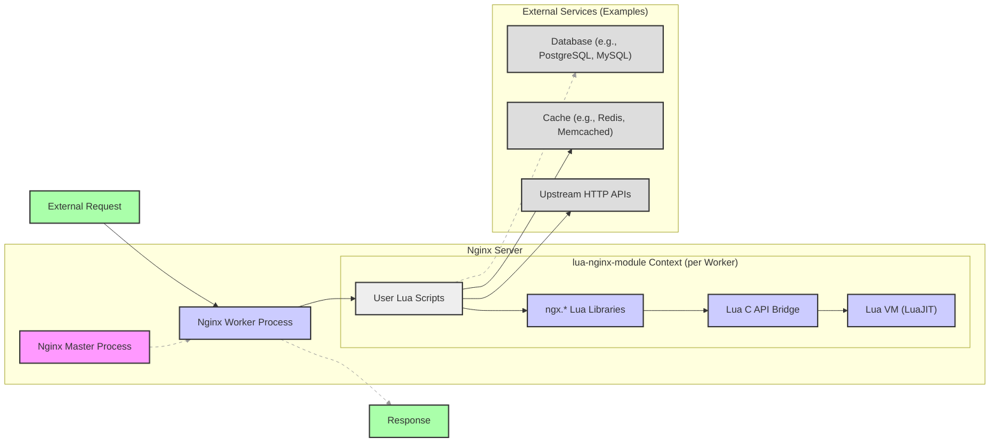

# Project Design Document: lua-nginx-module for Threat Modeling

**Project Name:** lua-nginx-module

**Project Repository:** [https://github.com/openresty/lua-nginx-module](https://github.com/openresty/lua-nginx-module)

**Version:** (Design Document based on current state of the repository as of October 26, 2023)

**Document Version:** 1.1

**Date:** October 26, 2023

**Author:** Gemini (AI Expert in Software, Cloud and Cybersecurity Architecture)

**Changes from Version 1.0:**

*   Expanded component descriptions, especially for `ngx.*` libraries and user Lua scripts.
*   Clarified Nginx request processing phases and Lua directive invocation.
*   Enhanced Security Considerations section with clearer threat categorization, specific examples, and mitigation strategies.
*   Improved Threat Modeling Approach section for better practical guidance.
*   Refined Mermaid diagrams for enhanced clarity.
*   Minor formatting and wording improvements throughout the document.

## 1. Introduction

This document provides a detailed design overview of the `lua-nginx-module` project. It is intended to serve as a foundation for threat modeling activities. This document outlines the architecture, components, data flow, and key security considerations of the module. By understanding the design, security professionals can effectively identify potential threats and vulnerabilities within systems utilizing `lua-nginx-module`. This document is intended for security engineers, developers, and operations teams responsible for deploying and securing Nginx instances using `lua-nginx-module`.

## 2. Project Overview

The `lua-nginx-module` is an Nginx module that embeds the LuaJIT just-in-time compiler and Lua programming language into Nginx HTTP servers. This powerful combination allows developers to extend Nginx's core functionalities significantly. By writing Lua scripts, developers can handle requests, generate dynamic responses, interact with various backend services (databases, caches, other APIs), implement complex business logic, and customize request processing within the Nginx request lifecycle.  This module is widely used in high-performance web applications, API gateways, and content delivery networks.

**Key Features:**

*   **LuaJIT Embedding:**  Leverages the LuaJIT VM, known for its exceptional performance and JIT compilation, ensuring efficient execution of Lua scripts within Nginx worker processes.
*   **Comprehensive Nginx API Access (`ngx.*` Lua Libraries):** Provides a rich and extensive set of Lua APIs through the `ngx` module. These APIs grant Lua scripts deep access to Nginx internals, enabling fine-grained control over request/response processing, networking, concurrency, and more.
*   **Flexible Configuration Integration:** Lua code can be seamlessly integrated into Nginx configurations. Scripts can be embedded directly within configuration blocks or loaded from external `.lua` files, offering flexibility in code organization and deployment.
*   **Extensibility and Customization:** Empowers developers to build highly customized Nginx functionalities, ranging from simple request modifications to complex web applications and API gateways, all within the Nginx environment.
*   **High Performance and Efficiency:** Designed for optimal performance due to the speed of LuaJIT and the module's tight integration with Nginx's event-driven architecture. Lua code executes within the non-blocking Nginx worker processes, minimizing overhead.
*   **Wide Adoption and Community Support:**  `lua-nginx-module` is a mature and widely adopted module with a strong community, ensuring readily available resources, documentation, and support.

## 3. System Architecture

The `lua-nginx-module` operates as an integral part of the Nginx architecture.  Each Nginx worker process, responsible for handling client requests, embeds a LuaJIT Virtual Machine instance.  Lua scripts execute within this VM and interact with Nginx through the provided `ngx.*` Lua libraries.

Here's a high-level architectural diagram illustrating the key components and their relationships:

**Component Description:**

*   **"Nginx Master Process"**: The parent process of Nginx. It is responsible for privileged operations like binding to ports, reading the Nginx configuration, and managing worker processes. It does not directly handle requests or execute Lua code.
*   **"Nginx Worker Process"**: Worker processes are the workhorses of Nginx. Each worker process is single-threaded and handles a subset of client connections in a non-blocking, event-driven manner. When `lua-nginx-module` is enabled, each worker process embeds a dedicated instance of the LuaJIT VM. All Lua script execution occurs within these worker processes.
*   **"Lua VM (LuaJIT)"**: The Lua Virtual Machine, specifically LuaJIT, is embedded within each Nginx worker process. LuaJIT is a high-performance JIT compiler for Lua, known for its speed and efficiency. Each worker process has its own isolated Lua VM instance, ensuring that Lua scripts running in different workers do not interfere with each other.
*   **"Lua C API Bridge"**: This is the critical interface that bridges the Lua VM and the Nginx C core. It's a set of C functions that allow Lua code to interact with Nginx's internal data structures and functionalities. This bridge is the foundation for the `ngx.*` Lua libraries.
*   **"ngx.* Lua Libraries"**:  A comprehensive suite of Lua libraries provided by `lua-nginx-module`. These libraries expose Nginx functionalities to Lua scripts in a Lua-friendly way. Key functionalities provided by `ngx.*` libraries include:
    *   **Request and Response Manipulation (`ngx.req`, `ngx.resp`):**  Access and modify request headers, body, URI, arguments, method, and response headers and body.
    *   **Network Operations (`ngx.socket.tcp`, `ngx.socket.udp`, `ngx.http`):** Create TCP/UDP sockets, perform HTTP subrequests to upstream services, and interact with network resources.
    *   **Asynchronous Operations and Timers (`ngx.timer`):** Implement non-blocking operations and schedule timers for delayed execution.
    *   **Shared Memory (`ngx.shared.DICT`):** Access and manipulate Nginx shared memory dictionaries for inter-worker data sharing.
    *   **Configuration and Variables (`ngx.config`, `ngx.var`):** Access Nginx configuration directives and variables within Lua scripts.
    *   **Logging and Output (`ngx.log`, `ngx.print`, `ngx.say`):** Control Nginx logging and generate output from Lua scripts.
    *   **Data Handling and Utilities (`ngx.md5`, `ngx.sha1`, `ngx.base64`, `ngx.re`):** Provide utilities for data manipulation, hashing, encoding, and regular expressions.
    *   **Process Control (`ngx.process`):**  Access process-related information and control worker processes (with caution).
*   **"User Lua Scripts"**: Lua code written by developers to implement custom logic and extend Nginx. These scripts are the core of the customization provided by `lua-nginx-module`. They are invoked at various stages of the Nginx request processing lifecycle, determined by Nginx configuration directives. Common directives for invoking Lua scripts include:
    *   `set_by_lua_block`, `set_by_lua_file`:  Executed during the "set variable" phase, used to set Nginx variables using Lua.
    *   `rewrite_by_lua_block`, `rewrite_by_lua_file`: Executed during the "rewrite" phase, used for request URI rewriting and redirection.
    *   `access_by_lua_block`, `access_by_lua_file`: Executed during the "access control" phase, used for implementing custom authentication and authorization logic.
    *   `content_by_lua_block`, `content_by_lua_file`: Executed during the "content generation" phase, used to generate the entire HTTP response body using Lua.
    *   `header_filter_by_lua_block`, `header_filter_by_lua_file`: Executed during the "header filter" phase, used to modify response headers.
    *   `body_filter_by_lua_block`, `body_filter_by_lua_file`: Executed during the "body filter" phase, used to modify the response body.
    *   `log_by_lua_block`, `log_by_lua_file`: Executed during the "logging" phase, used for custom logging logic.
*   **"External Request"**: An incoming HTTP request from a client to the Nginx server.
*   **"Response"**: The HTTP response generated by Nginx and sent back to the client. This response can be generated entirely by Lua scripts or modified by Lua scripts based on Nginx's default processing.
*   **"External Services (Examples)"**: Lua scripts often interact with external services to fulfill requests. Examples include databases, caching systems, and upstream HTTP APIs. These interactions are typically performed using the `ngx.socket.tcp`, `ngx.http`, and related `ngx.*` APIs.

## 4. Data Flow and Request Processing

The following flowchart illustrates a more detailed data flow for a request processed by `lua-nginx-module`, highlighting the different Nginx request processing phases where Lua scripts can be invoked:

```mermaid
graph LR
    A["External Request Received by Nginx Worker"] --> B{"Nginx Configuration Processing & Phase Determination"};
    B -- "set_by_lua* Directive" --> C["'set_by_lua' Phase: Invoke Lua VM"];
    B -- "rewrite_by_lua* Directive" --> D["'rewrite' Phase: Invoke Lua VM"];
    B -- "access_by_lua* Directive" --> E["'access' Phase: Invoke Lua VM"];
    B -- "content_by_lua* Directive" --> F["'content' Phase: Invoke Lua VM"];
    B -- "header_filter_by_lua* Directive" --> G["'header_filter' Phase: Invoke Lua VM"];
    B -- "body_filter_by_lua* Directive" --> H["'body_filter' Phase: Invoke Lua VM"];
    B -- "log_by_lua* Directive" --> I["'log' Phase: Invoke Lua VM"];
    B -- "No Lua Directives in Phase" --> J["Nginx Standard Phase Processing"];

    C --> K["Execute User Lua Script (set variable)"];
    D --> L["Execute User Lua Script (rewrite URI)"];
    E --> M["Execute User Lua Script (access control)"];
    F --> N["Execute User Lua Script (generate content)"];
    G --> O["Execute User Lua Script (modify headers)"];
    H --> P["Execute User Lua Script (modify body)"];
    I --> Q["Execute User Lua Script (custom logging)"];

    K --> R{"Lua Script Uses ngx.* APIs"};
    L --> R
    M --> R
    N --> R
    O --> R
    P --> R
    Q --> R

    R -- "Yes" --> S["Interact with Nginx Internals via C API Bridge"];
    S --> T["Nginx Processes Phase Actions (based on Lua script)"];

    T --> U{"Phase Complete?"};
    U -- "No (e.g., more Lua code)" --> K
    U -- "Yes" --> V{"Next Phase?"};
    V -- "Yes" --> B
    V -- "No (Content Generated)" --> W["Generate/Modify Response"];
    W --> X["Nginx Sends Response"];
    J --> V
    J --> W

    style A fill:#afa,stroke:#333,stroke-width:2px
    style X fill:#afa,stroke:#333,stroke-width:2px
    style B fill:#eee,stroke:#333,stroke-width:2px
    style C fill:#ccf,stroke:#333,stroke-width:2px
    style D fill:#ccf,stroke:#333,stroke-width:2px
    style E fill:#ccf,stroke:#333,stroke-width:2px
    style F fill:#ccf,stroke:#333,stroke-width:2px
    style G fill:#ccf,stroke:#333,stroke-width:2px
    style H fill:#ccf,stroke:#333,stroke-width:2px
    style I fill:#ccf,stroke:#333,stroke-width:2px
    style J fill:#eee,stroke:#333,stroke-width:2px
    style K fill:#eee,stroke:#333,stroke-width:2px
    style L fill:#eee,stroke:#333,stroke-width:2px
    style M fill:#eee,stroke:#333,stroke-width:2px
    style N fill:#eee,stroke:#333,stroke-width:2px
    style O fill:#eee,stroke:#333,stroke-width:2px
    style P fill:#eee,stroke:#333,stroke-width:2px
    style Q fill:#eee,stroke:#333,stroke-width:2px
    style R fill:#eee,stroke:#333,stroke-width:2px
    style S fill:#ccf,stroke:#333,stroke-width:2px
    style T fill:#ccf,stroke:#333,stroke-width:2px
    style U fill:#eee,stroke:#333,stroke-width:2px
    style V fill:#eee,stroke:#333,stroke-width:2px
    style W fill:#eee,stroke:#333,stroke-width:2px
```

**Detailed Data Flow Steps (Expanded):**

1.  **"External Request Received by Nginx Worker"**: An incoming HTTP request is accepted by an Nginx worker process.
2.  **"Nginx Configuration Processing & Phase Determination"**: Nginx processes its configuration to determine the server block, location block, and directives applicable to the request. It identifies if any `*_by_lua*` directives are configured for the current request processing phase. Nginx request processing is divided into phases (e.g., `set`, `rewrite`, `access`, `content`, `header_filter`, `body_filter`, `log`).
3.  **"*_by_lua* Directive"**: If a Lua directive (e.g., `content_by_lua_block`) is encountered for the current phase, the corresponding Lua VM invocation is triggered.  Each directive corresponds to a specific Nginx request processing phase.
4.  **"'Phase' Phase: Invoke Lua VM"**: Nginx invokes the embedded Lua VM for the specific phase where a Lua directive is configured.
5.  **"Execute User Lua Script (phase-specific action)"**: The user-defined Lua script associated with the directive is executed within the Lua VM. The script's purpose depends on the phase (e.g., setting variables in 'set' phase, access control in 'access' phase, generating content in 'content' phase).
6.  **"Lua Script Uses ngx.* APIs"**: During execution, the Lua script typically uses the `ngx.*` Lua libraries to interact with Nginx functionalities relevant to the current phase or for general request processing.
7.  **"Interact with Nginx Internals via C API Bridge"**: Calls to `ngx.*` functions are translated through the Lua C API Bridge to interact with Nginx's internal C code, allowing Lua to control Nginx behavior.
8.  **"Nginx Processes Phase Actions (based on Lua script)"**: Based on the Lua script's actions (via `ngx.*` APIs), Nginx performs phase-specific operations. For example, in the 'rewrite' phase, Lua might modify the request URI, or in the 'content' phase, Lua might generate the entire response body.
9.  **"Phase Complete?"**: After the Lua script execution and Nginx actions for the current phase, Nginx checks if there's more Lua code to execute within the same phase (less common, but possible in complex configurations).
10. **"Next Phase?"**: Nginx proceeds to the next phase in its request processing lifecycle.
11. **"No Lua Directives in Phase"**: If no Lua directives are configured for a particular phase, Nginx performs its standard, built-in processing for that phase (if any).
12. **"Generate/Modify Response"**: In the 'content' phase (or later phases), Nginx (potentially guided by Lua scripts) generates or finalizes the HTTP response.
13. **"Nginx Sends Response"**: Finally, Nginx sends the generated HTTP response back to the client.

## 5. Security Considerations for Threat Modeling

When threat modeling systems using `lua-nginx-module`, it's crucial to consider the expanded attack surface introduced by embedding a scripting language within Nginx.  The primary security concerns revolve around vulnerabilities in user-written Lua scripts and the potential for misuse of the powerful `ngx.*` APIs.

**Threat Categories and Specific Examples:**

*   **Injection Vulnerabilities**:  Improper handling of user input within Lua scripts can lead to various injection attacks.
    *   **Lua Injection (High Risk):** If user-controlled data is directly passed to functions like `loadstring` or `load`, attackers can inject and execute arbitrary Lua code within the Nginx worker process. **Example:** `loadstring("assert(os.execute('" .. user_input .. "'))")()` where `user_input` is not sanitized.
    *   **SQL Injection (Medium to High Risk):** When Lua scripts interact with databases, unsanitized user input in SQL queries can lead to SQL injection. **Example:** Constructing SQL queries by directly concatenating user input without using parameterized queries or proper escaping.
    *   **Command Injection (Low to Medium Risk - Less Common in Web Contexts):** While less frequent in typical web applications, if Lua scripts execute system commands (e.g., using `os.execute` or libraries that wrap it), unsanitized input can lead to command injection.
    *   **HTTP Header Injection/Response Splitting (Medium Risk):** If Lua scripts dynamically construct HTTP headers based on user input without proper validation, attackers can inject malicious headers or split the HTTP response. **Example:** Setting response headers using `ngx.resp.header` with unsanitized user input, potentially injecting `\r\n` to create new headers or manipulate the response structure.
    *   **Log Injection (Low Risk):**  If user input is directly logged without sanitization, attackers can inject malicious content into logs, potentially causing issues for log analysis or even log poisoning.

*   **Access Control and Authorization Bypasses (High Risk):** Lua scripts are frequently used to implement custom authentication and authorization logic. Flaws in these scripts can lead to serious security breaches.
    *   **Logic Errors in Authorization Code:**  Incorrectly implemented authorization logic in Lua scripts can allow unauthorized users to access protected resources. **Example:**  Flawed conditional statements or incorrect checks in Lua code that are meant to verify user roles or permissions.
    *   **Session Management Vulnerabilities:** If Lua scripts handle session management, vulnerabilities like session fixation, session hijacking, or insecure session storage can arise if not implemented securely.
    *   **Bypass due to Configuration Errors:** Misconfigurations in Nginx or Lua directives can inadvertently bypass intended access controls implemented in Lua scripts.

*   **Resource Exhaustion and Denial of Service (DoS) (Medium to High Risk):**  Poorly written or malicious Lua scripts can consume excessive resources, leading to DoS.
    *   **CPU Exhaustion (Medium Risk):** CPU-intensive Lua code (e.g., complex regular expressions, infinite loops, computationally expensive algorithms) can overload Nginx worker processes, impacting performance and potentially causing DoS.
    *   **Memory Exhaustion (Medium Risk):** Memory leaks in Lua scripts or excessive memory allocation (e.g., creating very large strings or tables) can lead to worker process crashes due to out-of-memory errors.
    *   **Subrequest Flooding (Medium to High Risk):** Lua scripts making excessive or uncontrolled subrequests to backend services or external APIs can overwhelm those services or the Nginx server itself, causing DoS. **Example:** A Lua script that makes a subrequest for every incoming request without proper rate limiting or caching.
    *   **File Descriptor Exhaustion (Low to Medium Risk):**  Lua scripts that open many sockets or files without proper closing can lead to file descriptor exhaustion, impacting Nginx's ability to handle new connections.

*   **Information Disclosure (Medium Risk):** Lua errors, logging, or unintended data leaks in Lua scripts can expose sensitive information.
    *   **Verbose Lua Error Messages:** Detailed Lua error messages, if exposed to users or logged without proper filtering, can reveal internal paths, configurations, or data structures.
    *   **Accidental Data Exposure in Logs:** Logging sensitive data (e.g., user credentials, API keys) in Lua scripts without proper redaction can lead to information disclosure.
    *   **Information Leakage through Response Bodies or Headers:** Lua scripts might unintentionally include sensitive data in HTTP responses or headers if not carefully coded.

*   **Server-Side Request Forgery (SSRF) (Medium to High Risk):** If Lua scripts make external HTTP requests based on user-controlled input (e.g., using `ngx.http.request`), SSRF vulnerabilities can arise if input is not properly validated and sanitized. **Example:**  A Lua script that takes a URL from a request parameter and directly uses it in `ngx.http.request` without validating the URL against a whitelist or sanitizing it.

*   **Security of External Lua Files (Medium Risk):** If Lua scripts are loaded from external files, compromised files can lead to arbitrary code execution within Nginx worker processes. Ensure proper file permissions and access control to prevent unauthorized modification.

*   **Vulnerabilities in `ngx.*` Libraries and LuaJIT (Low Risk):** While less likely, vulnerabilities in the `ngx.*` libraries or LuaJIT itself could be exploited. Regularly update `lua-nginx-module` and LuaJIT to the latest versions to patch known vulnerabilities.

**Mitigation Strategies (Examples):**

*   **Input Validation and Sanitization:** Implement robust input validation and sanitization in Lua scripts for all user-controlled data. Use whitelisting, input encoding, and context-aware escaping to prevent injection attacks.
*   **Secure Coding Practices in Lua:** Follow secure coding guidelines for Lua. Avoid using `loadstring` or `load` with user input. Use parameterized queries for database interactions. Minimize the use of system commands.
*   **Principle of Least Privilege:** Grant Lua scripts only the necessary permissions and access to Nginx functionalities and external resources. Avoid overly permissive configurations.
*   **Resource Limits and Rate Limiting:** Implement resource limits in Lua scripts (e.g., limiting CPU usage, memory allocation, number of subrequests). Use Nginx's rate limiting features to control request rates and prevent DoS.
*   **Secure Session Management:** If Lua scripts handle sessions, use secure session management practices, including strong session IDs, secure storage, HTTP-only and Secure flags for cookies, and proper session expiration.
*   **Regular Security Audits and Code Reviews:** Conduct regular security audits and code reviews of Lua scripts and Nginx configurations to identify and address potential vulnerabilities.
*   **Update Dependencies:** Keep `lua-nginx-module`, LuaJIT, and any other dependencies up-to-date to benefit from security patches.
*   **Error Handling and Logging:** Implement proper error handling in Lua scripts. Log errors securely and avoid exposing sensitive information in error messages or logs. Sanitize user input before logging.
*   **SSRF Prevention:**  When making external HTTP requests in Lua scripts, validate and sanitize URLs. Use whitelists of allowed domains or URLs. Consider using a proxy for external requests to add an extra layer of security.

## 6. Threat Modeling Approach

To effectively threat model systems using `lua-nginx-module`, a structured approach is recommended.  Here's a step-by-step guide:

1.  **Define Scope and Objectives:** Clearly define the scope of the threat modeling exercise. Identify the specific application or system components that utilize `lua-nginx-module`.  Establish the objectives of the threat modeling (e.g., identify high-risk vulnerabilities, prioritize security controls).

2.  **Decompose the System:**  Use the architecture and data flow diagrams in this document as a starting point. Break down the system into smaller, manageable components. Focus on areas where Lua scripts are involved and where external interactions occur. Identify:
    *   **Entry Points:**  Where external data enters the system (e.g., HTTP requests, configuration files, external Lua files).
    *   **Assets:**  Valuable components or data that need protection (e.g., user data, application logic, backend services, API keys, configuration secrets).
    *   **Trust Boundaries:**  Boundaries between different security zones or levels of trust (e.g., between the internet and the Nginx server, between Nginx and backend services, between Lua scripts and Nginx core).
    *   **Data Flows:**  How data moves through the system, especially data handled by Lua scripts.

3.  **Identify Threats (STRIDE Model Recommended):** Use a threat modeling methodology like STRIDE (Spoofing, Tampering, Repudiation, Information Disclosure, Denial of Service, Elevation of Privilege) to systematically identify threats for each component and data flow.  Consider the security considerations outlined in Section 5 as a threat library.  For each component and interaction, ask:
    *   **Spoofing:** Can an attacker impersonate a legitimate entity? (e.g., spoofing a user, spoofing a backend service)
    *   **Tampering:** Can an attacker modify data or code? (e.g., tampering with Lua scripts, tampering with request parameters, tampering with session data)
    *   **Repudiation:** Can an attacker deny performing an action? (Less relevant in typical web application threat modeling, but consider logging and audit trails)
    *   **Information Disclosure:** Can an attacker gain access to sensitive information? (e.g., leaking user data, exposing API keys, revealing internal configurations)
    *   **Denial of Service:** Can an attacker disrupt the service? (e.g., causing CPU exhaustion, memory exhaustion, subrequest flooding)
    *   **Elevation of Privilege:** Can an attacker gain higher privileges than intended? (e.g., gaining administrative access, bypassing authorization controls)

4.  **Analyze Vulnerabilities:** For each identified threat, analyze potential vulnerabilities that could be exploited. Consider:
    *   **Code Review of Lua Scripts:** Examine Lua scripts for insecure coding practices, input validation flaws, authorization logic errors, resource management issues, and other vulnerabilities.
    *   **Nginx Configuration Review:** Review Nginx configurations for misconfigurations that could weaken security or bypass Lua-based controls.
    *   **Dependency Analysis:** Assess the security of `lua-nginx-module`, LuaJIT, and any other Lua libraries used.

5.  **Risk Assessment and Prioritization:** Evaluate the risk associated with each identified threat and vulnerability. Risk is typically assessed based on:
    *   **Likelihood:** How likely is it that the threat will be exploited?
    *   **Impact:** What would be the business impact if the threat is exploited? (e.g., data breach, service disruption, financial loss, reputational damage).
    *   Prioritize threats based on their risk level (e.g., High, Medium, Low). Focus on mitigating high-risk threats first.

6.  **Develop Mitigation Strategies and Security Controls:** For each prioritized threat, develop and implement appropriate mitigation strategies and security controls. Refer to the mitigation strategies examples in Section 5.  Security controls can be:
    *   **Technical Controls:** Input validation, secure coding practices, access control mechanisms, resource limits, rate limiting, encryption, security patches, web application firewalls (WAFs).
    *   **Administrative Controls:** Security policies, procedures, security awareness training, code review processes, security testing.
    *   **Physical Controls:** (Less relevant for `lua-nginx-module` itself, but consider physical security of servers hosting Nginx).

7.  **Document and Communicate Findings:** Document the threat modeling process, identified threats, vulnerabilities, risk assessments, and mitigation strategies. Communicate findings to relevant stakeholders (developers, security team, operations team, management).

8.  **Iterate and Update:** Threat modeling is an ongoing process. Regularly revisit and update the threat model as the system evolves, new features are added, or new threats emerge.

## 7. Conclusion

This enhanced design document provides a more detailed and actionable foundation for threat modeling systems that utilize `lua-nginx-module`. By understanding the architecture, data flow, security considerations, and following a structured threat modeling approach, organizations can proactively identify, assess, and mitigate security risks associated with using `lua-nginx-module`. This proactive approach is essential for building secure, resilient, and high-performing web applications and services powered by Nginx and Lua. Continuous security assessment and adaptation are crucial to maintain a strong security posture in dynamic environments.