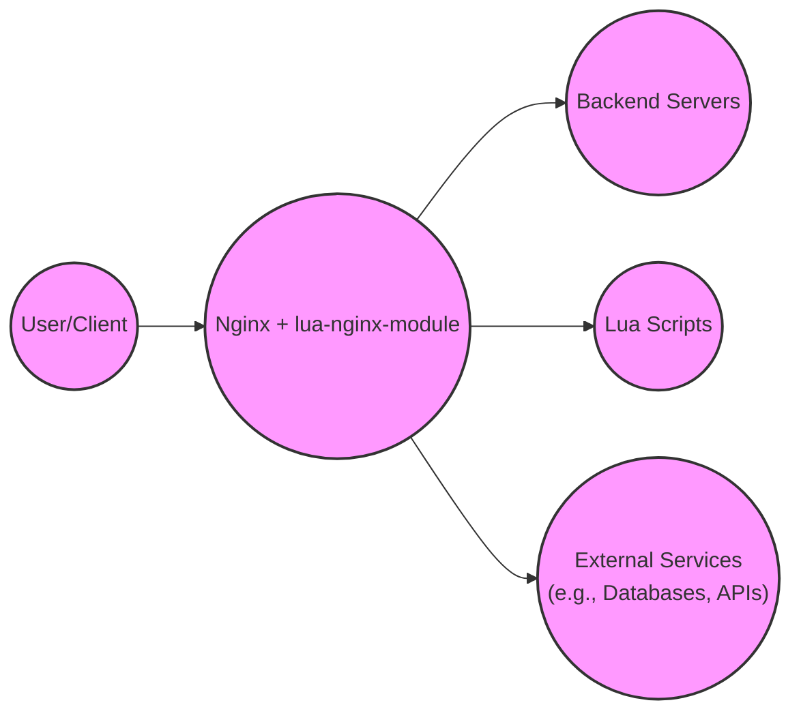
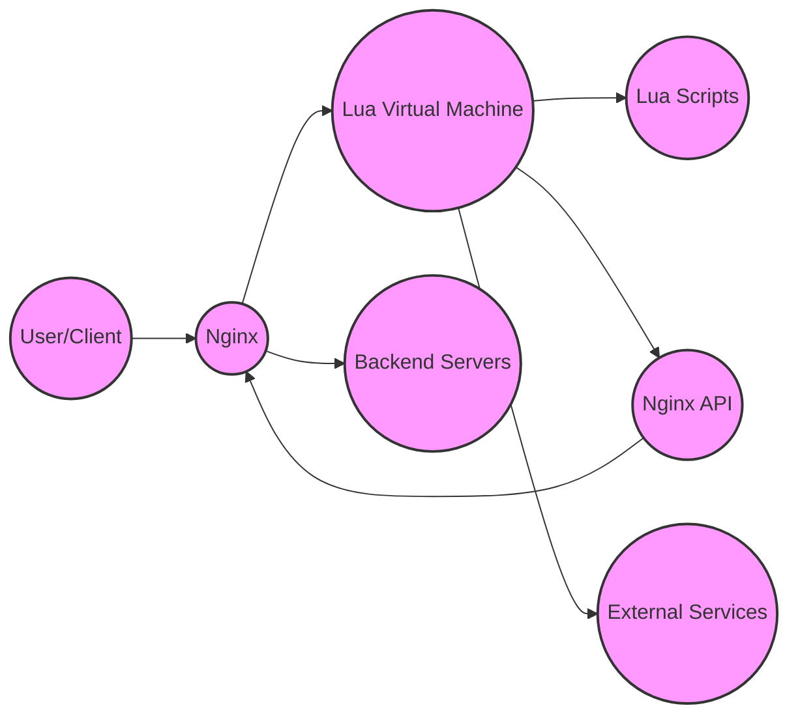
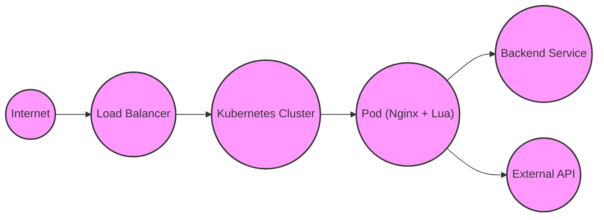
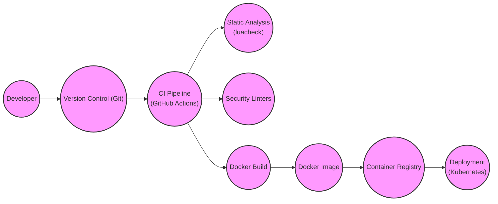

Okay, let's create a design document for the `lua-nginx-module` project, focusing on aspects relevant to threat modeling.

# BUSINESS POSTURE

Business Priorities and Goals:

*   Enable dynamic scripting and customization of Nginx behavior without requiring recompilation of Nginx itself.
*   Provide a high-performance, low-latency scripting environment within Nginx.
*   Extend Nginx's functionality with custom logic written in Lua, covering areas like request processing, response modification, authentication, and more.
*   Offer a more accessible and flexible alternative to native Nginx C modules for extending functionality.
*   Maintain compatibility with existing Nginx configurations and features.

Most Important Business Risks:

*   Security vulnerabilities introduced by custom Lua scripts could compromise the Nginx server and potentially the entire system.
*   Performance degradation due to poorly written or inefficient Lua scripts could impact the overall performance of Nginx.
*   Instability or crashes in the Lua environment could lead to Nginx service disruptions.
*   Incompatibility with future Nginx versions or other modules could break existing deployments.
*   Lack of proper sandboxing or resource limits for Lua scripts could allow malicious scripts to consume excessive resources or interfere with other processes.

# SECURITY POSTURE

Existing Security Controls:

*   security control: Nginx's core security features: The module operates within the context of Nginx, inheriting its core security features like request filtering, rate limiting, and SSL/TLS termination. Described in Nginx documentation.
*   security control: Lua sandbox (limited): Lua provides a degree of sandboxing, restricting access to certain system resources. However, this sandboxing is not absolute and can be bypassed with sufficient effort. Described in Lua documentation.
*   security control: Nginx worker process isolation: Nginx uses separate worker processes, providing some isolation between requests and limiting the impact of crashes. Described in Nginx documentation.

Accepted Risks:

*   accepted risk: Potential for vulnerabilities in custom Lua scripts: The primary risk is that users can write insecure Lua code that introduces vulnerabilities. This is inherent to the nature of the module, which allows arbitrary code execution.
*   accepted risk: Limited sandboxing of the Lua environment: While Lua offers some sandboxing, it's not a complete security boundary.
*   accepted risk: Reliance on Nginx's core security: The module's security heavily relies on the correct configuration and security of the underlying Nginx server.

Recommended Security Controls:

*   security control: Strict input validation and sanitization within Lua scripts: All user-provided input should be rigorously validated and sanitized before being used in any sensitive operations.
*   security control: Resource limits for Lua scripts: Implement mechanisms to limit CPU usage, memory allocation, and execution time for Lua scripts to prevent denial-of-service attacks.
*   security control: Code review and security testing of Lua scripts: Before deploying any custom Lua scripts, they should undergo thorough code review and security testing.
*   security control: Regular security audits of the Nginx configuration and Lua scripts: Conduct periodic audits to identify and address potential vulnerabilities.
*   security control: Use a dedicated, non-privileged user account for running Nginx worker processes.
*   security control: Implement a Web Application Firewall (WAF) in front of Nginx to provide an additional layer of security.
*   security control: Monitor Nginx and Lua logs for suspicious activity.

Security Requirements:

*   Authentication:
    *   If Lua scripts handle authentication, they must use secure methods like checking credentials against a secure store (e.g., a database or LDAP) and using strong password hashing algorithms.
    *   Avoid storing credentials directly in Lua scripts.
    *   Implement proper session management with secure, randomly generated session IDs and appropriate timeouts.
*   Authorization:
    *   If Lua scripts implement authorization logic, they must enforce access controls based on user roles and permissions.
    *   Follow the principle of least privilege, granting only the necessary permissions to each user.
*   Input Validation:
    *   All input from clients, other modules, and external sources must be strictly validated and sanitized.
    *   Use whitelisting (allowing only known-good input) rather than blacklisting (blocking known-bad input) whenever possible.
    *   Validate data types, lengths, formats, and ranges.
*   Cryptography:
    *   If Lua scripts handle sensitive data, they must use strong, industry-standard cryptographic algorithms for encryption, hashing, and digital signatures.
    *   Use secure random number generators for generating keys and nonces.
    *   Store cryptographic keys securely, outside of the Lua scripts themselves.
    *   Use established cryptographic libraries (e.g., LuaCrypto) rather than implementing custom cryptographic routines.

# DESIGN

## C4 CONTEXT

C4 Context Element List:

*   Element:
    *   Name: User/Client
    *   Type: User
    *   Description: Represents any client (browser, mobile app, other service) making requests to the Nginx server.
    *   Responsibilities: Initiates HTTP requests.
    *   Security controls: Implements client-side security measures (e.g., browser security settings, HTTPS).

*   Element:
    *   Name: Nginx + lua-nginx-module
    *   Type: System
    *   Description: The Nginx web server with the embedded lua-nginx-module.
    *   Responsibilities: Handles incoming requests, executes Lua scripts, interacts with backend servers and external services.
    *   Security controls: Nginx core security features, Lua sandbox (limited), worker process isolation.

*   Element:
    *   Name: Backend Servers
    *   Type: System
    *   Description: Application servers or services that Nginx proxies requests to.
    *   Responsibilities: Processes requests and returns responses.
    *   Security controls: Implemented by the backend servers themselves (application-level security).

*   Element:
    *   Name: Lua Scripts
    *   Type: Component
    *   Description: Custom Lua scripts executed by the lua-nginx-module.
    *   Responsibilities: Implements custom logic for request processing, response modification, etc.
    *   Security controls: Input validation, output encoding, secure coding practices within the scripts.

*   Element:
    *   Name: External Services
    *   Type: System
    *   Description: External services that Lua scripts might interact with (e.g., databases, APIs).
    *   Responsibilities: Provides specific services to the Lua scripts.
    *   Security controls: Implemented by the external services themselves (API keys, authentication, etc.).

## C4 CONTAINER

C4 Container Element List:

*   Element:
    *   Name: User/Client
    *   Type: User
    *   Description:  Same as in the Context diagram.
    *   Responsibilities: Same as in the Context diagram.
    *   Security controls: Same as in the Context diagram.

*   Element:
    *   Name: Nginx
    *   Type: Container (Web Server)
    *   Description: The Nginx web server.
    *   Responsibilities: Handles incoming requests, manages worker processes, interacts with the Lua VM.
    *   Security controls: Nginx core security features, worker process isolation.

*   Element:
    *   Name: Lua Virtual Machine
    *   Type: Container (Runtime Environment)
    *   Description: The Lua runtime environment embedded within Nginx.
    *   Responsibilities: Executes Lua scripts, provides access to the Nginx API.
    *   Security controls: Lua sandbox (limited).

*   Element:
    *   Name: Lua Scripts
    *   Type: Component
    *   Description: Custom Lua scripts.
    *   Responsibilities: Implements custom logic.
    *   Security controls: Input validation, output encoding, secure coding practices.

*   Element:
    *   Name: Nginx API
    *   Type: Component
    *   Description: The API provided by the lua-nginx-module for Lua scripts to interact with Nginx.
    *   Responsibilities: Provides functions for request manipulation, response generation, etc.
    *   Security controls: API-level access controls (if any).

*   Element:
    *   Name: External Services
    *   Type: System
    *   Description: Same as in the Context diagram.
    *   Responsibilities: Same as in the Context diagram.
    *   Security controls: Same as in the Context diagram.

*   Element:
    *   Name: Backend Servers
    *   Type: System
    *   Description: Same as in the Context diagram.
    *   Responsibilities: Same as in the Context diagram.
    *   Security controls: Same as in the Context diagram.

## DEPLOYMENT

Possible Deployment Solutions:

1.  Bare-metal servers: Nginx and the module are installed directly on physical servers.
2.  Virtual machines (VMs): Nginx and the module are installed within VMs on a hypervisor.
3.  Containers (e.g., Docker): Nginx and the module are packaged as a container image and deployed using a container orchestration platform (e.g., Kubernetes).
4.  Cloud-based web servers (e.g., AWS EC2, Google Compute Engine, Azure VMs): Nginx and the module are deployed on cloud-based VMs.

Chosen Deployment Solution (Example: Docker Container on Kubernetes):

Deployment Element List:

*   Element:
    *   Name: Internet
    *   Type: External
    *   Description: The public internet.
    *   Responsibilities: Source of incoming requests.
    *   Security controls: N/A

*   Element:
    *   Name: Load Balancer
    *   Type: Infrastructure
    *   Description: Distributes incoming traffic across multiple Kubernetes pods.
    *   Responsibilities: Load balancing, SSL/TLS termination (potentially).
    *   Security controls: DDoS protection, WAF (potentially).

*   Element:
    *   Name: Kubernetes Cluster
    *   Type: Infrastructure
    *   Description: The Kubernetes cluster managing the application.
    *   Responsibilities: Orchestrates containers, manages resources, provides networking.
    *   Security controls: Kubernetes RBAC, network policies, pod security policies.

*   Element:
    *   Name: Pod (Nginx + Lua)
    *   Type: Container
    *   Description: A Kubernetes pod running the Nginx container with the lua-nginx-module.
    *   Responsibilities: Handles incoming requests, executes Lua scripts.
    *   Security controls: Container image security, resource limits, network isolation.

*   Element:
    *   Name: Backend Service
    *   Type: Service
    *   Description: The backend application service.
    *   Responsibilities: Processes requests from Nginx.
    *   Security controls: Application-level security.

*   Element:
    *   Name: External API
    *   Type: Service
    *   Description: An external API accessed by Lua scripts.
    *   Responsibilities: Provides external services.
    *   Security controls: API authentication, authorization, rate limiting.

## BUILD

Build Process:

1.  Developer writes Lua scripts and Nginx configuration.
2.  Code is committed to a version control system (e.g., Git).
3.  A Continuous Integration (CI) pipeline is triggered (e.g., GitHub Actions, Jenkins).
4.  The CI pipeline performs the following steps:
    *   Checks out the code.
    *   Runs static analysis tools (e.g., luacheck) on the Lua scripts to identify potential code quality issues.
    *   Runs security linters (if available) to detect potential security vulnerabilities in the Lua scripts.
    *   Builds a Docker image containing Nginx, the lua-nginx-module, and the custom Lua scripts.  This uses a multi-stage Dockerfile to minimize the final image size and attack surface. The base image should be a minimal, secure base image (e.g., Alpine Linux).
    *   Pushes the Docker image to a container registry (e.g., Docker Hub, Google Container Registry).
    *   Optionally, runs integration tests against the built Docker image.
5.  The Docker image is then deployed to the target environment (e.g., Kubernetes).

Build Security Controls:

*   security control: Version control: All code is stored in a version control system, allowing for tracking changes and reverting to previous versions.
*   security control: CI pipeline: Automates the build process, ensuring consistency and repeatability.
*   security control: Static analysis: Identifies potential code quality issues in Lua scripts.
*   security control: Security linters: Detects potential security vulnerabilities in Lua scripts.
*   security control: Secure Docker base image: Uses a minimal, secure base image for the Docker container.
*   security control: Multi-stage Dockerfile: Minimizes the final image size and attack surface.
*   security control: Container registry: Stores Docker images securely.
*   security control: Integration tests: Verifies the functionality of the built image.
*   security control: Supply chain security: Use signed base images, verify dependencies.

# RISK ASSESSMENT

Critical Business Processes:

*   Serving web content and applications: Nginx with lua-nginx-module is likely used to serve critical web content or applications.
*   Dynamic request handling: Lua scripts may be used for critical dynamic request processing, such as authentication, authorization, or routing.
*   API gateway functionality: Nginx may be acting as an API gateway, with Lua scripts handling API requests.

Data Sensitivity:

*   User data: Lua scripts may handle sensitive user data, such as personally identifiable information (PII), authentication credentials, or financial data.  Sensitivity: High
*   Session data: Nginx and Lua scripts may manage session data. Sensitivity: Medium to High
*   Configuration data: Nginx configuration and Lua scripts themselves may contain sensitive information, such as API keys or database credentials. Sensitivity: High
*   Application data: Data processed by backend applications accessed through Nginx. Sensitivity: Varies depending on the application.

# QUESTIONS & ASSUMPTIONS

Questions:

*   What specific types of user data will be handled by Lua scripts?
*   What external services will Lua scripts interact with, and what data will be exchanged?
*   What are the specific performance requirements for the Nginx server and Lua scripts?
*   What is the existing security infrastructure (e.g., firewalls, WAFs) in place?
*   What is the process for deploying updates to Lua scripts and Nginx configuration?
*   Are there any existing security policies or guidelines that need to be followed?
*   What level of logging and monitoring is required?
*   What are the specific authentication and authorization requirements for Lua scripts?

Assumptions:

*   BUSINESS POSTURE: The organization has a moderate risk appetite, balancing the need for flexibility and customization with the need for security.
*   SECURITY POSTURE: The organization has some basic security controls in place, but there is room for improvement.
*   DESIGN: The deployment environment will be a Kubernetes cluster, and the build process will use a CI pipeline with Docker.  Nginx will be used as a reverse proxy and potentially as an API gateway. Lua scripts will be used for non-trivial request processing and may interact with external services.