# Project Design Document: OpenResty

**Version:** 1.1
**Date:** October 26, 2023
**Author:** AI Architecture Expert

## 1. Introduction

This document provides a detailed design overview of the OpenResty project, specifically tailored for threat modeling purposes. It describes the system's architecture, key components, and data flow, emphasizing aspects relevant to security vulnerabilities and potential attack vectors. This document will serve as the primary input for subsequent threat modeling activities.

## 2. Goals

The primary goals of this document are to:

* Clearly and concisely describe the architecture of OpenResty.
* Identify and detail the key components relevant for security analysis.
* Illustrate the typical data flow within OpenResty, highlighting security-sensitive stages.
* Explicitly outline potential security considerations and vulnerabilities.
* Provide a robust and actionable foundation for threat modeling exercises.

## 3. System Overview

OpenResty is a powerful web platform built by extending the standard Nginx core with LuaJIT, a just-in-time compiler for Lua, and a suite of purpose-built Lua libraries and third-party Nginx modules. This integration enables developers to build high-performance, scalable web applications, APIs, and gateways with dynamic request handling capabilities. Its architecture is inherently designed for high concurrency and low latency.

## 4. Architectural Design

OpenResty's architecture builds upon the event-driven, asynchronous, and non-blocking nature of Nginx. The integration of LuaJIT allows for embedding and executing Lua code within various phases of the Nginx request lifecycle, providing significant flexibility and power.

```mermaid
graph LR
    subgraph "Client Interactions"
        A("Client Request") --> B("Nginx Core");
    end

    subgraph "Nginx Core Processing"
        B --> C("Configuration Parsing");
        C --> D("Connection Handling");
        D --> E("HTTP Request Processing");
        E --> F("Content Generation / Proxying");
        F --> G("Response to Client");
    end

    subgraph "LuaJIT Integration & Execution"
        H("Lua Code (e.g., content_by_lua*)") --> I("LuaJIT Virtual Machine");
        E -- "Lua Context & API Calls" --> H;
        F -- "Lua Context & API Calls" --> H;
        I --> J("OpenResty Lua Libraries");
    end

    subgraph "External Resources"
        K("Upstream Service 1");
        L("Upstream Service 2");
        F -- "Proxy Pass / Upstream Interaction" --> K;
        F -- "Proxy Pass / Upstream Interaction" --> L;
        M("External Database / Cache");
        J -- "Data Access" --> M;
    end

    subgraph "Nginx Modules"
        N("Nginx Modules (e.g., SSL, Cache, WAF)");
        E -- "Module Invocation & Processing" --> N;
    end

    style A fill:#f9f,stroke:#333,stroke-width:2px
    style G fill:#ccf,stroke:#333,stroke-width:2px
```

**Key Architectural Elements:**

* **Nginx Core:** The foundational component responsible for handling network connections, parsing HTTP requests, managing worker processes, and basic web server functionalities.
* **LuaJIT Virtual Machine:**  Executes embedded Lua code, providing a dynamic scripting environment within the Nginx request lifecycle. Its just-in-time compilation enhances performance.
* **Lua Context:**  Specific points within the Nginx request processing where Lua code can be executed (e.g., `content_by_lua`, `access_by_lua`, `rewrite_by_lua`). These contexts provide access to Nginx APIs.
* **OpenResty Lua Libraries:** A collection of Lua libraries that extend Lua's capabilities and provide interfaces for interacting with Nginx internals, databases, and other services.
* **Nginx Modules:**  Both standard and third-party Nginx modules that provide additional functionalities like SSL/TLS termination, caching mechanisms, and potentially Web Application Firewall (WAF) capabilities.
* **Upstream Services:** Backend servers or services that OpenResty can proxy requests to.
* **External Resources:** Databases, caches, or other external systems that OpenResty might interact with through Lua libraries or Nginx modules.

## 5. Component Description

This section details the key components of OpenResty, focusing on their security-relevant aspects.

* **Nginx Core:**
    * Responsible for initial connection handling and request parsing, making it a target for network-level attacks.
    * Configuration vulnerabilities can expose the server or allow unauthorized access.
    * Vulnerabilities in Nginx itself can directly impact OpenResty's security.
* **LuaJIT Virtual Machine:**
    * Executes potentially untrusted Lua code, making it crucial to sanitize inputs and prevent code injection.
    * Performance optimizations might introduce subtle security vulnerabilities.
* **Lua Code Blocks (e.g., `content_by_lua_block`):**
    * The primary area for custom application logic, making it a significant attack surface if not developed securely.
    * Vulnerable to injection attacks (SQL injection, command injection, etc.) if interacting with external systems or processing user input without proper sanitization.
* **OpenResty Lua Libraries (e.g., `ngx.say`, `ngx.req`, `lua-resty-*`):**
    * While generally secure, vulnerabilities in specific libraries could be exploited.
    * Improper use of library functions can lead to security issues.
* **Third-Party Nginx Modules (e.g., `ngx_http_redis`, `ngx_waf`):**
    * Security depends on the quality and maintenance of the third-party module.
    * Potential for vulnerabilities that could be exploited.
    * Configuration of these modules is critical for security.
* **Configuration Files (nginx.conf):**
    * Store critical security settings, including access control, SSL/TLS configuration, and potentially secrets.
    * Misconfigurations can create significant security holes.
    * Access to these files needs to be strictly controlled.
* **Upstream Services:**
    * The security of communication with upstream services is crucial (e.g., using HTTPS, proper authentication).
    * OpenResty acts as a gateway, so vulnerabilities here could expose backend systems.
* **External Resources (e.g., Databases, Caches):**
    * Authentication and authorization mechanisms used to access these resources are critical.
    * Vulnerabilities in Lua libraries used to interact with these resources could be exploited.

## 6. Data Flow

The following describes a typical data flow for an HTTP request processed by OpenResty, highlighting potential security checkpoints.

1. **Client Request:** A client initiates an HTTP request to the OpenResty server (potential for malicious requests).
2. **Nginx Connection Handling:** The Nginx core accepts the connection (potential for connection flooding or other network-level attacks).
3. **Nginx Configuration Parsing:** Nginx loads its configuration (potential for exploiting misconfigurations).
4. **Request Processing:**
    * **Nginx Module Processing:** Nginx modules (e.g., SSL/TLS termination, WAF) process the request (potential for module vulnerabilities or bypasses).
    * **Lua Execution (if configured):** Based on the configuration, Lua code blocks are executed by the LuaJIT VM (major area for security vulnerabilities related to code injection, logic flaws, and insecure API usage).
    * **Lua Logic:** Lua code can access request data, potentially including sensitive information. Improper handling of this data can lead to vulnerabilities. Interactions with external systems through Lua libraries introduce further security considerations.
5. **Content Generation/Proxying:**
    * **Lua-Generated Content:** Lua scripts generate the response content (potential for vulnerabilities if data is not properly escaped or sanitized).
    * **Proxying to Upstream:** Nginx proxies the request to an upstream server (potential for man-in-the-middle attacks if communication is not secured).
6. **Response Processing:**
    * **Lua Response Manipulation:** Lua code can modify the response headers and body (potential for injecting malicious content or leaking information).
    * **Nginx Response Handling:** Nginx sends the response back to the client (potential for response splitting or other HTTP response manipulation attacks).

## 7. Security Considerations

This section outlines key security considerations for OpenResty deployments.

* **Nginx Core Vulnerabilities:** Staying up-to-date with Nginx security patches is crucial.
* **Lua Code Injection:**  A primary concern. Thorough input validation and output encoding in Lua code are essential.
* **Logic Flaws in Lua Code:**  Careful design and testing of Lua scripts are necessary to prevent security vulnerabilities.
* **Third-Party Module Vulnerabilities:** Regularly review and update third-party Nginx modules and Lua libraries.
* **Configuration Security:** Implement secure configuration practices, including least privilege and secure storage of secrets. Avoid embedding sensitive information directly in configuration files.
* **Upstream Communication Security:** Always use HTTPS for communication with upstream services and implement proper authentication mechanisms.
* **Denial of Service (DoS) Attacks:** Implement rate limiting, connection limits, and other DoS mitigation strategies.
* **Authentication and Authorization:**  Implement robust authentication and authorization mechanisms, either within Lua or through Nginx modules. Ensure proper session management.
* **Logging and Monitoring:** Implement comprehensive logging to detect and respond to security incidents. Monitor key security metrics.
* **Secrets Management:** Utilize secure secrets management solutions (e.g., HashiCorp Vault) instead of storing secrets in configuration files.
* **Web Application Firewall (WAF):** Consider using a WAF module to protect against common web application attacks.

## 8. Deployment Considerations

Security considerations are influenced by the deployment environment.

* **Bare Metal Servers:** Requires careful OS hardening and security configuration.
* **Virtual Machines (VMs):**  Security depends on the underlying hypervisor and VM configuration.
* **Containers (e.g., Docker, Kubernetes):**  Requires secure container image creation, secure container registry usage, and secure orchestration platform configuration.
* **Cloud Platforms (e.g., AWS, Azure, GCP):** Leverage cloud-native security services and follow platform security best practices.

## 9. Threat Modeling Focus Areas

Based on the design and security considerations, the following areas should be the primary focus during threat modeling exercises:

* **Attack Surface of Lua Code:**  Specifically analyze Lua code blocks for potential injection vulnerabilities (SQL, command, Lua injection), logic flaws, and insecure use of libraries.
* **Authentication and Authorization Boundaries:**  Map out authentication and authorization flows and identify potential bypasses or weaknesses.
* **Data Flow Security:**  Trace the flow of sensitive data and identify points where it could be exposed or compromised.
* **Configuration Vulnerabilities:**  Analyze Nginx configuration for potential misconfigurations that could lead to security issues.
* **Third-Party Component Risks:**  Assess the security posture of third-party Nginx modules and Lua libraries used.
* **Upstream Communication Security:**  Evaluate the security of communication channels with backend services.
* **Secrets Management Implementation:**  Analyze how sensitive credentials are stored, accessed, and managed.
* **Error Handling and Logging Effectiveness:**  Determine if error handling prevents information leakage and if logging provides sufficient security visibility.
* **DoS Attack Resilience:**  Evaluate the system's ability to withstand denial-of-service attacks.

## 10. Conclusion

This detailed design document provides a solid foundation for conducting thorough threat modeling of OpenResty deployments. By understanding the architecture, components, data flow, and inherent security considerations, security professionals can effectively identify potential vulnerabilities and develop appropriate mitigation strategies. This document should be used as a living document, updated as the OpenResty deployment evolves.