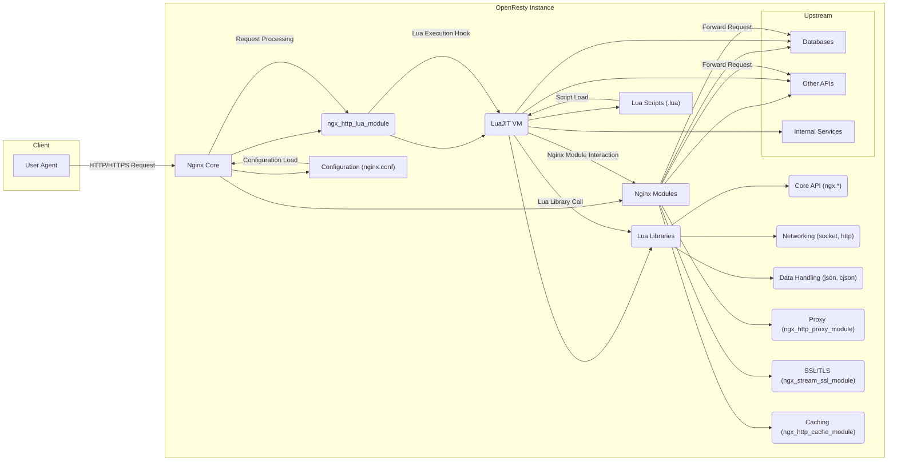

# Project Design Document: OpenResty

**Version:** 1.1
**Date:** October 26, 2023
**Author:** AI Software Architect

## 1. Introduction

This document provides a detailed architectural design of the OpenResty project, focusing on aspects relevant to security analysis and threat modeling. It outlines the system's core components, their interactions, and the overall architecture to facilitate a comprehensive understanding of potential security vulnerabilities.

## 2. Goals and Objectives

*   Provide a clear and concise architectural overview of OpenResty for security analysis.
*   Identify key components and their security-relevant functionalities.
*   Describe the data flow with an emphasis on potential attack vectors.
*   Highlight critical security considerations from an architectural standpoint.
*   Serve as the foundation for detailed threat modeling activities.

## 3. System Overview

OpenResty is a web platform built upon the Nginx core, enhanced with the LuaJIT runtime environment and a rich set of Lua libraries. This integration allows for dynamic request handling and custom logic implementation directly within the Nginx server. OpenResty is commonly used for building high-performance web applications, APIs, and edge services. Its architecture enables developers to intercept and modify the standard Nginx request processing lifecycle using Lua code.

## 4. Architectural Diagram

## 5. Key Components and Security Relevance

*   **Nginx Core:** The underlying web server responsible for handling network connections and basic HTTP processing. Security relevance includes:
    *   Vulnerabilities in the Nginx core itself.
    *   Configuration weaknesses leading to information disclosure or bypasses.
*   **ngx_http_lua_module:** The bridge between Nginx and the LuaJIT VM, enabling Lua code execution within request handling. Security relevance includes:
    *   Potential for Lua code injection if input is not sanitized.
    *   Exposure of Nginx internals to Lua code, requiring careful API usage.
*   **LuaJIT VM:** The high-performance Lua runtime environment. Security relevance includes:
    *   Vulnerabilities within the LuaJIT VM itself.
    *   Potential for resource exhaustion if Lua code is inefficient or malicious.
*   **Lua Libraries:** Pre-built Lua modules extending OpenResty's capabilities. Security relevance includes:
    *   Vulnerabilities within the libraries themselves.
    *   Insecure usage of library functions leading to vulnerabilities (e.g., insecure HTTP requests).
    *   **Core API (ngx.*):** Provides access to Nginx functionalities. Insecure usage can lead to bypasses or unexpected behavior.
    *   **Networking (socket, http):** Used for making outbound connections. Can be exploited for SSRF if not carefully controlled.
    *   **Data Handling (json, cjson):** Parsing untrusted data can lead to vulnerabilities if parsers have flaws.
*   **Nginx Modules:**  Extend Nginx functionality. Security relevance includes:
    *   Vulnerabilities within third-party modules.
    *   Configuration issues within modules leading to security weaknesses.
    *   **Proxy (ngx_http_proxy_module):** Can be exploited for SSRF if upstream is attacker-controlled.
    *   **SSL/TLS (ngx_stream_ssl_module):** Misconfiguration can lead to weak encryption or exposure of sensitive data.
    *   **Caching (ngx_http_cache_module):** Improper cache control can lead to information leakage.
*   **Configuration (nginx.conf):** Defines the behavior of the Nginx server. Security relevance includes:
    *   Misconfigurations leading to open redirects, access control bypasses, or information disclosure.
    *   Inclusion of insecure or outdated configurations.
*   **Lua Scripts (.lua):** Contain the custom application logic. Security relevance includes:
    *   Vulnerabilities in the Lua code itself (e.g., injection flaws, logic errors).
    *   Exposure of sensitive information within the scripts.
*   **Upstream Services:** Backend systems that OpenResty interacts with. Security relevance includes:
    *   Vulnerabilities in the upstream services themselves.
    *   Insecure communication between OpenResty and upstream services.
    *   **Databases:** Potential for SQL injection if Lua code constructs queries from untrusted input.
    *   **Other APIs:** Risk of API key leakage or abuse if not handled securely.
    *   **Internal Services:**  Unauthorized access or manipulation if not properly secured.

## 6. Data Flow and Potential Threats

The data flow through OpenResty presents several points where security vulnerabilities can be introduced:

1. **Client Request:** A malicious client can send crafted requests to exploit vulnerabilities in Nginx or the application logic.
    *   **Threats:** Malformed requests, injection attacks in headers or body.
2. **Nginx Core Processing:**  Vulnerabilities in the Nginx core could be triggered during request parsing or handling.
    *   **Threats:** Buffer overflows, denial of service.
3. **Lua Execution Hook:** When `ngx_http_lua_module` invokes Lua code, unsanitized input can lead to code injection.
    *   **Threats:** Lua code injection, execution of arbitrary commands.
4. **Lua Library Call:**  Using vulnerable Lua libraries or calling library functions insecurely can introduce weaknesses.
    *   **Threats:** SSRF, insecure data handling, cryptographic vulnerabilities.
5. **Nginx Module Interaction:**  Interacting with vulnerable Nginx modules can expose the system to their flaws.
    *   **Threats:** Exploitation of module-specific vulnerabilities.
6. **Upstream Communication:**  Communication with upstream services can be compromised if not secured.
    *   **Threats:** Man-in-the-middle attacks, data breaches, SSRF.
7. **Configuration Load:**  A compromised configuration file can fundamentally undermine the security of the entire system.
    *   **Threats:** Backdoors, unauthorized access, redirection of traffic.
8. **Script Load:**  Malicious Lua scripts can be injected or modified to compromise the application logic.
    *   **Threats:** Data manipulation, unauthorized actions, information disclosure.

## 7. Security Considerations (Architectural Level)

*   **Input Sanitization:**  Crucially important in Lua code to prevent injection attacks. All user-provided data should be validated and sanitized before being used in logic or when interacting with external systems.
*   **Secure Coding Practices in Lua:**  Adhering to secure coding principles is essential to avoid common vulnerabilities. This includes careful memory management (though less of a concern in Lua), avoiding insecure functions, and handling errors gracefully.
*   **Principle of Least Privilege:**  Granting only necessary permissions to the OpenResty process and the Lua code it executes minimizes the impact of potential compromises.
*   **Dependency Management:**  Regularly updating Lua libraries and Nginx modules is vital to patch known vulnerabilities. Using dependency management tools can help track and manage dependencies.
*   **Configuration Security:**  `nginx.conf` should be carefully reviewed and secured. Avoid exposing sensitive information in the configuration and restrict access to the configuration files.
*   **Secrets Management:**  Sensitive information like API keys and database credentials should be stored securely, preferably using dedicated secrets management solutions, and never hardcoded in configuration or code.
*   **Logging and Monitoring:**  Comprehensive logging of requests, errors, and security events is crucial for detecting and responding to attacks. Logs should be securely stored and regularly analyzed.
*   **Rate Limiting and DoS Protection:**  Implementing rate limiting and other mechanisms to protect against denial-of-service attacks is essential for maintaining availability.
*   **SSL/TLS Configuration:**  Using strong TLS configurations, including up-to-date protocols and ciphers, is critical for securing communication. Proper certificate management is also necessary.
*   **Regular Security Audits:**  Periodic security audits and penetration testing can help identify vulnerabilities that may have been missed.

## 8. Deployment Considerations and Security Implications

*   **Bare Metal/Virtual Machines:** Requires careful OS hardening, network segmentation, and firewall configuration to protect the underlying infrastructure.
*   **Containers (e.g., Docker):**  Emphasizes the need for secure container images, vulnerability scanning of images, and proper container orchestration security configurations.
*   **Cloud Environments:**  Leveraging cloud-native security services like security groups, network ACLs, and managed identity can enhance security. Proper IAM configuration is crucial.

## 9. Future Considerations and Emerging Threats

*   **WebAssembly (Wasm) Integration:** If OpenResty integrates with Wasm, new security considerations related to Wasm module sandboxing and security policies will arise.
*   **Service Mesh Integration:**  When deployed within a service mesh, understanding the security implications of the mesh's control plane and data plane interactions with OpenResty is important. Mutual TLS (mTLS) can enhance security in this context.
*   **Emerging Attack Vectors:**  Staying informed about new attack techniques targeting web applications and adapting security measures accordingly is crucial. This includes being aware of new vulnerabilities in Nginx, LuaJIT, and related libraries.

## 10. Conclusion

This detailed architectural design document provides a solid foundation for threat modeling OpenResty. By understanding the components, data flow, and inherent security considerations, security professionals and developers can effectively identify and mitigate potential vulnerabilities, leading to more secure and resilient applications built on the OpenResty platform. Continuous vigilance and adaptation to the evolving threat landscape are essential for maintaining a strong security posture.