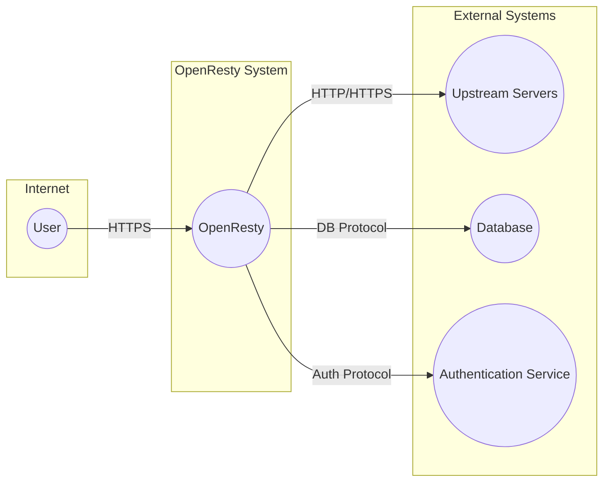
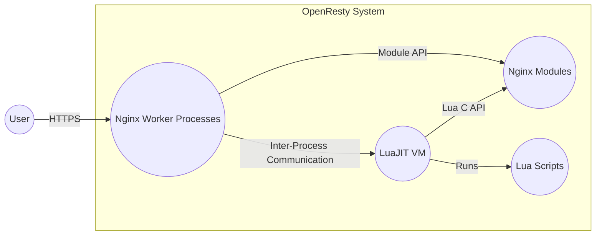
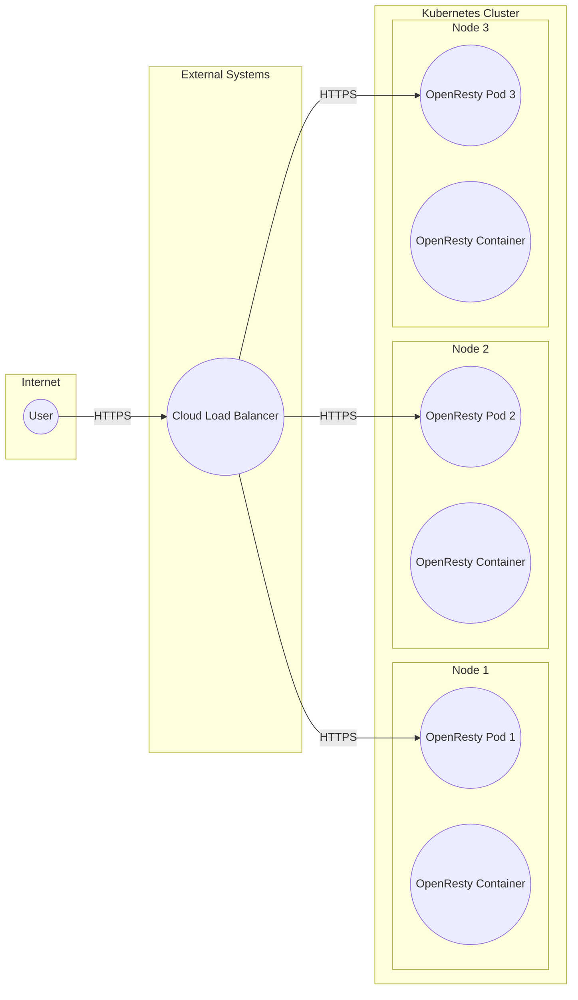
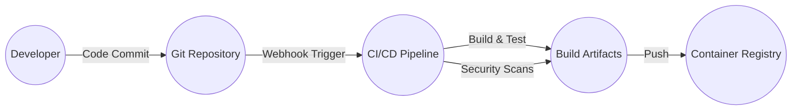

Okay, let's create a design document for OpenResty, keeping in mind its purpose and potential security considerations.

# BUSINESS POSTURE

OpenResty is a web platform that bundles the Nginx core with LuaJIT and various Nginx modules to create a high-performance web server capable of handling a large number of requests. It's often used for building dynamic web applications, APIs, and acting as a reverse proxy or load balancer.

Priorities:

*   Performance and Scalability: Handle high traffic loads with minimal latency.
*   Extensibility: Allow developers to easily extend functionality using Lua scripting.
*   Reliability: Maintain high availability and uptime.
*   Security: Protect against common web vulnerabilities and attacks.

Goals:

*   Provide a fast and efficient platform for web applications and APIs.
*   Enable developers to customize and extend web server behavior.
*   Serve as a robust and secure gateway for web traffic.

Business Risks:

*   Downtime or performance degradation impacting user experience and business operations.
*   Security breaches leading to data theft, service disruption, or reputational damage.
*   Misconfiguration or improper use of Lua scripting leading to vulnerabilities.
*   Inability to scale to meet growing traffic demands.
*   Vulnerabilities in third-party modules or dependencies.

# SECURITY POSTURE

Existing Security Controls:

*   security control: Nginx Core Security Features: OpenResty inherits the security features of Nginx, including protection against common web attacks like DDoS, cross-site scripting (XSS), and SQL injection (when properly configured). (Described in Nginx documentation and best practices guides).
*   security control: Lua Sandbox: LuaJIT provides a sandboxed environment for Lua scripts, limiting their access to system resources and preventing malicious code from causing widespread damage. (Described in LuaJIT documentation).
*   security control: Module Ecosystem: OpenResty's module ecosystem allows for the integration of security-focused modules, such as those for authentication, authorization, and input validation. (Described in individual module documentation).
*   security control: Regular Updates: OpenResty and its components (Nginx, LuaJIT, modules) receive regular updates to address security vulnerabilities. (Described in release notes and changelogs).

Accepted Risks:

*   accepted risk: Misconfiguration: Like any complex software, OpenResty can be misconfigured, leading to security vulnerabilities. This risk is mitigated through proper training, documentation, and configuration management.
*   accepted risk: Third-Party Module Risks: While the OpenResty core is generally secure, third-party modules may introduce vulnerabilities. This risk is mitigated by carefully selecting and vetting modules, and keeping them updated.
*   accepted risk: Lua Scripting Errors: Poorly written Lua scripts can introduce vulnerabilities or performance issues. This risk is mitigated through code reviews, testing, and following secure coding practices.

Recommended Security Controls:

*   security control: Web Application Firewall (WAF): Integrate a WAF (e.g., ModSecurity, NAXSI) to provide an additional layer of protection against web attacks.
*   security control: Input Validation and Sanitization: Implement rigorous input validation and sanitization in Lua scripts to prevent injection attacks.
*   security control: Rate Limiting: Configure rate limiting to mitigate DDoS attacks and prevent abuse.
*   security control: Security Headers: Implement security headers (e.g., HSTS, Content Security Policy) to enhance browser security.
*   security control: Regular Security Audits: Conduct regular security audits and penetration testing to identify and address vulnerabilities.

Security Requirements:

*   Authentication:
    *   Implement secure authentication mechanisms for accessing protected resources.
    *   Support various authentication methods (e.g., API keys, OAuth 2.0, JWT).
    *   Protect against brute-force attacks.
*   Authorization:
    *   Implement role-based access control (RBAC) or attribute-based access control (ABAC).
    *   Enforce the principle of least privilege.
    *   Ensure proper authorization checks before granting access to resources.
*   Input Validation:
    *   Validate all user inputs on the server-side.
    *   Use whitelisting instead of blacklisting whenever possible.
    *   Sanitize inputs to prevent injection attacks.
*   Cryptography:
    *   Use strong encryption algorithms and protocols (e.g., TLS 1.3).
    *   Securely store and manage cryptographic keys.
    *   Protect sensitive data in transit and at rest.

# DESIGN

## C4 CONTEXT

Element Descriptions:

*   Element:
    *   Name: User
    *   Type: Person
    *   Description: Represents a user interacting with the OpenResty system via a web browser or API client.
    *   Responsibilities: Initiates requests to the OpenResty system.
    *   Security controls: Browser security features, TLS encryption.

*   Element:
    *   Name: OpenResty
    *   Type: Software System
    *   Description: The OpenResty web platform, acting as a reverse proxy, load balancer, and web application server.
    *   Responsibilities: Handles incoming requests, executes Lua scripts, interacts with upstream servers and databases, enforces security policies.
    *   Security controls: Nginx core security features, Lua sandbox, WAF, rate limiting, security headers, input validation, authentication, authorization.

*   Element:
    *   Name: Upstream Servers
    *   Type: Software System
    *   Description: Backend servers that handle the actual application logic and data processing.
    *   Responsibilities: Process requests forwarded by OpenResty, return responses.
    *   Security controls: Application-specific security controls, input validation, authentication, authorization.

*   Element:
    *   Name: Database
    *   Type: Software System
    *   Description: A database system used to store and retrieve data.
    *   Responsibilities: Store and manage data, handle database queries.
    *   Security controls: Database security features, access control, encryption, auditing.

*   Element:
    *   Name: Authentication Service
    *   Type: Software System
    *   Description: An external service responsible for authenticating users.
    *   Responsibilities: Verify user credentials, issue tokens or cookies.
    *   Security controls: Secure authentication protocols, strong password policies, multi-factor authentication.

## C4 CONTAINER

Element Descriptions:

*   Element:
    *   Name: Nginx Worker Processes
    *   Type: Container
    *   Description: Multiple worker processes that handle incoming requests concurrently.
    *   Responsibilities: Handle requests, manage connections, interact with LuaJIT and modules.
    *   Security controls: Nginx core security features, process isolation.

*   Element:
    *   Name: LuaJIT VM
    *   Type: Container
    *   Description: The LuaJIT virtual machine that executes Lua scripts.
    *   Responsibilities: Execute Lua code, interact with Nginx and modules via APIs.
    *   Security controls: Lua sandbox, memory management.

*   Element:
    *   Name: Nginx Modules
    *   Type: Container
    *   Description: Various Nginx modules that extend the functionality of OpenResty.
    *   Responsibilities: Provide specific features like HTTP filtering, request transformation, authentication, etc.
    *   Security controls: Module-specific security controls, input validation.

*   Element:
    *   Name: Lua Scripts
    *   Type: Container
    *   Description: Custom Lua scripts written by developers to implement application logic.
    *   Responsibilities: Handle requests, interact with databases and upstream servers, implement business logic.
    *   Security controls: Input validation, output encoding, secure coding practices.

## DEPLOYMENT

Possible Deployment Solutions:

1.  Bare Metal Servers: Deploy OpenResty directly on physical servers.
2.  Virtual Machines (VMs): Deploy OpenResty on VMs within a cloud environment (e.g., AWS EC2, Google Compute Engine, Azure VMs).
3.  Containers (Docker): Package OpenResty and its dependencies into Docker containers and deploy them using a container orchestration platform (e.g., Kubernetes, Docker Swarm).
4.  Platform as a Service (PaaS): Deploy OpenResty on a PaaS provider that supports custom builds or Docker containers (e.g., Heroku, AWS Elastic Beanstalk).

Chosen Solution (Containers with Kubernetes):

Element Descriptions:

*   Element:
    *   Name: User
    *   Type: Person
    *   Description: Represents a user interacting with the OpenResty system.
    *   Responsibilities: Initiates requests to the OpenResty system.
    *   Security controls: Browser security features, TLS encryption.

*   Element:
    *   Name: Cloud Load Balancer
    *   Type: Infrastructure Node
    *   Description: A load balancer provided by the cloud provider (e.g., AWS ELB, Google Cloud Load Balancer).
    *   Responsibilities: Distributes incoming traffic across multiple OpenResty pods.
    *   Security controls: DDoS protection, SSL termination.

*   Element:
    *   Name: Kubernetes Cluster
    *   Type: Infrastructure Node
    *   Description: A cluster of nodes managed by Kubernetes.
    *   Responsibilities: Orchestrates the deployment and management of OpenResty pods.
    *   Security controls: Kubernetes security features, network policies, RBAC.

*   Element:
    *   Name: Node (1, 2, 3)
    *   Type: Infrastructure Node
    *   Description: A worker node within the Kubernetes cluster.
    *   Responsibilities: Runs OpenResty pods.
    *   Security controls: Node-level security configurations, OS hardening.

*   Element:
    *   Name: OpenResty Pod (1, 2, 3)
    *   Type: Container
    *   Description: A Kubernetes pod running one or more OpenResty containers.
    *   Responsibilities: Handles incoming requests, executes Lua scripts.
    *   Security controls: Container security features, resource limits.

*   Element:
    *   Name: OpenResty Container
    *   Type: Container
    *   Description: A Docker container containing the OpenResty web server and its dependencies.
    *   Responsibilities: Runs the OpenResty process.
    *   Security controls: Container image security, minimal base image, vulnerability scanning.

## BUILD

Build Process Description:

1.  Developer commits code changes to the Git repository.
2.  A webhook triggers the CI/CD pipeline (e.g., GitHub Actions, Jenkins, GitLab CI).
3.  The CI/CD pipeline checks out the code, builds the OpenResty application (compiling Lua scripts if necessary), and runs unit and integration tests.
4.  Security scans are performed:
    *   Static Application Security Testing (SAST): Analyzes the source code for vulnerabilities.
    *   Software Composition Analysis (SCA): Identifies and analyzes third-party dependencies for known vulnerabilities.
    *   Container Image Scanning: Scans the Docker image for vulnerabilities in the base image and installed packages.
5.  If all tests and scans pass, the build artifacts (including the Docker image) are created.
6.  The Docker image is pushed to a container registry (e.g., Docker Hub, Amazon ECR, Google Container Registry).

Security Controls:

*   security control: Code Reviews: All code changes are reviewed by another developer before being merged.
*   security control: SAST: Static analysis tools are used to identify potential vulnerabilities in the code.
*   security control: SCA: Dependency management tools are used to track and update third-party libraries, and to identify known vulnerabilities.
*   security control: Container Image Scanning: The Docker image is scanned for vulnerabilities before being deployed.
*   security control: Least Privilege: Build processes run with minimal privileges.
*   security control: Build Automation: The entire build process is automated to ensure consistency and repeatability.
*   security control: Immutable Infrastructure: Build artifacts (Docker images) are immutable, ensuring that the same code is deployed across all environments.

# RISK ASSESSMENT

Critical Business Processes:

*   Serving web content and API requests.
*   Handling user authentication and authorization.
*   Processing data and interacting with backend systems.
*   Maintaining high availability and performance.

Data Sensitivity:

*   User data (e.g., usernames, passwords, personal information): Highly sensitive.
*   Session data: Sensitive, depending on the application.
*   API keys and tokens: Highly sensitive.
*   Application data: Sensitivity varies depending on the application.
*   Configuration data: Sensitive, as it may contain credentials or other secrets.

# QUESTIONS & ASSUMPTIONS

Questions:

*   What specific third-party Nginx modules are being used or considered?
*   What are the specific authentication and authorization requirements?
*   What types of data will be stored and processed by OpenResty?
*   What are the expected traffic patterns and scalability requirements?
*   What is the existing infrastructure and deployment environment?
*   Are there any specific compliance requirements (e.g., PCI DSS, GDPR)?
*   What level of logging and monitoring is required?

Assumptions:

*   BUSINESS POSTURE: The primary goal is to build a high-performance, scalable, and secure web platform.
*   SECURITY POSTURE: Security is a high priority, and appropriate resources will be allocated to implement security controls.
*   DESIGN: A containerized deployment using Kubernetes is the preferred approach. The build process will be automated and include security scans.