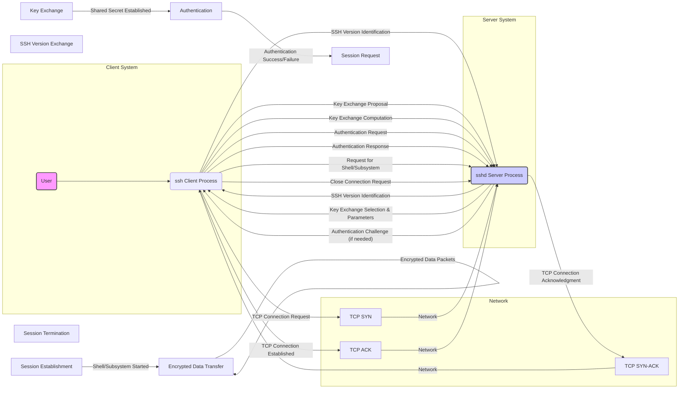
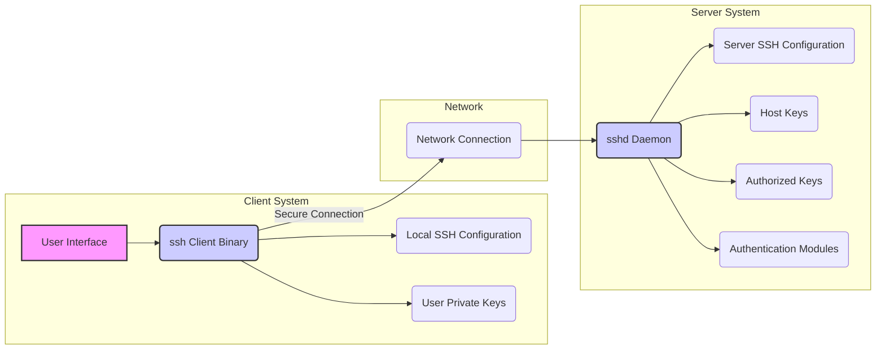
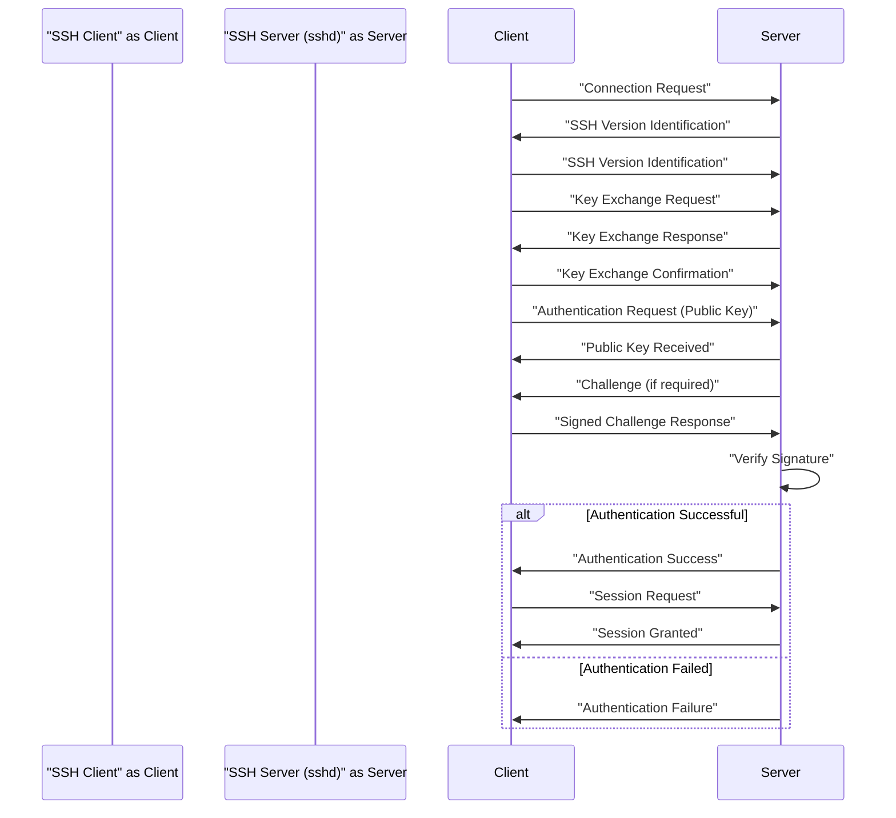

## Project Design Document: OpenSSH Portable (Improved)

**1. Introduction**

This document provides an enhanced architectural overview of the OpenSSH Portable project, specifically tailored for threat modeling activities. It details the key components, their interactions, data flow, and security features with greater clarity and depth. This document serves as a robust foundation for identifying potential vulnerabilities and attack vectors within the OpenSSH ecosystem.

**2. Project Overview**

*   **Project Name:** OpenSSH Portable
*   **Project Repository:** [https://github.com/openssh/openssh-portable](https://github.com/openssh/openssh-portable)
*   **Project Description:** OpenSSH is a suite of interconnected, secure networking utilities based on the Secure Shell (SSH) protocol. It provides strong encryption and authentication for secure communication over insecure networks. The "Portable" version emphasizes cross-platform compatibility, making it widely deployable.
*   **Primary Goal:** To enable secure remote access to computer systems and secure data transfer between them.
*   **Key Functionalities:**
    *   Secure interactive terminal sessions (`ssh`)
    *   Secure file transfer (`scp`, `sftp`)
    *   Secure port forwarding (tunneling) for arbitrary TCP/IP ports
    *   Robust key management for user and host authentication
    *   Secure forwarding of X11 applications
    *   Support for various authentication mechanisms

**3. System Architecture**

The OpenSSH architecture adheres to a client-server model, with distinct components interacting to establish and maintain secure connections.

*   **Logical Components:**
    *   **SSH Client:** The application (`ssh`) initiated by a user to establish a secure connection to a remote SSH server. It handles user input, encryption, and communication with the server.
    *   **SSH Server (sshd):** The daemon process (`sshd`) running on the remote host. It listens for incoming connection requests, manages authentication, establishes secure sessions, and handles requests from the client.
    *   **Authentication Subsystem:** A modular component within `sshd` responsible for verifying the identity of the connecting user. It supports various methods like password, public key, and GSSAPI authentication.
    *   **Connection Multiplexing:** A feature allowing multiple logical SSH sessions to share a single underlying secure transport connection, improving efficiency.
    *   **Forwarding Mechanisms:** Components within both the client and server that facilitate secure port forwarding (local and remote) and X11 forwarding.
    *   **Key Management Subsystem:** Responsible for generating, storing, exchanging, and managing cryptographic keys used for authentication and encryption.

*   **Key Processes:**
    *   **`ssh`:** The command-line client application used to initiate SSH connections. It handles user interaction, protocol negotiation, authentication, and data encryption/decryption.
    *   **`sshd`:** The SSH daemon process that listens on a specified port (default 22) for incoming connection requests. It manages authentication, session creation, and handles client requests.
    *   **`scp`:** Secure copy, a command-line utility for securely copying files between hosts. It leverages the `ssh` protocol for secure data transfer.
    *   **`sftp-server`:** The server-side subsystem invoked by `sshd` to handle Secure File Transfer Protocol (SFTP) requests.
    *   **`ssh-agent`:** An agent program that holds private keys in memory, allowing users to authenticate without repeatedly entering passphrases.
    *   **`ssh-add`:** A utility used to add private keys to the `ssh-agent`.
    *   **`ssh-keygen`:** A utility for generating, managing, and converting authentication keys (public and private).
    *   **`ssh-keyscan`:** A utility for collecting the public host keys of remote hosts.

*   **Configuration Files:**
    *   **Client-side:**
        *   `~/.ssh/config`: User-specific configuration options for the `ssh` client, allowing customization of connection parameters for different hosts.
        *   `/etc/ssh/ssh_config`: System-wide default configuration for the `ssh` client.
        *   `~/.ssh/known_hosts`: Stores the public keys of previously connected-to remote hosts to verify their identity and prevent man-in-the-middle attacks.
        *   `~/.ssh/authorized_keys`: Lists public keys that are authorized to log in to the local user account without a password.
        *   `~/.ssh/id_rsa`, `~/.ssh/id_ecdsa`, `~/.ssh/id_ed25519`, etc.: Default filenames for user's private keys.
    *   **Server-side:**
        *   `/etc/ssh/sshd_config`: The primary configuration file for the `sshd` daemon, controlling authentication methods, port numbers, and other security settings.
        *   `/etc/ssh/ssh_host_rsa_key`, `/etc/ssh/ssh_host_ecdsa_key`, `/etc/ssh/ssh_host_ed25519_key`, etc.: Private keys used to identify the SSH server to clients.
        *   `/etc/ssh/ssh_host_rsa_key.pub`, `/etc/ssh/ssh_host_ecdsa_key.pub`, `/etc/ssh/ssh_host_ed25519_key.pub`, etc.: Public keys corresponding to the host's private keys.
        *   `/etc/hosts.allow`, `/etc/hosts.deny`: Optional TCP wrappers configuration files for controlling access based on IP addresses or hostnames.

*   **Key Files and Directories:**
    *   `~/.ssh/`: The user's directory for SSH-related configuration and keys. Permissions on this directory are critical for security.
    *   `/etc/ssh/`: The system-wide directory for SSH server and client configuration files and host keys.
    *   `/var/log/auth.log` (or system-specific equivalent): System authentication logs, which record SSH connection attempts, authentication successes and failures, and other relevant events.

**4. Data Flow**

The establishment of an SSH connection involves a series of steps, ensuring secure communication between the client and server.

*   **TCP Connection Establishment:** The client initiates a TCP connection to the server on the designated SSH port (default 22). This involves the standard TCP handshake (SYN, SYN-ACK, ACK).
*   **SSH Version Exchange:** Once the TCP connection is established, the client and server exchange SSH protocol version identification strings.
*   **Key Exchange:** The client and server negotiate and perform a key exchange algorithm (e.g., Diffie-Hellman group exchange, ECDH) to establish a shared secret key. This key is used to encrypt subsequent communication.
*   **Authentication:** The client attempts to authenticate to the server. This can involve various methods:
    *   **Password Authentication:** The client sends the user's password, which is encrypted before transmission.
    *   **Public Key Authentication:** The client proves ownership of a private key corresponding to an authorized public key on the server. This involves cryptographic signatures.
    *   **GSSAPI Authentication:** Leveraging Kerberos or other GSSAPI mechanisms for authentication.
*   **Session Request:** Upon successful authentication, the client requests a specific type of session, such as a shell, execution of a command, or a subsystem (e.g., SFTP).
*   **Session Establishment:** The server grants the requested session, and a secure channel is established for communication.
*   **Encrypted Data Transfer:** All subsequent data exchanged between the client and server is encrypted using the negotiated encryption algorithm and integrity-protected using a MAC.
*   **Session Termination:** The session is terminated when the user logs out, the connection is closed, or an error occurs.

**5. Key Security Features**

*   **Strong Cryptography:** OpenSSH utilizes robust encryption algorithms (e.g., AES-CBC, AES-GCM, ChaCha20-Poly1305) to ensure the confidentiality of transmitted data.
*   **Multi-Factor Authentication Support:** While not strictly a core feature, OpenSSH supports pluggable authentication modules (PAM), enabling integration with multi-factor authentication mechanisms.
*   **Host Key Verification:** The SSH client verifies the identity of the server by checking its host key against a local database (`known_hosts`). This prevents man-in-the-middle attacks by ensuring the client connects to the intended server.
*   **Message Authentication Codes (MACs):** MAC algorithms (e.g., HMAC-SHA2-256, HMAC-SHA2-512) are used to ensure the integrity of transmitted data and detect any tampering.
*   **Protection Against Replay Attacks:** The SSH protocol includes mechanisms to prevent replay attacks, where an attacker captures and retransmits valid communication.
*   **Port Forwarding Security:** Securely tunnels arbitrary TCP ports, allowing secure access to services running on private networks or behind firewalls.
*   **X11 Forwarding with Security Extensions:** Securely forwards X11 graphical applications, preventing unauthorized access to the X server.
*   **Privilege Separation:** The `sshd` daemon often employs privilege separation, running parts of the process with reduced privileges to limit the impact of potential vulnerabilities.
*   **Protection Against Password Guessing:** Features like connection limits and lockout mechanisms can be configured to mitigate brute-force password guessing attacks.

**6. Deployment Considerations**

The security posture of an OpenSSH deployment is significantly influenced by its configuration and the environment in which it operates.

*   **Secure Configuration:** Properly configuring `/etc/ssh/sshd_config` is paramount. This includes:
    *   Disabling password authentication in favor of public key authentication.
    *   Disabling root login directly.
    *   Restricting allowed users and groups.
    *   Setting strong ciphers and MAC algorithms.
    *   Configuring appropriate timeouts and connection limits.
*   **Robust Key Management:** Securely generating, storing, and managing SSH keys is crucial. Private keys should be protected with strong passphrases and stored securely.
*   **Regular Security Updates:** Keeping OpenSSH updated with the latest security patches is essential to address known vulnerabilities.
*   **Network Security Measures:** Implementing firewalls and network segmentation to restrict access to the SSH port (default 22) and limit the attack surface.
*   **Monitoring and Logging:** Regularly monitoring SSH logs for suspicious activity, such as failed login attempts or unusual connection patterns.
*   **Use of TCP Wrappers or Firewalld:** Employing TCP wrappers or `firewalld` for an additional layer of access control based on IP addresses or hostnames.
*   **Consideration of Security Audits:** Periodically conducting security audits to identify potential misconfigurations or vulnerabilities.

**7. Threat Modeling Focus Areas**

When performing threat modeling on OpenSSH, consider the following categories and specific areas:

*   **Authentication Vulnerabilities:**
    *   Bypassing authentication mechanisms (e.g., exploiting weaknesses in password or public key authentication).
    *   Brute-force attacks against passwords.
    *   Exploiting vulnerabilities in GSSAPI or other authentication plugins.
    *   Weaknesses in key exchange algorithms leading to session hijacking.
*   **Network-Level Attacks:**
    *   Man-in-the-middle attacks to intercept or modify communication.
    *   Denial-of-service attacks targeting the `sshd` daemon.
    *   Exploiting vulnerabilities in the underlying TCP/IP stack.
*   **Cryptographic Vulnerabilities:**
    *   Exploiting weaknesses in implemented cryptographic algorithms.
    *   Downgrade attacks forcing the use of weaker ciphers.
    *   Side-channel attacks leaking information through timing or power consumption.
*   **Implementation Vulnerabilities:**
    *   Buffer overflows or other memory corruption issues in the `ssh` or `sshd` codebase.
    *   Format string vulnerabilities.
    *   Integer overflows.
    *   Use-after-free vulnerabilities.
*   **Configuration and Deployment Issues:**
    *   Insecure `sshd_config` settings (e.g., allowing password authentication, weak ciphers).
    *   Weak or default passwords.
    *   Insecure storage of private keys.
    *   Misconfigured permissions on SSH configuration files and directories.
*   **Forwarding-Related Attacks:**
    *   Exploiting port forwarding to gain unauthorized access to internal networks or services.
    *   X11 forwarding vulnerabilities allowing access to the client's X server.
*   **Privilege Escalation:**
    *   Vulnerabilities allowing an attacker with limited access to gain root privileges.

**8. Diagrams**

*   **High-Level Component Diagram:**

*   **Simplified Public Key Authentication Flow:**

**9. Conclusion**

This improved design document provides a more detailed and structured overview of the OpenSSH Portable project, specifically for threat modeling purposes. By understanding the intricate components, data flow, and security features, security professionals can conduct more effective threat analysis and implement appropriate mitigations to secure OpenSSH deployments. This document serves as a valuable resource for identifying potential vulnerabilities and strengthening the overall security posture of systems utilizing OpenSSH.