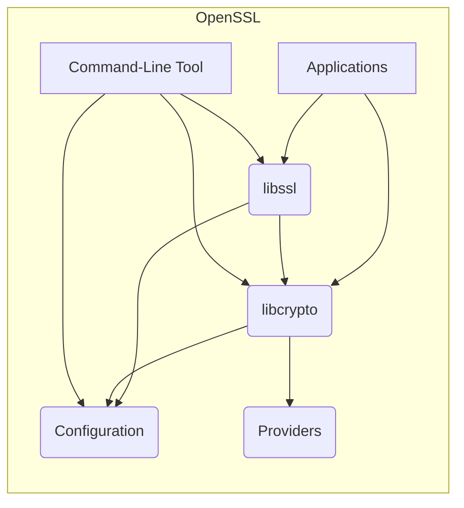
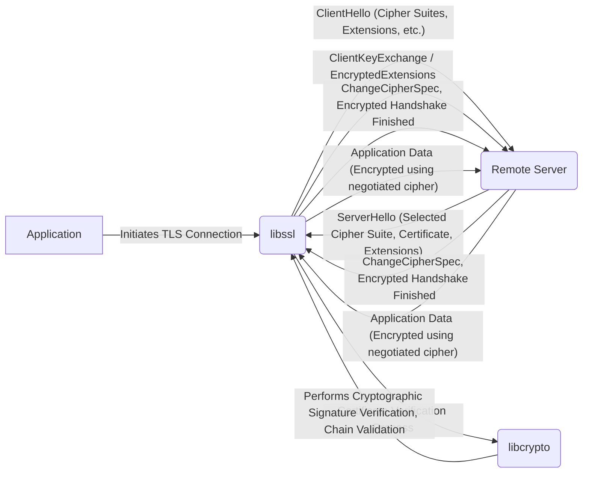

# Project Design Document: OpenSSL

**Version:** 1.1
**Date:** October 26, 2023
**Author:** AI Software Architect

## 1. Introduction

This document provides a refined high-level architectural design of the OpenSSL project. It aims to provide a clear and comprehensive understanding of the system's components, functionalities, and data flow, serving as a robust foundation for subsequent threat modeling activities. This document focuses on the core aspects directly relevant to security considerations.

## 2. Project Overview

OpenSSL is a widely adopted, production-ready, and feature-rich toolkit implementing the Transport Layer Security (TLS) and Secure Sockets Layer (SSL) protocols. It also serves as a general-purpose cryptography library. The project delivers essential cryptographic primitives and secure communication capabilities to a vast ecosystem of applications and services.

## 3. System Architecture

The OpenSSL project is logically structured into the following key components:

* **Core Library (`libcrypto`):** The fundamental component of OpenSSL, offering an extensive collection of cryptographic algorithms and functions.
    * Includes implementations for:
        * Symmetric encryption algorithms (e.g., "AES", "ChaCha20")
        * Asymmetric encryption algorithms (e.g., "RSA", "ECC")
        * Cryptographic hash functions (e.g., "SHA-256", "SHA-3")
        * Message Authentication Codes (MACs) (e.g., "HMAC")
        * Cryptographically secure random number generation (CSPRNG)
        * Key generation and management routines
        * Abstract Syntax Notation One (ASN.1) encoding and decoding
        * X.509 certificate parsing and manipulation
* **SSL/TLS Library (`libssl`):** This library leverages the functionalities of `libcrypto` to implement the SSL and TLS protocols.
    * Handles:
        * The TLS/SSL handshake process
        * Encryption and decryption of application data records
        * Verification of digital certificates
        * Management of TLS/SSL sessions
        * Negotiation of protocol versions and cipher suites
* **Command-Line Tool (`openssl`):** A versatile and powerful command-line utility enabling users to perform a wide array of cryptographic operations.
    * Key functionalities include:
        * Generation of cryptographic keys and X.509 certificates
        * Encryption and decryption of data
        * Computation of cryptographic hashes
        * Establishing connections to SSL/TLS enabled servers
        * Management of Certificate Authorities (CAs) and certificate revocation lists (CRLs)
* **Providers (Modern Cryptographic Implementations):** A modular and extensible framework for loading and utilizing diverse cryptographic algorithms and their implementations. This is the modern replacement for the deprecated "Engines" mechanism.
* **Configuration System:** A mechanism allowing for the customization of OpenSSL's behavior through configuration files, influencing aspects like default settings and enabled algorithms.

## 4. Key Features and Functionalities

* **Comprehensive Cryptographic Primitives:** Implementation of a broad spectrum of encryption, hashing, digital signature, and key derivation algorithms.
* **Robust SSL/TLS Protocol Support:**  Implementation of various versions of the SSL and TLS protocols, including modern standards like TLS 1.3.
* **Extensive X.509 Certificate Handling:**  Provides functionalities for the creation, parsing, verification, and management of X.509 certificates, including support for various extensions and certificate revocation mechanisms.
* **Flexible Key Management:**  Supports the generation, storage, and manipulation of various types of cryptographic keys, including private and public keys.
* **Secure Random Number Generation:**  Offers a cryptographically secure pseudo-random number generator (CSPRNG) essential for key generation and other security-sensitive operations.
* **Versatile Command-Line Interface:**  Provides a powerful and scriptable command-line tool for performing a wide range of cryptographic tasks.
* **Modular Provider Framework:**  Enables the integration of alternative or optimized cryptographic implementations through the provider mechanism.
* **Extensive Configuration Options:**  Allows for fine-grained customization of OpenSSL's behavior through configuration files.

## 5. Data Flow

A common data flow scenario involves an application utilizing OpenSSL's `libssl` to establish a secure communication channel with a remote server using the TLS protocol.

**Detailed Data Flow during a TLS Handshake (Illustrative Example):**

* **Client Initiation:** The application initiates a TLS connection by calling functions within `libssl`.
* **ClientHello:** `libssl` constructs and sends a `ClientHello` message. This message includes details like supported TLS protocol versions, a list of cipher suites the client supports, and various extensions.
* **ServerHello:** The remote server responds with a `ServerHello` message. This message indicates the selected TLS protocol version, the chosen cipher suite, the server's digital certificate, and potentially server-specific extensions.
* **Certificate Verification:** `libssl` utilizes `libcrypto` to perform a comprehensive verification of the server's certificate. This involves:
    * Verifying the digital signature on the certificate using the issuer's public key.
    * Validating the certificate chain by checking the signatures of intermediate CA certificates up to a trusted root CA.
    * Checking the certificate's validity period.
    * Verifying the certificate's revocation status (e.g., via CRLs or OCSP).
* **Key Exchange:** Based on the negotiated cipher suite, a key exchange mechanism is employed. This could involve algorithms like RSA, Diffie-Hellman (various forms), or Elliptic Curve Diffie-Hellman (ECDH). These operations are performed within `libcrypto`.
* **ChangeCipherSpec:** Both the client and the server send a `ChangeCipherSpec` message. This signals that all subsequent communication will be encrypted using the negotiated cipher suite and keys.
* **Finished:** Encrypted `Finished` messages are exchanged. These messages contain a hash of the preceding handshake messages, providing assurance that the handshake was not tampered with.
* **Application Data Transfer:** Once the handshake is successfully completed, application data is encrypted by the sender using the agreed-upon symmetric encryption algorithm (from `libcrypto`) and decrypted by the receiver.

## 6. Security Considerations

Given its critical role in securing communications and data, OpenSSL's security is of paramount importance. Key security considerations include:

* **Cryptographic Algorithm Security:** The robustness and correctness of the implemented cryptographic algorithms within `libcrypto` are fundamental. Vulnerabilities in these algorithms can have widespread and severe consequences.
* **Memory Safety:** As a library primarily written in C, OpenSSL is susceptible to memory safety vulnerabilities such as buffer overflows, use-after-free errors, and format string bugs. Adherence to secure coding practices is essential to mitigate these risks.
* **Random Number Generation Security:** The quality and unpredictability of the random numbers generated by the CSPRNG are crucial for the security of key generation, nonce generation, and other cryptographic operations. Weaknesses in the RNG can lead to predictable keys and compromise security.
* **Certificate Validation Robustness:** The correct and thorough implementation of X.509 certificate validation is vital to prevent man-in-the-middle attacks and ensure that clients are communicating with legitimate servers.
* **Resistance to Side-Channel Attacks:** Implementations need to be designed to resist side-channel attacks that attempt to extract sensitive information by analyzing timing variations, power consumption, electromagnetic emanations, or other observable characteristics of the system.
* **Effective Vulnerability Management:** A well-defined and responsive process for identifying, patching, and distributing security updates is crucial for addressing discovered vulnerabilities promptly.
* **Secure Configuration Practices:** Default or insecure configurations can significantly weaken the security provided by OpenSSL. Secure configuration guidelines and best practices are essential.
* **Supply Chain Security:** Ensuring the integrity and security of third-party dependencies and the build environment is important to prevent the introduction of malicious code or vulnerabilities.

## 7. Deployment Model

OpenSSL is predominantly deployed as a dynamically linked library integrated into various applications and services. Common deployment scenarios include:

* **Web Servers (e.g., Apache HTTP Server, Nginx):** Providing HTTPS functionality for secure web browsing and communication.
* **Email Servers (e.g., Postfix, Exim):** Securing email transmission using protocols like SMTP, POP3, and IMAP with TLS.
* **Virtual Private Networks (VPNs) (e.g., OpenVPN, strongSwan):** Forming the cryptographic foundation for secure VPN connections.
* **Database Servers (e.g., MySQL, PostgreSQL):** Encrypting connections between clients and database servers.
* **Custom Applications:** Developers directly integrate OpenSSL into their applications requiring cryptographic capabilities for various purposes.
* **Operating Systems:** Often included as a core component of many operating systems, providing cryptographic services to system-level utilities and applications.

## 8. Dependencies

OpenSSL has dependencies at both build time and runtime:

* **Build-time Dependencies:** These include compilers (e.g., GCC, Clang), build automation tools (e.g., Make, CMake, Perl), and potentially platform-specific development libraries or headers.
* **Runtime Dependencies:** Primarily relies on the underlying operating system for core functionalities such as memory management and system calls. May have optional runtime dependencies for specific features, such as hardware acceleration libraries.

## 9. Threat Modeling Focus Areas

Based on the architectural design and functionalities outlined above, the following areas should be prioritized during the threat modeling process:

* **`libcrypto` Component:**
    * Potential vulnerabilities in the implementation of cryptographic algorithms (e.g., incorrect implementation, side-channel leaks).
    * Weaknesses or flaws in the cryptographically secure random number generator (CSPRNG).
    * Memory safety vulnerabilities (e.g., buffer overflows, use-after-free) leading to information disclosure or arbitrary code execution.
    * Susceptibility to side-channel attacks (e.g., timing attacks, power analysis).
* **`libssl` Component:**
    * Vulnerabilities in the TLS/SSL handshake implementation that could lead to downgrade attacks, man-in-the-middle attacks, or denial-of-service.
    * Flaws in the certificate validation logic, potentially allowing for the acceptance of invalid or malicious certificates.
    * Weaknesses in session management, potentially leading to session hijacking or replay attacks.
    * Errors in the implementation of various TLS/SSL protocol extensions.
* **Command-Line Tool (`openssl`):**
    * Vulnerabilities arising from insecure parsing of command-line arguments or configuration files.
    * Potential for the exposure of sensitive information (e.g., private keys, passwords) through command history, logging, or temporary files.
    * Risks associated with the misuse of the tool for malicious purposes.
* **Providers Framework:**
    * Security of third-party cryptographic implementations loaded as providers.
    * Potential vulnerabilities in the interface between the core library and external providers.
* **Configuration System:**
    * Risks associated with insecure default configurations.
    * Vulnerabilities related to the parsing and processing of configuration files.
* **Inter-Component Interactions:**
    * Potential vulnerabilities arising from the interaction and data exchange between `libcrypto` and `libssl`.
    * Importance of robust input validation and sanitization at component boundaries.

This refined design document provides a more detailed and comprehensive understanding of the OpenSSL project's architecture and functionalities. This information is essential for conducting a thorough and effective threat model to identify potential security vulnerabilities and design appropriate mitigation strategies.