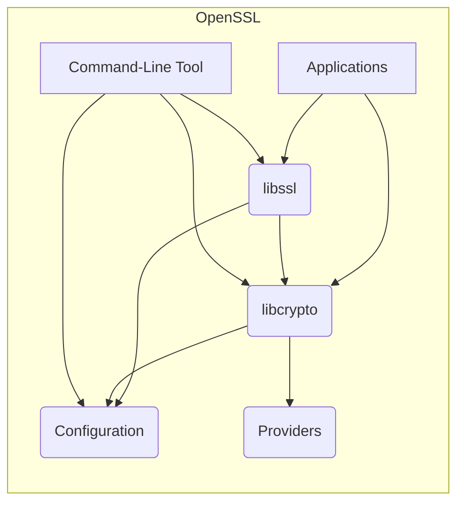
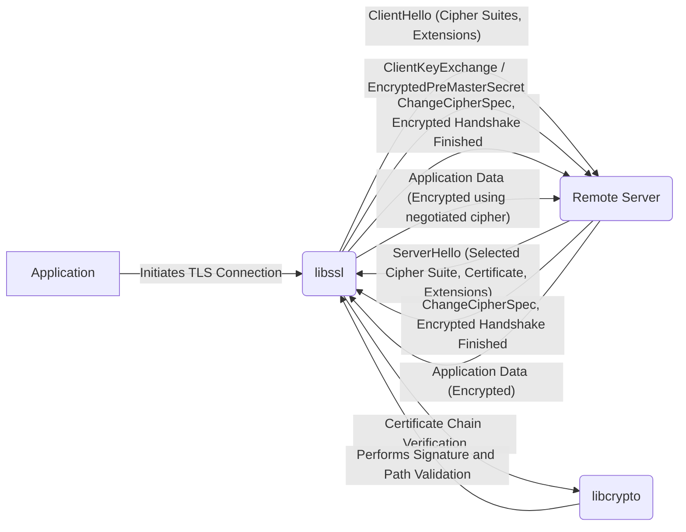

# Project Design Document: OpenSSL

**Version:** 1.1
**Date:** October 26, 2023
**Author:** AI Software Architect

## 1. Introduction

This document provides an enhanced architectural design of the OpenSSL project, building upon the previous version. It aims to offer a more detailed understanding of the system's components, functionalities, and data flow, serving as a robust foundation for subsequent threat modeling activities. The focus remains on aspects directly relevant to security considerations.

## 2. Project Overview

OpenSSL is a comprehensive, production-ready toolkit implementing the Transport Layer Security (TLS) and Secure Sockets Layer (SSL) protocols. It also serves as a general-purpose cryptography library, providing essential cryptographic primitives and secure communication capabilities to a wide array of applications and services.

## 3. System Architecture

The OpenSSL project is structured around several key components, each with distinct responsibilities:

* **Core Library (`libcrypto`):** The foundational element of OpenSSL, providing a rich set of cryptographic algorithms and supporting functions.
    *  Implements fundamental cryptographic operations:
        *  **Symmetric Encryption:** Algorithms like AES (various modes), ChaCha20, and others for encrypting data using a shared secret key.
        *  **Asymmetric Encryption:** Algorithms such as RSA, ECC (various curves), and others for public-key cryptography.
        *  **Hashing Algorithms:** Secure hash functions like SHA-256, SHA-3, and others for generating message digests.
        *  **Message Authentication Codes (MACs):** Algorithms like HMAC to ensure data integrity and authenticity.
        *  **Random Number Generation (RNG):** Provides a cryptographically secure pseudo-random number generator (CSPRNG) for key generation and other security-sensitive operations.
        *  **Key Generation and Management:** Functions for generating, storing, and manipulating cryptographic keys.
        *  **ASN.1 Encoding and Decoding:** Handles the Abstract Syntax Notation One (ASN.1) standard used for data serialization, particularly in certificates.
        *  **X.509 Certificate Handling:**  Provides functionalities for parsing, creating, verifying, and managing X.509 digital certificates.
* **SSL/TLS Library (`libssl`):** This library leverages the cryptographic primitives in `libcrypto` to implement the SSL and TLS protocols, enabling secure communication channels.
    *  Manages the secure communication lifecycle:
        *  **TLS Handshake Procedures:** Implements the complex handshake process for establishing secure connections, including negotiation of cipher suites and key exchange.
        *  **Record Encryption and Decryption:** Handles the encryption and decryption of application data transmitted over the secure connection.
        *  **Certificate Verification:**  Performs validation of digital certificates presented by the peer, ensuring trust and authenticity.
        *  **Session Management:**  Manages TLS/SSL sessions, allowing for session resumption to improve performance.
        *  **Protocol Negotiation:**  Negotiates the specific TLS/SSL protocol version and extensions to be used.
* **Command-Line Tool (`openssl`):** A versatile and powerful command-line utility that allows users and administrators to perform a wide range of cryptographic operations and manage certificates.
    *  Provides direct access to cryptographic functionalities:
        *  Generating private keys and Certificate Signing Requests (CSRs).
        *  Creating self-signed certificates and managing Certificate Authorities (CAs).
        *  Encrypting and decrypting files and data.
        *  Calculating message digests (hashes) of files.
        *  Connecting to SSL/TLS servers for testing and debugging.
        *  Examining and manipulating certificates and keys.
* **Providers (Modern replacement for Engines):** A modular and flexible architecture for loading and utilizing diverse cryptographic algorithm implementations, potentially including hardware-accelerated options.
* **Configuration System:** Allows for customization of OpenSSL's behavior through configuration files, influencing aspects like default cipher suites, certificate locations, and other operational parameters.

## 4. Key Features and Functionalities

* **Comprehensive Cryptographic Primitives:** Offers a wide array of robust and well-vetted implementations of symmetric and asymmetric encryption algorithms, hashing functions, and digital signature schemes.
* **Extensive SSL/TLS Protocol Support:** Implements various versions of the SSL and TLS protocols, including historical versions and modern, secure versions like TLS 1.2 and TLS 1.3, with support for negotiation and extension mechanisms.
* **Robust X.509 Certificate Handling:** Provides a complete set of functionalities for creating, parsing, validating, and managing X.509 digital certificates, which are fundamental for establishing trust in secure communication.
* **Flexible Key Management Capabilities:** Supports the generation, secure storage (through integration with system key stores or custom mechanisms), and manipulation of cryptographic keys, crucial for maintaining the confidentiality and integrity of cryptographic operations.
* **Cryptographically Secure Random Number Generation:** Integrates a well-vetted and cryptographically secure pseudo-random number generator (CSPRNG) essential for generating strong keys, initialization vectors, and other security-sensitive values.
* **Versatile Command-Line Interface:** Offers a powerful and scriptable command-line tool (`openssl`) for performing various cryptographic tasks, aiding in development, testing, and system administration.
* **Modular Provider Framework:** Enables the integration of alternative cryptographic implementations through a provider-based architecture, allowing for flexibility and the potential use of hardware acceleration or specialized cryptographic libraries.
* **Customizable Configuration Options:** Allows for fine-grained control over OpenSSL's behavior through configuration files, enabling administrators to tailor its operation to specific security requirements and environments.

## 5. Data Flow

Here are two illustrative data flow scenarios:

**Scenario 1: Establishing a Secure TLS Connection**

**Detailed Data Flow during a TLS Handshake:**

* **Client Initiation:** The application utilizes `libssl` to initiate a TLS connection to a remote server.
* **ClientHello:** `libssl` constructs and sends a `ClientHello` message, advertising supported cipher suites, TLS protocol versions, and extensions.
* **ServerHello:** The server responds with a `ServerHello`, selecting a mutually supported cipher suite, presenting its X.509 certificate (or certificate chain), and potentially including extensions.
* **Certificate Chain Verification:** `libssl` utilizes `libcrypto` to perform a rigorous verification of the server's certificate chain. This involves:
    *  Verifying the digital signature of each certificate in the chain.
    *  Validating the certificate path back to a trusted Certificate Authority (CA).
    *  Checking certificate validity periods (notBefore and notAfter dates).
    *  Examining certificate revocation status (using CRLs or OCSP).
* **Key Exchange:** Based on the negotiated cipher suite, a key exchange mechanism is employed. This might involve:
    *  RSA key exchange (less common in modern TLS).
    *  Diffie-Hellman (DH) or Elliptic-Curve Diffie-Hellman (ECDH) key exchange, where cryptographic computations are performed within `libcrypto` to establish shared secret keys.
* **ChangeCipherSpec:** Both the client and server send `ChangeCipherSpec` messages, signaling that all subsequent communication will be encrypted using the negotiated cipher suite and established keys.
* **Finished:** Encrypted `Finished` messages are exchanged. These messages contain a hash of the preceding handshake messages, providing assurance that the handshake was not tampered with. `libcrypto` is used for the hashing and encryption/decryption of these messages.
* **Application Data:** Once the secure channel is established, application data is encrypted and decrypted using the agreed-upon symmetric encryption algorithm from `libcrypto`, ensuring confidentiality.

**Scenario 2: Application Using `libcrypto` for Data Encryption**

**Detailed Data Flow for Direct Cryptographic Operation:**

* **Application Request:** An application directly calls functions within `libcrypto` to perform a cryptographic operation, such as encrypting data.
* **Algorithm Selection:** The application specifies the desired encryption algorithm (e.g., AES-256-GCM) and provides the data to be encrypted and the encryption key.
* **Cryptographic Processing:** `libcrypto` selects the appropriate implementation of the requested algorithm. This might involve using a software implementation or leveraging a provider for hardware acceleration.
* **Encryption:** The chosen cryptographic algorithm implementation performs the encryption operation on the provided data using the given key.
* **Ciphertext Return:** `libcrypto` returns the resulting ciphertext to the calling application.

## 6. Security Considerations

OpenSSL's critical role in securing communications necessitates careful consideration of potential security vulnerabilities:

* **Cryptographic Algorithm Vulnerabilities:**
    *  **Implementation Errors:** Bugs in the implementation of cryptographic algorithms within `libcrypto` can lead to incorrect encryption, decryption, or signature generation.
    *  **Algorithmic Weaknesses:** While OpenSSL generally implements strong algorithms, the choice of weak or deprecated algorithms in configurations can expose systems to attacks.
    *  **Side-Channel Attacks:** Implementations might be susceptible to attacks that exploit information leaked through timing variations, power consumption, or electromagnetic radiation.
* **Memory Safety Issues:** As a C-based library, OpenSSL is vulnerable to memory corruption issues if not carefully coded:
    *  **Buffer Overflows:** Writing beyond the allocated memory buffer can lead to crashes or arbitrary code execution (e.g., the Heartbleed vulnerability).
    *  **Use-After-Free:** Accessing memory that has been freed can lead to unpredictable behavior and potential security breaches.
    *  **Double-Free:** Freeing the same memory location twice can corrupt memory management structures.
* **Weak Random Number Generation:**
    *  **Predictable RNG:** If the CSPRNG is not properly seeded or has weaknesses, generated keys and other security-sensitive values might be predictable, allowing attackers to compromise security.
* **Flaws in Certificate Validation:**
    *  **Improper Chain Validation:** Failing to correctly validate the chain of trust back to a trusted CA can allow attackers to use forged certificates.
    *  **Hostname Verification Issues:** Incorrectly verifying the hostname in a certificate against the requested hostname can lead to man-in-the-middle attacks.
    *  **Ignoring Revocation Status:** Not checking certificate revocation lists (CRLs) or using the Online Certificate Status Protocol (OCSP) can lead to accepting compromised certificates.
* **TLS Protocol Implementation Vulnerabilities:**
    *  **Handshake Flaws:** Errors in the implementation of the TLS handshake can lead to downgrade attacks (forcing the use of weaker protocols) or man-in-the-middle attacks.
    *  **Padding Oracle Attacks:** Vulnerabilities in the handling of padding in certain encryption modes can allow attackers to decrypt ciphertext.
* **Command-Line Tool Security:**
    *  **Argument Injection:** Improper handling of command-line arguments can allow attackers to inject malicious commands.
    *  **Exposure of Sensitive Data:**  Accidental logging or display of sensitive information (e.g., private keys) through the command-line tool.
* **Provider Security:**
    *  **Vulnerabilities in Third-Party Providers:** Security flaws in externally loaded cryptographic providers can compromise the overall security of OpenSSL.
    *  **Interface Issues:** Vulnerabilities in the interface between the core library and providers.
* **Configuration Weaknesses:**
    *  **Insecure Defaults:** Default configurations that do not enforce strong security settings.
    *  **Misconfigurations:** Incorrectly configured options that weaken security.

## 7. Deployment Model

OpenSSL is a foundational library widely deployed across various systems and applications:

* **Web Servers (e.g., Apache, Nginx):** Provides the cryptographic foundation for HTTPS, securing web traffic.
* **Email Servers (e.g., Postfix, Exim):** Used to secure email communication protocols like SMTP (STARTTLS), POP3S, and IMAPS.
* **Virtual Private Networks (VPNs) (e.g., OpenVPN, strongSwan):** Forms the core cryptographic component for establishing secure VPN tunnels.
* **Database Servers (e.g., MySQL, PostgreSQL):** Used to encrypt connections between clients and database servers, protecting sensitive data in transit.
* **Custom Applications:** Developers directly integrate OpenSSL into their applications requiring cryptographic functionalities such as secure data storage, secure communication, and digital signatures.
* **Operating Systems:** Often included as a core component of operating systems, providing cryptographic services to system utilities and applications.
* **IoT Devices:** Increasingly used in embedded systems and IoT devices to secure communication and data.

## 8. Dependencies

OpenSSL's dependencies can be categorized as follows:

* **Essential Build-time Dependencies:**
    *  **C Compiler:**  Requires a standard C compiler (e.g., GCC, Clang) for compilation.
    *  **Perl:** Used for build scripts and code generation.
    *  **Make:**  A build automation tool used to manage the compilation process.
* **Optional Build-time Dependencies:**
    *  **Assembly Language Compiler (NASM, Yasm):**  May be used for optimized assembly language implementations of certain cryptographic algorithms for performance.
    *  **Operating System Specific Libraries:**  May depend on specific libraries provided by the operating system for features like threading or access to hardware features.
* **Runtime Dependencies:**
    *  **Operating System Kernel:** Relies on the underlying operating system kernel for basic functionalities like memory management and system calls.
    *  **Standard C Library (libc):**  A fundamental dependency for any C-based application.
    *  **Potentially Hardware Security Modules (HSMs) or Cryptographic Accelerators:** When configured to use providers that interface with hardware security devices.

## 9. Threat Modeling Focus Areas

Building upon the security considerations, threat modeling efforts should prioritize the following areas, considering potential attackers and their motivations:

* **Threats Targeting `libcrypto`:**
    *  Exploitation of memory corruption vulnerabilities (buffer overflows, use-after-free) leading to arbitrary code execution or information disclosure.
    *  Abuse of weaknesses in cryptographic algorithm implementations, potentially allowing for decryption without the key or forging signatures.
    *  Successful side-channel attacks to extract sensitive information like cryptographic keys.
    *  Exploitation of weaknesses in the random number generator, leading to predictable keys.
* **Threats Targeting `libssl`:**
    *  Man-in-the-middle attacks exploiting vulnerabilities in the TLS handshake process.
    *  Downgrade attacks forcing the use of weaker, vulnerable protocol versions.
    *  Exploitation of flaws in certificate validation logic, allowing the use of forged certificates.
    *  Session hijacking or replay attacks due to weaknesses in session management.
* **Threats Targeting the Command-Line Tool (`openssl`):**
    *  Execution of arbitrary commands through argument injection vulnerabilities.
    *  Accidental exposure of sensitive information (private keys, passwords) through command-line history or logging.
    *  Malicious use of the tool by authorized users to compromise the system.
* **Threats Related to Providers:**
    *  Compromise of security due to vulnerabilities in third-party cryptographic providers.
    *  Exploitation of interface vulnerabilities between `libcrypto` and loaded providers.
* **Threats Related to Configuration:**
    *  Exploitation of systems using insecure default configurations.
    *  Manipulation of configuration files to weaken security settings.
* **Threats Arising from Component Interactions:**
    *  Vulnerabilities that emerge from the interaction between different OpenSSL components (e.g., `libcrypto` and `libssl`).
    *  Data injection or manipulation at component boundaries.

This enhanced design document provides a more detailed and nuanced understanding of the OpenSSL project's architecture, functionalities, and security considerations. This comprehensive information is essential for conducting a thorough and effective threat model, enabling the identification of potential security vulnerabilities and the design of appropriate mitigation strategies.