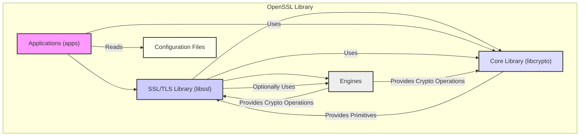
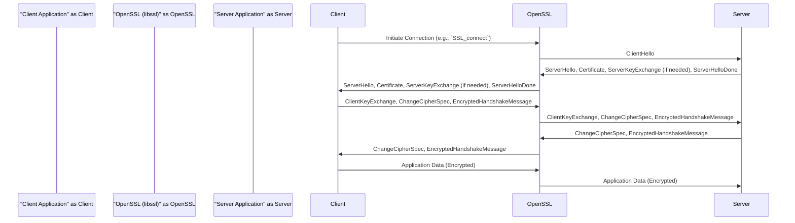

## Project Design Document: OpenSSL Library

**1. Introduction**

This document provides a detailed architectural overview of the OpenSSL library, intended to serve as a foundation for subsequent threat modeling activities. OpenSSL is a robust, full-featured, and widely used open-source toolkit that implements the Secure Sockets Layer (SSL) and Transport Layer Security (TLS) protocols, as well as general-purpose cryptography. This document outlines the key components, their interactions, and relevant security considerations.

**2. Project Goals and Scope**

* **Goal:** To provide a comprehensive design overview of the OpenSSL library for security analysis and threat modeling.
* **Scope:** This document covers the core architectural components of the OpenSSL library, including its cryptographic algorithms, SSL/TLS implementation, and utility functions. It focuses on the software architecture and does not delve into the specifics of the underlying hardware or operating systems.

**3. Architectural Overview**

OpenSSL's architecture is modular, allowing for flexibility and extensibility. It can be broadly divided into the following key areas:

* **Core Library:** Provides fundamental cryptographic primitives and utilities.
* **SSL/TLS Library:** Implements the SSL and TLS protocols.
* **Utilities and Applications:** Includes command-line tools and other utilities built upon the core libraries.

**4. Key Components**

* **`libcrypto` (Core Library):**
    * **Purpose:** Provides a wide range of cryptographic algorithms and supporting functions.
    * **Key Features:**
        * **Symmetric Ciphers:**  AES, DES, Blowfish, ChaCha20, etc.
        * **Asymmetric Ciphers:** RSA, DSA, ECDSA, EdDSA.
        * **Hash Functions:** SHA-1, SHA-256, SHA-3, MD5.
        * **Message Authentication Codes (MACs):** HMAC.
        * **Random Number Generation (RNG):**  Provides secure random numbers.
        * **Bignum Library:**  Handles arbitrary-precision arithmetic.
        * **ASN.1 Encoding/Decoding:**  Supports Abstract Syntax Notation One for data serialization.
        * **X.509 Certificate Handling:**  Manages X.509 certificates and related structures.
    * **Internal Structure:** Organized into modules based on cryptographic functionality (e.g., `crypto/bn`, `crypto/evp`, `crypto/rsa`).

* **`libssl` (SSL/TLS Library):**
    * **Purpose:** Implements the SSL and TLS protocols for secure communication over networks.
    * **Key Features:**
        * **Protocol Implementations:** Supports various versions of SSL and TLS (e.g., TLS 1.2, TLS 1.3).
        * **Handshake Management:** Handles the negotiation and establishment of secure connections.
        * **Record Layer Processing:** Encrypts and decrypts application data.
        * **Cipher Suite Negotiation:**  Selects the cryptographic algorithms to be used for a connection.
        * **Certificate Management:**  Handles the exchange and verification of X.509 certificates.
        * **Session Management:**  Manages SSL/TLS sessions for performance optimization.
    * **Internal Structure:**  Organized around protocol state machines and connection management.

* **`apps` (Command-line Applications):**
    * **Purpose:** Provides command-line utilities for various cryptographic operations and SSL/TLS testing.
    * **Key Applications:**
        * `openssl`:  A general-purpose command-line tool for cryptographic tasks.
        * `ciphers`:  Lists available cipher suites.
        * `s_client`:  A simple SSL/TLS client for testing connections.
        * `s_server`:  A simple SSL/TLS server for testing connections.
        * `req`:  Generates and processes X.509 certificate signing requests.
        * `x509`:  Manipulates X.509 certificates.

* **Configuration Files:**
    * **Purpose:** Allows customization of OpenSSL's behavior.
    * **Key Files:** `openssl.cnf` (main configuration file).
    * **Functionality:** Defines default settings for various cryptographic operations, certificate policies, and engine configurations.

* **Engines:**
    * **Purpose:** Provides a mechanism to plug in alternative cryptographic implementations, often for hardware acceleration.
    * **Functionality:** Allows OpenSSL to utilize cryptographic operations provided by external hardware security modules (HSMs) or software libraries.

**5. Architectural Diagram**

**6. Data Flow Diagram (Simplified Example: TLS Handshake)**

**7. Security Considerations**

* **Cryptographic Algorithm Security:** The security of OpenSSL heavily relies on the strength and correctness of the implemented cryptographic algorithms. Vulnerabilities in these algorithms (e.g., weaknesses in older hash functions) can compromise the security of the system.
* **Implementation Vulnerabilities:**  Bugs in the implementation of the cryptographic algorithms or the SSL/TLS protocols can lead to security vulnerabilities (e.g., buffer overflows, integer overflows).
* **Random Number Generation:** The security of cryptographic operations depends on the quality of the random numbers generated. Weak or predictable random numbers can be exploited by attackers.
* **Certificate Validation:** Proper validation of X.509 certificates is crucial to prevent man-in-the-middle attacks. Incorrect or incomplete validation can lead to accepting fraudulent certificates.
* **Memory Management:**  Improper memory management can lead to vulnerabilities like buffer overflows or use-after-free errors.
* **Side-Channel Attacks:**  Information leakage through side channels (e.g., timing attacks) can potentially compromise cryptographic keys.
* **Configuration Security:**  Misconfiguration of OpenSSL can weaken security. For example, using weak cipher suites or disabling certificate validation.
* **Dependency Management:**  Vulnerabilities in OpenSSL's dependencies could also impact its security.

**8. External Interfaces**

* **Application Programming Interface (API):**  Provides a C-language API for applications to utilize OpenSSL's functionality.
* **Command-line Interface (CLI):**  The `openssl` command-line tool and other utilities provide a way to interact with OpenSSL from the command line.
* **Configuration Files:** Allow external configuration of OpenSSL's behavior.
* **Engine Interface:**  Allows external cryptographic providers to be integrated.

**9. Deployment Considerations**

* **Operating System Compatibility:** OpenSSL is designed to be portable and supports a wide range of operating systems.
* **Library Linking:** Applications need to link against the `libcrypto` and `libssl` libraries.
* **Configuration Management:**  Proper configuration of OpenSSL is essential for security and performance.
* **Version Management:**  Keeping OpenSSL updated to the latest version is crucial to patch security vulnerabilities.

**10. Future Considerations**

* **Quantum-Resistant Cryptography:**  Exploring and potentially integrating quantum-resistant cryptographic algorithms.
* **Improved API Design:**  Ongoing efforts to improve the usability and security of the OpenSSL API.
* **Formal Verification:**  Applying formal verification techniques to improve the assurance of the correctness of cryptographic implementations.

This document provides a high-level architectural overview of OpenSSL. Further detailed analysis of individual components and their interactions will be necessary for comprehensive threat modeling.
