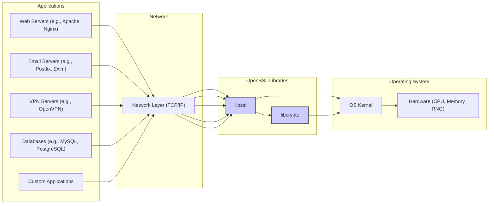
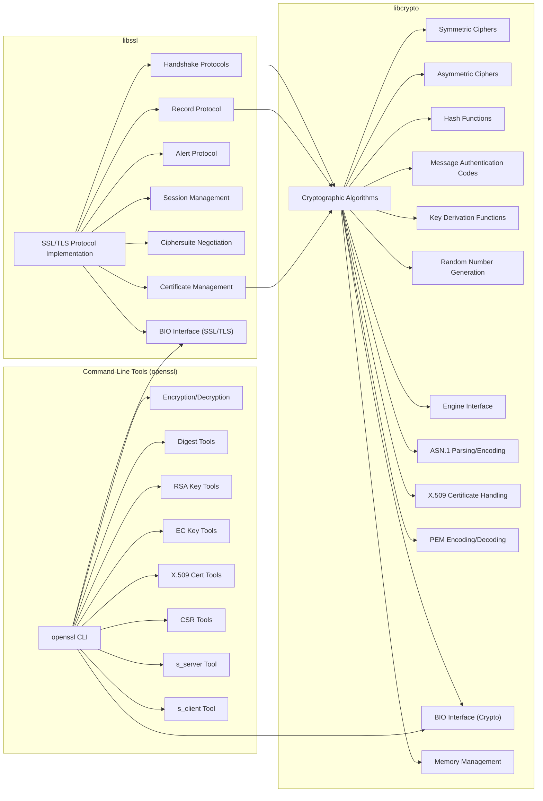

# Project Design Document: OpenSSL for Threat Modeling

**Project Name:** OpenSSL

**Project Repository:** [https://github.com/openssl/openssl](https://github.com/openssl/openssl)

**Document Version:** 1.1

**Date:** October 26, 2023

**Author:** Gemini (AI Expert in Software, Cloud, and Cybersecurity Architecture)

## 1. Introduction

This document provides a detailed design overview of the OpenSSL project, specifically tailored for threat modeling activities. It aims to clearly describe the architecture, key components, data flow, and security considerations of OpenSSL to facilitate the identification of potential vulnerabilities and attack vectors.  OpenSSL is a foundational security library, and understanding its design is crucial for securing systems that rely on it. This document will serve as a foundation for subsequent threat modeling exercises, enabling security professionals to proactively identify and mitigate risks.

## 2. Project Overview

OpenSSL is a widely used, open-source toolkit implementing the Secure Sockets Layer (SSL) and Transport Layer Security (TLS) protocols, as well as a general-purpose cryptography library.  Its primary function is to provide robust and reliable cryptographic services to applications requiring secure communication and data protection.  Due to its critical role in securing internet communications and various software systems, the security of OpenSSL itself is of paramount importance.

**Key Objectives of OpenSSL:**

* **Comprehensive Cryptographic Library:** Offer a broad spectrum of cryptographic algorithms, encompassing symmetric and asymmetric encryption, hashing, message authentication codes, and digital signatures.
* **TLS/SSL Protocol Implementation:**  Provide a correct, performant, and secure implementation of TLS/SSL protocols to enable encrypted and authenticated network communication.
* **Command-Line Utility:**  Include a versatile command-line tool (`openssl`) for managing keys, certificates, and performing diverse cryptographic operations for system administrators and developers.
* **Interoperability and Standards Compliance:**  Adhere to relevant security standards and ensure compatibility across different platforms and applications to promote widespread adoption.
* **Security as a Core Principle:**  Prioritize security through rigorous development practices, proactive vulnerability management, and a commitment to addressing security concerns promptly.

## 3. System Architecture

OpenSSL employs a modular and layered architecture to promote maintainability, reusability, and security.  The system is broadly divided into libraries and command-line tools, built upon a foundation of cryptographic primitives and abstractions.

### 3.1. High-Level Architecture Diagram



**Description:**

* **Applications:**  Represent software applications that leverage OpenSSL for secure communication and cryptographic functionalities.
* **Network:** Explicitly shows the network layer, highlighting that OpenSSL is often used to secure network communications.
* **OpenSSL Libraries:**
    * **`libssl`:**  The SSL/TLS library, responsible for implementing the protocol logic and utilizing `libcrypto` for cryptographic operations.
    * **`libcrypto`:** The core cryptographic library, providing a wide range of cryptographic algorithms and utilities.
* **Operating System:**  The underlying operating system providing essential services and hardware resources.

### 3.2. Detailed Component Architecture



**Component Descriptions:** (Descriptions remain largely the same as in version 1.0, focusing on clarity and conciseness. Refer to version 1.0 for detailed descriptions if needed.)

* **`libssl` Components:** (Focus on protocol logic and high-level functions)
    * **SSL/TLS Protocol Implementation:** Core logic for TLS/SSL protocols.
    * **Handshake Protocols:** Manages secure connection establishment.
    * **Record Protocol:** Handles encryption and decryption of data.
    * **Alert Protocol:**  Manages error and warning communication.
    * **Session Management:** Optimizes connection performance.
    * **Ciphersuites:** Negotiates cryptographic algorithms.
    * **Certificate Management:** Handles X.509 certificate operations.
    * **BIO_SSL:** Abstraction for I/O operations in `libssl`.

* **`libcrypto` Components:** (Focus on cryptographic primitives and utilities)
    * **Cryptographic Algorithms:** Collection of crypto algorithm implementations.
    * **Symmetric Ciphers:** AES, ChaCha20, etc.
    * **Asymmetric Ciphers:** RSA, ECC, etc.
    * **Hash Functions:** SHA-256, SHA-3, etc.
    * **Message Authentication Codes (MAC):** HMAC.
    * **Key Derivation Functions (KDF):** HKDF, PBKDF2.
    * **Random Number Generation (RNG):** Cryptographically secure RNG.
    * **Engine Interface:** Hardware acceleration integration.
    * **ASN.1 Parsing and Encoding:** Handles ASN.1 data structures.
    * **X.509 Certificate Handling:** X.509 certificate processing.
    * **PEM Encoding/Decoding:** PEM format handling.
    * **BIO_CRYPTO:** Abstraction for I/O in `libcrypto`.
    * **Memory Management:** Memory allocation and deallocation.

* **Command-Line Tools (`openssl`):** (Focus on utility functions)
    * **`openssl` CLI:** Main command-line interface.
    * **Encryption/Decryption Tools:** Data encryption/decryption utilities.
    * **Digest Tools:** Hash calculation utilities.
    * **RSA/EC Key Management Tools:** Key generation and management.
    * **X.509 Certificate Tools:** Certificate creation and management.
    * **CSR (Certificate Signing Request) Tools:** CSR management.
    * **`s_server` and `s_client`:** Testing and debugging tools.

## 4. Data Flow

Data flow in OpenSSL is centered around securing data in transit and performing cryptographic operations. The TLS handshake and secure data transfer are primary examples.

### 4.1. Simplified TLS 1.3 Handshake and Data Transfer

```mermaid
graph LR
    subgraph "Client"
        ClientApp["Client Application"]
        ClientSSL["Client libssl"]
        ClientNet["Client Network Interface"]
    end

    subgraph "Server"
        ServerNet["Server Network Interface"]
        ServerSSL["Server libssl"]
        ServerApp["Server Application"]
    end

    ClientApp --> ClientSSL: "Application Data"
    ClientSSL --> ClientNet: "Encrypted Data"
    ClientNet --> ServerNet: "Network"
    ServerNet --> ServerSSL: "Encrypted Data"
    ServerSSL --> ServerApp: "Application Data"

    ServerApp --> ServerSSL: "Application Data"
    ServerSSL --> ServerNet: "Encrypted Data"
    ServerNet --> ClientNet: "Network"
    ClientNet --> ClientSSL: "Encrypted Data"
    ClientSSL --> ClientApp: "Application Data"

    subgraph "TLS Handshake"
        ClientHello["Client Hello"]
        ServerHelloCertVerify["Server Hello, Certificate, Verify"]
        KeyExchange["Key Exchange"]
        Finished["Finished Messages"]
    end

    ClientSSL --> ClientNet: ClientHello
    ClientNet --> ServerNet: ClientHello
    ServerNet --> ServerSSL: ClientHello

    ServerSSL --> ServerNet: ServerHelloCertVerify
    ServerNet --> ClientNet: ServerHelloCertVerify
    ClientNet --> ClientSSL: ServerHelloCertVerify

    ClientSSL --> ClientNet: KeyExchange, Finished
    ClientNet --> ServerNet: KeyExchange, Finished
    ServerNet --> ServerSSL: KeyExchange, Finished
    style KeyExchange fill:#ffcc80,stroke:#333,stroke-width:1px
```

**Data Flow Description:**

1. **Application Data Exchange:** Applications pass data to `libssl` for secure transmission and receive decrypted data.
2. **Encryption/Decryption by `libssl`:** `libssl` utilizes `libcrypto` to encrypt outgoing and decrypt incoming data, ensuring confidentiality.
3. **TLS Handshake (Simplified):**
    * **Client Hello:** Client initiates handshake.
    * **Server Hello, Certificate, Verify:** Server responds with parameters and its certificate for authentication.
    * **Key Exchange:**  Client and server establish shared secret keys.
    * **Finished Messages:** Handshake completion confirmation.
4. **Network Transmission:** Encrypted data is transmitted over the network.
5. **`libcrypto` Operations:** During handshake and data transfer, `libcrypto` performs:
    * **Certificate Verification:** Validating server identity.
    * **Key Exchange:**  Executing key agreement algorithms.
    * **Symmetric Encryption/Decryption:** Protecting data confidentiality.
    * **Hashing and MAC:** Ensuring data integrity and authenticity.
    * **Random Number Generation:** Generating cryptographic keys and parameters.

## 5. Security Considerations for Threat Modeling

This section categorizes security considerations for threat modeling, focusing on key components and potential vulnerabilities.

**5.1. `libcrypto` Component Threats:**

* **Cryptographic Algorithm Vulnerabilities:**
    * **Implementation Flaws:** Bugs in the implementation of cryptographic algorithms (e.g., incorrect logic, off-by-one errors).
    * **Side-Channel Attacks:** Timing attacks, power analysis, cache attacks exploiting algorithm implementations to leak keys.
    * **Algorithm Weaknesses:**  Theoretical weaknesses in algorithms themselves (less common but possible over time).
* **Random Number Generator (RNG) Weakness:**
    * **Insufficient Entropy:** Lack of sufficient randomness sources leading to predictable or weak keys.
    * **RNG Algorithm Flaws:**  Bugs or weaknesses in the DRBG (Deterministic Random Bit Generator) implementation.
    * **State Compromise:**  Compromise of the RNG's internal state leading to predictable output.
* **Memory Management Issues:**
    * **Buffer Overflows/Underflows:**  Writing beyond allocated memory, leading to crashes or code execution.
    * **Use-After-Free:** Accessing freed memory, causing crashes or exploitable conditions.
    * **Double-Free:** Freeing memory twice, leading to memory corruption.
* **Engine Interface Vulnerabilities:**
    * **Engine Implementation Bugs:**  Vulnerabilities in third-party hardware engine implementations.
    * **Insecure Engine Integration:**  Flaws in how OpenSSL interacts with hardware engines.

**5.2. `libssl` Component Threats:**

* **Protocol Implementation Flaws:**
    * **Handshake Vulnerabilities:**  Bugs in handshake logic leading to downgrade attacks, man-in-the-middle attacks, or denial of service.
    * **Record Protocol Vulnerabilities:**  Flaws in encryption/decryption or MAC verification leading to data leakage or manipulation.
    * **State Machine Issues:**  Unexpected state transitions or vulnerabilities in the SSL/TLS state machine.
* **Certificate Management Vulnerabilities:**
    * **Certificate Parsing Errors:**  Vulnerabilities when parsing malformed or malicious certificates.
    * **Certificate Validation Bypass:**  Flaws in certificate chain validation logic.
    * **Trust Store Issues:**  Compromised or improperly configured trust stores.
* **Session Management Vulnerabilities:**
    * **Session Hijacking:**  Exploiting weaknesses in session ID generation or management.
    * **Session Fixation:**  Forcing clients to reuse a known session ID.

**5.3. `openssl` Command-Line Tool Threats:**

* **Command Injection:**  Vulnerabilities in parsing command-line arguments allowing execution of arbitrary commands.
* **Insecure Defaults/Misconfiguration:**  Using insecure default options or misconfiguring tools leading to weak keys or certificates.
* **Information Disclosure:**  Tools inadvertently revealing sensitive information (e.g., private keys in error messages).

**5.4. General Threats:**

* **Denial of Service (DoS):**  Exploiting vulnerabilities to crash OpenSSL or consume excessive resources.
* **Information Disclosure:**  Leaking sensitive data through vulnerabilities or side-channels.
* **Code Injection/Remote Code Execution (RCE):**  Exploiting memory corruption or other vulnerabilities to execute arbitrary code.
* **Supply Chain Attacks:**  Compromise of the OpenSSL codebase or build process.

## 6. Technologies Used

* **Programming Language:** C (Primarily)
* **Protocols:** TLS 1.3, TLS 1.2, TLS 1.1, TLS 1.0, DTLS, SSLv3 (deprecated), SSLv2 (deprecated)
* **Cryptographic Algorithms:**  Extensive suite including:
    * **Symmetric:** AES, ChaCha20, DES, 3DES, Blowfish, etc.
    * **Asymmetric:** RSA, DSA, ECDSA, ECDH, EdDSA, X25519, X448, etc.
    * **Hash:** SHA-1, SHA-256, SHA-384, SHA-512, SHA-3, MD5, etc.
    * **MAC:** HMAC, CMAC, etc.
    * **KDF:** HKDF, PBKDF2, etc.
* **Data Formats:** ASN.1 (DER, PEM), X.509
* **Operating Systems:** Cross-platform (Linux, Windows, macOS, *BSD, etc.)

## 7. Deployment Environment

OpenSSL is deployed as a library integrated into a wide range of applications and systems:

* **Server-Side:** Web servers, application servers, mail servers, database servers, VPN gateways, load balancers.
* **Client-Side:** Web browsers, email clients, VPN clients, mobile applications, IoT devices.
* **Operating Systems:** Core component of many operating systems.
* **Embedded Systems:** Network devices, security appliances, industrial control systems.

## 8. Future Considerations for Threat Landscape

* **Post-Quantum Cryptography (PQC):**  Transitioning to PQC algorithms to mitigate threats from quantum computers. Threat modeling should consider migration strategies and potential vulnerabilities during transition.
* **Formal Verification and Memory Safety:** Increased adoption of formal verification techniques and memory-safe languages to reduce implementation vulnerabilities. Threat modeling should consider the impact of these advancements on reducing certain vulnerability classes.
* **Continued Focus on Side-Channel Resistance:**  Ongoing research and development to improve resistance against side-channel attacks. Threat models should consider the evolving landscape of side-channel attack techniques.
* **Supply Chain Security:**  Strengthening supply chain security to prevent malicious code injection. Threat modeling should include supply chain risks.
* **Emerging Attack Vectors:**  Monitoring and adapting to new attack vectors and vulnerabilities discovered in cryptographic protocols and implementations. Continuous threat model updates are essential.

## 9. Conclusion

This design document provides a detailed foundation for threat modeling OpenSSL. It outlines the architecture, key components, data flow, and critical security considerations. By leveraging this document, security teams can conduct comprehensive threat modeling exercises, identify potential vulnerabilities across different components and attack surfaces, and develop effective mitigation strategies to enhance the security of systems relying on OpenSSL.  Regularly revisiting and updating the threat model based on new vulnerabilities, attack techniques, and evolving security best practices is crucial for maintaining a strong security posture.