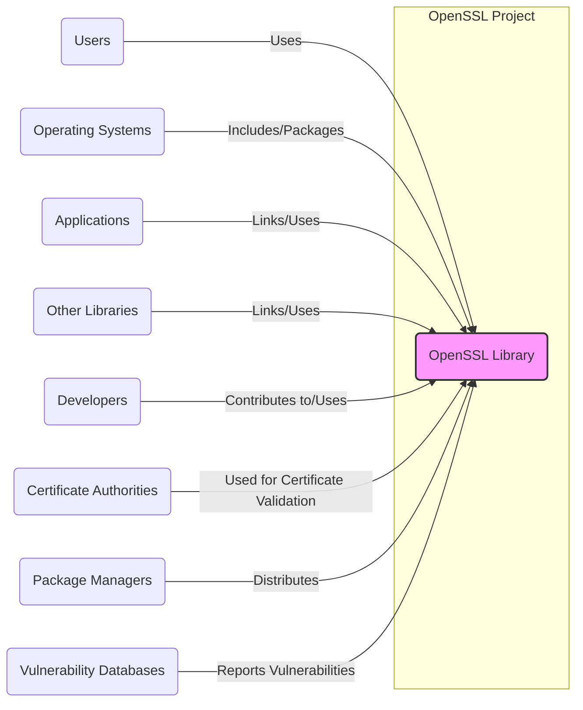
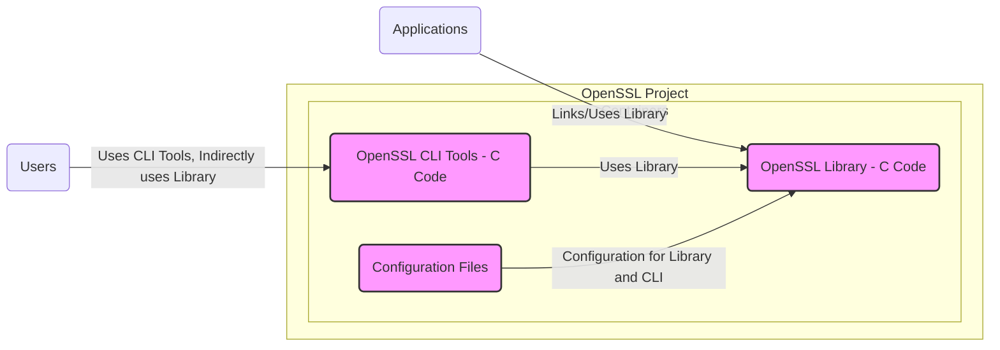
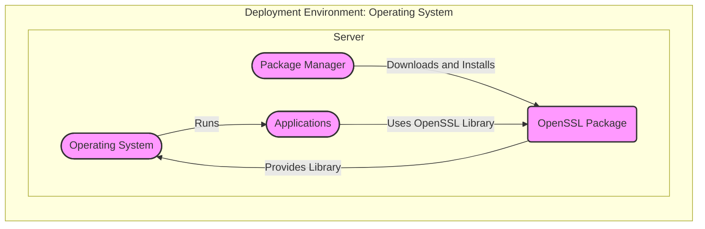

# BUSINESS POSTURE

The OpenSSL project provides a robust, commercial-grade, and full-featured toolkit for the Transport Layer Security (TLS) and Secure Sockets Layer (SSL) protocols. It is also a general-purpose cryptography library.

- Business priorities:
  - Provide a secure and reliable cryptographic library.
  - Maintain compatibility and stability across different platforms and versions.
  - Ensure performance and efficiency of cryptographic operations.
  - Foster a vibrant open-source community around the project.
  - Respond promptly to security vulnerabilities and provide timely updates.

- Business goals:
  - Be the leading open-source cryptographic library.
  - Be widely adopted and trusted by developers and organizations globally.
  - Continuously improve the security and functionality of the library.
  - Support evolving cryptographic standards and protocols.

- Business risks:
  - Security vulnerabilities in OpenSSL can have widespread and severe consequences for users.
  - Performance bottlenecks can impact applications relying on OpenSSL.
  - Lack of compatibility can hinder adoption and integration.
  - Community fragmentation can slow down development and maintenance.
  - Slow response to security issues can erode trust and lead to exploits.

# SECURITY POSTURE

- Security controls:
  - security control: Open source development model allowing for public scrutiny and community contributions. Implemented through GitHub repository and public mailing lists.
  - security control: Peer review process for code changes. Implemented through GitHub pull requests and code review practices.
  - security control: Vulnerability reporting process and security advisories. Described on the OpenSSL website and security mailing lists.
  - security control: Regular security audits and penetration testing. Documentation and reports might be available publicly or internally.
  - security control: Use of static analysis tools during development. Details of specific tools and integration are likely internal to the development process.
  - security control: Fuzzing and automated testing. Details of fuzzing and testing frameworks are likely internal to the development process.

- Accepted risks:
  - accepted risk: Complexity of the codebase increases the likelihood of subtle vulnerabilities.
  - accepted risk: Open source nature makes the codebase publicly available for vulnerability research by both security researchers and malicious actors.
  - accepted risk: Reliance on volunteer contributions can lead to inconsistencies in development pace and security focus.

- Recommended security controls:
  - security control: Enhance automated security testing with more advanced techniques like dynamic analysis and symbolic execution.
  - security control: Implement a Software Bill of Materials (SBOM) to track dependencies and components for supply chain security.
  - security control: Formalize and document the secure software development lifecycle (SSDLC) practices.
  - security control: Increase investment in security training for developers and contributors.

- Security requirements:
  - Authentication: Not directly applicable to the library itself, but required for access to development infrastructure (e.g., GitHub, build systems).
  - Authorization: Role-based access control for code contributions, infrastructure management, and release processes. Implemented through GitHub permissions and internal access management systems.
  - Input validation: Rigorous input validation within the OpenSSL API to prevent vulnerabilities like buffer overflows and format string bugs. Implemented in the C code of the library.
  - Cryptography:
    - Implement robust and well-vetted cryptographic algorithms and protocols. Implemented in the C code of the library.
    - Follow best practices for key management and cryptographic operations. Documented in OpenSSL documentation and internal guidelines.
    - Stay up-to-date with the latest cryptographic standards and recommendations. Addressed by the OpenSSL development and security teams.
    - Provide secure defaults and guidance for users on secure configuration and usage. Documented in OpenSSL documentation and examples.

# DESIGN

## C4 CONTEXT

- Elements of Context Diagram:
  - - Name: OpenSSL Library
    - Type: Software System
    - Description: The core cryptographic library providing TLS/SSL and general-purpose cryptography functions.
    - Responsibilities: Provide cryptographic algorithms, protocols, and tools for secure communication and data protection.
    - Security controls: Input validation, memory safety practices, cryptographic algorithm implementations, security testing.

  - - Name: Users
    - Type: Person
    - Description: Individuals or organizations that utilize applications or systems that depend on OpenSSL.
    - Responsibilities: Use applications and systems securely, report issues, and update to secure versions.
    - Security controls: User education, secure configuration of applications.

  - - Name: Operating Systems
    - Type: Software System
    - Description: Operating systems that package and distribute OpenSSL as part of their system libraries.
    - Responsibilities: Package and distribute secure and updated versions of OpenSSL, provide system-level security features.
    - Security controls: Package management security, system updates, OS-level security features.

  - - Name: Applications
    - Type: Software System
    - Description: Applications (e.g., web servers, email clients, VPNs) that link and use the OpenSSL library for cryptographic functionalities.
    - Responsibilities: Properly integrate and use OpenSSL, handle cryptographic keys securely, and update OpenSSL when necessary.
    - Security controls: Secure coding practices, input validation, secure configuration, dependency management.

  - - Name: Other Libraries
    - Type: Software System
    - Description: Other software libraries that may depend on or interact with OpenSSL for cryptographic operations.
    - Responsibilities: Integrate with OpenSSL securely, manage dependencies, and update libraries as needed.
    - Security controls: Secure coding practices, dependency management.

  - - Name: Developers
    - Type: Person
    - Description: Individuals who contribute to the development of OpenSSL, or developers who use OpenSSL in their applications.
    - Responsibilities: Contribute secure code, follow secure development practices, use OpenSSL correctly in applications.
    - Security controls: Code review, secure development training, access control to development infrastructure.

  - - Name: Certificate Authorities
    - Type: External System
    - Description: Trusted entities that issue digital certificates used by TLS/SSL, which OpenSSL helps to validate.
    - Responsibilities: Issue valid and trustworthy certificates, maintain certificate revocation lists (CRLs) or OCSP services.
    - Security controls: Certificate issuance policies, key management, infrastructure security.

  - - Name: Package Managers
    - Type: External System
    - Description: Systems like apt, yum, npm, pip, etc., used to distribute and install OpenSSL packages.
    - Responsibilities: Securely distribute packages, verify package integrity, provide update mechanisms.
    - Security controls: Package signing, secure repositories, update mechanisms.

  - - Name: Vulnerability Databases
    - Type: External System
    - Description: Databases (e.g., CVE, NVD) that track and report security vulnerabilities, including those found in OpenSSL.
    - Responsibilities: Collect and disseminate vulnerability information, provide vulnerability scoring and analysis.
    - Security controls: Data integrity, secure access to vulnerability information.

## C4 CONTAINER

- Elements of Container Diagram:
  - - Name: OpenSSL Library - C Code
    - Type: Library
    - Description: The core cryptographic library written in C, providing APIs for TLS/SSL and general-purpose cryptography.
    - Responsibilities: Implement cryptographic algorithms and protocols, manage memory and resources, provide a stable and secure API.
    - Security controls: Input validation, memory safety practices, cryptographic algorithm implementations, security testing, API design review.

  - - Name: OpenSSL CLI Tools - C Code
    - Type: Application
    - Description: Command-line tools (e.g., openssl command) written in C, providing utilities for key generation, certificate management, encryption, and other cryptographic tasks.
    - Responsibilities: Provide user-friendly command-line interface to OpenSSL functionalities, securely handle user inputs and commands.
    - Security controls: Input validation, command parsing security, secure handling of keys and sensitive data, privilege separation (if applicable).

  - - Name: Configuration Files
    - Type: Configuration
    - Description: Configuration files used to customize the behavior of the OpenSSL library and CLI tools.
    - Responsibilities: Store configuration settings, allow users to customize OpenSSL behavior.
    - Security controls: Secure file permissions, validation of configuration parameters, protection against configuration injection attacks.

## DEPLOYMENT

Deployment of OpenSSL is primarily about its distribution and integration into various environments, as it is a library. Common deployment scenarios include:

- **Operating System Packages:** Distributed as part of OS packages (e.g., apt, yum, apk).
- **Source Code Compilation:** Compiled from source code by users or developers.
- **Language-Specific Packages:** Wrapped and distributed for specific programming languages (e.g., Python's `cryptography` package).
- **Container Images:** Included in container images (e.g., Docker images) for application deployment.

Let's focus on **Operating System Packages** deployment scenario:

- Elements of Deployment Diagram (Operating System Packages):
  - - Name: Operating System
    - Type: Infrastructure
    - Description: The underlying operating system (e.g., Linux, Windows, macOS) on which applications and OpenSSL run.
    - Responsibilities: Provide a secure and stable environment for applications, manage system resources, and handle package management.
    - Security controls: OS-level security features (firewall, access control), kernel security, system updates.

  - - Name: Package Manager
    - Type: Software System
    - Description: System software (e.g., apt, yum, apk) used to install, update, and manage software packages, including OpenSSL.
    - Responsibilities: Securely download and install packages, verify package integrity, manage dependencies, and provide update mechanisms.
    - Security controls: Package signing, secure repositories, update mechanisms, access control to package management tools.

  - - Name: OpenSSL Package
    - Type: Software Artifact
    - Description: The packaged version of the OpenSSL library and related tools, distributed through package managers.
    - Responsibilities: Provide a pre-built and configured version of OpenSSL for easy installation and use.
    - Security controls: Secure build process, package signing, vulnerability scanning of packaged binaries.

  - - Name: Applications
    - Type: Software System
    - Description: Applications running on the operating system that depend on the OpenSSL library.
    - Responsibilities: Utilize the installed OpenSSL library for cryptographic functions, manage dependencies, and handle updates.
    - Security controls: Application-level security controls, secure coding practices, dependency management.

## BUILD

```mermaid
flowchart LR
    DEV(Developer) -->|Code Changes, Pull Requests| GH(GitHub Repository)
    GH -->|Triggers Build| CI([CI System - e.g., GitHub Actions])
    CI -->|Checkout Code, Build, Test, Security Checks| BA([Build Artifacts])
    BA -->|Publish to Package Repositories, Distribution Channels| DIST([Distribution - e.g., OS Package Repositories, Source Tarballs])

    subgraph "CI System - e.g., GitHub Actions"
        SC([Source Code Checkout])
        BUILD([Compilation])
        TEST([Automated Tests])
        SAST([Static Analysis Security Testing])
        LINT([Linters])
        CI --> SC
        SC --> BUILD
        BUILD --> TEST
        TEST --> SAST
        SAST --> LINT
        LINT --> BA
    end

    style DEV fill:#ccf,stroke:#333,stroke-width:2px
    style GH fill:#ccf,stroke:#333,stroke-width:2px
    style CI fill:#f9f,stroke:#333,stroke-width:2px
    style BA fill:#f9f,stroke:#333,stroke-width:2px
    style DIST fill:#f9f,stroke:#333,stroke-width:2px
    style SC fill:#eee,stroke:#333,stroke-width:1px,stroke-dasharray: 5 5
    style BUILD fill:#eee,stroke:#333,stroke-width:1px,stroke-dasharray: 5 5
    style TEST fill:#eee,stroke:#333,stroke-width:1px,stroke-dasharray: 5 5
    style SAST fill:#eee,stroke:#333,stroke-width:1px,stroke-dasharray: 5 5
    style LINT fill:#eee,stroke:#333,stroke-width:1px,stroke-dasharray: 5 5
```

- Elements of Build Diagram:
  - - Name: Developer
    - Type: Person
    - Description: Software developers contributing code changes to the OpenSSL project.
    - Responsibilities: Write code, submit pull requests, address code review feedback.
    - Security controls: Secure development training, code review process, access control to development infrastructure.

  - - Name: GitHub Repository
    - Type: Software System
    - Description: The Git repository hosted on GitHub that stores the OpenSSL source code and development history.
    - Responsibilities: Version control, code hosting, pull request management, issue tracking.
    - Security controls: Access control, branch protection, audit logging, vulnerability scanning (GitHub security features).

  - - Name: CI System - e.g., GitHub Actions
    - Type: Software System
    - Description: Continuous Integration system (like GitHub Actions, Jenkins, etc.) that automates the build, test, and security check process.
    - Responsibilities: Automate build process, run tests, perform security scans, generate build artifacts.
    - Security controls: Secure CI configuration, access control, secrets management, build isolation.

  - - Name: Source Code Checkout
    - Type: Build Process Step
    - Description: Step in CI pipeline where source code is retrieved from the GitHub repository.
    - Responsibilities: Obtain the correct version of the source code.
    - Security controls: Secure connection to GitHub, integrity checks (e.g., Git commit hashes).

  - - Name: Compilation
    - Type: Build Process Step
    - Description: Step in CI pipeline where source code is compiled into binary artifacts.
    - Responsibilities: Compile code for different platforms and architectures.
    - Security controls: Secure compiler toolchain, compiler hardening flags, build environment isolation.

  - - Name: Automated Tests
    - Type: Build Process Step
    - Description: Step in CI pipeline where automated tests (unit, integration, etc.) are executed.
    - Responsibilities: Verify code functionality and identify regressions.
    - Security controls: Comprehensive test suite, test environment isolation.

  - - Name: Static Analysis Security Testing (SAST)
    - Type: Build Process Step
    - Description: Step in CI pipeline where static analysis tools are used to scan the code for potential security vulnerabilities.
    - Responsibilities: Identify potential security flaws in the code without executing it.
    - Security controls: Selection of effective SAST tools, configuration and tuning of SAST tools, vulnerability triage process.

  - - Name: Linters
    - Type: Build Process Step
    - Description: Step in CI pipeline where linters are used to check code style and potential code quality issues.
    - Responsibilities: Enforce code style guidelines, identify potential code quality problems.
    - Security controls: Use of linters to catch potential security-related coding errors.

  - - Name: Build Artifacts
    - Type: Software Artifact
    - Description: The output of the build process, including binaries, libraries, header files, etc.
    - Responsibilities: Package build outputs for distribution.
    - Security controls: Artifact signing, integrity checks, secure storage of artifacts.

  - - Name: Distribution - e.g., OS Package Repositories, Source Tarballs
    - Type: Software System
    - Description: Systems and channels used to distribute OpenSSL to users (e.g., OS package repositories, official website for source code).
    - Responsibilities: Securely distribute OpenSSL packages and source code to users.
    - Security controls: Secure distribution channels, package signing, integrity verification mechanisms.

# RISK ASSESSMENT

- Critical business processes we are trying to protect:
  - Secure communication over networks (TLS/SSL).
  - Data encryption and decryption.
  - Digital signatures and verification.
  - Cryptographic key generation and management.

- Data we are trying to protect and their sensitivity:
  - Encryption keys: Highly sensitive. Compromise can lead to complete breakdown of security.
  - Data encrypted by OpenSSL: Sensitivity depends on the data itself, but often includes highly confidential information (personal data, financial data, trade secrets, etc.).
  - Digital certificates and private keys: Highly sensitive. Compromise can lead to impersonation and trust violations.
  - Source code of OpenSSL: Sensitive. Vulnerabilities in source code can be exploited.

# QUESTIONS & ASSUMPTIONS

- Questions:
  - What specific SAST and DAST tools are currently integrated into the OpenSSL CI/CD pipeline?
  - What is the process for triaging and remediating vulnerabilities identified by security scans and audits?
  - Is there a dedicated security team or role responsible for overseeing the security of the OpenSSL project?
  - What is the frequency of security audits and penetration testing?
  - Are there specific security training programs for OpenSSL developers and contributors?
  - What is the process for generating and managing Software Bill of Materials (SBOM) for OpenSSL releases?

- Assumptions:
  - Security is a top priority for the OpenSSL project.
  - The OpenSSL project has a well-defined vulnerability reporting and response process.
  - The project actively engages with the security community and incorporates security best practices.
  - There is a commitment to maintaining the long-term security and stability of OpenSSL.
  - The project utilizes automated build and testing infrastructure.