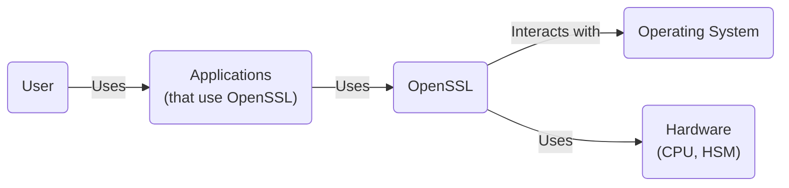
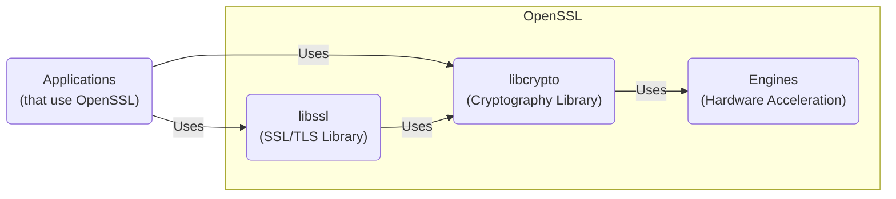
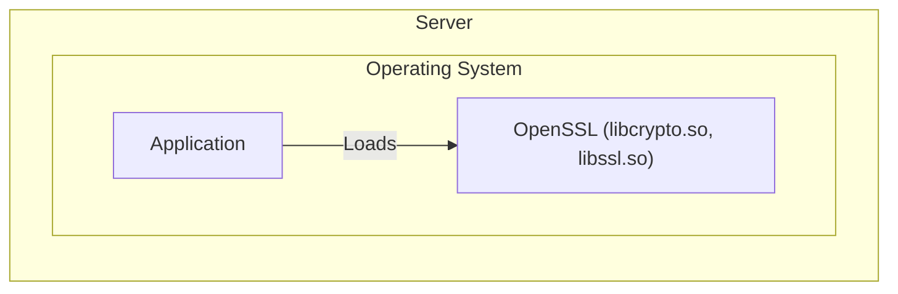
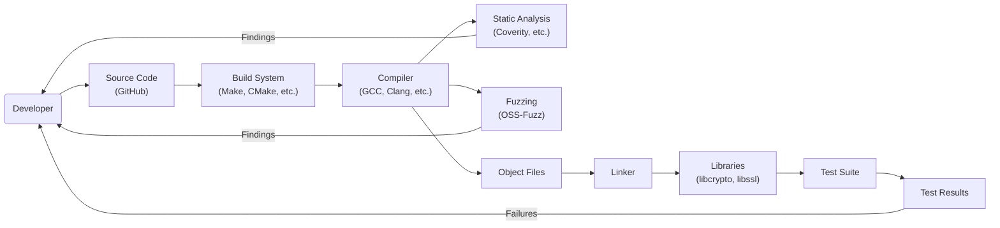

# BUSINESS POSTURE

OpenSSL is a foundational, widely-used open-source project providing cryptographic tools and libraries. Its primary business goal is to provide robust, reliable, and performant cryptographic primitives and protocols for securing communications and data. Given its pervasive use in countless applications and systems, the project's priorities center on maintaining stability, security, and compatibility.

Business Priorities:

- Provide a comprehensive and reliable cryptography toolkit.
- Maintain compatibility across a wide range of platforms and architectures.
- Ensure the long-term maintainability and sustainability of the project.
- Respond promptly and effectively to security vulnerabilities.
- Foster a community of contributors and users.
- Maintain wide adoption and trust within the industry.

Business Goals:

- Be the de facto standard open-source cryptography library.
- Provide high-quality, well-documented, and easy-to-use APIs.
- Support the latest cryptographic standards and protocols.
- Minimize the occurrence and impact of security vulnerabilities.

Most Important Business Risks:

- Discovery of critical security vulnerabilities that could compromise a large number of systems.
- Loss of trust due to mishandling of vulnerabilities or perceived lack of responsiveness.
- Inability to keep up with evolving cryptographic standards and best practices.
- Fragmentation of the codebase or community, leading to competing forks.
- Lack of funding or resources to support ongoing development and maintenance.
- Legal challenges related to patents or export restrictions.

# SECURITY POSTURE

Existing Security Controls:

- security control: Code reviews: OpenSSL has a well-established code review process, requiring multiple reviewers for significant changes. Described in [CONTRIBUTING.md](https://github.com/openssl/openssl/blob/master/CONTRIBUTING.md) and [GOVERNANCE.md](https://github.com/openssl/openssl/blob/master/GOVERNANCE.md).
- security control: Static analysis: The project utilizes static analysis tools to identify potential vulnerabilities. Described in [fuzzing documentation](https://github.com/openssl/openssl/tree/master/fuzz).
- security control: Fuzzing: OpenSSL employs fuzzing techniques to test for unexpected inputs and edge cases. Described in [fuzzing documentation](https://github.com/openssl/openssl/tree/master/fuzz).
- security control: Cryptographic algorithm implementations: OpenSSL implements a wide range of cryptographic algorithms, adhering to industry standards.
- security control: Secure coding guidelines: The project has guidelines for secure coding practices. Described in [OpenSSL Coding Style](https://github.com/openssl/openssl/blob/master/NOTES-STYLE.md).
- security control: Vulnerability disclosure policy: OpenSSL has a documented process for reporting and handling security vulnerabilities. Described in [Vulnerabilities](https://www.openssl.org/policies/vulnerabilities.html).
- security control: Regular releases: The project follows a release schedule, providing updates and security patches.
- security control: Support for hardware security modules (HSMs): OpenSSL can integrate with HSMs for enhanced key protection.

Accepted Risks:

- accepted risk: Complexity of the codebase: The large and complex codebase makes it challenging to audit and maintain.
- accepted risk: Legacy code: The presence of legacy code may contain outdated practices or vulnerabilities.
- accepted risk: Dependence on external contributors: Reliance on volunteer contributors can lead to variations in code quality and responsiveness.
- accepted risk: Resource constraints: Limited resources may impact the speed and thoroughness of security reviews and vulnerability remediation.

Recommended Security Controls:

- security control: Continuous fuzzing integration: Integrate fuzzing into the continuous integration (CI) pipeline for more frequent and automated testing.
- security control: Formal verification: Explore the use of formal verification techniques for critical components to mathematically prove their correctness.
- security control: Memory safety: Investigate migrating parts of the codebase to memory-safe languages (e.g., Rust) to mitigate memory-related vulnerabilities.
- security control: Enhanced static analysis: Integrate more advanced static analysis tools that can detect subtle bugs and vulnerabilities.
- security control: Supply chain security: Implement measures to verify the integrity of dependencies and build tools.

Security Requirements:

- Authentication:
    - Support for strong authentication mechanisms, including multi-factor authentication, where applicable.
    - Secure handling of authentication credentials (e.g., passwords, keys).
- Authorization:
    - Fine-grained access control to cryptographic operations and keys.
    - Role-based access control (RBAC) where appropriate.
- Input Validation:
    - Strict validation of all inputs to prevent injection attacks and other vulnerabilities.
    - Whitelisting of allowed inputs rather than blacklisting of prohibited inputs.
- Cryptography:
    - Use of strong, up-to-date cryptographic algorithms and protocols.
    - Secure key management practices, including generation, storage, and destruction.
    - Protection against known cryptographic attacks (e.g., padding oracle attacks, timing attacks).
    - Support for cryptographic agility, allowing for easy updates to algorithms and protocols.
    - Proper use of random number generators.

# DESIGN

## C4 CONTEXT

Element Descriptions:

- User:
  - Name: User
  - Type: Person
  - Description: Represents any user or entity that indirectly interacts with OpenSSL through applications.
  - Responsibilities: Initiates actions that lead to the use of OpenSSL for cryptographic operations.
  - Security controls: N/A (Indirect interaction)

- Applications:
  - Name: Applications
  - Type: Software System
  - Description: Represents applications that utilize the OpenSSL library for cryptographic functionalities.
  - Responsibilities: Utilize OpenSSL APIs for secure communication, data encryption, and other cryptographic tasks.
  - Security controls: Application-specific security controls, proper use of OpenSSL APIs.

- OpenSSL:
  - Name: OpenSSL
  - Type: Software System
  - Description: The OpenSSL library itself, providing cryptographic functions and protocols.
  - Responsibilities: Provide cryptographic primitives, protocols (SSL/TLS), and key management functions.
  - Security controls: Code reviews, static analysis, fuzzing, secure coding guidelines, vulnerability disclosure policy.

- Operating System:
  - Name: Operating System
  - Type: Software System
  - Description: The underlying operating system on which OpenSSL and applications run.
  - Responsibilities: Provide system resources, memory management, and low-level APIs.
  - Security controls: OS-level security controls, secure configuration.

- Hardware:
  - Name: Hardware
  - Type: Hardware
  - Description: The physical hardware, including CPU and potentially a Hardware Security Module (HSM).
  - Responsibilities: Execute cryptographic operations, provide secure storage for keys (HSM).
  - Security controls: Hardware-based security features, secure boot, tamper resistance (HSM).

## C4 CONTAINER

Element Descriptions:

- Applications:
  - Name: Applications
  - Type: Software System
  - Description: Represents applications that utilize the OpenSSL library for cryptographic functionalities.
  - Responsibilities: Utilize OpenSSL APIs for secure communication, data encryption, and other cryptographic tasks.
  - Security controls: Application-specific security controls, proper use of OpenSSL APIs.

- libcrypto:
  - Name: libcrypto
  - Type: Library
  - Description: The core cryptography library providing fundamental cryptographic primitives.
  - Responsibilities: Implement cryptographic algorithms (hashing, encryption, digital signatures, etc.).
  - Security controls: Code reviews, static analysis, fuzzing, secure coding guidelines.

- libssl:
  - Name: libssl
  - Type: Library
  - Description: The SSL/TLS library providing secure communication protocols.
  - Responsibilities: Implement SSL/TLS protocols, handle secure connections.
  - Security controls: Code reviews, static analysis, fuzzing, secure coding guidelines, protocol-specific security measures.

- Engines:
  - Name: Engines
  - Type: Module
  - Description: Interface for hardware acceleration and cryptographic offloading.
  - Responsibilities: Provide a standardized way to interact with hardware cryptographic accelerators (e.g., HSMs).
  - Security controls: Secure communication with hardware, proper handling of keys.

## DEPLOYMENT

Possible deployment solutions:

1.  Statically linked library: OpenSSL is compiled and linked directly into the application executable.
2.  Dynamically linked library: OpenSSL is compiled as a shared library (e.g., .so, .dll) and loaded at runtime.
3.  System-wide installation: OpenSSL is installed as a system-wide library, accessible to all applications.
4.  Containerized deployment: OpenSSL is included within a container image along with the application.

Chosen solution (Dynamically linked library):

Element Descriptions:

- Server:
  - Name: Server
  - Type: Infrastructure Node
  - Description: The physical or virtual server hosting the application and OpenSSL.
  - Responsibilities: Provide the computing resources for the application and OpenSSL.
  - Security controls: Server hardening, network security, intrusion detection/prevention systems.

- Operating System:
    - Name: Operating System
    - Type: Software System
    - Description: OS where application and OpenSSL are running.
    - Responsibilities: Provide system resources.
    - Security controls: OS hardening, regular security updates.

- Application:
  - Name: Application
  - Type: Software Component
  - Description: The application that uses OpenSSL.
  - Responsibilities: Perform its intended functions, utilizing OpenSSL for cryptography.
  - Security controls: Application-specific security controls, secure coding practices.

- OpenSSL (libcrypto.so, libssl.so):
  - Name: OpenSSL (libcrypto.so, libssl.so)
  - Type: Library
  - Description: The dynamically linked OpenSSL libraries.
  - Responsibilities: Provide cryptographic functions to the application.
  - Security controls: Code reviews, static analysis, fuzzing, secure coding guidelines.

## BUILD

The OpenSSL build process involves several steps, from source code to compiled libraries. The process can vary depending on the target platform and configuration options. Below is a general overview, focusing on security aspects.

Build Process Description:

1.  Developer: Developers write and modify the OpenSSL source code.
2.  Source Code: The source code is hosted on GitHub, providing version control and collaboration features.
3.  Build System: OpenSSL uses a combination of Makefiles, CMake, and Perl scripts for its build system. This allows for configuration and compilation on various platforms.
4.  Compiler: A compiler (e.g., GCC, Clang) translates the source code into object files.
5.  Static Analysis: Static analysis tools are used to scan the source code for potential vulnerabilities and coding errors. Findings are reported back to the developers.
6.  Fuzzing: Fuzzing tools are used to test the library with a wide range of inputs, including malformed or unexpected data.  Vulnerabilities discovered during fuzzing are reported to the developers.
7.  Object Files: The compiler generates object files from the source code.
8.  Linker: The linker combines the object files to create the final libraries (libcrypto and libssl).
9.  Libraries: The compiled libraries (libcrypto.so, libssl.so, etc.) are the output of the build process.
10. Test Suite: OpenSSL includes a comprehensive test suite to verify the correctness and functionality of the library.
11. Test Results: The results of the test suite are checked. Failures are reported back to the developers for investigation and fixing.

Security Controls in Build Process:

- security control: Version control (GitHub): Provides a history of changes and facilitates collaboration.
- security control: Static analysis: Helps identify potential vulnerabilities before runtime.
- security control: Fuzzing: Tests the library with a wide range of inputs to discover vulnerabilities.
- security control: Test suite: Verifies the correctness and functionality of the library.
- security control: Compiler warnings: The build process is configured to treat compiler warnings as errors, ensuring that potential issues are addressed.
- security control: AddressSanitizer (ASan) and UndefinedBehaviorSanitizer (UBSan): These sanitizers are used during testing to detect memory errors and undefined behavior.

# RISK ASSESSMENT

Critical Business Processes to Protect:

- Secure communication: Protecting the confidentiality and integrity of data transmitted over networks using SSL/TLS.
- Data encryption: Ensuring the confidentiality of sensitive data at rest.
- Digital signatures: Providing authenticity and non-repudiation for digital documents and transactions.
- Key management: Securely generating, storing, and managing cryptographic keys.
- Code integrity: Ensuring that the OpenSSL library itself has not been tampered with.

Data to Protect and Sensitivity:

- Cryptographic keys: Highest sensitivity. Compromise of keys can lead to complete loss of confidentiality and integrity.
- Private data transmitted over SSL/TLS: High sensitivity. This can include personal information, financial data, authentication credentials, etc.
- Data encrypted using OpenSSL: Sensitivity varies depending on the nature of the data.
- OpenSSL library itself: High sensitivity. Tampering with the library can compromise all systems that rely on it.

# QUESTIONS & ASSUMPTIONS

Questions:

- What are the specific compliance requirements (e.g., FIPS 140-2) that OpenSSL needs to meet?
- What is the process for handling security vulnerabilities reported by external researchers?
- What are the plans for migrating parts of the codebase to memory-safe languages?
- What are the specific performance requirements for different cryptographic operations?
- What level of support is provided for different hardware platforms and architectures?

Assumptions:

- BUSINESS POSTURE: The OpenSSL project has sufficient funding and resources to support ongoing development and maintenance.
- BUSINESS POSTURE: The OpenSSL community is active and engaged, contributing to the project's success.
- SECURITY POSTURE: The existing security controls are effectively implemented and maintained.
- SECURITY POSTURE: Developers follow secure coding guidelines and best practices.
- DESIGN: The chosen deployment model (dynamically linked library) is appropriate for most use cases.
- DESIGN: The build process is automated and reproducible.
- DESIGN: The test suite provides adequate coverage of the library's functionality.