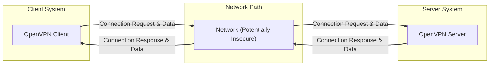
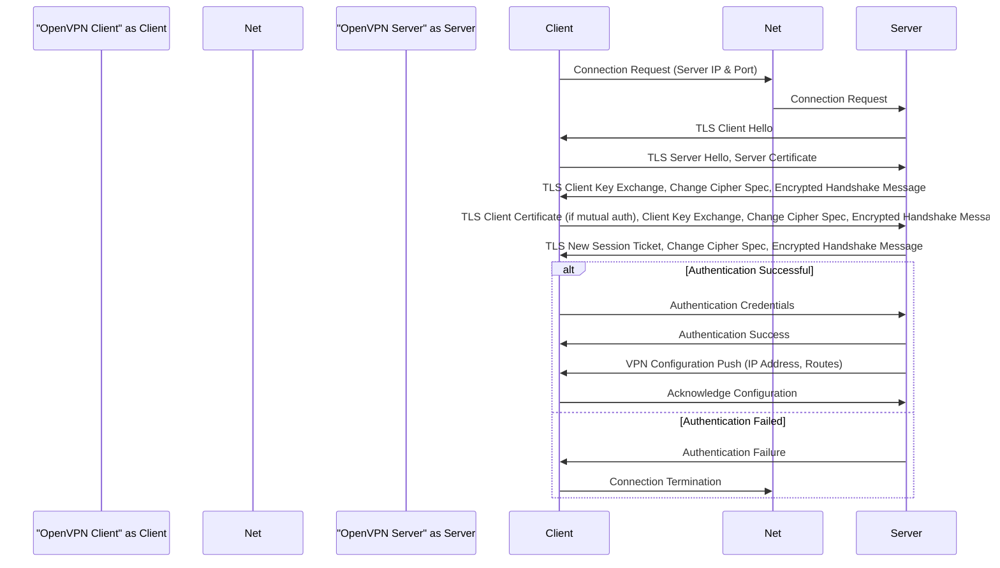
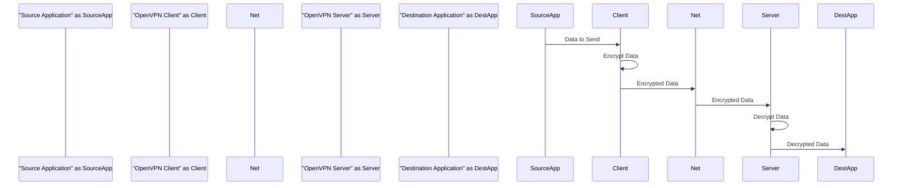

# Project Design Document: OpenVPN (Improved)

**Version:** 1.1
**Date:** October 26, 2023
**Author:** Gemini (AI Language Model)

## 1. Introduction

This document provides an enhanced design overview of the OpenVPN project, specifically tailored for use in subsequent threat modeling activities. It details the architecture, key components, and data flows within the system, highlighting security-relevant aspects.

## 2. Goals and Objectives

The primary goals of OpenVPN are to:

*   Establish secure, encrypted tunnels between two or more endpoints, ensuring confidentiality and integrity of data in transit.
*   Provide secure remote access to private networks for authorized users.
*   Enable secure site-to-site VPN connections, linking geographically dispersed networks.
*   Offer a highly flexible and configurable VPN solution adaptable to various network environments.
*   Support a wide range of authentication and encryption methods, allowing for tailored security configurations.

## 3. Scope

This design document focuses on the core functional and security aspects of OpenVPN, including:

*   The OpenVPN client application and its core functionalities.
*   The OpenVPN server application and its core functionalities.
*   The underlying TLS/SSL protocol and its role in secure communication establishment and maintenance.
*   Key configuration parameters and their direct impact on the security posture of the VPN.
*   Detailed data flow diagrams illustrating connection establishment, authentication, and data transfer processes.
*   Consideration of both UDP and TCP transport protocols.

This document does not cover:

*   Specific graphical user interface (GUI) implementations for OpenVPN clients or servers.
*   Advanced and complex routing configurations beyond the fundamental VPN tunneling.
*   Third-party integrations, plugins, or extensions to the core OpenVPN functionality.
*   Specific deployment scenarios or infrastructure details (e.g., cloud deployments, network hardware).

## 4. High-Level Architecture

OpenVPN operates on a client-server model, where a client application initiates a secure connection to a server application.

## 5. Detailed Component Description

### 5.1. OpenVPN Client Application

The OpenVPN client application is responsible for the following key functions:

*   **Configuration Parsing:** Reading and interpreting the client configuration file, which dictates connection parameters and security settings.
*   **Connection Initiation:** Initiating a connection request to the specified OpenVPN server address and port.
*   **TLS/SSL Handshake:** Performing the TLS/SSL handshake with the server to establish a secure, encrypted channel. This includes certificate exchange and verification.
*   **Authentication:** Authenticating with the server using the configured method, such as username/password, pre-shared keys, or client certificates.
*   **Tunnel Establishment:** Establishing the secure VPN tunnel after successful authentication and negotiation.
*   **Encryption/Decryption:** Encrypting outgoing data before sending it through the tunnel and decrypting incoming data received through the tunnel.
*   **Virtual Interface Management:** Creating and managing a virtual network interface through which VPN traffic is routed.
*   **Routing:** Directing network traffic intended for the VPN through the established tunnel.

### 5.2. OpenVPN Server Application

The OpenVPN server application is responsible for the following key functions:

*   **Listening for Connections:** Listening for incoming connection requests from OpenVPN clients on a specified port.
*   **Configuration Parsing:** Reading and interpreting the server configuration file, which defines server behavior, security policies, and client access rules.
*   **TLS/SSL Handshake:** Performing the TLS/SSL handshake with connecting clients, presenting its server certificate for verification.
*   **Client Authentication:** Authenticating connecting clients based on the configured authentication methods.
*   **IP Address Assignment:** Assigning virtual IP addresses to successfully authenticated clients within the VPN network.
*   **Tunnel Establishment:** Establishing the secure VPN tunnel with authenticated clients.
*   **Encryption/Decryption:** Encrypting outgoing data destined for clients and decrypting incoming data from clients.
*   **Virtual Interface Management:** Managing a virtual network interface for the VPN server.
*   **Routing:** Routing traffic between the VPN tunnel and the server's local network or other configured networks.
*   **Access Control:** Enforcing access control policies based on client configurations and server settings.

### 5.3. TLS/SSL Protocol Implementation

OpenVPN leverages the TLS/SSL protocol (typically through OpenSSL or a similar library) to provide:

*   **Secure Channel Establishment:** Creating an encrypted and authenticated communication channel between the client and server.
*   **Mutual Authentication (Optional):** Verifying the identity of both the client and the server through certificate exchange.
*   **Key Exchange:** Securely negotiating and exchanging cryptographic keys for symmetric encryption of VPN traffic.
*   **Encryption:** Encrypting data transmitted over the VPN tunnel to ensure confidentiality.
*   **Integrity Protection:** Ensuring the integrity of data transmitted over the VPN tunnel, preventing tampering.

### 5.4. Configuration Files (Client and Server)

Configuration files are crucial for defining the behavior and security settings of both the client and server. Key configuration parameters include:

*   **Network Settings:**
    *   Server address and port.
    *   Protocol (UDP or TCP).
    *   Local and remote network configurations.
*   **Security Settings:**
    *   Encryption cipher (e.g., AES-256-GCM, CHACHA20-POLY1305).
    *   Authentication method (e.g., `tls-auth`, `username/password`, `pki`).
    *   Certificate Authority (CA) certificate for verifying peer certificates.
    *   Server certificate and private key.
    *   Client certificate and private key (for mutual authentication).
    *   TLS authentication key (`tls-auth`) for HMAC firewall.
    *   TLS cipher list for specifying allowed TLS ciphers.
    *   TLS version minimum and maximum.
*   **Tunnel Settings:**
    *   Virtual network configuration (IP address ranges).
    *   Routing directives (push routes, redirect-gateway).
    *   Compression settings.
*   **User Management (Server):**
    *   Configuration for user authentication (e.g., PAM integration, authentication scripts).

## 6. Data Flow Diagrams

### 6.1. Connection Establishment and Authentication (Simplified)

### 6.2. Data Transfer Through Established Tunnel

## 7. Security Considerations and Potential Threats

This section outlines key security considerations and potential threats relevant to OpenVPN deployments:

*   **Authentication Vulnerabilities:**
    *   **Weak Passwords:** Susceptible to brute-force attacks if password-based authentication is used with weak passwords.
    *   **Compromised Credentials:** If user credentials are leaked or stolen, unauthorized access is possible.
    *   **Lack of Multi-Factor Authentication (MFA):** Absence of MFA increases the risk of unauthorized access even with strong passwords.
    *   **Insecure Key Storage:** If private keys for certificate-based authentication are stored insecurely, they can be compromised.
*   **Encryption Weaknesses:**
    *   **Use of Weak or Obsolete Ciphers:** Configuring OpenVPN to use weak or outdated encryption algorithms can be exploited.
    *   **Downgrade Attacks:** Potential for attackers to force the use of weaker encryption ciphers during the TLS handshake.
    *   **Implementation Flaws in Encryption Libraries:** Vulnerabilities in the underlying TLS/SSL library (e.g., OpenSSL) can compromise encryption.
*   **TLS/SSL Protocol Exploits:**
    *   **Known TLS Vulnerabilities:** Susceptibility to known vulnerabilities in the TLS protocol if OpenVPN and its underlying libraries are not updated.
    *   **Man-in-the-Middle (MitM) Attacks:** While TLS aims to prevent this, misconfigurations or lack of proper certificate verification can make it possible.
*   **Configuration Issues:**
    *   **Insecure Configuration Files:** If configuration files are not properly secured, attackers might modify them to gain unauthorized access or disrupt the VPN.
    *   **Permissive Firewall Rules:** Overly permissive firewall rules on the server can expose the VPN to unnecessary risks.
    *   **Default Configurations:** Using default configurations without proper hardening can leave the VPN vulnerable.
*   **Denial of Service (DoS) Attacks:**
    *   **Resource Exhaustion:** Attackers might flood the server with connection requests to exhaust resources and prevent legitimate users from connecting.
    *   **Amplification Attacks:** Exploiting UDP protocol characteristics to amplify attack traffic towards the server.
    *   **TLS Renegotiation Attacks:** (Mitigated in modern versions but a historical concern).
*   **Key Management Risks:**
    *   **Insecure Key Generation:** Weakly generated keys can be more easily compromised.
    *   **Lack of Key Rotation:** Infrequent key rotation increases the window of opportunity for attackers if keys are compromised.
    *   **Insecure Key Exchange:** Vulnerabilities in the key exchange process during TLS handshake.
*   **Software Vulnerabilities:**
    *   **Bugs in OpenVPN Code:** Potential for vulnerabilities in the OpenVPN codebase itself that could be exploited.
    *   **Dependencies Vulnerabilities:** Vulnerabilities in libraries that OpenVPN depends on.
*   **Side-Channel Attacks:** (More theoretical but worth noting)
    *   Exploiting information leaked through timing variations or other side channels.

## 8. Deployment Considerations with Security Implications

*   **Operating System Hardening:** The security of the underlying operating system hosting the OpenVPN server is crucial.
*   **Firewall Configuration:** Properly configured firewalls on both the client and server networks are essential to restrict access and prevent unauthorized connections.
*   **Network Segmentation:** Isolating the VPN server and the VPN network segment can limit the impact of a potential breach.
*   **Regular Updates and Patching:** Keeping the OpenVPN software and all underlying libraries up-to-date is critical for addressing known vulnerabilities.
*   **Monitoring and Logging:** Implementing robust monitoring and logging mechanisms can help detect and respond to security incidents.
*   **Certificate Management:** Establishing a proper process for generating, distributing, and revoking certificates is vital for certificate-based authentication.
*   **Load Balancing and High Availability:** While improving availability, these configurations also need careful security consideration to avoid introducing new attack vectors.

## 9. Future Considerations

*   Exploring integration with more modern authentication frameworks and protocols (e.g., OAuth 2.0, SAML).
*   Investigating hardware acceleration for cryptographic operations to improve performance.
*   Enhancements to logging and auditing capabilities for better security monitoring.
*   Further improvements to the resilience against denial-of-service attacks.
*   Adoption of post-quantum cryptography algorithms as they become standardized and practical.
