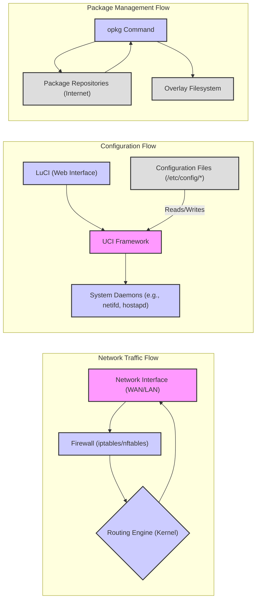

# Project Design Document: OpenWrt

**Version:** 1.1
**Date:** October 26, 2023
**Author:** AI Software Architect

## 1. Introduction

This document provides an enhanced and more detailed architectural design of the OpenWrt project. It aims to offer a comprehensive understanding of the system's components, their interactions, and the overall structure, specifically tailored for threat modeling purposes.

### 1.1. Purpose

The primary purpose of this document is to provide a clear, concise, and in-depth description of the OpenWrt architecture. This detailed description will serve as the foundational input for a thorough threat modeling exercise, enabling the identification of potential security vulnerabilities and risks within the system.

### 1.2. Scope

This document encompasses the core architectural components of OpenWrt, including the operating system kernel, key system services, configuration mechanisms, user interfaces (both web and command-line), and the package management system. It focuses on the software aspects of OpenWrt and does not delve into the specifics of the diverse range of underlying hardware platforms it supports, except where hardware interaction is directly relevant to software functionality.

### 1.3. Goals

* Provide an exceptionally clear and easily understandable overview of the OpenWrt architecture, suitable for both technical and security audiences.
* Identify and describe the major components and their specific responsibilities within the system.
* Detail the interactions and data flow between these components, highlighting critical pathways.
* Emphasize key security-relevant aspects of the design, setting the stage for targeted threat analysis.
* Serve as a reliable, up-to-date, and comprehensive reference for subsequent threat modeling activities.

## 2. System Overview

OpenWrt is a highly extensible and customizable embedded Linux distribution. Its primary use is on embedded devices, particularly wireless routers, to provide advanced network routing and management capabilities. It offers a complete Linux operating system environment, including a robust package management system, empowering users to extensively tailor the system to meet specific requirements.

### 2.1. High-Level Architecture

OpenWrt's architecture is structured in a layered approach, promoting modularity and maintainability:

* **Hardware Abstraction Layer (HAL):** This layer interfaces directly with the underlying hardware. The Linux kernel is the central component here, providing device drivers and managing hardware resources.
* **Operating System Core:** This layer comprises the fundamental components of the operating system: the Linux kernel, core system libraries (typically uClibc-ng or musl for resource efficiency), and essential system utilities provided by Busybox.
* **Configuration and Management Layer:** This layer is responsible for system configuration, network management, and providing user interfaces for administration. Key components include UCI (Unified Configuration Interface) and LuCI (the web interface).
* **Application Layer:** This layer includes the various applications and services that run on top of the core system. Examples include network daemons (dnsmasq, hostapd, OpenVPN), system monitoring tools, and user-installed packages.
* **Overlay Filesystem:** OpenWrt utilizes an overlay filesystem, merging a read-only base filesystem (squashfs) with a read-write layer (jffs2 or ubifs). This allows for persistent changes while maintaining a clean base system.

## 3. Detailed Component Description

This section provides a more in-depth description of the key components within the OpenWrt architecture.

### 3.1. Linux Kernel

* The core of the operating system, responsible for fundamental tasks such as process management, memory management, and device driver interaction.
* Provides the core networking stack, including implementation of TCP/IP protocols, routing functionalities, and the netfilter framework (iptables/nftables) for firewalling.
* Implements security features such as user and group permissions, process isolation (namespaces, cgroups), and memory protection mechanisms.

### 3.2. Busybox

* A single executable that provides a multitude of standard Unix utilities, offering a space-efficient alternative to individual full-fledged utilities.
* Includes essential commands for file system manipulation, system administration tasks, and basic networking operations.

### 3.3. UCI (Unified Configuration Interface)

* OpenWrt's central and abstract configuration system. It decouples the logical configuration from the physical implementation details.
* Provides a consistent and standardized way to manage system settings across various components and applications.
* Configuration data is stored in human-readable text files, typically located in the `/etc/config/` directory.
* Includes a command-line utility (`uci`) for programmatically accessing, modifying, and managing configuration parameters.

### 3.4. LuCI

* The primary web-based user interface for OpenWrt administration and management.
* Built using the Lua programming language and follows a Model-View-Controller (MVC) architectural pattern.
* Interacts with the UCI framework to read and apply system configuration changes.
* Offers a modular design with various applications (modules) for network configuration, system administration, package management, and status monitoring.

### 3.5. Netifd

* The network interface management daemon responsible for configuring and managing network interfaces.
* Handles tasks such as assigning IP addresses (static or DHCP), configuring VLANs, and setting up routing tables.
* Interacts directly with the Linux kernel's networking stack to apply configuration changes.
* Relies on the UCI framework for its configuration.

### 3.6. Firewall (iptables/nftables)

* Implements the firewall functionality, controlling network traffic flow based on defined rules.
* Uses rule sets to filter network packets based on various criteria, including source and destination IP addresses, ports, and protocols.
* Configuration is managed through UCI, which generates the underlying `iptables` or `nftables` rules.
* `iptables` is the older, established firewall framework, while `nftables` is a more modern and flexible alternative offering improved performance and syntax.

### 3.7. DNS Resolver (dnsmasq/Unbound)

* Provides Domain Name System (DNS) resolution services, translating domain names into IP addresses.
* Often includes a lightweight DHCP server component.
* `dnsmasq` is a popular, lightweight option commonly used in OpenWrt for both DNS and DHCP.
* `Unbound` is a more feature-rich, validating, recursive, and caching DNS resolver, offering enhanced security.
* Configuration is typically managed through UCI.

### 3.8. DHCP Server (dnsmasq/odhcpd)

* Responsible for dynamically assigning IP addresses and other network configuration parameters to client devices on the local network.
* `dnsmasq` often serves as both the DNS resolver and DHCP server in OpenWrt.
* `odhcpd` is a lightweight DHCPv6 server daemon specifically designed for OpenWrt, handling IPv6 address assignment.
* Configuration is managed through UCI.

### 3.9. Wireless Daemon (hostapd/wpa_supplicant)

* `hostapd`: Implements access point functionality, enabling the OpenWrt device to act as a Wi-Fi hotspot, allowing other devices to connect wirelessly.
* `wpa_supplicant`: Used for connecting the OpenWrt device to existing Wi-Fi networks as a client. It handles authentication and key management for wireless connections.
* Configuration for both daemons is managed through UCI, defining wireless network parameters such as SSID, security protocols, and passwords.

### 3.10. Package Manager (opkg)

* A lightweight package management system used to install, update, and remove software packages on the OpenWrt system.
* Downloads packages from configured software repositories (online servers containing pre-compiled software).
* Manages dependencies between packages, ensuring that required libraries and components are installed.
* Represents a potential security risk if package sources are compromised or if packages contain vulnerabilities.

### 3.11. Bootloader (e.g., U-Boot)

* The first software to execute when the device is powered on.
* Responsible for initializing the hardware components of the device, including memory and peripherals.
* Loads the Linux kernel and initial ramdisk (initramfs) into memory and starts the kernel execution.
* May provide functionalities for firmware recovery and flashing new firmware images.
* Security vulnerabilities in the bootloader can have critical consequences, potentially allowing for persistent compromise of the device.

### 3.12. Overlay Filesystem

* OpenWrt utilizes an overlay filesystem, typically combining a read-only squashfs filesystem containing the base system with a read-write JFFS2 or UBIFS partition.
* This allows for persistent changes to the filesystem (e.g., installed packages, modified configurations) while keeping the base system image intact.
* The overlay filesystem mechanism is crucial for OpenWrt's update and rollback capabilities.

### 3.13. OpenWrt Build System (Not a runtime component, but crucial for understanding the system)

* A set of scripts and tools used to build custom OpenWrt firmware images.
* Allows users to select specific packages, kernel modules, and configurations to create tailored firmware images.
* Understanding the build system is important for assessing the security of the firmware creation process.

## 4. Data Flow

This section illustrates the typical flow of data through the OpenWrt system, highlighting key interaction points.

### 4.1. Network Traffic Flow (Detailed)

* Network packets enter the system through a physical network interface (e.g., Ethernet port, Wi-Fi adapter).
* The firewall, implemented using `iptables` or `nftables` rules within the kernel, inspects the packets based on pre-configured rules.
* The kernel's routing engine determines the appropriate next hop for the packet based on the destination IP address and routing table entries.
* The packet is then forwarded out through the designated network interface.

### 4.2. Configuration Flow (Detailed)

* Users interact with the system either through the LuCI web interface or by using the `uci` command-line tool directly.
* Configuration changes made through LuCI are translated into `uci` commands and written to the corresponding configuration files located in `/etc/config/`.
* System daemons (such as `netifd`, `hostapd`, `dnsmasq`) either monitor these configuration files for changes or are notified of changes through mechanisms like hotplug events.
* Upon detecting changes, these daemons parse the configuration files and apply the new settings, often interacting with the kernel or other system components to implement the changes.

### 4.3. Package Management Flow (Detailed)

* When a user initiates a package installation, update, or removal using the `opkg` command, `opkg` contacts the configured package repositories (typically remote servers).
* `opkg` downloads package lists and the actual package binaries from these repositories.
* Upon successful download, `opkg` installs the package files onto the read-write overlay filesystem, making the software available for use.
* `opkg` also manages package dependencies, ensuring that any required libraries or other packages are also installed.

## 5. Security Considerations

This section expands on the security aspects of the OpenWrt architecture, highlighting potential areas of concern for threat modeling.

* **Kernel Vulnerabilities:** Exploits in the Linux kernel can grant attackers complete control over the system. Regular kernel updates are crucial.
* **Firewall Misconfiguration:** Incorrectly configured firewall rules can create unintended openings, allowing unauthorized network access.
* **LuCI Security:** Vulnerabilities in the LuCI web interface (e.g., cross-site scripting, authentication bypasses) can allow remote attackers to compromise the device. Secure coding practices and regular updates are essential.
* **UCI Configuration Security:**  While UCI files are generally readable by the `root` user, vulnerabilities in daemons parsing these files could lead to privilege escalation if malformed configurations are processed.
* **Package Repository Integrity:** Compromised package repositories can distribute malicious software to OpenWrt devices. Using trusted and verified repositories is vital. Package signing mechanisms help mitigate this risk.
* **Bootloader Security:** A compromised bootloader can allow attackers to install persistent malware or prevent legitimate firmware updates. Secure boot mechanisms can help mitigate this.
* **Default Credentials:** Using default or weak passwords for the LuCI interface or SSH access is a significant security risk. Strong, unique passwords should always be enforced.
* **Software Update Process:** A secure and reliable software update mechanism is crucial for patching vulnerabilities promptly. The update process itself should be protected from tampering.
* **Remote Management Security:**  Remote access protocols like SSH should be secured with strong authentication mechanisms (e.g., key-based authentication) and should be the only exposed management interface.
* **Supply Chain Security:** The security of the tools and processes used to build OpenWrt firmware is important. Compromises in the build system could lead to backdoored firmware images.
* **Data at Rest Encryption:** Sensitive configuration data or user data stored on the device may require encryption to protect against unauthorized access if the device is physically compromised.
* **Input Validation:**  All components that process external input (e.g., network data, user input in LuCI) must implement robust input validation to prevent injection attacks.

## 6. Deployment Model

OpenWrt's versatility allows for deployment in various scenarios:

* **Residential Wireless Routers:** The most common use case, providing advanced features beyond stock firmware.
* **Small Office/Home Office (SOHO) Gateways:**  Used to connect local networks to the internet, often with VPN capabilities.
* **Industrial Gateways:** Deployed in industrial environments for network connectivity and management.
* **IoT Devices:** Increasingly used as the operating system for custom IoT devices requiring network connectivity and processing.
* **Virtual Machines/Containers:** Can be run in virtualized environments for testing or specific network functions.
* **Software-Defined Networking (SDN) Environments:** Used as a lightweight operating system for network devices in SDN deployments.

## 7. Technologies Used

* **Operating System:** Linux
* **Core Libraries:** uClibc-ng or musl
* **System Utilities:** Busybox
* **Configuration System:** UCI (Unified Configuration Interface)
* **Web Interface:** LuCI (Lua based)
* **Firewall:** iptables or nftables
* **DNS Resolver/DHCP Server:** dnsmasq or Unbound/odhcpd
* **Wireless Daemon:** hostapd/wpa_supplicant
* **Package Manager:** opkg
* **Bootloader:** Typically U-Boot or vendor-specific bootloaders
* **Filesystem:** squashfs (read-only base), jffs2 or UBIFS (read-write overlay)
* **Programming Languages:** C (kernel, core utilities), Lua (LuCI), Shell scripting (build system, system scripts)

## 8. Diagrams

This section includes visual representations of the OpenWrt architecture.

### 8.1. High-Level Component Diagram

```mermaid
graph LR
    subgraph "OpenWrt System"
        A["Linux Kernel"]
        B["Busybox"]
        C["UCI"]
        D["LuCI"]
        E["Netifd"]
        F["Firewall (iptables/nftables)"]
        G["DNS Resolver (dnsmasq/Unbound)"]
        H["DHCP Server (dnsmasq/odhcpd)"]
        I["Wireless Daemon (hostapd/wpa_supplicant)"]
        J["opkg"]
        K["Bootloader"]
        L["Overlay Filesystem"]
    end

    style A fill:#f9f,stroke:#333,stroke-width:2px
    style B fill:#ccf,stroke:#333,stroke-width:2px
    style C fill:#f9f,stroke:#333,stroke-width:2px
    style D fill:#ccf,stroke:#333,stroke-width:2px
    style E fill:#ccf,stroke:#333,stroke-width:2px
    style F fill:#ccf,stroke:#333,stroke-width:2px
    style G fill:#ccf,stroke:#333,stroke-width:2px
    style H fill:#ccf,stroke:#333,stroke-width:2px
    style I fill:#ccf,stroke:#333,stroke-width:2px
    style J fill:#ccf,stroke:#333,stroke-width:2px
    style K fill:#ddd,stroke:#333,stroke-width:2px
    style L fill:#ddd,stroke:#333,stroke-width:2px
```

## 9. Conclusion

This enhanced design document provides a more detailed and comprehensive understanding of the OpenWrt architecture. By elaborating on the individual components, their interactions, and the underlying data flows, this document serves as a robust foundation for conducting a thorough and effective threat modeling exercise. The detailed security considerations outlined here will further guide the identification and mitigation of potential vulnerabilities within the OpenWrt ecosystem.