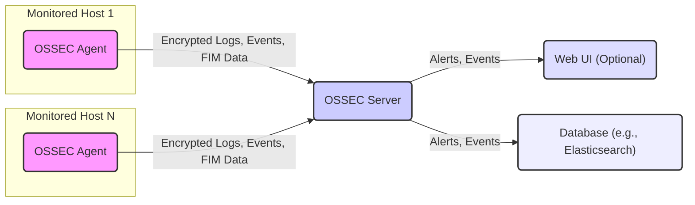

## Project Design Document: OSSEC HIDS (Improved)

**1. Introduction**

This document provides an enhanced and detailed design overview of the OSSEC Host-based Intrusion Detection System (HIDS). It elaborates on the system's architecture, key components, data flow, and security considerations, offering a more comprehensive foundation for subsequent threat modeling activities.

**2. Goals**

*   Provide a more in-depth understanding of the OSSEC architecture and its functionalities.
*   Clearly identify key components, their responsibilities, and interactions.
*   Detail the data flow within the system, including data transformation and processing.
*   Highlight specific security considerations and potential threats relevant for threat modeling.

**3. Target Audience**

This document is intended for:

*   Security architects and engineers involved in designing and securing systems.
*   Software developers contributing to or integrating with OSSEC.
*   Threat modeling practitioners seeking a detailed understanding of the system's attack surface.
*   System administrators responsible for deploying and managing OSSEC.

**4. System Overview**

OSSEC is a powerful and versatile open-source HIDS designed for scalability and comprehensive security monitoring. It employs an agent-server architecture, where lightweight agents deployed on monitored hosts collect and forward security-relevant data to a central server for analysis, correlation, and alerting. Key functionalities include log analysis, file integrity monitoring (FIM), rootkit detection, process monitoring, and active response capabilities.



**5. Component Details**

*   **OSSEC Agent:**
    *   Deployed on each host requiring monitoring.
    *   Primary responsibility is the secure collection of security-relevant data:
        *   **System Logs:** Extracts and forwards logs from operating systems (e.g., syslog, Windows Event Logs).
        *   **Application Logs:** Collects logs from various applications running on the host.
        *   **File Integrity Monitoring (FIM):** Monitors specified files and directories for unauthorized changes, tracking modifications, additions, and deletions.
        *   **Rootkit Detection:** Performs checks for known and suspected rootkit signatures and behaviors.
        *   **Process Monitoring:** Tracks running processes, identifying suspicious or unauthorized activity.
        *   **Network Activity (Optional):** Can monitor network connections and traffic.
    *   Configuration can be managed:
        *   **Locally:** Configuration files reside on the agent host.
        *   **Server-Pushed:** The server centrally manages and distributes agent configurations.
    *   Communicates with the OSSEC server using an encrypted and authenticated channel, typically over TCP.
    *   Performs initial data filtering and normalization before transmission to reduce server load.

*   **OSSEC Server:**
    *   The central hub for receiving, processing, and analyzing data from all connected agents.
    *   Key functions include:
        *   **Log Analysis:** Employs a rule-based engine to analyze received logs, identifying patterns and anomalies indicative of security threats.
        *   **Event Correlation:** Correlates events from multiple agents to detect broader attack patterns.
        *   **Alert Generation:** Triggers alerts based on matched rules and detected security incidents.
        *   **Agent Management:** (Optional) Centrally manages agent configurations, updates, and status.
        *   **API:** Provides an interface for integrating with other security tools and systems (e.g., SIEM, ticketing systems).
        *   **Alert and Event Storage:** Stores generated alerts and raw events in a database or flat files for historical analysis and reporting.
        *   **Active Response:** Can initiate automated responses to detected threats (e.g., blocking an IP address using firewall rules).

*   **Web UI (Optional):**
    *   Provides a user-friendly graphical interface for interacting with the OSSEC server.
    *   Key features include:
        *   **Alert Visualization:** Displays generated alerts with details and context.
        *   **Event Browsing:** Allows users to search and examine raw events received from agents.
        *   **Agent Status Monitoring:** Provides an overview of connected agents and their status.
        *   **Rule Management:** (Potentially) Enables users to view and manage the rule set.
        *   **Configuration Management:** (Potentially) Allows for managing server and agent configurations.
    *   Typically requires authentication and authorization to access, employing methods such as:
        *   Username/Password authentication.
        *   Integration with existing authentication systems (e.g., LDAP, Active Directory).

*   **Database (Optional):**
    *   Used for persistent storage of alerts, events, and potentially configuration data.
    *   Offers advantages over flat files, such as:
        *   Efficient searching and querying of historical data.
        *   Improved scalability for large deployments.
        *   Enhanced reporting capabilities.
    *   Common database choices include Elasticsearch, but other relational or NoSQL databases can be used.

**6. Data Flow**

The data flow within OSSEC is a critical aspect for understanding its operation and potential vulnerabilities.

```mermaid
graph LR
    A("Monitored Host") -->|1. Security Events (Logs, File Changes, etc.)| B("OSSEC Agent")
    B -->|2. Data Collection, Filtering, Normalization| C("Secure Channel (e.g., TLS)")
    C -->|3. Encrypted Logs and Events| D("OSSEC Server")
    D -->|4. Rule-Based Analysis, Correlation| E("Alert Generation")
    E -->|5. Alerts and Enriched Events| F("Database/Log Files")
    E -->|6. Real-time Alerts| G("Web UI")
    D -->|7. Agent Configuration (Server-Pushed)| B
    D -->|8. Active Response Commands| H("Firewall, System")
    style A fill:#eee,stroke:#333,stroke-width:2px
    style B fill:#f9f,stroke:#333,stroke-width:2px
    style C stroke:#00f,stroke-width:2px,stroke-dasharray: 5 5
    style D fill:#ccf,stroke:#333,stroke-width:2px
    style E fill:#ffc,stroke:#333,stroke-width:2px
    style F fill:#eef,stroke:#333,stroke-width:2px
    style G fill:#ddf,stroke:#333,stroke-width:2px
    style H fill:#aaf,stroke:#333,stroke-width:2px
```

**Detailed Data Flow Steps:**

*   **Step 1: Security Event Generation:** Security-relevant events occur on the monitored host, such as log entries, file system modifications, process executions, etc.
*   **Step 2: Agent Collection and Pre-processing:** The OSSEC agent collects these events based on its configuration. It performs initial filtering (e.g., ignoring irrelevant logs) and normalization (e.g., standardizing log formats).
*   **Step 3: Secure Transmission:** The agent establishes a secure, encrypted channel (typically using TLS/SSL) with the OSSEC server.
*   **Step 4: Encrypted Data Transmission:** The collected and pre-processed data is transmitted securely to the OSSEC server.
*   **Step 5: Server Analysis and Correlation:** The OSSEC server receives the data and applies its rule-based analysis engine to identify potential security incidents. It can also correlate events from multiple agents.
*   **Step 6: Alert Generation:** When a rule is triggered, an alert is generated, containing details about the event and the matched rule. The original event may be enriched with additional information.
*   **Step 7: Alert and Event Storage:** Generated alerts and the corresponding (potentially enriched) events are stored in the configured database or log files.
*   **Step 8: Real-time Alert Display:** The Web UI (if deployed) can display alerts in real-time as they are generated by the server.
*   **Step 9: Server-Pushed Configuration:** The OSSEC server can push configuration updates to the agents, allowing for centralized management.
*   **Step 10: Active Response:** Upon detecting certain threats, the OSSEC server can trigger active responses, such as executing commands to block an IP address on a firewall or disable a user account.

**7. Security Considerations**

Understanding the security considerations for each component and the data flow is crucial for effective threat modeling.

*   **OSSEC Agent Security:**
    *   **Integrity:**
        *   Threat: Agent tampering to disable monitoring or report false data.
        *   Mitigation: Employ secure software distribution methods, utilize file integrity monitoring on the agent itself, and implement secure boot processes.
    *   **Confidentiality:**
        *   Threat: Unauthorized access to sensitive data collected by the agent before encryption.
        *   Mitigation: Minimize the storage of sensitive data locally, ensure proper file system permissions, and utilize memory protection techniques.
    *   **Authentication:**
        *   Threat: Unauthorized agents connecting to the server or impersonating legitimate agents.
        *   Mitigation: Utilize strong authentication mechanisms (e.g., key-based authentication) between agents and the server.
    *   **Authorization:**
        *   Threat: Agents collecting or transmitting data beyond their intended scope.
        *   Mitigation: Implement granular configuration options and enforce least privilege principles for data collection.

*   **OSSEC Server Security:**
    *   **Integrity:**
        *   Threat: Compromise of the server leading to manipulation of rules, configurations, or stored data.
        *   Mitigation: Implement strong access controls, regularly patch the server operating system and OSSEC software, and utilize file integrity monitoring.
    *   **Confidentiality:**
        *   Threat: Unauthorized access to stored logs and alerts containing sensitive information.
        *   Mitigation: Implement strong access controls, encrypt data at rest, and utilize secure logging practices.
    *   **Availability:**
        *   Threat: Denial-of-service attacks targeting the server, preventing it from receiving and analyzing data.
        *   Mitigation: Implement network security measures, utilize load balancing and redundancy, and ensure sufficient system resources.
    *   **Authentication & Authorization:**
        *   Threat: Unauthorized access to the server's management interface or API.
        *   Mitigation: Enforce strong password policies, utilize multi-factor authentication, and implement role-based access control.
    *   **Input Validation:**
        *   Threat: Malicious log data from compromised agents potentially exploiting vulnerabilities in the server's parsing logic.
        *   Mitigation: Implement robust input validation and sanitization techniques.

*   **Communication Channel Security:**
    *   **Confidentiality:**
        *   Threat: Interception of communication between agents and the server, exposing sensitive log data.
        *   Mitigation: Enforce the use of strong encryption protocols (e.g., TLS 1.2 or higher) for all communication.
    *   **Integrity:**
        *   Threat: Tampering with data in transit between agents and the server.
        *   Mitigation: Utilize secure communication protocols that provide data integrity checks.
    *   **Authentication:**
        *   Threat: Man-in-the-middle attacks where an attacker intercepts and potentially modifies communication.
        *   Mitigation: Implement mutual authentication between agents and the server.

*   **Web UI Security:**
    *   **Authentication:**
        *   Threat: Unauthorized access to the Web UI.
        *   Mitigation: Enforce strong password policies, utilize multi-factor authentication, and consider integration with existing identity providers.
    *   **Authorization:**
        *   Threat: Users gaining access to features or data they are not authorized to view or modify.
        *   Mitigation: Implement role-based access control to restrict user privileges.
    *   **Common Web Vulnerabilities:**
        *   Threat: Exploitation of vulnerabilities such as Cross-Site Scripting (XSS), Cross-Site Request Forgery (CSRF), and SQL Injection.
        *   Mitigation: Follow secure coding practices, regularly update the Web UI software, and implement appropriate security headers and input validation.

*   **Database Security:**
    *   **Access Control:**
        *   Threat: Unauthorized access to the database containing sensitive alerts and events.
        *   Mitigation: Implement strong authentication and authorization mechanisms for database access, restrict network access, and regularly audit access logs.
    *   **Confidentiality:**
        *   Threat: Exposure of sensitive data stored in the database.
        *   Mitigation: Encrypt data at rest and in transit to the database.

**8. Deployment Considerations**

*   **Deployment Models:**
    *   **Centralized Server:** A single OSSEC server manages all agents, simplifying management for smaller to medium-sized environments.
    *   **Distributed Deployment:** Multiple OSSEC servers are used for scalability and redundancy in larger environments. Agents can be grouped and assigned to specific servers or utilize load balancing.
*   **Agent Deployment Methods:**
    *   **Manual Installation:** Agents are installed and configured individually on each host.
    *   **Scripted Installation:** Automated scripts are used to deploy agents across multiple hosts.
    *   **Configuration Management Tools:** Tools like Ansible, Puppet, or Chef are used to automate agent deployment and configuration management.
*   **Server Sizing and Resource Allocation:** Proper planning for server resources (CPU, memory, storage) is crucial based on the number of agents and the volume of data being processed.

**9. Future Considerations**

*   Enhanced integration with cloud platforms and services.
*   Improved threat intelligence feed integration for more accurate detection.
*   Advanced analytics and machine learning capabilities for anomaly detection.
*   Containerization of server and agent components for easier deployment and management.
*   Integration with orchestration platforms like Kubernetes for dynamic scaling.

This improved design document provides a more detailed and comprehensive understanding of the OSSEC HIDS architecture, data flow, and security considerations. This enhanced information will be invaluable for conducting thorough threat modeling exercises and implementing robust security measures.
