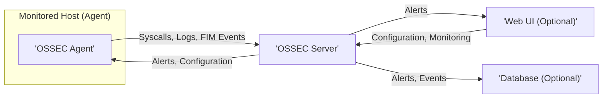
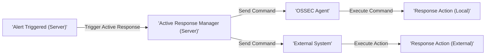

# Project Design Document: OSSEC HIDS (Improved)

**Document Version:** 1.1
**Date:** October 26, 2023
**Author:** AI Software Architect

## 1. Introduction

This document provides an improved and detailed architectural design of the OSSEC HIDS (Host-based Intrusion Detection System) project, based on the open-source project found at [https://github.com/ossec/ossec-hids](https://github.com/ossec/ossec-hids). This document is specifically tailored to serve as a robust foundation for subsequent threat modeling activities, offering a clear and comprehensive understanding of the system's components, their interactions, and the flow of data.

## 2. Goals and Objectives

The fundamental goal of OSSEC is to deliver a comprehensive and versatile host-based intrusion detection system. Key objectives include:

*   **Comprehensive Log Analysis:** Aggregating and scrutinizing logs from diverse sources (operating system events, application logs) to pinpoint potentially malicious or anomalous activities.
*   **Robust File Integrity Monitoring (FIM):** Vigilantly monitoring critical files and directories for unauthorized modifications, which could indicate a compromise.
*   **Effective Rootkit Detection:** Employing various techniques to identify the presence of rootkits, which are designed to conceal malicious activity.
*   **Detailed Process Monitoring:** Tracking running processes to detect unusual or malicious behavior, such as unauthorized process execution.
*   **Automated Active Response:** Enabling the automatic triggering of predefined actions in response to detected threats, minimizing the impact of security incidents.
*   **Centralized Management and Monitoring:** Providing a centralized platform for managing and monitoring multiple OSSEC agents deployed across different hosts.

## 3. System Architecture

The OSSEC architecture is based on a client-server model, offering flexibility with optional components to suit various deployment needs.

### 3.1. High-Level Architecture



### 3.2. Detailed Component Architecture

This section provides a more granular view of the essential components within the OSSEC ecosystem.

*   **OSSEC Agent:**
    *   Deployed on each host being monitored.
    *   Primary responsibility is the collection of security-relevant data and its secure transmission to the central server.
    *   Performs localized analysis based on rules and configurations received from the server, enabling faster detection of certain threats.
    *   Capable of initiating local active responses to immediately mitigate specific threats.
    *   Key modules within the agent:
        *   `Logcollector`:  Configurable module responsible for gathering logs from various sources, including system logs, application logs, and custom log files.
        *   `Syscheck`:  Performs file integrity monitoring by periodically checking the attributes and hashes of critical files and directories.
        *   `Rootcheck`:  Detects the presence of rootkits by employing various techniques, such as checking for suspicious files, processes, and kernel modifications.
        *   `Process Monitoring`:  Monitors running processes, tracking their execution and resource usage to identify anomalies.
        *   `Local Analysis`:  Applies a subset of rules locally to collected data, allowing for rapid detection and response to common threats.
        *   `Agent Control`:  Manages the communication channel with the OSSEC server, handling registration, configuration updates, and command execution.
*   **OSSEC Server:**
    *   The central processing unit of the OSSEC deployment, responsible for aggregating and analyzing data received from all connected agents.
    *   Stores the global configuration and rule sets that govern the behavior of the entire system.
    *   Generates alerts based on the analysis of events, triggering notifications and potential active responses.
    *   Can initiate active responses either on the agents or on the server itself to counter detected threats.
    *   Key modules within the server:
        *   `Analysis Engine`:  The core of the server, responsible for processing incoming events and applying the defined rule sets to identify threats.
        *   `Rule Decoder`:  Parses raw log messages into structured data, making them easier for the rule engine to analyze. Decoders are essential for understanding diverse log formats.
        *   `Rule Engine`:  Matches the decoded events against a comprehensive set of predefined rules and user-defined rules to detect suspicious patterns and anomalies.
        *   `Alert Manager`:  Manages the generation, prioritization, and distribution of alerts based on triggered rules.
        *   `Active Response Manager`:  Orchestrates and executes configured active responses, either locally on the server or by sending commands to agents.
        *   `Configuration Manager`:  Handles the management and distribution of configuration settings to agents and the server itself.
        *   `Database Interface`:  Provides connectivity to the optional database for persistent storage of alerts, events, and other data, enhancing scalability and reporting capabilities.
*   **Web UI (Optional):**
    *   Provides a user-friendly graphical interface for managing and monitoring the OSSEC deployment.
    *   Allows administrators to view alerts, manage agents, configure the system, and generate reports.
    *   Typically interacts with the OSSEC server via a secure API or by accessing a shared data store.
*   **Database (Optional):**
    *   Used for the persistent storage of alerts, events, raw logs, and other relevant data.
    *   Significantly enhances performance and scalability, particularly in large deployments with numerous agents and high event volumes.
    *   Common database options include Elasticsearch, MySQL, PostgreSQL, and other compatible SQL or NoSQL databases.

## 4. Data Flow

This section meticulously outlines the movement of data within the OSSEC system, highlighting key pathways and transformations.

### 4.1. Log Collection and Analysis

```mermaid
graph LR
    subgraph "Monitored Host (Agent)"
        A["'Log Sources'"]
        B["'Logcollector'"]
        C["'Local Analysis'"]
    end
    D["'OSSEC Server'"]
    E["'Rule Decoder'"]
    F["'Rule Engine'"]
    G["'Alert Manager'"]

    A -- "Logs" --> B
    B -- "Raw Logs" --> C
    C -- "Analyzed Events" --> D
    D -- "Raw Logs" --> E
    E -- "Decoded Events" --> F
    F -- "Matched Rules" --> G
    G -- "Alerts" --> "User/System"
```

*   **Agent-Side Processing:**
    *   `Log Sources` on the monitored host generate a stream of log messages reflecting system and application activities.
    *   The `Logcollector` module on the agent diligently gathers these logs from configured sources.
    *   Optionally, the `Local Analysis` module can perform preliminary filtering or analysis based on a subset of rules, enabling immediate detection of certain threats.
    *   The agent securely transmits the collected (and potentially locally analyzed) logs to the central OSSEC server.
*   **Server-Side Processing:**
    *   The `OSSEC Server` receives the raw log data from the connected agents.
    *   The `Rule Decoder` module attempts to parse the unstructured log messages into a structured format based on predefined decoders. This is crucial for consistent analysis.
    *   The `Rule Engine` then compares these decoded events against a comprehensive set of defined rules.
    *   If a rule matches a specific event pattern, the `Alert Manager` generates a corresponding alert.
    *   These alerts are subsequently distributed to configured outputs, such as log files, the Web UI, or external security systems.

### 4.2. File Integrity Monitoring (FIM)

```mermaid
graph LR
    subgraph "Monitored Host (Agent)"
        A["'Monitored Files/Directories'"]
        B["'Syscheck'"]
    end
    C["'OSSEC Server'"]
    D["'FIM Database'"]
    E["'Analysis Engine'"]
    F["'Alert Manager'"]

    A -- "File Attributes" --> B
    B -- "File Hashes, Attributes" --> C
    C -- "Baseline Data" --> D
    B -- "Changes Detected" --> C
    C -- "Compare with Baseline" --> E
    E -- "Anomaly Detected" --> F
    F -- "Alerts" --> "User/System"
```

*   **Agent-Side Monitoring:**
    *   The `Syscheck` module on the agent is responsible for continuously monitoring designated files and directories for any modifications.
    *   It collects critical attributes like file size, modification timestamps, permissions, and cryptographic hashes to establish a baseline.
    *   This baseline information is securely transmitted to the OSSEC server.
*   **Server-Side Comparison and Alerting:**
    *   The `OSSEC Server` stores the initial "baseline" information about the monitored files and directories, often in an internal data store or the optional database.
    *   When the agent detects changes in the monitored files, it sends the updated attributes and hashes to the server.
    *   The `Analysis Engine` on the server compares the current attributes with the stored baseline.
    *   If significant changes are detected, indicating potential unauthorized modification, the `Analysis Engine` triggers an alert via the `Alert Manager`.

### 4.3. Active Response



*   Upon the `Alert Manager` triggering an alert on the OSSEC server, the `Active Response Manager` can initiate predefined automated actions.
*   Active responses can be categorized as either local (executed on the agent that triggered the alert) or external.
*   **Local Active Response:** The server sends a specific command to the relevant agent, which then executes a pre-configured script or action. Examples include blocking a suspicious IP address using `iptables` or killing a malicious process.
*   **External Active Response:** The server can send commands or notifications to external security systems or platforms. This could involve informing a firewall to block an attacker's IP or creating a ticket in an incident management system.

## 5. Components and their Interactions

This section delves deeper into the communication pathways and interactions between the core OSSEC components.

*   **Agent and Server Communication:**
    *   Agents typically establish communication with the server over UDP or TCP, with port 1514 being the default.
    *   Secure communication is ensured through authentication using a pre-shared secret key.
    *   Agents transmit a variety of security data to the server, including log data, FIM events, rootcheck results, and process information.
    *   Conversely, the server sends configuration updates, active response commands, and other management instructions to the agents.
*   **Server and Web UI Communication:**
    *   The Web UI interacts with the server primarily through a secure API (often a RESTful API) or by accessing a shared data store, such as the optional database.
    *   The Web UI retrieves critical information from the server, including alert details, agent status, and configuration parameters, for display and management.
    *   Administrators can use the Web UI to send configuration changes and management commands back to the server.
*   **Server and Database Communication:**
    *   The server communicates with the optional database to persistently store and retrieve alerts, events, and potentially configuration data.
    *   This interaction is facilitated through standard database connectors or drivers appropriate for the chosen database system.

## 6. Security Considerations (for Threat Modeling)

This section explicitly highlights key security considerations within the OSSEC architecture, specifically from a threat modeling perspective.

*   **Agent Security - Potential Threats:**
    *   **Agent Compromise:** A compromised agent could be leveraged to send fabricated data to the server, potentially masking malicious activity or triggering false positives. It could also be used as a launchpad for further attacks on the host or network.
    *   **Agent Key Exposure:** If the shared authentication key is compromised, an attacker could impersonate legitimate agents, inject malicious data, or disrupt communication. Secure key management is paramount.
    *   **Local Tampering:** An attacker with local access to an agent could disable its functionality, tamper with its configuration, or prevent it from reporting accurately.
*   **Server Security - Potential Threats:**
    *   **Server Compromise:** A successful attack on the OSSEC server represents a critical failure, potentially allowing attackers to control the entire monitoring infrastructure, disable alerts, or gain access to sensitive data.
    *   **Unauthorized Access:**  Insufficient access controls could allow unauthorized individuals to view sensitive alert data, modify configurations, or disrupt operations.
    *   **Software Vulnerabilities:** Unpatched vulnerabilities in the OSSEC server software could be exploited by attackers to gain unauthorized access or cause denial of service.
    *   **Log Tampering:** If server logs are compromised, it could hinder incident investigation and allow attackers to cover their tracks.
*   **Web UI Security - Potential Threats:**
    *   **Authentication Bypass:** Weak or improperly configured authentication mechanisms could allow unauthorized access to the Web UI.
    *   **Injection Attacks (SQL, XSS):** Vulnerabilities in the Web UI code could be exploited through injection attacks to gain unauthorized access, steal data, or execute malicious scripts.
    *   **Session Hijacking:** If session management is not properly secured, attackers could hijack legitimate user sessions to gain control of the Web UI.
*   **Communication Security - Potential Threats:**
    *   **Man-in-the-Middle (MITM) Attacks:** If communication between agents and the server is not encrypted, attackers could intercept and potentially modify data in transit. While shared keys provide authentication, they don't inherently provide confidentiality.
    *   **Replay Attacks:** Attackers could capture and retransmit legitimate communication packets to perform unauthorized actions.
*   **Database Security (if used) - Potential Threats:**
    *   **Unauthorized Access:**  Insufficient database access controls could allow attackers to directly access sensitive alert and event data.
    *   **Data Breach:** A compromised database could expose historical security events and potentially sensitive information about monitored systems.
    *   **Database Vulnerabilities:** Unpatched vulnerabilities in the database software could be exploited to gain unauthorized access or cause data corruption.

## 7. Deployment Considerations

*   **Network Segmentation:** Strategically segmenting the network to isolate OSSEC components can limit the blast radius of a potential security breach.
*   **Resource Allocation:**  Properly sizing the infrastructure by allocating sufficient CPU, memory, and disk space to both agents and the server is crucial for optimal performance, especially in large-scale deployments.
*   **Scalability Planning:** Design the deployment with scalability in mind to accommodate future growth in the number of monitored hosts and the volume of security events.
*   **High Availability (HA):** For critical environments, implementing high availability for the OSSEC server ensures continuous monitoring and minimizes downtime in case of failures.

## 8. Future Enhancements (Potential)

*   **Enhanced SIEM Integration:**  Developing tighter integration with Security Information and Event Management (SIEM) systems to facilitate centralized analysis, correlation of events from multiple sources, and improved incident response workflows.
*   **Cloud Environment Support:**  Expanding capabilities to seamlessly monitor cloud-based infrastructure and integrate with native cloud logging services.
*   **Advanced Threat Intelligence:**  Incorporating threat intelligence feeds to proactively identify and respond to known malicious actors and emerging threats.
*   **Machine Learning Integration:**  Leveraging machine learning algorithms to enhance anomaly detection capabilities, identify subtle threats that might be missed by rule-based systems, and reduce false positives.

This improved document provides a more refined and detailed design overview of the OSSEC HIDS project, with a strong emphasis on aspects relevant for thorough threat modeling. The enhanced component descriptions, clarified data flow diagrams, and explicit security considerations offer a robust foundation for identifying potential vulnerabilities and attack vectors within the system.
