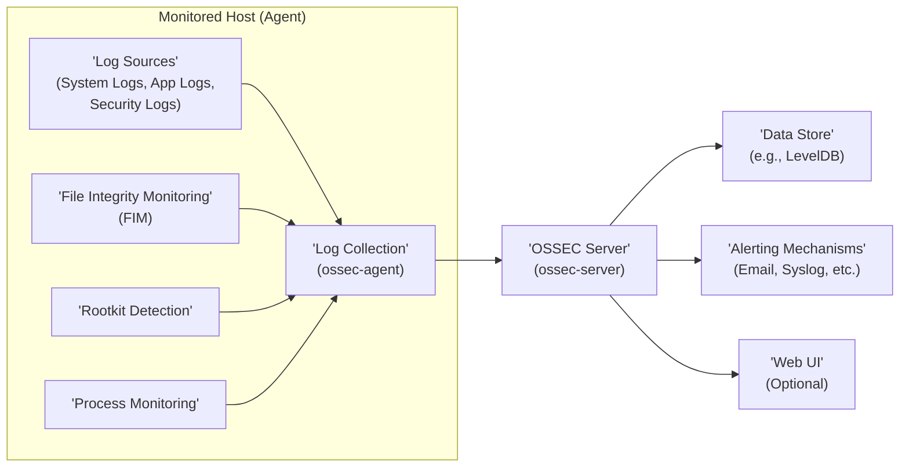
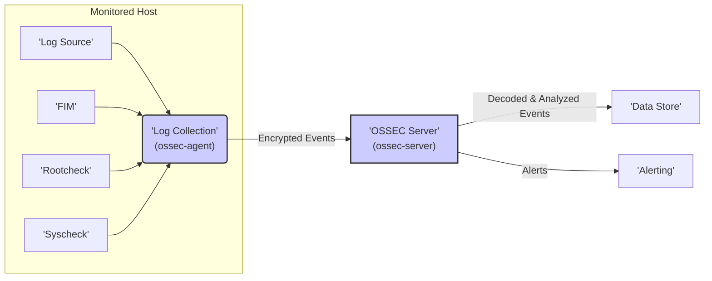

# Project Design Document: OSSEC HIDS

**Version:** 1.1
**Date:** October 26, 2023
**Author:** AI Software Architect

## 1. Introduction

This document provides an enhanced design overview of the OSSEC HIDS (Host-based Intrusion Detection System) project, building upon the information available in the provided GitHub repository: [https://github.com/ossec/ossec-hids](https://github.com/ossec/ossec-hids). This iteration aims to provide even greater clarity and detail regarding OSSEC's architecture, components, and data flows, specifically tailored for effective threat modeling exercises.

## 2. Goals and Objectives

The primary goals of OSSEC HIDS are to:

*   Provide comprehensive host-level security monitoring, encompassing logs, file system integrity, and system behavior.
*   Detect a wide range of security threats, from malware and rootkits to policy violations and suspicious activities.
*   Enable rapid incident detection and response through real-time alerting and actionable insights.
*   Offer centralized management and correlation of security events across multiple monitored hosts.
*   Support forensic investigations by providing detailed audit trails and event data.

This design document is specifically focused on elucidating the system's architecture to facilitate thorough identification and analysis of potential security threats and vulnerabilities.

## 3. High-Level Architecture

OSSEC employs a client-server architecture with optional extensions for enhanced capabilities.

**Components:**

*   **Monitored Host (Agent):** Deployed on each system requiring monitoring. It gathers security-relevant data and transmits it to the central server.
    *   **Log Sources:**  Diverse sources of audit and security information.
        *   System Logs (e.g., syslog, Windows Event Logs): Records of operating system events.
        *   Application Logs (e.g., web server logs, database logs): Logs generated by specific applications.
        *   Security Logs (e.g., authentication logs, firewall logs): Logs related to security events and access control.
    *   **File Integrity Monitoring (FIM):** Tracks changes to critical files and directories, detecting unauthorized modifications.
    *   **Rootkit Detection:** Scans the system for the presence of known rootkits, which are malicious software designed to hide their existence.
    *   **Process Monitoring:** Monitors running processes for suspicious behavior, such as unauthorized execution or unusual resource consumption.
    *   **Log Collection (ossec-agent):** The core agent process responsible for collecting data from the aforementioned sources, potentially performing local analysis, and securely forwarding it to the server.
*   **OSSEC Server (ossec-server):** The central processing unit of OSSEC. It receives data from agents, performs in-depth analysis, generates alerts, and manages the overall system.
*   **Data Store:**  Used for persistent storage of configuration data, received events, generated alerts, and other operational information. LevelDB is a common embedded database choice.
*   **Alerting Mechanisms:**  Various methods for notifying administrators and security teams about detected security incidents.
    *   Email: Sends alert notifications via email.
    *   Syslog: Forwards alerts to a centralized syslog server for aggregation and analysis.
    *   External Integrations: Supports integration with other security tools and platforms (e.g., SIEM, ticketing systems) via scripts or plugins.
*   **Web UI (Optional):** A graphical user interface that provides a visual representation of alerts, agent status, and configuration options, simplifying management and analysis.

## 4. Detailed Component Design

### 4.1. OSSEC Agent (ossec-agent)

*   **Functionality:**
    *   **Configuration Management:** Reads its operational parameters from the `ossec.conf` file.
    *   **Data Collection:** Gathers logs from specified sources, monitors file integrity based on defined rules, performs rootkit checks, and tracks running processes.
    *   **Local Analysis (Optional):** Can perform preliminary analysis based on configured rules before sending data to the server, reducing server load.
    *   **Secure Communication:** Compresses and encrypts collected data before transmitting it to the server, ensuring confidentiality and integrity. Typically uses TCP or UDP over a secure channel.
    *   **Active Response:** Can execute local actions in response to commands received from the server, such as blocking an IP address or killing a process.
*   **Key Modules:**
    *   **Log Collector:** Responsible for reading, parsing, and normalizing logs from diverse sources, handling various log formats.
    *   **File Integrity Monitoring (FIM) Daemon (syscheckd):** Monitors specified files and directories for changes in attributes, content, and permissions, based on configured rules.
    *   **Rootcheck Daemon (rootcheck):** Performs scans to detect the presence of known rootkits and suspicious system modifications.
    *   **Syscheck Daemon:** Monitors system attributes like open ports, network interfaces, and kernel modules for changes.
    *   **Agent Communication:** Manages the secure connection and data exchange with the OSSEC server.
    *   **Active Response Module:** Executes predefined scripts or commands upon receiving instructions from the server.
*   **Configuration:**
    *   The `ossec.conf` file on the agent defines critical parameters such as:
        *   Log sources to monitor.
        *   Files and directories for FIM.
        *   Frequency of rootkit and system checks.
        *   The IP address and port of the OSSEC server.
        *   Encryption and compression settings.
        *   Active response configurations.

### 4.2. OSSEC Server (ossec-server)

*   **Functionality:**
    *   **Agent Management:** Listens for connections from agents, authenticates them, and manages their configurations.
    *   **Data Reception and Processing:** Receives encrypted data from agents, decrypts it, and parses the events.
    *   **Event Analysis:** Applies a sophisticated rule-based analysis engine to detect threats and anomalies in the received events. This involves decoding events to extract relevant information and then matching them against predefined rules.
    *   **Alert Generation:** Generates alerts when events match defined rules, indicating potential security incidents.
    *   **Data Storage:** Stores received events, generated alerts, and agent configurations in the configured data store.
    *   **Alerting and Notification:** Triggers configured alerting mechanisms to notify administrators about detected threats.
    *   **Active Response Management:** Can initiate active response actions on agents based on detected threats.
*   **Key Modules:**
    *   **Agent Listener (ossec-remoted):** Handles incoming connections from agents, manages authentication, and receives data.
    *   **Event Decoder (ossec-analysisd):** Parses raw events into a structured format using predefined decoding rules, making the data easier to analyze.
    *   **Rule Engine (ossec-analysisd):** The core of the analysis process. It compares decoded events against a comprehensive set of rules defined in XML files.
    *   **Alert Generator (ossec-analysisd):** Creates alert messages based on rule matches, including details about the event and the triggered rule.
    *   **Database Interface (ossec-dbd):** Manages interactions with the underlying data store, handling data persistence and retrieval.
    *   **Alert Dispatcher (ossec-maild):** Sends alert notifications through configured channels (e.g., email, syslog).
    *   **Active Response Manager (ossec-execd):** Executes configured active response actions, either locally on the server or remotely on agents.
    *   **Configuration Manager:** Manages agent configurations and distributes updates.
*   **Configuration:**
    *   The `ossec.conf` file on the server defines global settings, agent authentication methods, decoding rules, analysis rules, alerting configurations, and database settings.
    *   **Decoding Rules (`decoder.xml`):** Define how to parse various log formats and extract relevant fields.
    *   **Analysis Rules (`rules/`):** Define patterns and conditions for detecting specific threats and anomalies. These rules are highly configurable and can be customized to suit specific environments.

### 4.3. Data Store

*   **Functionality:**
    *   Provides persistent storage for:
        *   Raw events received from agents.
        *   Generated alerts.
        *   Agent configurations.
        *   Internal state information.
*   **Common Implementations:**
    *   **LevelDB:** An embedded key-value store, often the default choice for its simplicity and performance.
    *   Other database systems can be configured depending on the deployment needs and scale.

### 4.4. Alerting Mechanisms

*   **Functionality:**
    *   Provide timely notifications of detected security incidents to relevant personnel.
    *   Enable prompt incident response and mitigation.
*   **Common Methods:**
    *   **Email:** Sends detailed alert information via email to designated recipients.
    *   **Syslog:** Forwards alerts in syslog format to a central logging server for aggregation and correlation with other security events.
    *   **Custom Scripts:** Allows execution of user-defined scripts upon alert generation, enabling integration with other systems or custom actions.
    *   **Integrations:** Supports integration with various security information and event management (SIEM) systems, ticketing platforms, and communication tools through plugins or APIs.

### 4.5. Web UI (Optional)

*   **Functionality:**
    *   Provides a user-friendly graphical interface for managing and monitoring OSSEC.
    *   Allows viewing, searching, and filtering alerts.
    *   Displays the status and configuration of connected agents.
    *   Offers reporting and visualization capabilities for security events.
*   **Common Implementations:**
    *   **OSSEC Web UI:** The original web interface for OSSEC.
    *   **Wazuh Web:** A more modern and feature-rich web interface developed as part of the Wazuh fork of OSSEC.

## 5. Data Flow

The core data flow within OSSEC involves the systematic collection, secure transmission, rigorous analysis, and timely alerting of security-relevant events.

**Detailed Data Flow:**

1. **Event Generation:** Security-relevant events occur on the monitored host, such as log entries being written, files being modified, or new processes being started.
2. **Data Collection (Agent):** The `ossec-agent` collects these events from configured sources using its various modules (Log Collector, FIM, Rootcheck, Syscheck).
3. **Local Analysis (Optional):** The agent may perform preliminary analysis based on configured rules to filter out noise or identify simple threats locally.
4. **Transmission:** The agent encrypts the collected data to ensure confidentiality and transmits it securely to the OSSEC server.
5. **Reception (Server):** The `ossec-server` receives the encrypted data from the agent through the `ossec-remoted` process.
6. **Authentication:** The server authenticates the agent to ensure that the data is coming from a trusted source.
7. **Decryption:** The server decrypts the received data.
8. **Decoding:** The `ossec-analysisd` process uses predefined decoding rules to parse the raw events into a structured format, extracting relevant fields and information.
9. **Analysis:** The rule engine within `ossec-analysisd` compares the decoded events against a comprehensive set of analysis rules.
10. **Alert Generation:** If an event matches a defined rule, the `ossec-analysisd` process generates an alert, categorizing the severity and providing details about the event and the triggered rule.
11. **Storage:** The original event data and the generated alert are stored in the configured data store by the `ossec-dbd` process.
12. **Alerting:** The `ossec-maild` process (or other configured alerting mechanisms) sends notifications about the generated alert through the specified channels (e.g., email, syslog).
13. **Active Response (Optional):** Based on the alert and configured active response rules, the `ossec-execd` process may initiate actions, either locally on the server or by sending commands back to the agent to take remedial steps.

## 6. Security Considerations (For Threat Modeling)

This section outlines key security considerations relevant for threat modeling, categorized for clarity.

*   **Agent Security:**
    *   **Agent Compromise:** A compromised agent could be used to inject false data, suppress real alerts, or act as a foothold for further attacks.
    *   **Secure Key Management:** Secure storage and management of agent authentication keys are critical to prevent unauthorized agents from connecting.
    *   **Local Tampering:** Protection against local attacks and tampering is necessary to ensure the integrity of the agent software and configuration.
    *   **Resource Exhaustion:** Malicious actors could attempt to overload the agent with requests or data to cause denial of service.
*   **Server Security:**
    *   **Server as a High-Value Target:** The central server is a critical component and a prime target for attackers seeking to disable monitoring or gain access to sensitive data.
    *   **Access Control:** Strict access control measures are essential to limit who can access the server and its data.
    *   **Denial of Service:** The server must be protected against denial-of-service attacks that could prevent it from processing events and generating alerts.
    *   **Vulnerability Management:** Regular patching and updates are crucial to address known vulnerabilities in the server software and its dependencies.
*   **Communication Security:**
    *   **Man-in-the-Middle Attacks:** The communication channel between agents and the server must be strongly encrypted and authenticated to prevent eavesdropping and tampering.
    *   **Replay Attacks:** Mechanisms should be in place to prevent attackers from replaying captured communication to gain unauthorized access or disrupt operations.
*   **Data Security:**
    *   **Confidentiality:** Sensitive data (logs, alerts) stored in the data store must be protected against unauthorized access through encryption and access controls.
    *   **Integrity:** Measures should be in place to ensure the integrity of stored data, preventing unauthorized modification or deletion.
    *   **Availability:** The data store should be highly available to ensure that historical data is accessible for analysis and investigations.
*   **Rule and Configuration Security:**
    *   **Malicious Rules:** Carefully review and test custom rules to prevent the introduction of malicious rules that could generate false positives/negatives or cause system instability.
    *   **Unauthorized Modification:** Access to rule and configuration files should be restricted to authorized personnel to prevent unauthorized changes.
*   **Web UI Security (if used):**
    *   **Common Web Application Vulnerabilities:** Standard web application security considerations apply, including protection against SQL injection, cross-site scripting (XSS), and cross-site request forgery (CSRF).
    *   **Authentication and Authorization:** Strong authentication and authorization mechanisms are essential to control access to the web interface and its functionalities.
*   **Alerting Channel Security:**
    *   **Spoofing:** Ensure that alerting mechanisms are configured to prevent spoofing of alert notifications.
    *   **Confidentiality of Alerts:** Consider the sensitivity of alert information and choose alerting channels that provide appropriate security.

## 7. Deployment Model

OSSEC offers flexibility in deployment, catering to various organizational needs and scales.

*   **Centralized Deployment:** A single OSSEC server manages and analyzes data from all agents.
    *   **Advantages:** Simplified management, centralized view of security events.
    *   **Disadvantages:** Single point of failure, potential performance bottleneck in large environments.
*   **Distributed Deployment:** Multiple OSSEC servers are deployed, often in a hierarchical structure, to manage a large number of agents or geographically dispersed environments.
    *   **Advantages:** Improved scalability and resilience, reduced load on individual servers.
    *   **Disadvantages:** Increased complexity in management and configuration.
*   **Standalone (Agent-only) Deployment:** An agent is configured to perform local analysis and alerting without a central server.
    *   **Advantages:** Useful for isolated systems or when a central server is not feasible.
    *   **Disadvantages:** Lacks centralized management and correlation of events.

The optimal deployment model depends on factors such as the number of hosts, network topology, security requirements, and administrative resources.

## 8. Assumptions and Constraints

*   This design document is based on publicly available information and the structure of the OSSEC project as represented in the GitHub repository.
*   Specific implementation details and functionalities may vary depending on the OSSEC version and configuration.
*   The threat modeling process will provide a more in-depth analysis of potential vulnerabilities and attack vectors.
*   This document assumes a foundational understanding of security principles, network concepts, and system administration practices.

## 9. Future Considerations

*   **Enhanced Cloud Integration:** Improved support for monitoring cloud-based infrastructure and services.
*   **Advanced Analytics and Machine Learning:** Integration of machine learning techniques for more sophisticated threat detection and anomaly analysis.
*   **Containerization and Orchestration:** Support for deploying OSSEC components within containers (e.g., Docker) and orchestration platforms (e.g., Kubernetes).
*   **Improved Scalability and Performance:** Ongoing efforts to enhance the scalability and performance of OSSEC for handling increasingly large and complex environments.
*   **Integration with SOAR Platforms:** Deeper integration with Security Orchestration, Automation, and Response (SOAR) platforms for automated incident response.
*   **Community Contributions:** Leveraging and incorporating contributions from the active OSSEC community.

This enhanced design document provides a more detailed and structured overview of OSSEC HIDS, specifically tailored to support comprehensive threat modeling activities. The detailed component descriptions, data flow diagrams, and categorized security considerations offer a solid foundation for identifying potential vulnerabilities and developing effective mitigation strategies.