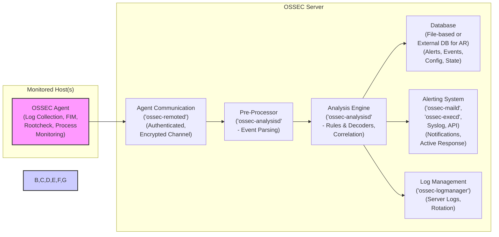
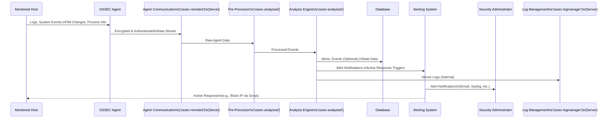

# Project Design Document: OSSEC HIDS

## 1. Introduction

### 1.1. Project Goal

The goal of the OSSEC HIDS project is to provide a robust, open-source Host-based Intrusion Detection System (HIDS). OSSEC aims to detect anomalies, intrusions, and policy violations across monitored systems by analyzing logs, file system changes, rootkit activity, and system calls. This design document outlines the architecture and components of OSSEC HIDS to facilitate understanding and future threat modeling activities.

### 1.2. Document Purpose

This document serves as a detailed design specification for the OSSEC HIDS project. It provides a comprehensive overview of the system's architecture, components, data flow, and key security considerations. This document is specifically created to be used as a foundation for threat modeling exercises, enabling security professionals to identify potential vulnerabilities and design appropriate mitigations.

### 1.3. Target Audience

This document is intended for a broad audience, including:

*   **Security Architects and Engineers:** To understand the system's design for security analysis and threat modeling.
*   **Software Developers:** To gain insight into the system's architecture for development and maintenance purposes.
*   **System Administrators:** To understand the system's components and data flow for deployment and operational management.
*   **Threat Modeling Teams:** To use this document as a basis for identifying and analyzing potential threats and vulnerabilities within the OSSEC HIDS system.

## 2. System Overview

### 2.1. OSSEC HIDS Description

OSSEC (Open Source Security Events Correlator) is a powerful and versatile, multi-platform, open-source Host-based Intrusion Detection System (HIDS). It performs deep log analysis, file integrity monitoring, rootkit detection, process monitoring, and real-time alerting. OSSEC operates using a lightweight agent-server architecture, where agents are deployed on monitored hosts and report to a central server for efficient analysis and correlation. This architecture allows for scalable monitoring of numerous endpoints.

### 2.2. Key Features

*   **Log Analysis:**  Sophisticated parsing and analysis of logs from diverse sources (system logs, application logs, web server logs, etc.) to detect suspicious patterns, security events, and policy violations. Supports custom log formats and decoders.
*   **File Integrity Monitoring (FIM):**  Proactive monitoring of critical files and directories for unauthorized changes. Alerts are triggered upon modifications to sensitive system files, application configurations, or any monitored file, ensuring data integrity and change control.
*   **Rootkit Detection:** Employs both signature-based and behavioral analysis techniques to detect known and unknown rootkits, protecting systems from stealthy malware.
*   **Process Monitoring:**  Continuous monitoring of running processes to identify suspicious activity, unauthorized processes, or deviations in process behavior, aiding in the detection of malicious software and anomalous system activity.
*   **Real-time Alerting:** Generates immediate alerts upon detection of security events, providing timely notifications to administrators through various channels for rapid incident response.
*   **Centralized Management:** Provides a central server for streamlined management of agents, configuration of rules and decoders, and consolidated viewing of alerts from all monitored hosts, simplifying security operations.
*   **Scalability:** Designed for scalability through its agent-based architecture and efficient event processing.  The server can handle a large number of agents, and rules/decoders are optimized for performance. Scalability can be further enhanced by optimizing rule sets and hardware resources.
*   **Cross-Platform Compatibility:** Agents are available for a wide range of operating systems, including Linux, Windows, macOS, Solaris, HP-UX, and AIX, ensuring broad applicability across diverse IT environments.
*   **Active Response:**  Automated responses to detected threats, such as blocking IP addresses, killing processes, or triggering custom scripts, enabling rapid containment and mitigation of security incidents.

### 2.3. Deployment Scenarios

OSSEC's flexible architecture supports various deployment scenarios:

*   **Centralized Monitoring:** A single, dedicated OSSEC server monitors multiple agents distributed across the network. This is the most common and straightforward deployment model, suitable for organizations of various sizes.
*   **Distributed Monitoring (Conceptual):** While OSSEC doesn't have a built-in hierarchical server structure, distributed monitoring can be achieved conceptually by deploying multiple independent OSSEC servers, each monitoring a segment of the network.  Alerts from these servers can be aggregated into a central SIEM or management platform if needed. Load balancers can also be used to distribute agent connections across multiple servers for increased capacity and resilience.
*   **Cloud Environments:** Agents can be seamlessly deployed on cloud instances (e.g., AWS EC2, Azure VMs, GCP Compute Engine) to monitor workloads running in cloud environments, extending security visibility to cloud infrastructure.
*   **Hybrid Environments:** OSSEC effectively monitors both on-premises and cloud-based systems within a hybrid infrastructure, providing unified security monitoring across diverse environments.
*   **Small Office/Home Office (SOHO):** OSSEC can be deployed in smaller environments, even on a single machine acting as both server and agent for basic host security monitoring.

## 3. Architecture

### 3.1. High-Level Architecture Diagram

### 3.2. Component Description

#### 3.2.1. OSSEC Agent

*   **Function:** The OSSEC Agent is a lightweight component installed on each monitored host. Its core functions are:
    *   **Comprehensive Data Collection:** Collects a wide range of security-relevant data, including system logs, application logs, custom logs, file integrity information, rootkit detection results, and process monitoring data.
    *   **Efficient Local Processing (Minimal):** Performs minimal local processing and filtering to reduce network bandwidth usage and server load, ensuring efficient data transmission.
    *   **Secure Communication:** Establishes a secure, authenticated, and encrypted communication channel with the OSSEC Server, protecting data in transit.
    *   **Dynamic Configuration Management:** Receives configuration updates from the server, allowing for centralized management and dynamic adjustments to monitoring parameters and rules without manual agent intervention.
*   **Key Processes:**
    *   `ossec-agentd`: The central agent daemon, managing core agent functionalities, communication, and coordination of other agent processes.
    *   `ossec-logcollector`:  Dedicated process for efficiently collecting logs from configured log sources, supporting various log formats and sources.
    *   `ossec-syscheckd`:  Process responsible for performing file integrity monitoring, detecting unauthorized file modifications.
    *   `ossec-rootcheck`:  Process dedicated to rootkit detection, employing signature and behavioral analysis techniques.
*   **Security Considerations:** Agent security is paramount. Compromised agents can be exploited to send false data, disrupt monitoring, or provide an entry point into the monitored system. Secure agent-server communication and agent hardening are critical.

#### 3.2.2. OSSEC Server

*   **Function:** The OSSEC Server is the central processing and management hub of the OSSEC HIDS. It aggregates data from agents, performs in-depth analysis, generates alerts, manages agents, and provides the overall system management interface.
*   **Key Components within the Server:**
    *   **Agent Communication (`ossec-remoted`):**  Listens for incoming connections from agents, securely authenticates them using pre-shared keys, and receives data streams over an encrypted channel (typically UDP or TCP with encryption).
    *   **Pre-Processor (`ossec-analysisd` - Event Parsing):** Receives raw data from `ossec-remoted`, performs initial parsing and normalization of events, and forwards the processed events to the core analysis engine.
    *   **Analysis Engine (`ossec-analysisd` - Rules & Decoders, Correlation):** The core of the server's intelligence. It utilizes decoders to structure raw events and applies a comprehensive set of rules to detect security incidents, correlate related events, and generate alerts based on defined thresholds and patterns.
    *   **Database (File-based or External DB for AR):** Stores alerts, events (optionally), configuration data for server and agents, and state information. OSSEC primarily uses flat files for storage, offering simplicity and speed.  Newer versions and features like Active Response (AR) may leverage external databases (e.g., SQLite, MySQL) for enhanced performance and scalability of specific components.
    *   **Alerting System (`ossec-maild`, `ossec-execd`, Syslog, API - Notifications, Active Response):**  Generates alerts based on detected events and provides flexible notification mechanisms through various channels, including email (`ossec-maild`), syslog, execution of external scripts (`ossec-execd` for active response), and API integrations for SIEM or other security platforms.
    *   **Log Management (`ossec-logmanager` - Server Logs, Rotation):** Manages the OSSEC server's own internal logs, including storage, rotation, and archiving, ensuring audit trails and facilitating server troubleshooting.
*   **Key Processes:**
    *   `ossec-serverd`: The main server daemon, responsible for overall server management, process coordination, and configuration loading.
    *   `ossec-remoted`: Handles secure agent communication, authentication, and data reception.
    *   `ossec-analysisd`: Performs event pre-processing, core analysis (decoding, rule matching, correlation), and alert generation.
    *   `ossec-maild`: Sends email alerts based on configured rules and alert levels.
    *   `ossec-execd`: Executes external commands or scripts in response to alerts, enabling active response capabilities.
    *   `ossec-dbd`: (If enabled and configured) Database daemon for managing external database interactions, primarily for Active Response and API features.
    *   `ossec-logmanager`: Manages server-side logging and log rotation.
*   **Security Considerations:** Server security is paramount as it is the central point of control and analysis. Compromise of the server can have severe consequences, leading to widespread security breaches and loss of monitoring capabilities. Server hardening, strong access controls, and regular security updates are essential.

#### 3.2.3. Analysis Engine (`ossec-analysisd`)

*   **Function:** The analysis engine is the core intelligence component of the OSSEC server. It is responsible for the critical tasks of:
    *   **Sophisticated Event Decoding:** Parses raw log data and events into structured, normalized formats using a flexible system of decoders. Decoders are defined in XML files and are highly customizable to handle diverse log formats and event types from various systems and applications.
    *   **Advanced Rule Matching:**  Compares decoded events against a rich and extensible set of predefined rules. Rules, also defined in XML, specify complex patterns, conditions, and thresholds to accurately detect a wide range of security incidents, policy violations, and anomalous behaviors.
    *   **Intelligent Event Correlation:** Correlates related events across time and sources to identify complex, multi-stage attack patterns and reduce false positives by providing contextual awareness.
    *   **Precise Alert Generation:** Generates alerts with configurable severity levels when rules are triggered, providing granular control over alert thresholds and enabling prioritization of critical security incidents.
*   **Key Components:**
    *   **Decoders (XML-based):** XML-based definitions that specify how to parse and structure different log formats into a standardized event format for analysis. OSSEC provides a library of pre-built decoders and allows for creation of custom decoders.
    *   **Rules (XML-based):** XML-based definitions that define security events and conditions to be detected. Rules are highly flexible and can be customized to match specific security policies and threat landscapes. They include severity levels, groups, and actions to be taken upon rule triggering.
    *   **Rule Engine (Core Logic):** The central processing logic that efficiently matches decoded events against the defined rules, performs event correlation, and generates alerts when rule conditions are met.
*   **Security Considerations:**  The integrity and accuracy of decoders and rules are critical for effective threat detection. Maliciously modified or poorly written decoders or rules can lead to missed detections (false negatives) or excessive false positives, significantly impacting the effectiveness of OSSEC. Secure management and version control of rules and decoders are important.

#### 3.2.4. Database (File-based Storage)

*   **Function:** OSSEC primarily utilizes file-based storage for:
    *   **Persistent Alert Storage:** Stores generated alerts for historical analysis, reporting, compliance auditing, and incident investigation.
    *   **Optional Event Storage:** Can be configured to store raw events for more in-depth forensic analysis and investigation, providing a richer audit trail.
    *   **Configuration Data Repository:** Stores server and agent configurations, including rules, decoders, agent keys, and system settings.
    *   **State Information Management:** Stores state information for various components, such as File Integrity Monitoring (FIM) baselines, agent status, and active response state, enabling persistent operation and stateful analysis.
*   **Implementation:**  Primarily implemented using flat files and directory structures for simplicity and performance.  Newer versions and integrations, particularly for Active Response and API features, may leverage external databases (e.g., SQLite, MySQL) for improved scalability and data management for those specific components.
*   **Security Considerations:**  Secure storage and robust access control to the database are essential to protect sensitive alert data, configuration information, and potentially raw event data. Data confidentiality, integrity, and availability are crucial. File system permissions should be carefully configured to restrict access to authorized processes and administrators. Encryption at rest should be considered for sensitive data storage.

#### 3.2.5. Alerting System (`ossec-maild`, `ossec-execd`, etc.)

*   **Function:** The alerting system is responsible for reliably and promptly notifying administrators and other systems about detected security incidents, enabling timely incident response and automated mitigation.
*   **Diverse Alerting Channels:** OSSEC supports a variety of alerting channels to suit different operational needs and integration requirements:
    *   **Email (`ossec-maild`):** Sends email notifications for alerts, configurable with different alert levels and recipients.
    *   **Syslog:** Forwards alerts in standard syslog format to a central syslog server or SIEM system for centralized logging and correlation with other security events.
    *   **External Scripts/Commands (`ossec-execd` - Active Response):** Executes custom scripts or commands in response to alerts, enabling automated remediation actions like IP blocking, process termination, system quarantine, or integration with incident response platforms. This is the core of OSSEC's Active Response capability.
    *   **API (Integration):** Provides an API (in newer versions and through integrations) for programmatic access to alerts and events, facilitating integration with SIEM systems, dashboards, and other security management tools.
    *   **Log Files (Local Logging):** Alerts are also logged to local files on the OSSEC server for auditing and local review.
*   **Configurable Alert Levels:** OSSEC employs a severity level system (0-15) to categorize alerts, allowing administrators to filter, prioritize, and route alerts based on their criticality. This enables efficient alert management and focus on high-priority incidents.
*   **Security Considerations:**  Secure and reliable alerting is paramount for effective incident response. Misconfigured alerting channels, compromised alerting systems, or excessive alerting can lead to missed critical alerts, alert fatigue, or unauthorized access to alert information. Secure configuration of email servers, syslog destinations, and script execution environments is important.

#### 3.2.6. Log Management (`ossec-logmanager`)

*   **Function:** Manages the OSSEC server's own internal log files, ensuring proper logging for auditing, troubleshooting, and operational monitoring of the OSSEC server itself.
    *   **Server Log Storage:** Stores server logs, capturing events related to server operation, agent communication, analysis engine activity, and alerting processes.
    *   **Automated Log Rotation:** Implements log rotation policies to prevent log files from consuming excessive disk space, ensuring efficient disk utilization and log manageability.
    *   **Optional Log Archiving:** Supports optional log archiving to move older logs to secondary storage for long-term retention and compliance requirements.
*   **Security Considerations:**  Proper log management is crucial for auditing server activity, investigating security incidents related to the OSSEC server itself, and ensuring operational stability. Secure storage and access control to server logs are important to prevent unauthorized access or tampering with audit trails. Regular review of server logs can help identify operational issues or security anomalies within the OSSEC infrastructure.

## 4. Data Flow

### 4.1. Data Flow Diagram

### 4.2. Data Flow Description

1.  **Comprehensive Data Collection on Monitored Host:** The OSSEC Agent, deployed on each monitored host, actively collects a wide range of security-relevant data:
    *   **Logs:** System logs (e.g., syslog, Windows Event Logs), application logs, web server logs, security appliance logs, and custom application logs.
    *   **File System Events:** Real-time changes detected by the File Integrity Monitoring (FIM) module, including file creations, modifications, deletions, and attribute changes.
    *   **System Events:** Process creation and termination events, rootkit detection events, and (to a limited extent) system call information.
    *   **Process Information:**  Data about running processes, including process names, IDs, users, and resource consumption.

2.  **Secure Agent-Server Communication:** The OSSEC Agent establishes a persistent, secure, authenticated, and encrypted communication channel to the OSSEC Server's `ossec-remoted` component. Data is transmitted over this secure channel, typically using UDP or TCP with encryption (e.g., using keys exchanged during agent registration). Authentication ensures only authorized agents can communicate, and encryption protects data confidentiality and integrity during transmission.

3.  **Pre-processing on Server (`ossec-analysisd` Pre-processor):** The `ossec-remoted` component on the server receives the encrypted data stream from agents and forwards it to the `ossec-analysisd` pre-processor. This pre-processor performs initial data handling, including decryption, basic parsing, and normalization of events to prepare them for the core analysis engine.

4.  **Advanced Analysis by Analysis Engine (`ossec-analysisd` Analysis Engine):** The `ossec-analysisd` analysis engine is the central processing unit. It performs the core security analysis:
    *   **Event Decoding:** Parses the pre-processed data into structured events using configured decoders, transforming raw log lines and event data into a standardized format.
    *   **Rule Application:** Matches decoded events against a comprehensive set of predefined and custom rules to detect security incidents, policy violations, and anomalous activities.
    *   **Event Correlation:** Correlates related events, potentially from multiple agents and across different timeframes, to identify complex attack patterns and reduce false positives.
    *   **Alert Generation:** Generates alerts with assigned severity levels when rules are triggered, indicating potential security issues that require attention.

5.  **Alert Storage, Notification, and Active Response:**
    *   **Database Storage:** Generated alerts, and optionally raw events, are stored in the OSSEC database (typically file-based). State data for FIM and Active Response is also maintained in the database.
    *   **Alerting System Notification:** The analysis engine triggers the alerting system components (e.g., `ossec-maild`, `ossec-execd`, Syslog, API) to send notifications to administrators via configured channels (email, syslog, integrations).
    *   **Active Response Execution:** For certain high-severity alerts or rules configured for active response, the `ossec-execd` component is triggered to execute predefined scripts or commands. These scripts can perform automated remediation actions directly on the monitored host (via agent communication) or on network devices (e.g., firewall rule updates).

6.  **Server Log Management (`ossec-logmanager`):** The OSSEC server generates its own internal logs, which are managed by the `ossec-logmanager` component. These logs are used for auditing server operations, troubleshooting issues, and monitoring the health of the OSSEC infrastructure itself.

## 5. Security Considerations (Detailed)

This section expands on the initial security considerations, providing more specific potential threats and vulnerabilities for threat modeling.

### 5.1. Authentication and Authorization

*   **Threats:**
    *   **Weak Agent Authentication Keys:** Default or easily guessable agent authentication keys could allow unauthorized agents to connect to the server, potentially injecting malicious data or disrupting monitoring.
    *   **Man-in-the-Middle (MITM) Attacks on Agent Registration:** If agent registration process is not sufficiently secure, MITM attacks could allow attackers to impersonate agents or servers, compromising agent keys.
    *   **Lack of Multi-Factor Authentication (MFA) for Server Access:**  Compromised administrator credentials (username/password) could grant unauthorized access to the OSSEC server, allowing attackers to disable monitoring, modify rules, or access sensitive alert data.
    *   **Insufficient Access Control (Authorization) on Server:**  Lack of role-based access control (RBAC) or granular permissions could allow lower-privileged administrators to perform actions they shouldn't, such as modifying critical rules or accessing sensitive data.
    *   **Session Hijacking:** Vulnerabilities in the server's web interface (if used via integrations) or API could allow attackers to hijack administrator sessions and gain unauthorized access.

*   **Mitigations (Examples):**
    *   **Strong, Unique Agent Keys:** Generate strong, unique keys for each agent during deployment. Rotate keys periodically.
    *   **Secure Agent Registration Process:** Implement secure agent registration mechanisms, potentially involving certificate-based authentication or out-of-band key exchange.
    *   **Implement MFA for Server Access:** Enforce multi-factor authentication for all administrative access to the OSSEC server.
    *   **Role-Based Access Control (RBAC):** Implement RBAC to restrict access to server functionalities based on user roles and responsibilities.
    *   **Secure Session Management:** Implement robust session management practices to prevent session hijacking, including secure cookies, session timeouts, and protection against cross-site scripting (XSS).

### 5.2. Data Confidentiality and Integrity

*   **Threats:**
    *   **Eavesdropping on Agent-Server Communication:** Unencrypted or weakly encrypted agent-server communication could allow attackers to intercept sensitive log data and alerts in transit.
    *   **Data Tampering during Transmission:**  Lack of integrity checks on agent-server communication could allow attackers to modify data in transit, leading to inaccurate analysis and missed detections.
    *   **Unauthorized Access to Stored Alerts and Events:** Insufficient access controls on the OSSEC database (file-based or external) could allow unauthorized users to access sensitive alert data, potentially revealing confidential information.
    *   **Data Breach of Stored Data:**  Lack of encryption at rest for stored alerts, events, and configuration data could expose sensitive information in case of server compromise or data theft.
    *   **Data Corruption or Loss:**  File system errors, hardware failures, or malicious attacks could lead to data corruption or loss of alerts, events, and configuration data, impacting monitoring effectiveness and incident investigation.

*   **Mitigations (Examples):**
    *   **Strong Encryption for Agent-Server Communication:** Use strong encryption protocols (e.g., TLS/SSL) for all agent-server communication.
    *   **Data Integrity Checks:** Implement integrity checks (e.g., message authentication codes - MACs) to ensure data integrity during transmission.
    *   **Strict Access Controls on Database:** Configure file system permissions or database access controls to restrict access to stored alerts, events, and configuration data to authorized processes and administrators only.
    *   **Encryption at Rest:** Implement encryption at rest for sensitive data stored in the OSSEC database.
    *   **Data Backup and Recovery:** Implement regular data backups and disaster recovery procedures to protect against data loss and ensure business continuity.

### 5.3. Network Security

*   **Threats:**
    *   **Denial of Service (DoS) Attacks on Server:**  DoS attacks targeting the OSSEC server could disrupt monitoring capabilities and prevent alert processing.
    *   **Agent Communication Port Exploitation:**  Vulnerabilities in the `ossec-remoted` component or exposed agent communication ports could be exploited for attacks.
    *   **Network Segmentation Bypass:**  If network segmentation is relied upon for security, vulnerabilities in OSSEC or misconfigurations could allow attackers to bypass segmentation and gain access to restricted network zones.
    *   **Lateral Movement via Compromised Agents:**  Compromised agents could be used as pivot points for lateral movement within the network.
    *   **Exfiltration of Data via Agent Communication Channel:**  Attackers compromising an agent could potentially use the agent-server communication channel to exfiltrate data from the monitored host.

*   **Mitigations (Examples):**
    *   **Network Firewalls and Intrusion Prevention Systems (IPS):** Deploy network firewalls and IPS to protect the OSSEC server and restrict access to agent communication ports.
    *   **Rate Limiting and DoS Protection:** Implement rate limiting and DoS protection mechanisms on the OSSEC server to mitigate DoS attacks.
    *   **Regular Security Patching:**  Apply regular security patches to the OSSEC server and agents to address known vulnerabilities.
    *   **Network Segmentation:**  Implement network segmentation to isolate the OSSEC server and monitored hosts into separate network zones.
    *   **Agent Hardening and Monitoring:** Harden OSSEC agents and monitor them for signs of compromise.

### 5.4. Agent Security

*   **Threats:**
    *   **Agent Compromise:**  Agents running with elevated privileges or containing vulnerabilities could be compromised by attackers, leading to control of the monitored host.
    *   **Tampering with Agent Configuration or Binaries:** Attackers gaining access to a monitored host could tamper with the agent configuration or binaries to disable monitoring, generate false positives, or use the agent for malicious purposes.
    *   **Resource Exhaustion on Monitored Host:**  A misconfigured or vulnerable agent could consume excessive resources (CPU, memory, disk I/O) on the monitored host, impacting system performance and availability.
    *   **Agent as a Backdoor:**  A compromised agent could be used as a persistent backdoor into the monitored host.
    *   **Privilege Escalation via Agent Vulnerabilities:**  Vulnerabilities in the agent software could be exploited for privilege escalation on the monitored host.

*   **Mitigations (Examples):**
    *   **Principle of Least Privilege for Agents:** Run agents with the minimum necessary privileges.
    *   **Agent Hardening:** Harden agents by removing unnecessary services, applying security patches, and using host-based firewalls.
    *   **File Integrity Monitoring of Agent Binaries and Configuration:** Use FIM to monitor the integrity of agent binaries and configuration files to detect tampering.
    *   **Resource Monitoring and Limits for Agents:** Monitor agent resource consumption and configure resource limits to prevent resource exhaustion.
    *   **Regular Agent Updates and Vulnerability Scanning:**  Keep agents up-to-date with security patches and perform regular vulnerability scanning.

### 5.5. Server Security

*   **Threats:**
    *   **Server Operating System Vulnerabilities:** Unpatched vulnerabilities in the server operating system could be exploited to compromise the OSSEC server.
    *   **OSSEC Server Software Vulnerabilities:** Vulnerabilities in the OSSEC server software itself could be exploited for remote code execution or other attacks.
    *   **Misconfiguration of Server Services:** Misconfigured server services (e.g., SSH, web server if used) could create vulnerabilities.
    *   **Rule and Decoder Injection/Tampering:** Attackers gaining access to the server could inject malicious rules or decoders, or tamper with existing ones, to bypass detections or generate false positives.
    *   **Log Injection:** Attackers could attempt to inject malicious log entries into the OSSEC server's logs to mislead analysis or hide malicious activity.
    *   **Insufficient Logging and Auditing of Server Activity:**  Lack of sufficient logging and auditing of server activity could hinder incident investigation and detection of malicious actions on the server itself.

*   **Mitigations (Examples):**
    *   **Regular OS and OSSEC Patching:**  Implement a robust patch management process to apply security patches to the server operating system and OSSEC software promptly.
    *   **Server Hardening:** Harden the OSSEC server according to security best practices, including minimizing exposed services, disabling unnecessary features, and using strong passwords.
    *   **Secure Configuration Management:** Implement secure configuration management practices to ensure consistent and secure server configurations.
    *   **Rule and Decoder Review and Version Control:**  Regularly review and update OSSEC rules and decoders. Implement version control for rules and decoders to track changes and prevent unauthorized modifications.
    *   **Log Integrity Protection:** Implement mechanisms to protect the integrity of OSSEC server logs, such as log signing or secure log forwarding to a dedicated logging system.
    *   **Comprehensive Server Logging and Auditing:** Enable comprehensive logging and auditing of server activity to monitor for suspicious actions and facilitate incident investigation.

## 6. Technology Stack (Brief Overview)

*   **Programming Languages:** Primarily C for core components (agent, server daemons) for performance and efficiency. Python and other scripting languages are used for auxiliary tools, API integrations, and some newer features.
*   **Operating Systems:**
    *   **Server:** Linux (strongly recommended for server components due to stability, performance, and community support), other Unix-like systems (limited support for server components on Windows in older versions).
    *   **Agent:** Broad cross-platform support: Linux, Windows, macOS, Solaris, HP-UX, AIX.
*   **Communication Protocols:** UDP (default, for performance), TCP (configurable for reliability), both with encryption for agent-server communication.
*   **Data Storage:** Primarily file-based (flat files) for core functionality.  Potential for external database integration (e.g., SQLite, MySQL) for specific features like Active Response (AR) and API in newer versions or integrations.
*   **Configuration Format:** XML is extensively used for rules, decoders, agent and server configuration files, providing a structured and extensible configuration mechanism.

## 7. Deployment Architecture (Example - Centralized)

In a typical centralized deployment scenario:

*   **Dedicated OSSEC Server:** A dedicated server (physical or virtual) is provisioned to host all OSSEC Server components (`ossec-serverd`, `ossec-remoted`, `ossec-analysisd`, etc.).  Linux is the recommended operating system for the server.
*   **Distributed OSSEC Agents:** OSSEC Agents are installed on all hosts to be monitored across the IT environment (servers, workstations, laptops, network devices, cloud instances). Agents are lightweight and designed for minimal performance impact.
*   **Agent-Server Communication Configuration:** Agents are configured to communicate with the central OSSEC Server, specifying the server's IP address or hostname and the pre-shared authentication key.
*   **Network Firewall Configuration:** Network firewalls are configured to allow agent communication to the OSSEC server on the designated ports (UDP or TCP ports used by `ossec-remoted`).  Inbound traffic to the server on these ports should be restricted to authorized agent networks.
*   **Administrative Access:** Administrators typically access the OSSEC server via command-line interface (CLI) for configuration management, log analysis, alert review, and system administration. Web UIs or dashboards may be integrated through external tools or API integrations for enhanced visualization and management.
*   **Scalability Considerations:** For larger deployments, server resources (CPU, memory, disk I/O) should be appropriately sized to handle the expected volume of events from agents.  Load balancing or distributed server architectures (conceptually, as described earlier) can be considered for very large environments.

## 8. Future Considerations (For Long-Term Planning - Less Relevant for Immediate Threat Modeling)

*   **Scalability and Performance Optimization:**  Continued focus on enhancing server scalability to efficiently handle massive deployments and high event volumes. Explore further optimizations for rule processing, event correlation, and database performance.
*   **Enhanced Web UI and Visualization:** Development or integration of a more comprehensive and user-friendly web-based user interface (UI) for simplified management, advanced reporting, interactive dashboards, and improved data visualization.
*   **Deeper Cloud Integrations:**  Strengthening integrations with major cloud platforms (AWS, Azure, GCP) to streamline deployment, configuration, and monitoring of cloud-native workloads and infrastructure. Explore serverless OSSEC components or cloud-managed OSSEC services.
*   **Advanced Analytics and Machine Learning (ML):**  Investigating and incorporating advanced analytics and machine learning techniques to enhance threat detection capabilities, improve anomaly detection accuracy, reduce false positives through behavioral analysis, and automate threat intelligence integration.
*   **Expanded API and Automation Capabilities:**  Further development and expansion of the OSSEC API to enable richer integration with other security tools (SIEM, SOAR, threat intelligence platforms), orchestration frameworks, and automation workflows, facilitating automated incident response and security operations.
*   **Containerization and Orchestration:**  Exploring containerization of OSSEC server and agent components (e.g., Docker, Kubernetes) to simplify deployment, management, and scaling in modern infrastructure environments.

This improved document provides a more detailed and comprehensive design overview of the OSSEC HIDS project, making it even more suitable for thorough threat modeling activities. The expanded security considerations section, in particular, offers a more granular view of potential threats and vulnerabilities to be analyzed.