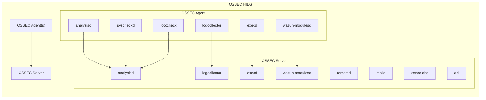
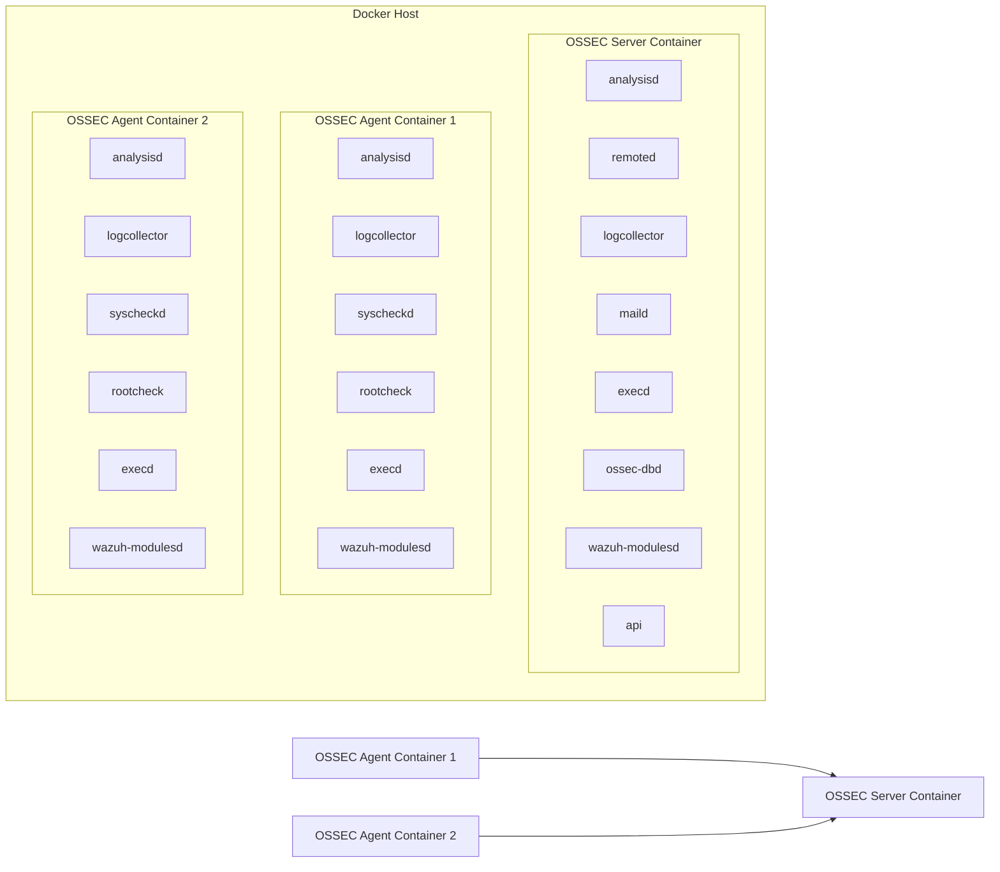
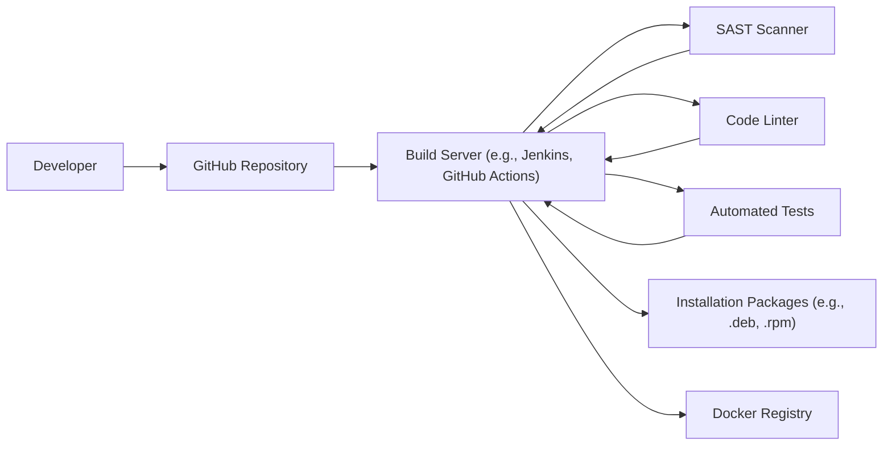

# BUSINESS POSTURE

Business Priorities and Goals:

*   Provide a host-based intrusion detection system (HIDS) that is open-source and freely available.
*   Offer a scalable solution suitable for monitoring a range of systems, from single servers to large deployments.
*   Enable early detection of security threats and policy violations on monitored systems.
*   Support compliance with various security standards and regulations.
*   Provide a flexible and customizable system that can be adapted to different environments and needs.
*   Maintain a strong community and ecosystem around the project.

Business Risks:

*   Failure to detect critical security threats, leading to data breaches or system compromise.
*   Inability to scale to meet the needs of growing organizations.
*   Complexity of configuration and management, hindering adoption and effective use.
*   Lack of support for emerging threats and technologies.
*   Vulnerabilities within OSSEC itself, potentially exposing monitored systems to attack.
*   Reputational damage due to security incidents related to OSSEC.
*   Competition from commercial HIDS solutions.

# SECURITY POSTURE

Existing Security Controls:

*   security control: File integrity monitoring (FIM) to detect unauthorized changes to critical system files and configurations. (Implemented in syscheck component)
*   security control: Log analysis to identify suspicious activity and security events from various log sources. (Implemented in analysisd component)
*   security control: Rootkit detection to identify the presence of rootkits on monitored systems. (Implemented in rootcheck component)
*   security control: Active response to automatically take actions in response to detected threats, such as blocking IP addresses or running custom scripts. (Implemented in agent and server components)
*   security control: System inventory to collect information about the monitored systems, including installed software and hardware. (Implemented in agent component)
*   security control: Compliance auditing to check system configurations against security policies and standards. (Implemented via rules and CDB lists)
*   security control: Centralized management to manage and monitor multiple agents from a single server. (Implemented in server component)
*   security control: Encryption of communication between agents and server. (Implemented using pre-shared keys or certificates)

Accepted Risks:

*   accepted risk: Potential for false positives, requiring tuning and customization of rules.
*   accepted risk: Performance overhead on monitored systems, especially during intensive file integrity checks.
*   accepted risk: Reliance on community support and contributions for ongoing development and maintenance.
*   accepted risk: Complexity of rule creation and management, requiring specialized knowledge.
*   accepted risk: Limited built-in reporting capabilities, requiring integration with external tools for advanced analysis and visualization.

Recommended Security Controls:

*   security control: Implement robust input validation on all user-supplied data, including configuration files and API requests.
*   security control: Regularly update OSSEC to the latest version to benefit from security patches and improvements.
*   security control: Conduct regular security audits and penetration testing of the OSSEC infrastructure.
*   security control: Implement a strong password policy for OSSEC management interfaces.
*   security control: Enable two-factor authentication for OSSEC management interfaces, if available.
*   security control: Monitor OSSEC's own logs for any signs of suspicious activity or errors.
*   security control: Integrate OSSEC with a Security Information and Event Management (SIEM) system for centralized security monitoring and analysis.

Security Requirements:

*   Authentication:
    *   Agents must authenticate to the server using pre-shared keys or certificates.
    *   Management interfaces (if any) should require strong authentication.
*   Authorization:
    *   Access to OSSEC management functions should be restricted based on the principle of least privilege.
    *   Agents should only have access to the data and functionality necessary for their role.
*   Input Validation:
    *   All input from agents, configuration files, and API requests must be validated to prevent injection attacks and other vulnerabilities.
*   Cryptography:
    *   Communication between agents and the server must be encrypted using strong cryptographic protocols (e.g., TLS).
    *   Sensitive data, such as passwords and API keys, should be stored securely, preferably using encryption.
*   Auditing:
    *   All security-relevant events, including configuration changes, authentication attempts, and detected threats, should be logged.

# DESIGN

## C4 CONTEXT

```mermaid
graph LR
    subgraph "OSSEC System"
        ossec["OSSEC HIDS"]
    end

    user["System Administrator"] --> ossec
    logs["External Log Sources"] --> ossec
    siem["SIEM System"] <-- ossec
    email["Email Server"] <-- ossec
    ext_sys["External Systems (e.g., for active response)"] <-- ossec

```

Element Descriptions:

*   Element:
    *   Name: OSSEC HIDS
    *   Type: System
    *   Description: The core OSSEC host-based intrusion detection system.
    *   Responsibilities:
        *   Collect and analyze logs from various sources.
        *   Perform file integrity monitoring.
        *   Detect rootkits.
        *   Execute active responses.
        *   Provide centralized management.
    *   Security controls: File integrity monitoring, log analysis, rootkit detection, active response, system inventory, compliance auditing, centralized management, encryption of communication.

*   Element:
    *   Name: System Administrator
    *   Type: User
    *   Description: The person responsible for configuring, managing, and monitoring OSSEC.
    *   Responsibilities:
        *   Install and configure OSSEC agents and server.
        *   Define security rules and policies.
        *   Monitor alerts and investigate security events.
        *   Maintain the OSSEC infrastructure.
    *   Security controls: Strong authentication, access control based on least privilege.

*   Element:
    *   Name: External Log Sources
    *   Type: System
    *   Description: Systems and applications that generate logs that are analyzed by OSSEC.
    *   Responsibilities:
        *   Generate logs in a format that OSSEC can understand.
        *   Send logs to OSSEC agents or directly to the server.
    *   Security controls: Log integrity, secure log transmission.

*   Element:
    *   Name: SIEM System
    *   Type: System
    *   Description: A Security Information and Event Management (SIEM) system that integrates with OSSEC for centralized security monitoring and analysis.
    *   Responsibilities:
        *   Receive alerts and events from OSSEC.
        *   Correlate OSSEC data with data from other security tools.
        *   Provide advanced reporting and visualization capabilities.
    *   Security controls: Secure communication with OSSEC, data encryption, access control.

*   Element:
    *   Name: Email Server
    *   Type: System
    *   Description: An email server used by OSSEC to send alert notifications.
    *   Responsibilities:
        *   Relay email messages from OSSEC to designated recipients.
    *   Security controls: Secure email configuration, authentication, encryption.

*   Element:
    *   Name: External Systems (e.g., for active response)
    *   Type: System
    *   Description: External systems that OSSEC interacts with to execute active responses, such as firewalls or network devices.
    *   Responsibilities:
        *   Receive commands from OSSEC to block IP addresses or perform other actions.
    *   Security controls: Secure communication with OSSEC, authentication, authorization.

## C4 CONTAINER



Element Descriptions:

*   Element:
    *   Name: OSSEC Server
    *   Type: Container
    *   Description: The central server that manages OSSEC agents and performs centralized analysis.
    *   Responsibilities:
        *   Receive data from agents.
        *   Perform centralized log analysis and correlation.
        *   Manage agent configurations.
        *   Store alerts and events.
        *   Provide management interfaces.
    *   Security controls: Encryption of communication, access control, input validation, auditing.

*   Element:
    *   Name: analysisd
    *   Type: Container
    *   Description: The main analysis engine on the OSSEC server.
    *   Responsibilities:
        *   Process events from agents and local sources.
        *   Apply rules to detect security threats.
        *   Generate alerts.
    *   Security controls: Input validation, rule-based analysis.

*   Element:
    *   Name: remoted
    *   Type: Container
    *   Description: Handles communication with OSSEC agents.
    *   Responsibilities:
        *   Receive data from agents.
        *   Send commands to agents.
    *   Security controls: Encryption of communication, authentication.

*   Element:
    *   Name: logcollector
    *   Type: Container
    *   Description: Collects logs from local sources on the server.
    *   Responsibilities:
        *   Read logs from files and system logs.
        *   Forward logs to analysisd.
    *   Security controls: Input validation.

*   Element:
    *   Name: maild
    *   Type: Container
    *   Description: Sends email notifications for alerts.
    *   Responsibilities:
        *   Format and send email messages.
    *   Security controls: Secure email configuration.

*   Element:
    *   Name: execd
    *   Type: Container
    *   Description: Executes active responses.
    *   Responsibilities:
        *   Run scripts and commands in response to alerts.
    *   Security controls: Secure execution environment, input validation.

*   Element:
    *   Name: ossec-dbd
    *   Type: Container
    *   Description: Manages the OSSEC database.
    *   Responsibilities:
        *   Store alerts, events, and agent information.
    *   Security controls: Database security, access control.

*   Element:
    *   Name: wazuh-modulesd
    *   Type: Container
    *   Description: Manages various Wazuh modules, such as vulnerability detection and security configuration assessment.
    *   Responsibilities:
        *   Execute module-specific tasks.
    *   Security controls: Module-specific security controls.

*   Element:
    *   Name: api
    *   Type: Container
    *   Description: Provides an API for managing and interacting with OSSEC.
    *   Responsibilities:
        *   Handle API requests.
        *   Provide access to OSSEC data and functionality.
    *   Security controls: Authentication, authorization, input validation.

*   Element:
    *   Name: OSSEC Agent(s)
    *   Type: Container
    *   Description: Agents installed on monitored systems.
    *   Responsibilities:
        *   Collect logs and system information.
        *   Perform file integrity monitoring.
        *   Detect rootkits.
        *   Execute active responses.
        *   Send data to the OSSEC server.
    *   Security controls: Encryption of communication, input validation, secure execution environment.

*   Element:
    *   Name: agent_analysisd
    *   Type: Container
    *   Description: Local analysis engine on the agent.
    *   Responsibilities: Pre-processes logs and events before sending to server.
    *   Security controls: Input validation.

*   Element:
    *   Name: agent_logcollector
    *   Type: Container
    *   Description: Collects logs from local sources on the agent.
    *   Responsibilities: Reads logs from files and system logs.
    *   Security controls: Input validation.

*   Element:
    *   Name: syscheckd
    *   Type: Container
    *   Description: Performs file integrity monitoring.
    *   Responsibilities:
        *   Scan files and directories for changes.
        *   Report changes to the server.
    *   Security controls: Secure configuration, integrity checks.

*   Element:
    *   Name: rootcheck
    *   Type: Container
    *   Description: Detects rootkits.
    *   Responsibilities:
        *   Run various rootkit detection techniques.
        *   Report findings to the server.
    *   Security controls: Secure configuration.

*   Element:
    *   Name: agent_execd
    *   Type: Container
    *   Description: Executes active responses on the agent.
    *   Responsibilities: Run scripts and commands in response to alerts.
    *   Security controls: Secure execution environment, input validation.

*   Element:
    *   Name: agent_wmodules
    *   Type: Container
    *   Description: Manages various Wazuh modules on the agent.
    *   Responsibilities: Execute module-specific tasks.
    *   Security controls: Module-specific security controls.

## DEPLOYMENT

Possible Deployment Solutions:

1.  Traditional installation on physical or virtual servers.
2.  Containerized deployment using Docker or Kubernetes.
3.  Cloud-based deployment using pre-built images or marketplace offerings.

Chosen Solution: Containerized deployment using Docker.



Element Descriptions:

*   Element:
    *   Name: Docker Host
    *   Type: Node
    *   Description: The physical or virtual machine that hosts the Docker containers.
    *   Responsibilities:
        *   Provide the runtime environment for the containers.
    *   Security controls: Operating system hardening, network security, access control.

*   Element:
    *   Name: OSSEC Server Container
    *   Type: Container
    *   Description: The Docker container that runs the OSSEC server components.
    *   Responsibilities: See C4 Container descriptions.
    *   Security controls: Container isolation, image security, resource limits.

*   Element:
    *   Name: OSSEC Agent Container 1, OSSEC Agent Container 2
    *   Type: Container
    *   Description: Docker containers that run the OSSEC agent components.
    *   Responsibilities: See C4 Container descriptions.
    *   Security controls: Container isolation, image security, resource limits.

## BUILD

The build process for OSSEC involves compiling the source code from the GitHub repository and creating installation packages or Docker images.



Build Process Steps:

1.  Developer commits code changes to the GitHub repository.
2.  A build server (e.g., Jenkins, GitHub Actions) detects the changes and triggers a build.
3.  The build server checks out the code from the repository.
4.  Static Application Security Testing (SAST) tools scan the code for vulnerabilities.
5.  Code linters check the code for style and potential errors.
6.  Automated tests (unit tests, integration tests) are executed.
7.  If all checks and tests pass, the build server compiles the code and creates installation packages (e.g., .deb, .rpm).
8.  The build server builds Docker images and pushes them to a Docker registry.

Security Controls:

*   security control: Use of a dedicated build server to isolate the build process.
*   security control: Integration of SAST tools to identify vulnerabilities early in the development lifecycle.
*   security control: Use of code linters to enforce coding standards and prevent common errors.
*   security control: Automated testing to ensure code quality and functionality.
*   security control: Secure storage of build artifacts (installation packages and Docker images).
*   security control: Use of signed packages and images to ensure authenticity and integrity.
*   security control: Regular updates of build tools and dependencies to address security vulnerabilities.

# RISK ASSESSMENT

Critical Business Processes:

*   Intrusion detection and response.
*   Security monitoring and compliance.
*   Data protection.

Data Sensitivity:

*   System logs: Contain information about system activity, including user logins, program executions, and network connections. Sensitivity: Medium to High.
*   File integrity data: Contains hashes and metadata of monitored files. Sensitivity: Medium.
*   Alerts and events: Contain information about detected security threats and policy violations. Sensitivity: High.
*   Configuration files: Contain settings for OSSEC, including rules, policies, and API keys. Sensitivity: High.

# QUESTIONS & ASSUMPTIONS

Questions:

*   What specific compliance requirements (e.g., PCI DSS, HIPAA) need to be addressed?
*   What are the expected performance requirements for OSSEC in terms of events per second (EPS) and number of agents?
*   What are the existing security tools and infrastructure that OSSEC needs to integrate with?
*   What is the level of expertise of the system administrators who will be managing OSSEC?
*   Are there any specific regulatory or legal requirements related to data retention and privacy?
*   What level of false positives is acceptable?

Assumptions:

*   BUSINESS POSTURE: The organization has a moderate risk appetite and prioritizes security, but also needs a cost-effective solution.
*   SECURITY POSTURE: The organization has basic security controls in place, such as firewalls and antivirus software, but needs to improve its host-based intrusion detection capabilities.
*   DESIGN: OSSEC will be deployed in a containerized environment using Docker. The organization has the necessary infrastructure and expertise to manage Docker containers.
*   DESIGN: OSSEC will be integrated with a SIEM system for centralized security monitoring.
*   DESIGN: The organization will use pre-shared keys for agent-server authentication.
*   DESIGN: The organization will regularly update OSSEC to the latest version.