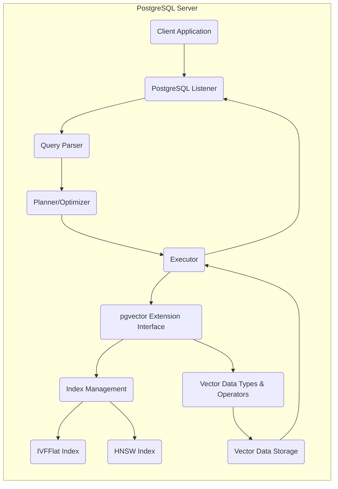
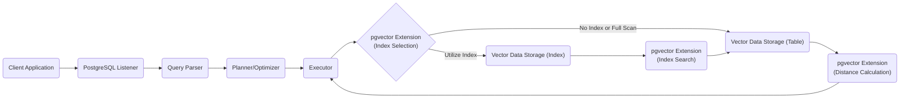

# Project Design Document: pgvector Extension for PostgreSQL

**Version:** 1.1
**Date:** October 26, 2023
**Author:** AI Software Architect

## 1. Introduction

This document provides a detailed design overview of the `pgvector` PostgreSQL extension, as found in the repository [https://github.com/pgvector/pgvector](https://github.com/pgvector/pgvector). This extension enhances PostgreSQL by adding support for vector embeddings and efficient similarity searches. This document aims to clearly articulate the architecture, components, and data flow of the extension, serving as a foundation for subsequent threat modeling activities and general understanding.

## 2. Goals and Objectives

*   Provide a comprehensive and easily understandable architectural overview of the `pgvector` extension.
*   Clearly define the components of the extension and their interactions within the PostgreSQL environment.
*   Illustrate the data flow for common operations performed using the extension.
*   Identify key areas of security concern to guide the threat modeling process.
*   Serve as a central reference document for developers, security engineers, database administrators, and other stakeholders involved with `pgvector`.

## 3. Target Audience

*   Security engineers responsible for performing threat modeling and security assessments.
*   Software developers integrating `pgvector` into their applications and services.
*   Database administrators managing PostgreSQL instances where the `pgvector` extension is installed and utilized.
*   Technical staff seeking a deeper understanding of the `pgvector` extension's architecture and functionality.

## 4. Scope

This document focuses on the design of the `pgvector` extension itself and its direct interactions with the core PostgreSQL database system. The scope includes:

*   The high-level architecture of the extension and its integration within PostgreSQL.
*   Detailed descriptions of the key components that constitute the extension.
*   Illustrations of the data flow for typical operations, such as inserting vector data and performing similarity searches.
*   Initial security considerations relevant for threat modeling.
*   Deployment considerations specific to the `pgvector` extension.

This document explicitly excludes:

*   The design and implementation of specific application logic that utilizes the `pgvector` extension.
*   Detailed performance benchmarking, optimization strategies, or tuning guides for `pgvector`.
*   In-depth analysis of the internal implementation details of the underlying similarity search algorithms (e.g., the specific implementation of IVFFlat or HNSW).
*   Step-by-step instructions for the build, installation, or upgrade process of the extension.

## 5. High-Level Architecture

The `pgvector` extension operates as an integral part of the PostgreSQL server process. It extends PostgreSQL's functionality by introducing new data types, functions, and operators specifically designed for handling vector embeddings and performing efficient similarity searches.

*   **Client Application:** Any application or service that connects to the PostgreSQL database and interacts with the `pgvector` extension through SQL queries.
*   **PostgreSQL Listener:** The PostgreSQL component responsible for accepting incoming client connections.
*   **Query Parser:** Parses SQL queries received from the client application, verifying syntax and structure.
*   **Planner/Optimizer:** Analyzes the parsed query and determines the most efficient execution plan, including leveraging `pgvector`'s functionalities and indexes when applicable.
*   **Executor:** Executes the query plan generated by the Planner/Optimizer, interacting with the `pgvector` extension when vector operations are involved.
*   **pgvector Extension Interface:** The entry point for the PostgreSQL executor to interact with the `pgvector` extension's functionalities.
*   **Vector Data Types & Operators:**  Provides the `vector` data type and associated operators (e.g., distance calculations) that can be used in SQL queries.
*   **Index Management:**  Handles the creation, management, and utilization of specialized index types provided by `pgvector` for efficient similarity searches.
*   **IVFFlat Index:** Implements the Inverted File with Flat list indexing algorithm for approximate nearest neighbor search.
*   **HNSW Index:** Implements the Hierarchical Navigable Small World indexing algorithm for approximate nearest neighbor search.
*   **Vector Data Storage:** Standard PostgreSQL tables and indexes are used to store the actual vector data. `pgvector`'s specialized index types are built on top of this storage.

## 6. Component Details

The `pgvector` extension comprises several key components that work together to provide its functionality:

*   **`vector` Data Type:**
    *   A fundamental data type introduced by the extension to represent a fixed-length array of floating-point numbers.
    *   Stored directly within PostgreSQL table columns, similar to other native data types.
    *   The dimensionality (length) of the vector is defined at the column creation level, ensuring consistency within the column.
*   **Operators for Vector Operations:**
    *   `<->` (Euclidean distance operator): Calculates the Euclidean (L2) distance between two `vector` data types.
    *   `<#>` (Negative inner product operator): Calculates the negative inner product between two `vector` data types. Using the negative allows for ordering by similarity (smaller negative inner product means higher similarity).
    *   `<*>` (Cosine distance operator): Calculates the cosine distance between two `vector` data types.
    *   These operators enable expressing similarity search logic directly within standard SQL `WHERE` clauses and `ORDER BY` clauses.
*   **Functions for Vector Calculations:**
    *   `l2_distance(vector, vector)`: An explicit function to calculate the L2 (Euclidean) distance between two vectors.
    *   `inner_product(vector, vector)`: An explicit function to calculate the inner product of two vectors.
    *   `cosine_distance(vector, vector)`: An explicit function to calculate the cosine distance between two vectors.
    *   These functions provide alternative ways to perform distance calculations and can be used in more complex expressions.
*   **Specialized Index Types:**
    *   **IVFFlat (Inverted File with Flat list):**
        *   An approximate nearest neighbor (ANN) search index that divides the vector space into a specified number of partitions (lists or clusters).
        *   During a search, only a subset of these partitions are searched, significantly improving query performance at the cost of some accuracy.
        *   The `lists` parameter controls the number of partitions, influencing the trade-off between search speed and accuracy. A higher number of lists generally leads to better accuracy but slower indexing and potentially slower searches if too many lists need to be scanned.
    *   **HNSW (Hierarchical Navigable Small World):**
        *   Another ANN search index that builds a multi-layered graph structure where each layer represents a progressively coarser approximation of the data.
        *   Search starts at the top layer and navigates down to find the nearest neighbors efficiently.
        *   Key parameters include `m` (the maximum number of connections for each node in the graph) and `ef_construction` (the size of the dynamic candidate list used during index construction, affecting build time and index quality).
*   **Extension Management Functions (Potentially Implicit):**
    *   While not explicitly listed as separate components, the extension likely includes internal functions for managing the lifecycle of the extension, such as initialization and cleanup within the PostgreSQL server.

## 7. Data Flow

The following sections describe the typical data flow for common operations performed using the `pgvector` extension.

### 7.1. Inserting Vector Data

*   **Client Application:** Initiates the process by sending an `INSERT` SQL statement to the PostgreSQL server, including `vector` data.
*   **PostgreSQL Listener:** Accepts the connection and receives the `INSERT` statement.
*   **Query Parser:** Parses the SQL statement to ensure it is syntactically correct.
*   **Planner/Optimizer:** Determines the execution plan for the `INSERT` statement.
*   **Executor:** Executes the plan, which involves writing the provided vector data to the specified table column.
*   **pgvector Extension:**  Handles the serialization and storage of the `vector` data type within the PostgreSQL data files.
*   **Vector Data Storage (Table):** The `vector` data is physically stored within the PostgreSQL table's data blocks.

### 7.2. Performing a Similarity Search

*   **Client Application:** Sends a `SELECT` SQL statement that includes a similarity search condition, typically using a `pgvector` operator in the `WHERE` clause or `ORDER BY` clause with a `LIMIT`.
*   **PostgreSQL Listener, Query Parser:** These components process the incoming SQL statement.
*   **Planner/Optimizer:** Analyzes the query and determines the most efficient way to perform the similarity search. This includes deciding whether to use an available `pgvector` index (IVFFlat or HNSW) or perform a full table scan.
*   **Executor:** Executes the query plan:
    *   **pgvector Extension (Index Selection):** The executor interacts with the `pgvector` extension to determine if a suitable index exists for the given query.
    *   **Vector Data Storage (Index):** If an index is selected, the executor uses the index structure to identify candidate vectors that are likely to be similar to the query vector.
    *   **Vector Data Storage (Table):** The actual vector data for the candidate vectors (or all vectors in case of a full scan) is retrieved from the table.
    *   **pgvector Extension (Index Search):**  If an ANN index is used, the extension performs the approximate nearest neighbor search algorithm.
    *   **pgvector Extension (Distance Calculation):** The extension calculates the distances between the query vector and the retrieved vectors using the specified distance metric (Euclidean, inner product, or cosine).
*   The results, ordered by similarity (distance), are returned to the client application.

## 8. Security Considerations (Pre-Threat Modeling)

This section outlines potential security considerations that should be thoroughly investigated during a dedicated threat modeling exercise:

*   **Data Confidentiality of Vector Embeddings:**
    *   Vector embeddings, while numerical, can encode sensitive information derived from the original data they represent. Unauthorized access to vector data could lead to the leakage of this underlying information.
    *   Implement robust access control mechanisms within PostgreSQL to restrict access to tables and columns containing vector data based on the principle of least privilege.
    *   Consider employing encryption at rest for the PostgreSQL database files and encryption in transit for client connections to protect vector data.
*   **Data Integrity of Vector Data and Indexes:**
    *   Ensure that only authorized users and processes can modify vector data and the associated `pgvector` indexes.
    *   Protect against accidental or malicious corruption of vector data, which could impact the accuracy of similarity searches and potentially lead to data integrity issues in dependent applications.
    *   Implement appropriate backup and recovery strategies for vector data and indexes.
*   **Availability and Denial of Service:**
    *   Similarity search queries, especially those involving large datasets and complex ANN indexes, can be resource-intensive. Maliciously crafted or excessive similarity search requests could lead to denial-of-service conditions, impacting the availability of the database.
    *   Implement rate limiting and query monitoring mechanisms to mitigate potential DoS attacks.
    *   Properly configure resource limits within PostgreSQL to prevent individual queries from consuming excessive resources.
*   **Input Validation and Injection Risks:**
    *   While `pgvector` itself doesn't directly parse user-provided vector data in the same way as traditional SQL injection, vulnerabilities in the application layer that constructs SQL queries containing vector data could introduce risks.
    *   Ensure that application code properly sanitizes and validates any user-provided input that is used to construct vector data or similarity search queries.
*   **Security of the `pgvector` Extension:**
    *   The `pgvector` extension runs within the PostgreSQL server process, sharing its security context. Any vulnerabilities within the extension's code could potentially compromise the entire database instance.
    *   Keep the `pgvector` extension updated to the latest version to benefit from security patches and bug fixes.
    *   Follow secure coding practices if developing custom extensions or modifications related to `pgvector`.
*   **Access Control to `pgvector` Functionality:**
    *   Leverage PostgreSQL's role-based access control system to control which users and roles have permission to use the functions and operators provided by the `pgvector` extension.
    *   Restrict the ability to create and manage `pgvector` indexes to authorized database administrators.
*   **Security Implications of Index Structures:**
    *   Investigate potential security implications related to the structure and metadata of `pgvector` indexes. Could information about the data distribution or relationships be inferred from the index structure itself?

## 9. Deployment Considerations

*   **PostgreSQL Version Compatibility:** Verify that the specific version of the `pgvector` extension is compatible with the target PostgreSQL server version.
*   **Resource Provisioning:**  Similarity searches, particularly with large vector datasets and ANN indexes, can demand significant CPU, memory, and disk I/O resources. Provision infrastructure accordingly, considering the expected query load and data volume.
*   **Index Build Time and Strategy:** Building IVFFlat and HNSW indexes can be a time-consuming process, especially for large datasets. Plan for this during initial setup and data migration. Consider strategies for building indexes incrementally or offline.
*   **Configuration of Index Parameters:**  Carefully configure the parameters for IVFFlat (`lists`) and HNSW (`m`, `ef_construction`) indexes based on the specific use case requirements and the desired balance between search accuracy and performance. Incorrectly configured parameters can lead to suboptimal results or performance issues.
*   **Monitoring and Observability:** Implement monitoring for key metrics related to `pgvector` usage, such as query performance, index size, and resource consumption. This helps in identifying potential performance bottlenecks or security issues.

## 10. Future Considerations

*   **Support for Additional Index Types and Distance Metrics:** Explore the possibility of supporting other advanced ANN index algorithms or distance metrics within the extension.
*   **Integration with PostgreSQL Features:** Investigate potential integrations with other PostgreSQL features, such as table partitioning, foreign data wrappers, or logical replication, to enhance the scalability and manageability of vector data.
*   **Enhanced Monitoring and Observability Tools:** Develop more comprehensive tools for monitoring the performance, resource utilization, and potential issues related to `pgvector`.
*   **Vector Data Compression Techniques:** Explore and potentially implement techniques for compressing vector data to reduce storage costs and improve I/O performance.

## 11. Glossary

*   **Vector Embedding:** A numerical representation of data (e.g., text, images, audio) in a high-dimensional space. The position of a vector in this space reflects the semantic meaning or features of the original data. Similar data points are typically located closer to each other.
*   **Similarity Search:** The process of finding data points (represented as vectors) that are most similar to a given query vector based on a defined distance metric.
*   **Euclidean Distance (L2 Distance):** A measure of the straight-line distance between two points in Euclidean space.
*   **Inner Product:** A measure of the alignment between two vectors. A higher inner product generally indicates greater similarity when vectors are normalized.
*   **Cosine Distance:** A measure of the angle between two vectors, ranging from 0 (identical direction) to 2 (opposite direction). It is often used when the magnitude of the vectors is not as important as their orientation.
*   **IVFFlat (Inverted File with Flat list):** An approximate nearest neighbor search index that divides the vector space into a set of Voronoi cells (partitions). During a search, only the partitions closest to the query vector are examined.
*   **HNSW (Hierarchical Navigable Small World):** An approximate nearest neighbor search index that builds a multi-layer graph structure. The top layers contain fewer, more distant connections, while lower layers have more connections to closer neighbors, enabling efficient navigation during search.
*   **ANN (Approximate Nearest Neighbor):** Algorithms and data structures designed to find the nearest neighbors to a query point in high-dimensional space with high probability but not necessarily with 100% accuracy. This trade-off allows for significantly faster search times compared to exact nearest neighbor search methods.

This improved document provides a more detailed and structured overview of the `pgvector` extension, enhancing its value for threat modeling and general understanding.
