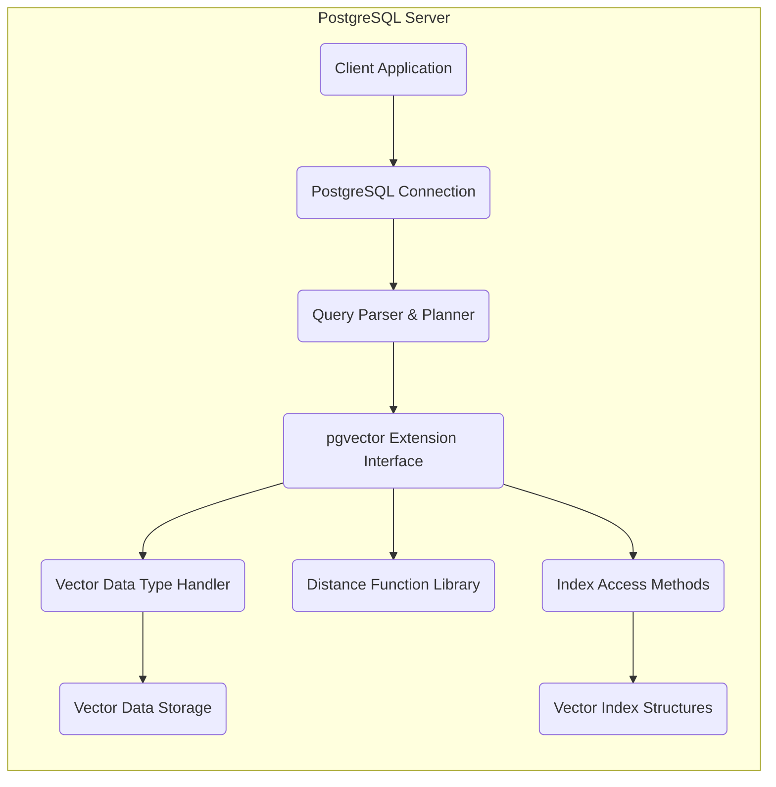
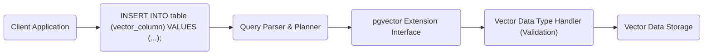
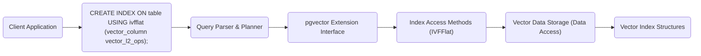
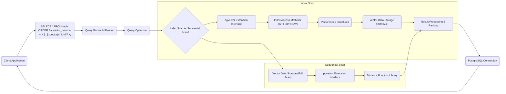

# Project Design Document: pgvector

**Version:** 1.1
**Date:** October 26, 2023
**Author:** AI Software Architect

## 1. Introduction

This document provides a detailed design overview of the `pgvector` project, a PostgreSQL extension designed for efficient similarity search of vector embeddings. This document aims to provide a comprehensive understanding of the system's architecture, data flow, and key components. It will serve as the foundation for subsequent threat modeling activities. The project repository can be found at: https://github.com/pgvector/pgvector.

## 2. Goals and Objectives

The primary goals of `pgvector` are:

*   **Efficient Storage of Vector Embeddings:** Provide a native mechanism within PostgreSQL to store vector embeddings with varying dimensions.
*   **High-Performance Similarity Search:** Enable fast and accurate similarity searches between vector embeddings, supporting various distance metrics.
*   **Deep Integration with PostgreSQL:** Integrate seamlessly with PostgreSQL's core functionalities, including data types, indexing infrastructure, and the SQL query language.
*   **Extensibility and Adaptability:** Allow for future expansion with the addition of new distance metrics, indexing algorithms, and optimization techniques.

## 3. System Architecture

The `pgvector` extension operates as an integral part of the PostgreSQL server. It introduces new data types, functions, operators, and access methods (for indexing) to effectively manage and query vector embeddings.

### 3.1. High-Level Architecture

*   **Client Application:** Any application that connects to the PostgreSQL database to interact with vector embeddings (store, query, manipulate).
*   **PostgreSQL Connection:** The standard PostgreSQL connection handling mechanism.
*   **Query Parser & Planner:** PostgreSQL's internal components responsible for parsing SQL queries and generating execution plans.
*   **pgvector Extension Interface:** The entry point for `pgvector` functionality within PostgreSQL, handling communication between the core server and the extension's components.
*   **Vector Data Type Handler:** Manages the `vector` data type, including validation, storage format, and basic operations.
*   **Distance Function Library:** Contains the implementations for various distance metrics (e.g., Euclidean, Inner Product, Cosine).
*   **Index Access Methods:** Implements the logic for different indexing algorithms (e.g., IVFFlat, HNSW) used for accelerating similarity searches.
*   **Vector Data Storage:** Standard PostgreSQL tables and storage mechanisms used to persist the raw vector data.
*   **Vector Index Structures:** Specialized data structures created and managed by the indexing methods to facilitate efficient nearest neighbor searches.

### 3.2. Detailed Component Description

*   **Vector Data Type:**
    *   Introduces a new data type `vector(n)`, where `n` defines the dimensionality of the vector.
    *   Internally, vectors are typically stored as arrays of `float4` (single-precision floating-point numbers).
    *   Supports basic vector operations like addition, subtraction, and scalar multiplication through overloaded operators.

*   **Distance Function Library:**
    *   Provides a set of functions and operators to calculate the distance or similarity between two vectors.
    *   Key distance metrics include:
        *   **Euclidean Distance (L2):** Calculated using the `<->` operator. Suitable when the magnitude and direction of vectors are both important.
        *   **Inner Product:** Calculated using the `<#>` operator (negated for descending order). Useful when the relative orientation of vectors is important, and vector norms are relatively consistent.
        *   **Cosine Distance:** Calculated using the `<=>` operator. Measures the angle between vectors, normalizing for magnitude. Appropriate when only the direction of vectors matters.

*   **Indexing Mechanisms (Access Methods):**
    *   Implements specialized indexing methods optimized for nearest neighbor search in high-dimensional spaces.
    *   Examples include:
        *   **IVFFlat (Inverted File with Flat list):**
            *   Divides the vector space into a predefined number of partitions (lists).
            *   Assigns each vector to a partition based on a clustering algorithm.
            *   During search, only a subset of partitions are searched, significantly reducing the search space.
            *   Offers a trade-off between index build time, index size, and query performance.
        *   **HNSW (Hierarchical Navigable Small World):**
            *   Builds a multi-layer graph where each layer represents a progressively coarser approximation of the data.
            *   Search starts at the top layer and navigates down to find the nearest neighbors.
            *   Generally provides better query performance than IVFFlat, especially for high recall, but can have higher index build costs and memory usage.

*   **SQL Functions and Operators:**
    *   Extends PostgreSQL's SQL capabilities with functions and operators for vector manipulation and querying:
        *   Functions to cast arrays to the `vector` type.
        *   Operators for distance calculations (`<->`, `<#>`, `<=>`).
        *   Operators for basic vector arithmetic.
        *   Allows using distance operators in `ORDER BY` clauses for efficient similarity searches with `LIMIT`.

*   **Extension Management:**
    *   Utilizes PostgreSQL's extension framework for easy installation, updates, and removal using standard SQL commands (`CREATE EXTENSION vector;`, `ALTER EXTENSION vector UPDATE;`, `DROP EXTENSION vector;`).

## 4. Data Flow

The following describes the typical data flow for storing and querying vector embeddings using the `pgvector` extension.

### 4.1. Data Insertion

*   **Client Application:** Sends an `INSERT` statement to the PostgreSQL server, including vector data for a column of type `vector`.
*   **Query Parser & Planner:** Parses the SQL statement and prepares it for execution.
*   **pgvector Extension Interface:** Receives the data and delegates handling to the appropriate `pgvector` components.
*   **Vector Data Type Handler (Validation):** Validates the provided data to ensure it conforms to the `vector` type definition (correct dimensionality, numeric values).
*   **Vector Data Storage:** The validated vector data is stored within the specified table column using PostgreSQL's standard storage mechanisms.

### 4.2. Index Creation

*   **Client Application:** Executes a `CREATE INDEX` statement specifying the desired indexing method (e.g., `ivfflat`) and the operator class corresponding to the distance metric (e.g., `vector_l2_ops` for Euclidean distance).
*   **Query Parser & Planner:** Processes the `CREATE INDEX` statement.
*   **pgvector Extension Interface:**  Invokes the appropriate index access method based on the specified index type.
*   **Index Access Methods (IVFFlat):** The `IVFFlat` indexing logic retrieves vector data from storage.
*   **Vector Data Storage (Data Access):** The raw vector data is read from the table.
*   **Vector Index Structures:** The `IVFFlat` index structure (partitions, centroids) is built and stored, ready for use in similarity searches.

### 4.3. Similarity Search

*   **Client Application:** Sends a `SELECT` query with an `ORDER BY` clause using a distance operator and a `LIMIT` clause to retrieve the top-k most similar vectors to a given query vector.
*   **Query Parser & Planner:** Parses the query and identifies the use of `pgvector` operators.
*   **Query Optimizer:** Determines the most efficient execution plan, deciding whether to use an available index or perform a sequential scan.
*   **Index Scan or Sequential Scan?:**
    *   **Index Scan:** If an appropriate index exists and the optimizer deems it beneficial, the `pgvector` extension's index access methods are invoked.
        *   **pgvector Extension Interface:** Handles the communication with the indexing logic.
        *   **Index Access Methods (IVFFlat/HNSW):** The relevant indexing algorithm is used to identify candidate vectors.
        *   **Vector Index Structures:** The index is accessed to narrow down the search.
        *   **Vector Data Storage (Retrieval):** The actual vector data for the candidate vectors is retrieved.
        *   **Result Processing & Ranking:** The distances are calculated, and the top-k nearest neighbors are identified and ranked.
    *   **Sequential Scan:** If no suitable index exists or the optimizer chooses a sequential scan, all vectors in the table are examined.
        *   **Vector Data Storage (Full Scan):** All vector data is read from the table.
        *   **pgvector Extension Interface:** Facilitates the use of the distance function library.
        *   **Distance Function Library:** The distance between the query vector and each vector in the table is calculated.
        *   **Result Processing & Ranking:** The results are sorted based on distance, and the top-k are selected.
*   **PostgreSQL Connection:** The ranked results are returned to the client application.

## 5. Security Considerations

This section outlines potential security considerations relevant to the `pgvector` extension. These will be further analyzed during the threat modeling process.

*   **Data Security:**
    *   **Confidentiality:** Protecting the confidentiality of vector embeddings, especially if they represent sensitive information. Access control policies enforced by PostgreSQL apply to tables containing vector data.
    *   **Integrity:** Ensuring the integrity of vector embeddings to prevent unauthorized modification or corruption. PostgreSQL's transaction mechanisms and Write-Ahead Logging (WAL) contribute to data integrity.

*   **Access Control:**
    *   **Authentication and Authorization:** Controlling which users and roles have permissions to create, read, update, and delete vector data and indexes. PostgreSQL's role-based access control (RBAC) is the primary mechanism for managing these permissions.

*   **Extension Security:**
    *   **Code Security:** Ensuring the `pgvector` extension code itself is free from vulnerabilities that could be exploited to compromise the PostgreSQL instance or the underlying operating system. Regular security audits and adherence to secure coding practices are important.
    *   **Dependency Management:**  Managing the security of any external libraries or dependencies used by the `pgvector` extension.

*   **Input Validation and Sanitization:**
    *   Validating the dimensionality and format of vector data provided during insertion and querying to prevent unexpected behavior, crashes, or potential injection attacks.

*   **Denial of Service (DoS):**
    *   **Resource Exhaustion:**  Potential for malicious queries that trigger computationally expensive similarity searches (especially without appropriate indexing) leading to resource exhaustion (CPU, memory, I/O). Implementing query timeouts and resource limits can mitigate this risk.
    *   **Index Bomb:**  Crafted data that could lead to inefficient or excessively large index creation, impacting performance and storage.

*   **Information Disclosure:**
    *   Care must be taken to avoid inadvertently leaking sensitive information through error messages, timing differences in query execution (timing attacks), or by exposing internal implementation details.

## 6. Deployment

Deploying the `pgvector` extension involves the following steps within a PostgreSQL environment:

*   **Compilation and Installation:** Compiling the `pgvector` source code (typically written in C) and installing the resulting shared library (`.so` file on Linux) into the PostgreSQL installation's `lib` directory.
*   **Shared Library Configuration:** Ensuring the shared library is discoverable by PostgreSQL, often by adding its directory to the `shared_preload_libraries` configuration setting in `postgresql.conf` (requires a server restart).
*   **Enabling the Extension:** Connecting to the target PostgreSQL database and executing the SQL command `CREATE EXTENSION vector;`. This registers the extension within the database.
*   **Index Configuration:** For certain indexing methods like IVFFlat, configuration parameters (e.g., `lists` for the number of partitions) might need to be tuned based on the data distribution and performance requirements.

## 7. Future Considerations

*   **Expanded Distance Metric Support:** Adding support for a wider range of distance and similarity metrics to cater to diverse use cases.
*   **Advanced Indexing Algorithms:** Implementing cutting-edge indexing techniques for improved performance and scalability in high-dimensional spaces.
*   **Quantization and Compression:** Exploring techniques to compress vector data for reduced storage footprint and faster data transfer, potentially with some trade-off in accuracy.
*   **Integration with Machine Learning Ecosystems:**  Developing tighter integrations with popular machine learning libraries and frameworks to streamline the workflow for embedding generation and similarity search.
*   **Distributed Vector Search Capabilities:** Investigating approaches for scaling vector search across a distributed PostgreSQL cluster to handle massive datasets.
*   **GPU Acceleration:** Exploring the potential for leveraging GPUs to accelerate distance calculations and indexing operations.
