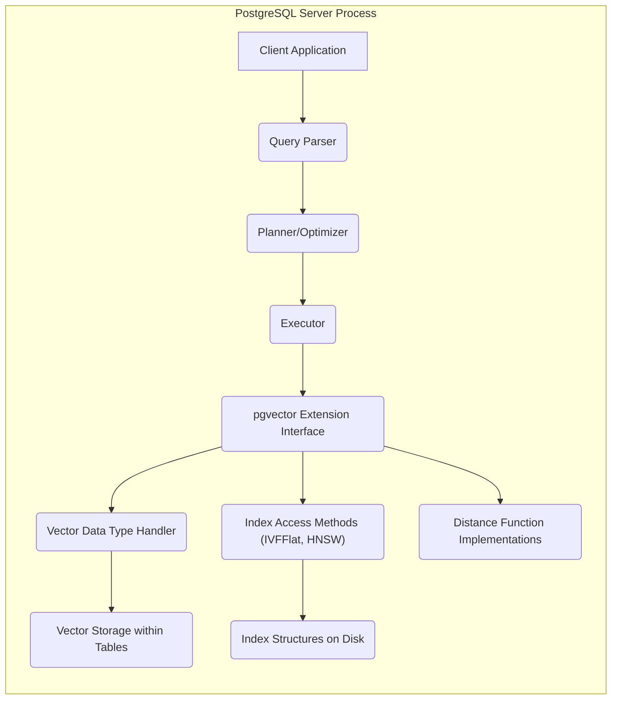
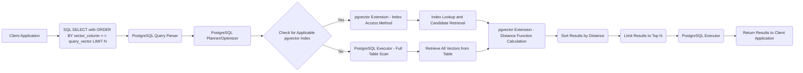

# Project Design Document: pgvector Extension for PostgreSQL

**Version:** 1.1
**Date:** October 26, 2023
**Author:** AI Software Architect

## 1. Introduction

This document provides a detailed design overview of the `pgvector` extension for PostgreSQL. This extension enables the efficient storage and querying of vector embeddings, commonly used in machine learning applications, directly within the database. This document is intended to serve as a foundational resource for subsequent threat modeling activities.

### 1.1. Purpose

The primary purpose of this document is to clearly and comprehensively articulate the architecture, components, and data flow of the `pgvector` extension. This detailed design will facilitate a thorough and effective threat model analysis, enabling the identification of potential security vulnerabilities and informing the development of appropriate mitigation strategies.

### 1.2. Scope

This document comprehensively covers the design of the `pgvector` PostgreSQL extension, including its core functionalities:

*   Definition and storage of the `vector` data type.
*   Implementation of indexing mechanisms optimized for efficient similarity search.
*   Provision of distance functions for calculating the similarity between vectors.
*   Mechanisms for processing queries involving nearest neighbor searches.
*   The interface and interactions between the `pgvector` extension and the core PostgreSQL database system.

This document explicitly excludes:

*   The internal implementation details of the PostgreSQL core database system itself.
*   The specifics of machine learning models used to generate the vector embeddings.
*   Application-level logic that utilizes the `pgvector` extension for specific use cases.
*   The operational aspects of deploying and managing a PostgreSQL instance.

### 1.3. Goals

The key goals of this design document are to:

*   Provide a clear, detailed, and easily understandable description of the `pgvector` extension's architecture.
*   Identify and describe the key components of the extension and their interactions with each other and the PostgreSQL core.
*   Illustrate the flow of data during various operations involving the extension.
*   Serve as a robust and reliable basis for conducting a comprehensive threat model analysis.

## 2. High-Level Architecture

The `pgvector` extension is tightly integrated within the PostgreSQL database server. It introduces new data types, functions, and indexing access methods that are managed directly by the PostgreSQL server process.

*   **"Client Application"**: Any application or tool that interacts with the PostgreSQL database server by sending SQL queries.
*   **"Query Parser"**: The PostgreSQL component responsible for parsing incoming SQL queries and verifying their syntax.
*   **"Planner/Optimizer"**: The PostgreSQL component that analyzes parsed queries and determines the most efficient execution plan. This includes deciding whether and how to utilize `pgvector` indexes.
*   **"Executor"**: The PostgreSQL component that executes the query plan generated by the planner, calling upon various subsystems and extensions as needed.
*   **"pgvector Extension Interface"**: The point of interaction between the PostgreSQL core and the `pgvector` extension. This involves function call handlers and access method APIs.
*   **"Vector Data Type Handler"**:  Manages the storage, retrieval, and manipulation of the `vector` data type within PostgreSQL's type system.
*   **"Index Access Methods (IVFFlat, HNSW)"**: Implements the logic for building and searching the specialized vector indexes provided by `pgvector`.
*   **"Distance Function Implementations"**: Contains the code for calculating the various distance metrics (L2, Inner Product, Cosine) between vectors.
*   **"Vector Storage within Tables"**:  Represents how the actual vector data is stored within the regular PostgreSQL table structures on disk.
*   **"Index Structures on Disk"**: Represents the on-disk representation of the `pgvector` indexes, managed by PostgreSQL's storage layer.

## 3. Component Details

This section provides a more detailed description of the key components within the `pgvector` extension.

### 3.1. Vector Data Type

*   Introduces a new fundamental data type, typically named `vector`, specifically designed to store arrays of floating-point numbers representing vector embeddings.
*   The definition of the `vector` data type includes the dimensionality of the vector, which is a fixed attribute of the column. This constraint is enforced during data insertion.
*   The underlying storage mechanism for the `vector` data type is managed by PostgreSQL's internal storage engine, similar to other built-in data types.

### 3.2. Indexing Mechanisms

`pgvector` provides specialized indexing methods to enable efficient similarity searches over large collections of vectors:

*   **IVFFlat (Inverted File with Flat list):**
    *   This method divides the high-dimensional vector space into a predefined number of partitions (often referred to as lists or clusters).
    *   Vectors are assigned to partitions based on their proximity to the partition's centroid.
    *   During a similarity search, the query vector is compared to the partition centroids, and only a subset of the partitions is searched, significantly reducing the number of distance calculations.
    *   Requires a training phase to determine the optimal partition centroids based on a sample of the data. The number of partitions is a key parameter affecting performance and accuracy.
*   **HNSW (Hierarchical Navigable Small World):**
    *   This method constructs a multi-layered graph structure where each layer represents a progressively coarser approximation of the vector space.
    *   Nodes in the graph represent vectors, and edges connect similar vectors. The graph is built in a way that allows for efficient navigation from a starting point to the nearest neighbors of a query vector.
    *   Search starts at the top layer of the hierarchy and navigates down to finer layers, quickly narrowing down the search space.
    *   Generally offers better performance and recall compared to IVFFlat, especially for high-dimensional data, but can have higher index build times and memory overhead.

### 3.3. Distance Functions

`pgvector` implements several functions to calculate the distance or similarity between two vectors:

*   **L2 Distance (Euclidean Distance):**  Calculates the standard Euclidean distance, which is the straight-line distance between the endpoints of the two vectors in the vector space. Lower values indicate greater similarity.
*   **Inner Product:** Calculates the dot product of the two vectors. For normalized vectors, a higher inner product indicates greater similarity. This is computationally efficient.
*   **Cosine Distance:** Calculates one minus the cosine of the angle between the two vectors. This measures the similarity in orientation, regardless of magnitude. A value closer to zero indicates greater similarity.

### 3.4. Query Processing

*   `pgvector` seamlessly integrates with PostgreSQL's standard query execution framework.
*   When a SQL query involves a vector similarity search (e.g., using the `<->`, `<#>`, or `<=>` operators in an `ORDER BY` clause with a `LIMIT`), the PostgreSQL query planner considers the available `pgvector` indexes.
*   The query planner selects the most efficient execution plan, potentially utilizing the IVFFlat or HNSW index access methods to speed up the search.
*   The executor then interacts with the `pgvector` extension's functions and access methods to perform the actual vector comparisons and retrieve the nearest neighbor vectors based on the chosen distance function.

### 3.5. API and Functions

The `pgvector` extension exposes a set of SQL functions and operators that allow users to interact with vector data:

*   **`vector(float[])`:** A constructor function that allows casting an array of floating-point numbers to the `vector` data type. This is used for inserting vector data.
*   **`<->` (L2 Distance Operator):** An operator that calculates the L2 distance between two `vector` values. Typically used in `ORDER BY` clauses for nearest neighbor searches.
*   **`<#>` (Negative Inner Product Operator):** An operator that calculates the negative inner product of two `vector` values. The negation is used because `ORDER BY` sorts in ascending order by default, and a higher inner product indicates greater similarity.
*   **`<=>` (Cosine Distance Operator):** An operator that calculates the cosine distance between two `vector` values. Used for finding vectors with similar orientations.
*   **Index creation commands (e.g., `CREATE INDEX ON table USING ivfflat (vector_column vector_l2_ops) WITH (lists = N);` or `CREATE INDEX ON table USING hnsw (vector_column vector_l2_ops) WITH (m = M, ef_construction = EC);`)**: SQL commands used to create the specialized vector indexes, specifying the index type and relevant parameters.

## 4. Data Flow

This section illustrates the typical flow of data during key operations involving the `pgvector` extension.

### 4.1. Vector Insertion

*   **"Client Application"**: Sends an `INSERT` statement containing vector data, typically as an array of floats.
*   **"PostgreSQL Query Parser"**: Parses the SQL statement and identifies the `vector` data type.
*   **"PostgreSQL Planner/Optimizer"**: Determines the execution plan for the insertion.
*   **"PostgreSQL Executor"**: Executes the plan, calling the appropriate handlers.
*   **"pgvector Extension - Vector Data Type Handler"**: Handles the `vector` data, ensuring correct formatting and dimensionality.
*   **"PostgreSQL Storage Engine"**:  The core PostgreSQL component responsible for writing data to disk.
*   **"Vector Data Stored in Table"**: The vector data is persisted within the specified table column.

### 4.2. Index Creation

*   **"Client Application"**: Issues a `CREATE INDEX` statement specifying either `ivfflat` or `hnsw` as the index type.
*   **"PostgreSQL Query Parser"**: Parses the `CREATE INDEX` statement.
*   **"PostgreSQL Planner/Optimizer"**: Determines the plan for building the index.
*   **"PostgreSQL Executor"**: Executes the index creation plan.
*   **"pgvector Extension - Index Access Method (IVFFlat or HNSW)"**: The specific `pgvector` component responsible for building the chosen index type.
*   **"Read Vector Data from Table"**: The index building process reads the existing vector data from the table.
*   **"Build Index Structure in Memory"**: The index structure (partitions for IVFFlat, graph for HNSW) is constructed in memory.
*   **"Persist Index Structure to Disk"**: The in-memory index structure is written to disk and managed by PostgreSQL's storage engine.
*   **"Index Ready for Use"**: The index is now available for optimizing similarity queries.

### 4.3. Similarity Query

*   **"Client Application"**: Sends a `SELECT` query that includes an `ORDER BY` clause using a vector distance operator and a `LIMIT` clause.
*   **"PostgreSQL Query Parser"**: Parses the SQL query.
*   **"PostgreSQL Planner/Optimizer"**: Analyzes the query and attempts to find the most efficient execution plan.
*   **"Check for Applicable pgvector Index"**: The planner checks if a suitable `pgvector` index exists on the relevant vector column.
*   **"pgvector Extension - Index Access Method"**: If an index exists, the appropriate `pgvector` index access method (IVFFlat or HNSW) is invoked.
*   **"PostgreSQL Executor - Full Table Scan"**: If no suitable index exists, a full table scan will be performed.
*   **"Index Lookup and Candidate Retrieval"**: The index is used to efficiently retrieve a set of candidate vectors that are likely to be the nearest neighbors.
*   **"Retrieve All Vectors from Table"**: In the case of a full table scan, all vectors are retrieved.
*   **"pgvector Extension - Distance Function Calculation"**: The `pgvector` extension calculates the distances between the query vector and the candidate vectors (or all vectors in a full scan).
*   **"Sort Results by Distance"**: The results are sorted based on the calculated distances.
*   **"Limit Results to Top N"**: The result set is limited to the top N nearest neighbors as specified in the query.
*   **"PostgreSQL Executor"**: The executor manages the overall query execution.
*   **"Return Results to Client Application"**: The final results are returned to the client application.

## 5. Security Considerations (For Threat Modeling)

This section details potential security considerations relevant for threat modeling, categorized for clarity.

*   **Access Control:**
    *   **Threat:** Unauthorized Read Access: Users with insufficient privileges might attempt to read sensitive vector data, potentially revealing proprietary information or user behaviors learned by machine learning models.
    *   **Threat:** Unauthorized Write Access: Malicious actors could try to insert or modify vector data, corrupting the dataset and potentially skewing the results of machine learning models or influencing decision-making processes.
    *   **Threat:** Unauthorized Index Manipulation: Users with excessive privileges could create, modify, or drop `pgvector` indexes, leading to denial of service (by dropping indexes) or performance degradation (by creating inefficient indexes).
*   **Data Security:**
    *   **Threat:** Data Breach at Rest: If the underlying PostgreSQL storage is compromised, the vector data, including potentially sensitive embeddings, could be exposed.
    *   **Threat:** Data Breach in Transit (Internal): While less likely within the database server, vulnerabilities in internal communication could theoretically expose vector data.
    *   **Threat:** Information Leakage through Embeddings: Even without direct access to the original data, analysis of vector embeddings themselves might reveal sensitive information or patterns.
*   **Input Validation:**
    *   **Threat:** Injection Attacks (Vector Data): Maliciously crafted vector data with unexpected dimensions or values could potentially cause buffer overflows or other vulnerabilities in the `pgvector` extension or PostgreSQL.
    *   **Threat:** SQL Injection (Indirect): While `pgvector` itself doesn't directly parse SQL, vulnerabilities in how applications construct SQL queries using vector data could lead to SQL injection attacks.
*   **Index Security:**
    *   **Threat:** Index Corruption: An attacker might try to corrupt the index structures, leading to incorrect search results or denial of service.
    *   **Threat:** Index Exhaustion: Creating excessively large or numerous indexes could consume significant storage space and resources, potentially leading to denial of service.
    *   **Threat:** Timing Attacks on Index Lookup: Subtle variations in query execution time based on index structure or data distribution could potentially be exploited to infer information about the vector data.
*   **Distance Function Security:**
    *   **Threat:** Algorithmic Complexity Exploitation: Certain distance functions, if not implemented carefully, might have performance vulnerabilities that could be exploited for denial of service.
*   **Extension Security:**
    *   **Threat:** Vulnerabilities in `pgvector` Code: Bugs or security flaws in the `pgvector` extension's C code could be exploited to compromise the database server.
    *   **Threat:** Dependency Vulnerabilities: If `pgvector` relies on external libraries, vulnerabilities in those dependencies could pose a security risk.
    *   **Threat:** Malicious Extension Replacement: An attacker with sufficient privileges might try to replace the legitimate `pgvector` extension with a malicious version.
*   **Resource Consumption:**
    *   **Threat:** Denial of Service through Expensive Queries: Maliciously crafted similarity queries without appropriate limits or using inefficient distance functions could consume excessive CPU, memory, and I/O resources, leading to denial of service.
    *   **Threat:** Denial of Service through Index Creation: Attempting to create extremely large or complex indexes could overwhelm the server's resources.
*   **Side-Channel Attacks:**
    *   **Threat:** Timing Attacks: Observing the execution time of similarity queries could potentially reveal information about the underlying vector data or index structure.

## 6. Deployment Considerations

*   The `pgvector` extension must be explicitly installed and enabled within each PostgreSQL database where it will be used. This typically involves using the `CREATE EXTENSION vector;` command after the extension's shared library is available to PostgreSQL.
*   Installation often requires compiling the extension from source code or using pre-built packages provided by operating system distributions or package managers.
*   Careful consideration should be given to the storage requirements for vector data and the chosen index structures. HNSW indexes, in particular, can have significant memory overhead.
*   Performance tuning of indexing parameters is crucial for achieving optimal query performance. This includes parameters like the number of lists in IVFFlat and the `m` and `ef_construction` parameters in HNSW. These parameters should be adjusted based on the specific dataset and performance requirements.
*   Regularly updating the `pgvector` extension to the latest version is important to benefit from bug fixes and security patches.

## 7. Future Considerations

*   Exploration and potential implementation of more advanced and specialized indexing techniques for vector similarity search.
*   Deeper integration with other PostgreSQL features, such as table partitioning and read replicas, to improve scalability and availability.
*   Investigation into the potential for leveraging hardware acceleration (e.g., GPUs) to speed up vector operations.
*   Support for different vector data types, such as quantized vectors, to reduce storage costs and improve performance in certain scenarios.
*   Enhancements to the query planner to more effectively optimize queries involving vector similarity searches in complex scenarios.

This improved design document provides a more detailed and nuanced understanding of the `pgvector` extension for PostgreSQL. It aims to be a more effective resource for conducting a thorough threat model by providing specific examples of potential threats within each security consideration category.