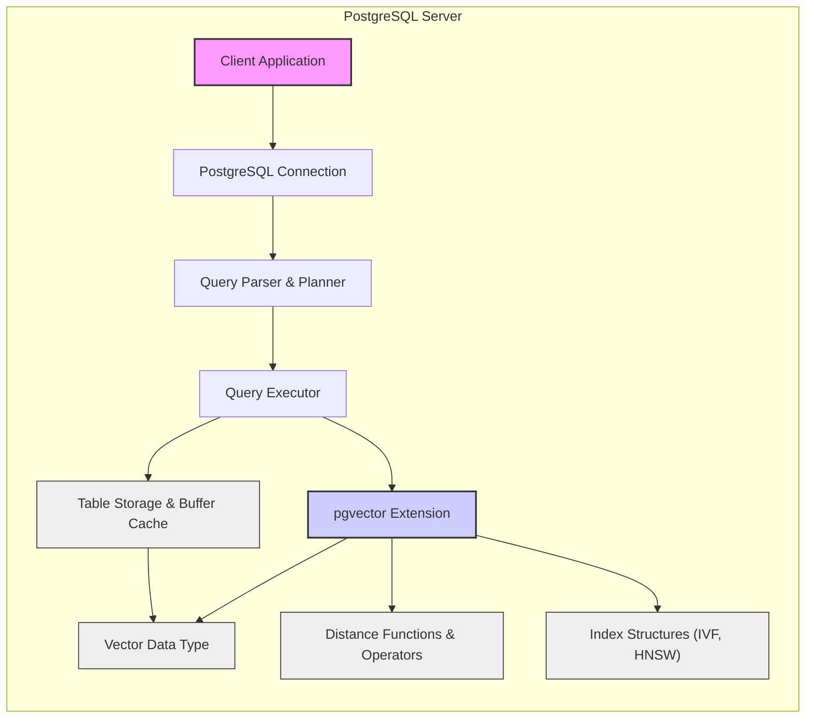

# Project Design Document: pgvector PostgreSQL Extension

**Project Name:** pgvector

**Project URL:** [https://github.com/pgvector/pgvector](https://github.com/pgvector/pgvector)

**Document Version:** 1.1

**Date:** 2023-10-27

**Author:** AI Cloud & Security Expert

## 1. Introduction

This document provides a detailed design overview of the pgvector PostgreSQL extension. pgvector is an open-source extension that adds robust vector similarity search capabilities to PostgreSQL. It is designed for efficient storage and querying of vector embeddings, enabling advanced applications like machine learning feature stores, recommendation engines, semantic search, and anomaly detection directly within the PostgreSQL database. This document aims to provide a comprehensive and clear understanding of pgvector's architecture, components, data flow, and technology stack. This detailed design will serve as a crucial foundation for subsequent threat modeling activities, ensuring the security and robustness of systems leveraging pgvector.

## 2. Project Overview

pgvector extends PostgreSQL by introducing a native `vector` data type and specialized indexing methods, allowing users to perform high-performance similarity searches on vector embeddings directly within their existing PostgreSQL infrastructure. This eliminates the need for separate, specialized vector databases in many use cases, simplifying application architectures and reducing operational complexity.

**Key Features:**

*   **Native Vector Data Type:** Introduces the `vector` data type to PostgreSQL, optimized for storing and manipulating vector embeddings as arrays of floating-point numbers.
*   **Comprehensive Distance Operators:** Provides a suite of operators for calculating vector distances, including Euclidean distance (`<->`), cosine distance (`<#>` ), and inner product (`<*>`), catering to various similarity measurement needs.
*   **Advanced Indexing Methods:** Supports state-of-the-art indexing methods like IVF (Inverted File Index) for large datasets and HNSW (Hierarchical Navigable Small World) for high-performance approximate nearest neighbor search, enabling efficient querying at scale.
*   **Seamless SQL Integration:**  Integrates deeply with standard SQL, allowing users to leverage familiar SQL syntax for vector operations, making it easy to incorporate vector search into existing database workflows.
*   **Open Source and Community-Driven:** Released under the PostgreSQL License, fostering community collaboration, transparency, and continuous improvement.
*   **Extensible Distance Functions:** Allows for the potential addition of custom distance functions to support specialized similarity metrics beyond the built-in options.

## 3. System Architecture

pgvector is designed as a tightly integrated PostgreSQL extension, operating within the PostgreSQL server process. It enhances the core database functionalities by introducing new data types, functions, operators, and index access methods.

### 3.1. High-Level Architecture Diagram

**Diagram Description:**

*   **"Client Application"**: Represents any application (e.g., web service, data pipeline, analytical tool) that interacts with PostgreSQL to store and query vector data.
*   **"PostgreSQL Connection"**:  The established network connection between the client application and the PostgreSQL server instance.
*   **"Query Parser & Planner"**: PostgreSQL core components responsible for parsing incoming SQL queries, validating syntax, and generating optimized query execution plans.
*   **"Query Executor"**: PostgreSQL core component that executes the query plan, orchestrating data retrieval, function calls, and interactions with storage and extensions.
*   **"pgvector Extension"**: The pgvector extension module, dynamically loaded into the PostgreSQL server at runtime, providing vector-specific functionalities.
*   **"Vector Data Type"**: The custom `vector` data type defined by pgvector, used for storing vector embeddings as arrays of floating-point numbers within PostgreSQL tables.  Internally, vectors are likely stored as contiguous blocks of memory for efficiency.
*   **"Distance Functions & Operators"**:  The set of functions (e.g., `l2_distance`, `cosine_distance`, `inner_product`) and operators (`<->`, `<#>`, `<*>`) provided by pgvector to calculate vector distances and similarities. These are implemented in C for performance.
*   **"Index Structures (IVF, HNSW)"**:  Specialized index structures implemented by pgvector to accelerate vector similarity searches. IVF is suitable for large datasets, while HNSW offers a balance of speed and accuracy. These indexes are built and maintained by pgvector within PostgreSQL's indexing framework.
*   **"Table Storage & Buffer Cache"**: PostgreSQL's storage layer responsible for persistent data storage on disk and the buffer cache for in-memory data access. Vector data and index structures are stored and managed within this layer, benefiting from PostgreSQL's robust storage mechanisms.

### 3.2. Component Description

1.  **Vector Data Type:**
    *   **Purpose:**  Defines the fundamental `vector` data type within PostgreSQL. This type is used to represent and store vector embeddings as ordered arrays of floating-point numbers.
    *   **Implementation:** Implemented in C as a custom PostgreSQL data type.  Likely utilizes PostgreSQL's variable-length data type infrastructure (`VARLENA`).  Storage format is likely a contiguous array of floats, potentially with metadata for dimensions. Data validation might include checks on vector dimension and data type.
    *   **Security Considerations:**
        *   **Data Confidentiality:**  Vector data, depending on its source, may contain sensitive information. PostgreSQL's standard access control mechanisms (row-level security, column privileges) should be applied to tables containing vector data. Encryption at rest (PostgreSQL feature) can further protect data confidentiality.
        *   **Data Integrity:**  PostgreSQL's transactional integrity and storage mechanisms ensure the reliability of vector data storage. Checksums and WAL (Write-Ahead Logging) contribute to data integrity.

2.  **Distance Operators and Functions:**
    *   **Purpose:** Provides SQL operators and functions to efficiently calculate distances and similarities between vectors. Supports common metrics like Euclidean distance, cosine distance, and inner product.
    *   **Implementation:** Implemented as highly optimized C functions within the pgvector extension. These functions are designed for performance and are likely vectorized where possible.
    *   **Security Considerations:**
        *   **Input Validation:**  Distance functions should validate input vectors to prevent unexpected behavior or crashes. This includes checking for NULL vectors, correct data types, and potentially dimension compatibility if enforced.
        *   **Performance and Resource Consumption:** Distance calculations, especially on large vectors or in bulk, can be CPU-intensive.  Maliciously crafted queries with very large vectors or excessive distance calculations could lead to denial-of-service. Query timeouts and resource limits within PostgreSQL can mitigate this.

3.  **Index Types (IVF, HNSW):**
    *   **Purpose:** Implements indexing methods to drastically accelerate vector similarity searches, especially for large datasets. IVF and HNSW are approximate nearest neighbor (ANN) search algorithms, offering trade-offs between search speed and accuracy.
    *   **Implementation:** Implemented in C, deeply integrated with PostgreSQL's indexing infrastructure as custom access methods.  Index structures are built on top of the `vector` data type and utilize distance operators for index construction and search.
    *   **Security Considerations:**
        *   **Index Integrity:**  The integrity of index structures is critical for search accuracy and reliability. PostgreSQL's storage mechanisms and transaction management ensure index consistency.
        *   **Index Build Resource Consumption:** Building vector indexes, especially HNSW, can be resource-intensive (CPU, memory, disk I/O).  Uncontrolled index creation could lead to resource exhaustion and denial-of-service.  Resource monitoring and appropriate index creation scheduling are important.
        *   **Approximate Search Trade-offs:**  Users should be aware that IVF and HNSW are approximate algorithms.  The accuracy vs. speed trade-off should be considered in security-sensitive applications where precise results are paramount.

4.  **Extension Loading and Management:**
    *   **Purpose:**  Enables users to easily load, update, and manage the pgvector extension within their PostgreSQL database using standard SQL commands (`CREATE EXTENSION vector;`, `ALTER EXTENSION vector UPDATE;`, `DROP EXTENSION vector;`).
    *   **Implementation:** Leverages PostgreSQL's robust extension framework. Extension loading typically requires database superuser privileges.
    *   **Security Considerations:**
        *   **Trusted Source:**  Extensions should always be loaded from trusted sources (e.g., official PostgreSQL extension repositories, reputable package managers).  Loading extensions from untrusted sources poses a significant security risk, potentially introducing malicious code into the database server.
        *   **Privilege Management:**  Access to extension management commands should be restricted to authorized database administrators.  Uncontrolled extension loading and management can lead to security vulnerabilities.

## 4. Data Flow

The primary data flows in pgvector involve vector data ingestion (insertion and updates) and vector similarity search queries.

**4.1. Vector Data Ingestion:**

1.  **Client Application** initiates data ingestion by sending SQL `INSERT` or `UPDATE` statements to PostgreSQL containing vector data.
2.  **PostgreSQL Connection** receives the SQL statement and passes it to the query processing pipeline.
3.  **PostgreSQL Query Parser & Planner** parses the SQL statement, validates syntax, and generates an optimized execution plan for data insertion or update.
4.  **PostgreSQL Query Executor** executes the plan. When processing `vector` data:
    *   The **pgvector Extension**'s data type handler is invoked to process and store the vector data. This may involve data validation and serialization into the storage format.
    *   If an index (IVF or HNSW) is defined on the `vector` column being modified, the **pgvector Extension**'s index management routines are called to update the index structure to reflect the new or modified vector data. Index updates can be synchronous or asynchronous depending on index type and configuration.
5.  **PostgreSQL Table Storage & Buffer Cache** persists the vector data and index updates to disk and manages caching for efficient access.  WAL ensures durability and recoverability of data changes.

**4.2. Vector Similarity Search:**

1.  **Client Application** sends an SQL `SELECT` query to PostgreSQL to perform a vector similarity search. The query typically includes a `WHERE` clause using pgvector distance operators (e.g., `ORDER BY vector_column <-> query_vector LIMIT N`) to find nearest neighbors.
2.  **PostgreSQL Connection** receives the query and passes it to the query processing pipeline.
3.  **PostgreSQL Query Parser & Planner** parses the SQL query, recognizes pgvector operators and functions, and generates a query plan. The planner will attempt to utilize available vector indexes (IVF, HNSW) if they are suitable for the query.
4.  **PostgreSQL Query Executor** executes the query plan.
    *   **Index-Based Search (if applicable):** If an appropriate index (IVF or HNSW) exists and is chosen by the planner, the **pgvector Extension**'s index access methods are invoked. The index is used to efficiently perform an approximate nearest neighbor search, significantly reducing the number of distance calculations required.
    *   **Sequential Scan (no index or exact search):** If no suitable index is available or an exact search is requested, the **pgvector Extension**'s distance functions are used to calculate distances between the query vector and vectors in the table (or a relevant subset based on other query predicates). This involves a sequential scan of the table data.
5.  **PostgreSQL Query Executor** retrieves the results (nearest neighbor vectors and their associated data) and returns them to the **Client Application** via the PostgreSQL connection.

## 5. Technology Stack

*   **Programming Language:** C (for the core pgvector extension implementation, including data type, distance functions, and indexing algorithms).
*   **Database:** PostgreSQL (pgvector is designed as an extension for PostgreSQL; version compatibility should be verified against pgvector documentation).
*   **SQL:** Standard SQL is used to interact with pgvector functionalities, including data definition language (DDL) for creating vector columns and indexes, and data manipulation language (DML) for inserting, updating, and querying vector data.
*   **Build System:** PostgreSQL's extension build infrastructure, typically utilizing `pg_config` for PostgreSQL configuration and standard `Makefile` conventions for compilation and installation.
*   **Version Control:** Git, used for the pgvector project repository hosted on GitHub ([https://github.com/pgvector/pgvector](https://github.com/pgvector/pgvector)).
*   **Testing Framework:** Likely uses PostgreSQL's regression testing framework for unit and integration testing of the extension.

## 6. Security Considerations

This section details security considerations relevant to pgvector, providing a basis for comprehensive threat modeling.

*   **Data Confidentiality:**
    *   Vector embeddings may encode sensitive information. Access control to tables containing vector data using PostgreSQL's RBAC and row-level security is crucial.
    *   Consider enabling encryption at rest for PostgreSQL to protect vector data stored on disk.
    *   Ensure secure connections (TLS/SSL) between client applications and PostgreSQL to protect vector data in transit.

*   **Data Integrity:**
    *   PostgreSQL's transactional mechanisms and WAL provide inherent data integrity.
    *   Regular database backups and restore procedures are essential for disaster recovery and data integrity maintenance.
    *   Consider implementing data validation at the application level before inserting vector data into the database to ensure data quality and prevent unexpected behavior.

*   **Extension Security:**
    *   pgvector, being a C extension, runs within the PostgreSQL server process. Vulnerabilities in pgvector's C code could potentially compromise the entire PostgreSQL instance.
    *   Thorough code reviews, static analysis, and security testing of the pgvector extension are highly recommended.
    *   Always use official releases of pgvector from trusted sources. Verify checksums or signatures if available.
    *   Keep pgvector updated to the latest version to benefit from security patches and bug fixes.

*   **Resource Consumption & Denial of Service:**
    *   Vector indexing and similarity search operations, especially with large datasets and complex indexes, can be resource-intensive (CPU, memory, disk I/O).
    *   Maliciously crafted queries with extremely large vectors, very high dimensionality, or unbounded result sets could lead to denial-of-service.
    *   Implement query timeouts and resource limits within PostgreSQL to prevent resource exhaustion.
    *   Monitor resource usage during vector operations and optimize queries and index configurations for performance.

*   **Input Validation & SQL Injection:**
    *   pgvector functions and operators should perform robust input validation to prevent vulnerabilities like buffer overflows or unexpected behavior due to malformed vector data.
    *   While direct SQL injection vulnerabilities within pgvector itself are less likely, ensure that applications using pgvector properly sanitize user inputs when constructing SQL queries that include vector data or distance calculations, especially when using dynamic SQL.

*   **Access Control to Extension Functions & Operators:**
    *   PostgreSQL's RBAC primarily controls table access. While function-level permissions are generally less granular, consider if specific roles or users should be restricted from using certain pgvector functions or operators if fine-grained access control is required.

*   **Dependency Security:**
    *   Assess the security of any external libraries or dependencies used by pgvector (if any).
    *   Keep dependencies updated to the latest versions with security patches.
    *   Perform dependency scanning to identify known vulnerabilities in pgvector's dependencies.

*   **Privilege Escalation:**
    *   Carefully review pgvector's code and functionality for any potential privilege escalation vulnerabilities. Ensure that pgvector operations are performed with the least necessary privileges within the PostgreSQL server.

## 7. Threat Modeling Scope

This design document provides the necessary information for conducting comprehensive threat modeling for pgvector. The threat modeling scope should encompass:

*   **Data Flow Analysis:**  Detailed analysis of the data ingestion and similarity search data flows (Section 4) to pinpoint potential interception, manipulation, or disruption points.
*   **Component-Level Threat Analysis:**  In-depth examination of each component (Section 3.2) – Vector Data Type, Distance Functions, Index Types, Extension Management – to identify component-specific threats and vulnerabilities.
*   **Attack Surface Identification:**  Mapping the attack surface exposed by pgvector, including SQL interfaces (operators, functions, data type), extension management commands, and any potential internal interfaces or interactions with PostgreSQL internals.
*   **Threat and Vulnerability Assessment:**  Systematic identification of potential threats (e.g., data breaches, denial-of-service, privilege escalation, data corruption) and vulnerabilities (e.g., buffer overflows, input validation flaws, insecure dependencies) based on the security considerations outlined in Section 6 and common threat modeling frameworks (e.g., STRIDE, PASTA).
*   **Risk Assessment:**  Evaluation of the likelihood and impact of each identified threat and vulnerability to prioritize mitigation efforts.
*   **Mitigation Strategy Development:**  Formulation of concrete mitigation strategies and security controls to address identified risks and enhance the security posture of systems utilizing pgvector. This may include code hardening, input validation improvements, access control enhancements, resource limiting, security monitoring, and secure deployment practices.

This threat modeling process, guided by this design document, will be crucial for proactively identifying and mitigating security risks associated with pgvector, ensuring its secure and reliable operation within applications that depend on vector similarity search capabilities in PostgreSQL.