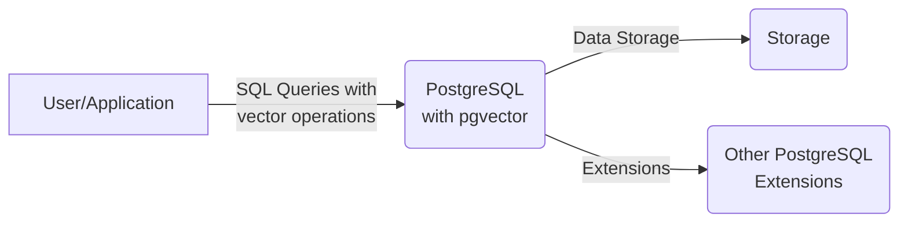
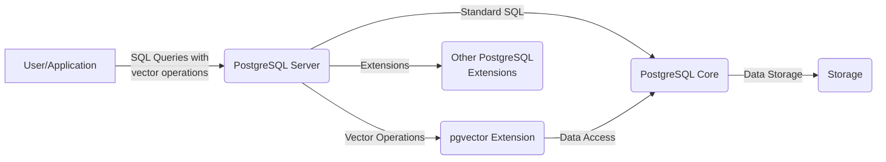
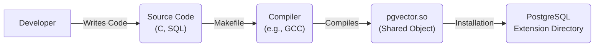

Okay, let's create a design document for the pgvector project.

# BUSINESS POSTURE

Business Priorities and Goals:

*   Provide efficient and scalable vector similarity search capabilities within PostgreSQL.
*   Enable developers to easily integrate vector embeddings and similarity search into their applications using a familiar SQL interface.
*   Offer a performant and cost-effective solution compared to dedicated vector databases.
*   Maintain compatibility with existing PostgreSQL infrastructure and tooling.
*   Provide open-source solution to attract community and contributions.

Most Important Business Risks:

*   Data breaches or unauthorized access to sensitive vector data stored within PostgreSQL.
*   Performance bottlenecks or scalability issues impacting the usability of applications relying on pgvector.
*   Vulnerabilities in the extension code leading to PostgreSQL instability or crashes.
*   Lack of adoption due to complexity or compatibility issues.
*   Competition from other vector databases or PostgreSQL extensions.

# SECURITY POSTURE

Existing Security Controls:

*   security control: Relies on PostgreSQL's built-in security mechanisms for authentication, authorization, and access control (role-based access control, row-level security). (Described in PostgreSQL documentation)
*   security control: Leverages PostgreSQL's data encryption capabilities (if configured) for data at rest and in transit. (Described in PostgreSQL documentation)
*   security control: Input validation is performed to prevent SQL injection and other common vulnerabilities. (Implemented in the C code of the extension)
*   security control: The project is open-source, allowing for community review and contributions to identify and address security vulnerabilities. (Visible in the GitHub repository)

Accepted Risks:

*   accepted risk: The security of pgvector is inherently tied to the security of the underlying PostgreSQL installation. Any vulnerabilities or misconfigurations in PostgreSQL could impact pgvector.
*   accepted risk: The extension is written in C, which introduces the potential for memory management errors and related vulnerabilities if not carefully coded.
*   accepted risk: Users are responsible for appropriately managing the dimensionality and scale of their vector data to avoid performance issues.

Recommended Security Controls:

*   security control: Implement fuzz testing to identify potential vulnerabilities in the C code.
*   security control: Conduct regular security audits and penetration testing of the extension and its integration with PostgreSQL.
*   security control: Provide clear documentation and guidelines on securely configuring and using pgvector, including best practices for data protection and access control.
*   security control: Establish a vulnerability disclosure program to encourage responsible reporting of security issues.
*   security control: Integrate static analysis tools into the build process to identify potential code vulnerabilities.

Security Requirements:

*   Authentication: Relies on PostgreSQL's authentication mechanisms. No additional authentication is required specifically for pgvector.
*   Authorization: Utilizes PostgreSQL's role-based access control and row-level security to manage access to vector data and operations.
*   Input Validation: The extension must perform thorough input validation to prevent SQL injection and other injection attacks. This includes validating vector data, operator arguments, and any other user-supplied input.
*   Cryptography: Relies on PostgreSQL's encryption capabilities for data at rest and in transit. pgvector itself does not implement custom encryption.

# DESIGN

## C4 CONTEXT



Element Description:

*   Element:
    *   Name: User/Application
    *   Type: User/External System
    *   Description: Represents any user or application that interacts with PostgreSQL to perform vector similarity searches using pgvector.
    *   Responsibilities: Sending SQL queries containing vector operations to PostgreSQL.
    *   Security controls: Authentication and authorization managed by the application and PostgreSQL.

*   Element:
    *   Name: PostgreSQL with pgvector
    *   Type: System
    *   Description: The core PostgreSQL database system with the pgvector extension installed.
    *   Responsibilities: Processing SQL queries, executing vector operations, managing data storage, and enforcing security policies.
    *   Security controls: PostgreSQL's built-in security mechanisms (authentication, authorization, access control, encryption).

*   Element:
    *   Name: Storage
    *   Type: External System
    *   Description: The underlying storage system used by PostgreSQL to store data, including vector data.
    *   Responsibilities: Providing persistent storage for all data managed by PostgreSQL.
    *   Security controls: Data encryption at rest (if configured in PostgreSQL).

*   Element:
    *   Name: Other PostgreSQL Extensions
    *   Type: External System
    *   Description: Other extensions that may be installed within the PostgreSQL instance.
    *   Responsibilities: Providing additional functionality to PostgreSQL.
    *   Security controls: Dependent on the specific extensions installed.

## C4 CONTAINER

Since pgvector is a PostgreSQL extension, the container diagram is essentially an extension of the context diagram.



Element Description:

*   Element:
    *   Name: User/Application
    *   Type: User/External System
    *   Description: Represents any user or application that interacts with PostgreSQL to perform vector similarity searches using pgvector.
    *   Responsibilities: Sending SQL queries containing vector operations to PostgreSQL.
    *   Security controls: Authentication and authorization managed by the application and PostgreSQL.

*   Element:
    *   Name: PostgreSQL Server
    *   Type: Container
    *   Description: The main PostgreSQL server process.
    *   Responsibilities: Handling client connections, parsing SQL queries, managing query execution, and coordinating with extensions.
    *   Security controls: PostgreSQL's built-in security mechanisms.

*   Element:
    *   Name: pgvector Extension
    *   Type: Container
    *   Description: The pgvector extension code that provides vector similarity search functionality.
    *   Responsibilities: Implementing vector data types, operators, and index support.
    *   Security controls: Input validation, reliance on PostgreSQL's security mechanisms.

*   Element:
    *   Name: PostgreSQL Core
    *   Type: Container
    *   Description: The core components of PostgreSQL, including the query parser, planner, executor, and storage engine.
    *   Responsibilities: Handling standard SQL operations, managing data storage, and enforcing security policies.
    *   Security controls: PostgreSQL's built-in security mechanisms.

*   Element:
    *   Name: Storage
    *   Type: External System
    *   Description: The underlying storage system used by PostgreSQL.
    *   Responsibilities: Providing persistent storage for all data.
    *   Security controls: Data encryption at rest (if configured).

*   Element:
    *   Name: Other PostgreSQL Extensions
    *   Type: External System
    *   Description: Other extensions that may be installed within the PostgreSQL instance.
    *   Responsibilities: Providing additional functionality to PostgreSQL.
    *   Security controls: Dependent on the specific extensions installed.

## DEPLOYMENT

pgvector is deployed as a PostgreSQL extension. There are several deployment options:

1.  **Self-managed PostgreSQL:** Install pgvector on a self-managed PostgreSQL instance (e.g., on a virtual machine or bare-metal server).
2.  **Cloud-managed PostgreSQL:** Use a cloud provider's managed PostgreSQL service (e.g., Amazon RDS, Azure Database for PostgreSQL, Google Cloud SQL) and install pgvector as an extension.
3.  **Docker:** Use a pre-built Docker image that includes PostgreSQL and pgvector.

We will describe the cloud-managed PostgreSQL deployment on AWS (Amazon RDS) in detail:

```mermaid
graph LR
    A["User/Application"] -- "Network" --> B("AWS Region");
    B -- "" --> C("VPC");
    C -- "" --> D("Subnet (Public)");
    C -- "" --> E("Subnet (Private)");
    D -- "" --> F("Internet Gateway");
    E -- "" --> G("RDS PostgreSQL Instance\n(with pgvector)");
    G -- "" --> H("EBS Volume");

```

Element Description:

*   Element:
    *   Name: User/Application
    *   Type: User/External System
    *   Description: The application accessing the PostgreSQL database.
    *   Responsibilities: Connecting to the database and executing queries.
    *   Security controls: Application-level security controls, network security.

*   Element:
    *   Name: AWS Region
    *   Type: Deployment Node
    *   Description: The geographical region where the resources are deployed.
    *   Responsibilities: Providing the infrastructure for the deployment.
    *   Security controls: AWS infrastructure security.

*   Element:
    *   Name: VPC
    *   Type: Deployment Node
    *   Description: Virtual Private Cloud, a logically isolated section of the AWS Cloud.
    *   Responsibilities: Providing a private network for the resources.
    *   Security controls: Network ACLs, security groups.

*   Element:
    *   Name: Subnet (Public)
    *   Type: Deployment Node
    *   Description: A subnet within the VPC that has a route to the internet.
    *   Responsibilities: Hosting resources that require direct internet access (not applicable in this case).
    *   Security controls: Network ACLs, security groups.

*   Element:
    *   Name: Subnet (Private)
    *   Type: Deployment Node
    *   Description: A subnet within the VPC that does not have a direct route to the internet.
    *   Responsibilities: Hosting resources that should not be directly accessible from the internet.
    *   Security controls: Network ACLs, security groups.

*   Element:
    *   Name: Internet Gateway
    *   Type: Deployment Node
    *   Description: Enables communication between instances in the VPC and the internet.
    *   Responsibilities: Routing traffic to and from the internet.
    *   Security controls: AWS infrastructure security.

*   Element:
    *   Name: RDS PostgreSQL Instance (with pgvector)
    *   Type: Deployment Node
    *   Description: The managed PostgreSQL database instance with the pgvector extension installed.
    *   Responsibilities: Running the PostgreSQL database and pgvector extension.
    *   Security controls: RDS security features (encryption at rest, encryption in transit, IAM integration, security groups).

*   Element:
    *   Name: EBS Volume
    *   Type: Deployment Node
    *   Description: The storage volume attached to the RDS instance.
    *   Responsibilities: Providing persistent storage for the database.
    *   Security controls: EBS encryption.

## BUILD

The pgvector project is built using a Makefile. The build process involves compiling the C code into a PostgreSQL extension.



Build Process Security Controls:

*   security control: The Makefile can be extended to include static analysis tools (e.g., linters, SAST scanners) to identify potential code vulnerabilities during the build process.
*   security control: The build process can be automated using a CI/CD system (e.g., GitHub Actions) to ensure consistent and reproducible builds.
*   security control: The CI/CD pipeline can be configured to run tests (including security tests) before deploying the extension.
*   security control: Dependency management should be carefully considered to avoid introducing vulnerable dependencies.

# RISK ASSESSMENT

Critical Business Processes:

*   Storing and retrieving vector embeddings.
*   Performing similarity searches on vector data.
*   Integrating vector search into applications.

Data Sensitivity:

*   Vector embeddings may represent sensitive data, such as user profiles, product information, or financial data. The sensitivity of the data depends on the specific application.
*   The sensitivity of the vector data should be assessed and appropriate security controls should be implemented to protect it.

# QUESTIONS & ASSUMPTIONS

Questions:

*   What is the specific threat model for the applications that will use pgvector?
*   What are the regulatory requirements for the data that will be stored as vector embeddings?
*   What is the expected scale of the vector data (number of vectors, dimensionality)?
*   Are there any specific performance requirements for the similarity searches?

Assumptions:

*   BUSINESS POSTURE: The primary goal is to provide a secure and reliable vector similarity search solution within PostgreSQL.
*   SECURITY POSTURE: PostgreSQL's built-in security mechanisms are properly configured and maintained.
*   DESIGN: The deployment environment will be properly secured according to best practices.