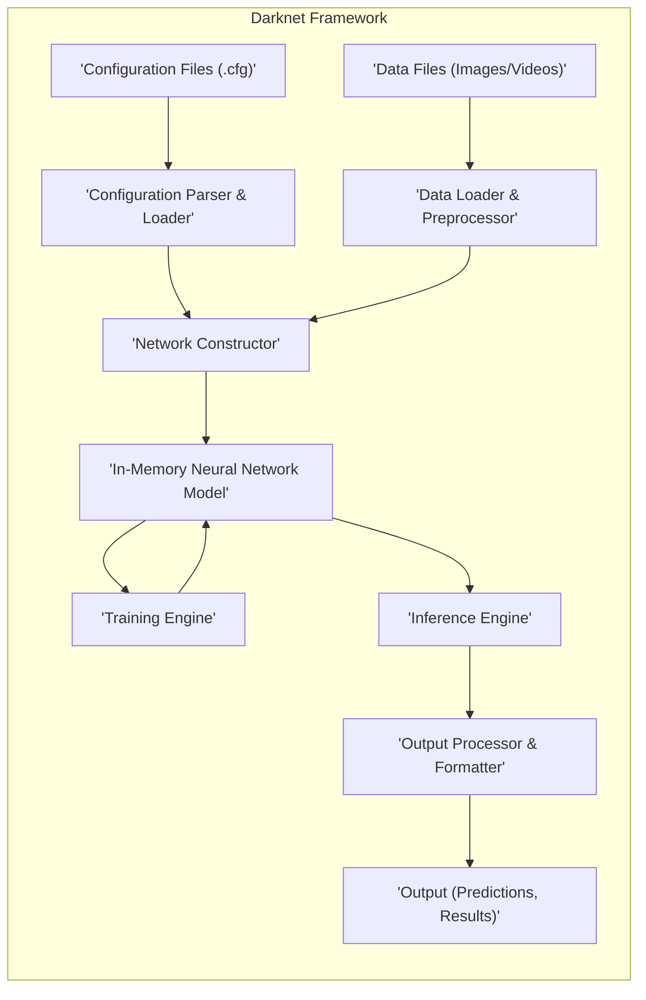
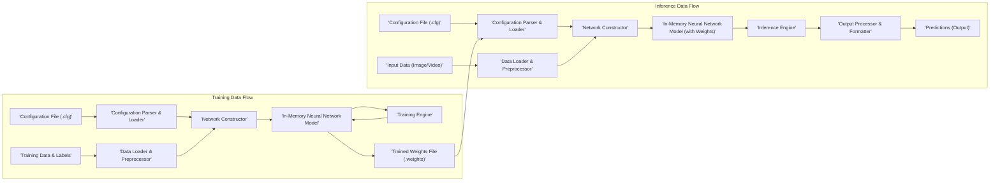

# Project Design Document: Darknet Framework

**Version:** 1.1
**Date:** October 26, 2023
**Author:** AI Architecture Expert

## 1. Introduction

This document provides an enhanced design overview of the Darknet framework, an open-source neural network framework primarily implemented in C and leveraging CUDA for GPU acceleration. This detailed description aims to facilitate a comprehensive understanding of the system's architecture, individual components, and the flow of data, serving as a robust foundation for subsequent threat modeling exercises. This revision expands on the previous version with more specific details relevant to security considerations.

## 2. Goals and Objectives

The fundamental goals of the Darknet framework are:

* To offer a high-performance platform for both training and executing convolutional neural networks (CNNs).
* To provide a highly configurable and adaptable architecture suitable for constructing diverse neural network topologies, with a particular emphasis on object detection tasks.
* To ensure deployability across a range of hardware platforms, including standard CPUs and specialized GPUs.
* To present a straightforward command-line interface (CLI) that promotes ease of use, scripting, and automation.

## 3. System Architecture

The Darknet framework is designed with a modular approach, enabling users to fine-tune and customize various aspects of the neural network pipeline. The core architectural stages are:

* **Configuration Parsing and Loading:** The process of reading and interpreting configuration files that define the neural network's structure, training hyperparameters, and locations of data.
* **Data Ingestion and Preprocessing:**  The stage where image or video data is loaded into the system and undergoes necessary transformations in preparation for training or inference.
* **Neural Network Construction:** The dynamic building of the neural network in memory based on the specifications provided in the configuration.
* **Training (Conditional):** An iterative process of adjusting the network's internal parameters (weights) based on the input data and the calculated error (loss).
* **Inference Execution:** The utilization of the trained network to generate predictions on new, unseen input data.
* **Result Processing and Output:** The formatting and presentation of the inference results in a usable manner.

## 4. Detailed Component Description

The Darknet framework is composed of several distinct and interacting components:

* **Configuration Parser & Loader:**
    * **Functionality:** Responsible for reading and meticulously parsing configuration files (`.cfg`). These files are crucial as they define the network's architecture (layers, connections, activation functions), training parameters (learning rate, batch size, momentum), and paths to data sources.
    * **Details:**  Handles a variety of layer types, including convolutional layers, pooling layers, fully connected layers, and specialized layers like route and shortcut layers, interpreting their specific parameters. It performs validation checks to ensure the configuration is syntactically correct and logically consistent.
    * **Security Relevance:**  A critical component from a security perspective. Vulnerabilities in the parser could allow for injection of malicious data or code through crafted configuration files, potentially leading to arbitrary code execution.

* **Data Loader & Preprocessor:**
    * **Functionality:**  Loads image and video data from the file system based on paths specified in the configuration or command-line arguments. Performs essential preprocessing steps to prepare the data for the neural network.
    * **Details:** Supports common image formats (JPEG, PNG, etc.) and potentially video formats. Preprocessing steps include resizing images to the network's input dimensions, normalizing pixel values, and potentially applying data augmentation techniques (e.g., rotations, flips) during training. For training, it also loads ground truth labels, typically bounding box coordinates and class labels from associated label files.
    * **Security Relevance:**  Susceptible to path traversal vulnerabilities if not properly sanitized. Maliciously crafted image files could potentially exploit vulnerabilities in image decoding libraries.

* **Network Constructor:**
    * **Functionality:**  Dynamically builds the neural network model in the system's memory. This construction is driven by the information extracted from the parsed configuration file.
    * **Details:** Allocates memory for each layer of the network and initializes the layer parameters (weights and biases). Establishes the connections between layers as defined in the configuration, creating the computational graph of the neural network.
    * **Security Relevance:**  While less directly vulnerable, errors in the constructor logic could lead to unexpected behavior or memory corruption, which could be exploited.

* **In-Memory Neural Network Model:**
    * **Functionality:** Represents the core of the framework – the interconnected layers of the neural network and their associated parameters.
    * **Details:** Implements the forward and backward propagation algorithms, which are fundamental to both inference and training. Stores the learned weights and biases after the training process is complete.
    * **Security Relevance:** The integrity of the model (weights and biases) is crucial. Tampering with these parameters could lead to incorrect or even malicious predictions.

* **Training Engine:**
    * **Functionality:** Implements the training loop, iterating over the training dataset to adjust the network's parameters.
    * **Details:** Calculates the loss function, which quantifies the difference between the network's predictions and the ground truth. Employs optimization algorithms (e.g., Stochastic Gradient Descent (SGD), Adam) to update the network's weights and biases in a direction that minimizes the loss. Includes mechanisms for monitoring training progress, such as tracking loss and accuracy metrics. Supports saving and loading trained weights to resume training or deploy the trained model.
    * **Security Relevance:**  Training processes can be resource-intensive. Denial-of-service attacks could target the training engine by providing excessively large or complex datasets.

* **Inference Engine:**
    * **Functionality:**  Utilizes the trained neural network model to make predictions on new, unseen input data.
    * **Details:** Performs forward propagation, feeding the input data through the network's layers to generate output predictions. For object detection tasks, this involves predicting bounding box coordinates and associated class probabilities for detected objects.
    * **Security Relevance:**  Input data provided to the inference engine needs to be carefully handled to prevent exploits.

* **Output Processor & Formatter:**
    * **Functionality:** Processes the raw output generated by the inference engine and formats it into a user-friendly and understandable format.
    * **Details:** Applies thresholds to filter predictions based on their confidence scores, removing predictions below a certain confidence level. Performs Non-Maximum Suppression (NMS) to eliminate redundant overlapping bounding boxes for the same object. Formats the output, typically including bounding box coordinates, detected object class labels, and confidence scores. Can output results to the console, save them to files, or potentially send them to other applications or systems.
    * **Security Relevance:** If output is directed to files or external systems, there are potential risks of unauthorized access or modification if proper security measures are not in place.

## 5. Data Flow

The typical flow of data within the Darknet framework follows these steps:

1. **Configuration Loading:** The user initiates the Darknet executable, providing a configuration file (`.cfg`) as an argument. The 'Configuration Parser & Loader' component reads and parses this file.
2. **Data Loading and Preprocessing:** Based on the information in the configuration file, the 'Data Loader & Preprocessor' component loads image or video files from the specified locations. It then applies necessary preprocessing steps to the loaded data.
3. **Network Construction:** The 'Network Constructor' component dynamically builds the neural network model in memory, guided by the parsed configuration.
4. **Training (Conditional):**
    * If training is initiated, training data and corresponding ground truth labels are fed into the 'In-Memory Neural Network Model'.
    * The 'Training Engine' calculates the loss and updates the network's weights and biases based on the chosen optimization algorithm.
    * This iterative process continues for a defined number of epochs or until a stopping criterion is met.
5. **Inference Execution:**
    * When performing inference, input data is fed into the 'In-Memory Neural Network Model' (which may contain pre-trained weights or weights learned during the training phase).
    * The 'Inference Engine' performs forward propagation to generate raw prediction outputs.
6. **Output Processing and Formatting:** The 'Output Processor & Formatter' component takes the raw output from the inference engine, applies filtering and formatting, and generates the final, user-friendly predictions.
7. **Output Delivery:** The processed predictions are presented to the user, typically on the console or saved to a file.

## 6. Key Data Structures and File Formats

* **Configuration Files (`.cfg`):** Plain text files that define the architecture of the neural network, including layer types, connections, and hyperparameters. They also specify training parameters and data paths.
* **Data Files (Images/Videos):** Standard image formats like JPEG, PNG, and potentially other formats. Video files in common video containers.
* **Label Files:** Text files associated with image data for training, containing ground truth bounding box coordinates and class labels for each object in the image. The format is typically one object per line, with class ID and normalized bounding box coordinates.
* **Weights Files (`.weights`):** Binary files that store the learned weights and biases of the neural network after training. These files are crucial for deploying a trained model for inference.
* **Names Files (`.names`):** Simple text files containing a list of object class names, one name per line. This file is used to map the numerical class IDs in the label files to human-readable class names.
* **Data Files (`.data`):** Configuration files that group together paths to training data, validation data, the names file, and a backup directory for saving weights during training.

## 7. Deployment Considerations

Darknet's deployment is typically centered around its command-line interface. Common deployment scenarios include:

* **Local Workstation:** Running Darknet directly on a user's personal computer for development, experimentation, training on smaller datasets, or local inference tasks.
* **Dedicated Server:** Deploying Darknet on a server infrastructure, often equipped with GPUs, to handle larger datasets, provide inference as a service, or perform batch processing.
* **Cloud Environments:** Utilizing cloud computing platforms (e.g., Amazon Web Services (AWS), Microsoft Azure, Google Cloud Platform (GCP)) and leveraging GPU-accelerated instances for scalable training and inference.
* **Edge Devices:**  Potentially deploying optimized or pruned versions of Darknet on resource-constrained edge devices for real-time object detection in embedded systems or IoT applications.

## 8. Security Considerations (Detailed for Threat Modeling)

This section provides a more detailed overview of potential security concerns, crucial for subsequent threat modeling activities:

* **Configuration File Injection:**
    * **Threat:** Maliciously crafted `.cfg` files could exploit vulnerabilities in the 'Configuration Parser & Loader'. This could lead to arbitrary code execution on the system running Darknet.
    * **Example:** A specially crafted layer definition could trigger a buffer overflow when the parser attempts to allocate memory.
* **Data Poisoning:**
    * **Threat:**  During training, if the training data or label files are compromised, the resulting model could learn incorrect patterns, leading to inaccurate or biased predictions during inference.
    * **Example:** Injecting images with incorrect labels could degrade the model's accuracy for specific classes.
* **Path Traversal Vulnerabilities:**
    * **Threat:**  If the 'Data Loader & Preprocessor' does not properly sanitize file paths specified in configuration files or command-line arguments, attackers could potentially access or overwrite arbitrary files on the system.
    * **Example:** Providing a path like `../../../../etc/passwd` could expose sensitive system files.
* **Malicious Input Data Exploits:**
    * **Threat:**  Providing specially crafted image or video files to the 'Data Loader & Preprocessor' or 'Inference Engine' could exploit vulnerabilities in underlying image or video decoding libraries, potentially leading to crashes or arbitrary code execution.
    * **Example:** A malformed JPEG file could trigger a buffer overflow in the JPEG decoding library.
* **Model Tampering:**
    * **Threat:**  If the `.weights` files are not properly protected, an attacker could modify them, injecting malicious weights that cause the model to make incorrect or targeted predictions.
    * **Example:** Modifying weights to cause the model to misclassify certain objects.
* **Dependency Vulnerabilities:**
    * **Threat:** Darknet relies on external libraries (e.g., CUDA, cuDNN, potentially image processing libraries). Vulnerabilities in these dependencies could be exploited to compromise the Darknet framework.
    * **Example:** An outdated version of CUDA with a known security flaw.
* **Command Injection:**
    * **Threat:** If Darknet uses external commands based on user input without proper sanitization, attackers could inject malicious commands that are executed by the system.
    * **Example:**  If a command-line argument is used to specify an output file path without validation, an attacker could inject commands using shell metacharacters.
* **Denial of Service (DoS):**
    * **Threat:**  Attackers could provide excessively large or complex input data or configuration files that consume excessive resources (CPU, memory, GPU), leading to a denial of service.
    * **Example:** Providing an extremely large image or a configuration file defining an excessively deep network.
* **Information Disclosure:**
    * **Threat:** Error messages or verbose output could inadvertently reveal sensitive information about the system or the data being processed.
    * **Example:**  Displaying full file paths in error messages.

## 9. Future Considerations

* **Enhanced Input Validation:** Implementing more rigorous input validation for all data sources, including configuration files, data files, and command-line arguments, to mitigate injection vulnerabilities.
* **Secure Configuration Loading:** Exploring secure methods for loading and parsing configuration files, potentially using a more robust and less error-prone format.
* **Sandboxing or Containerization:**  Deploying Darknet within sandboxed environments or containers (like Docker) to limit the impact of potential security breaches.
* **Regular Security Audits and Penetration Testing:** Conducting periodic security assessments to identify and address potential vulnerabilities proactively.
* **Code Refactoring and Modernization:**  Refactoring the codebase to improve security and maintainability, potentially migrating to safer memory management practices.
* **API Development with Security in Mind:** If an API is developed, incorporating security best practices from the outset, including authentication, authorization, and input validation.

This enhanced design document provides a more detailed and security-focused overview of the Darknet framework. This information is essential for conducting a thorough threat model to identify potential security vulnerabilities and develop appropriate mitigation strategies.