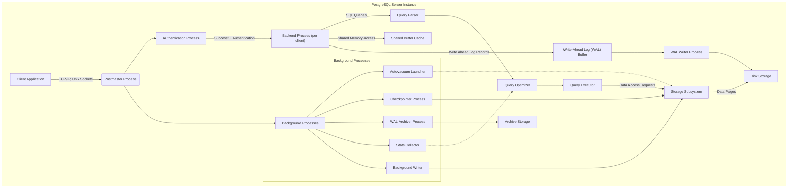
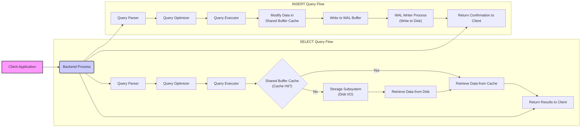

# Project Design Document: PostgreSQL (Improved)

**Version:** 1.1
**Date:** October 26, 2023
**Author:** AI Software Architect
**Audience:** Security Engineers, Developers, Threat Modelers

## 1. Introduction

This document provides an enhanced architectural design of the PostgreSQL database system, based on the source code available at [https://github.com/postgres/postgres](https://github.com/postgres/postgres). This detailed design is specifically tailored to facilitate comprehensive threat modeling activities. It elaborates on the key components, their interactions, data flow, and inherent security mechanisms within the system. This document aims to provide a solid foundation for identifying potential security vulnerabilities and designing appropriate mitigations.

## 2. Goals

*   Provide a clear, detailed, and accurate overview of the PostgreSQL architecture relevant for security analysis.
*   Identify key components and their specific responsibilities, emphasizing security-relevant functions.
*   Describe the data flow within the system, highlighting potential points of interaction and data transformation.
*   Elaborate on important security considerations, design choices, and built-in security features.
*   Serve as a robust and actionable basis for identifying potential threats, vulnerabilities, and attack vectors.

## 3. High-Level Architecture

PostgreSQL employs a robust client/server architecture. Multiple client applications can concurrently connect to a single PostgreSQL server instance. The server manages multiple database instances and efficiently handles concurrent client requests through a multi-process model.

## 4. Key Components (Detailed)

*   **Postmaster Process:** The central entry point for all client connections. It listens on configured ports (typically 5432) for incoming connection requests. Its primary responsibilities include:
    *   **Listening for Connections:**  Handles new connection requests via TCP/IP or Unix domain sockets.
    *   **Authentication Management:**  Spawns authentication processes to verify client credentials.
    *   **Backend Process Management:** Forks a new `postgres` backend process for each successful client connection.
    *   **Server Configuration Management:**  Reads and manages server configuration parameters.
    *   **Signal Handling:**  Manages signals for server control and maintenance.
*   **Backend Process (postgres):** A dedicated process spawned by the Postmaster to serve a single client connection. Each backend process operates independently, providing isolation between client sessions. Key responsibilities include:
    *   **Receiving and Processing Queries:**  Handles SQL queries submitted by the connected client.
    *   **Parsing and Optimization:**  Utilizes the query parser and optimizer to prepare queries for execution.
    *   **Data Access and Manipulation:**  Interacts with the storage subsystem to retrieve or modify data.
    *   **Transaction Management:**  Manages transactions, ensuring atomicity, consistency, isolation, and durability (ACID properties).
    *   **Security Enforcement:** Enforces access control policies and row-level security.
*   **Authentication Process:** A short-lived process responsible for verifying the identity of connecting clients. It supports various authentication methods configured in `pg_hba.conf`, including:
    *   **Password-based Authentication:**  Verifies passwords against stored hashes.
    *   **Certificate-based Authentication (SSL/TLS):**  Authenticates clients based on digital certificates.
    *   **Operating System User Mapping:**  Authenticates based on the client's operating system username.
    *   **Kerberos and LDAP:**  Supports integration with external authentication systems.
*   **Query Parser:**  Analyzes incoming SQL queries for syntactic correctness and semantic validity. It transforms the textual query into an internal representation (parse tree). This stage is crucial for identifying potential SQL injection vulnerabilities if input is not properly sanitized before this stage.
*   **Query Optimizer:**  Determines the most efficient execution plan for a given query parse tree. It considers various factors like available indexes, table statistics, and join strategies. A poorly optimized query can lead to performance issues and potential resource exhaustion, which could be exploited in denial-of-service attacks.
*   **Query Executor:**  Executes the optimized query plan, retrieving and manipulating data from the storage subsystem. It interacts with the buffer cache and disk storage to access the required data.
*   **Storage Subsystem:** Manages the physical storage of database data. Key aspects include:
    *   **Tablespace Management:**  Organizes database objects into logical storage locations.
    *   **Data File Management:**  Manages the physical files where table data and indexes are stored.
    *   **Access Methods:**  Provides different ways to access data (e.g., sequential scans, index scans).
    *   **Concurrency Control:**  Manages concurrent access to data using locking mechanisms to ensure data integrity.
*   **Disk Storage:** The persistent storage medium where database files reside. Security considerations include physical security of the storage media and encryption at rest.
*   **Shared Buffer Cache:** An in-memory cache that stores frequently accessed data pages from disk. This significantly improves query performance by reducing disk I/O. Security implications involve ensuring the integrity of the cached data.
*   **Write-Ahead Log (WAL) Buffer and Writer:**  A critical component for ensuring data durability and recoverability. All changes to data are first written to the WAL before being applied to the data files.
    *   **WAL Buffer:**  A temporary in-memory buffer for WAL records.
    *   **WAL Writer Process:**  Periodically writes the contents of the WAL buffer to persistent storage.
*   **Background Processes:** Essential for maintaining the health and performance of the database:
    *   **Autovacuum Launcher and Workers:**  Reclaims storage occupied by deleted or updated tuples, preventing table bloat and maintaining performance.
    *   **Checkpointer Process:**  Periodically writes dirty data pages from the shared buffer cache to disk, ensuring that committed changes are persisted.
    *   **WAL Archiver Process:**  Copies WAL segments to archival storage for point-in-time recovery, crucial for disaster recovery.
    *   **Stats Collector:**  Gathers statistics about database activity (e.g., table and index access patterns) used by the query optimizer to make informed decisions.
    *   **Background Writer:**  Writes out dirty buffers in the background, reducing the load on backend processes during heavy write operations.

## 5. Data Flow (Detailed)

Consider a client submitting a `SELECT` query:

1. **Client Connection and Authentication:** The client application initiates a connection, and the Postmaster spawns an "Authentication Process" to verify credentials against configured methods (e.g., checking a password hash stored in `pg_auth`).
2. **Backend Process Assignment:** Upon successful authentication, the Postmaster forks a new "Backend Process" and assigns the client connection.
3. **Query Reception:** The "Backend Process" receives the SQL query from the client.
4. **Parsing:** The "Query Parser" analyzes the query for syntax and semantics, creating a parse tree. Input validation at the application level is crucial to prevent malicious code injection at this stage.
5. **Optimization:** The "Query Optimizer" analyzes the parse tree and generates an efficient execution plan based on available indexes and statistics gathered by the "Stats Collector".
6. **Execution:** The "Query Executor" executes the plan. This might involve:
    *   **Checking Permissions:** Verifying the client has the necessary privileges to access the requested data.
    *   **Accessing the Buffer Cache:**  Checking if the required data pages are present in the "Shared Buffer Cache".
    *   **Disk I/O:** If the data is not in the cache, the "Storage Subsystem" retrieves it from "Disk Storage".
7. **Data Retrieval:** The "Storage Subsystem" retrieves the requested data pages.
8. **Result Processing:** The "Query Executor" processes the retrieved data according to the query.
9. **Result Delivery:** The "Backend Process" sends the query results back to the client application.

Consider a client submitting an `INSERT` query:

1. Steps 1-3 are the same as the `SELECT` query.
2. **Parsing and Optimization:** The "Query Parser" and "Query Optimizer" process the `INSERT` statement.
3. **Execution:** The "Query Executor" prepares to insert the new data.
4. **Data Modification in Buffer Cache:** The new data is written to the appropriate data pages in the "Shared Buffer Cache".
5. **WAL Logging:**  A record of the change is written to the "WAL Buffer".
6. **WAL Write to Disk:** The "WAL Writer Process" writes the WAL records to the "Disk Storage". This ensures durability.
7. **Checkpoint (Eventually):** The "Checkpointer Process" will eventually write the modified data pages from the "Shared Buffer Cache" to the "Disk Storage".
8. **Result Delivery:** The "Backend Process" sends a confirmation of the successful insertion to the client.

## 6. Security Considerations (Expanded)

PostgreSQL incorporates a multi-layered security approach:

*   **Authentication Mechanisms:**  The variety of authentication methods allows administrators to choose the most appropriate and secure option for their environment. However, misconfiguration of `pg_hba.conf` can lead to unauthorized access. Weak password policies can also compromise password-based authentication.
*   **Authorization System:**  The role-based access control (RBAC) system allows for granular control over database object access. However, overly permissive role assignments can increase the attack surface. Row-Level Security (RLS) provides an additional layer of control, but incorrect policy definitions can lead to unintended data exposure or access denial.
*   **Connection Security (SSL/TLS):**  Encrypting client/server communication protects against eavesdropping and man-in-the-middle attacks. However, proper certificate management and configuration are crucial.
*   **SQL Injection Prevention:**  While PostgreSQL itself does not have inherent vulnerabilities to SQL injection, applications interacting with the database must use parameterized queries or prepared statements to prevent malicious SQL code from being injected through user input.
*   **Auditing Capabilities:**  Logging database activity provides valuable information for security monitoring and incident response. However, proper configuration and regular review of audit logs are necessary.
*   **Operating System Security Dependence:** PostgreSQL's security is intrinsically linked to the security of the underlying operating system. Vulnerabilities in the OS can be exploited to compromise the database.
*   **Extension Security:**  PostgreSQL's extensibility through extensions is powerful but introduces potential security risks if untrusted or vulnerable extensions are used.
*   **Physical Security:**  Physical access to the server hosting the database can bypass many software-based security controls.

## 7. Deployment Considerations (Security Implications)

The deployment environment significantly impacts the security posture of PostgreSQL:

*   **Standalone Server:**  Requires careful configuration of the operating system firewall and network access controls.
*   **Replication:**  Secure communication channels between master and replica servers are essential to prevent data breaches or tampering during replication.
*   **Clustering:**  Secure communication and authentication between cluster nodes are critical. Misconfigurations can lead to split-brain scenarios or unauthorized access.
*   **Cloud Environments:**  Leveraging cloud provider security features (e.g., network segmentation, access control lists, encryption at rest) is crucial. Properly configuring managed database services is also vital.

## 8. Dependencies (Security Risks)

External dependencies can introduce vulnerabilities:

*   **Operating System:**  OS vulnerabilities can be directly exploited to compromise the PostgreSQL server. Regular patching is essential.
*   **C Library (libc):**  Vulnerabilities in the C library can have widespread impact.
*   **Network Libraries:**  Vulnerabilities in network libraries can be exploited for remote attacks.
*   **SSL/TLS Libraries (e.g., OpenSSL):**  Vulnerabilities in these libraries can compromise encryption and authentication. Regular updates are critical.
*   **Zlib:**  Compression library vulnerabilities could potentially be exploited.
*   **Authentication Libraries (e.g., Kerberos, LDAP):**  Vulnerabilities in these libraries can compromise authentication mechanisms.

## 9. Threat Modeling Focus Areas (More Specific)

Based on the detailed architecture, specific threat areas for focused threat modeling include:

*   **Postmaster Process:**
    *   Denial of Service attacks targeting connection limits or resource exhaustion.
    *   Exploitation of vulnerabilities in connection handling or authentication mechanisms.
*   **Backend Processes:**
    *   SQL Injection vulnerabilities in applications interacting with the database.
    *   Privilege escalation through vulnerabilities in stored procedures or functions.
    *   Resource exhaustion through poorly written queries or malicious input.
*   **Authentication Process:**
    *   Brute-force attacks against password-based authentication.
    *   Exploitation of vulnerabilities in external authentication mechanisms (Kerberos, LDAP).
    *   Bypassing authentication through misconfiguration of `pg_hba.conf`.
*   **Query Parser and Optimizer:**
    *   Exploiting vulnerabilities in the parser to inject malicious code (less common but possible).
    *   Crafting queries that lead to inefficient execution plans and resource exhaustion.
*   **Storage Subsystem:**
    *   Unauthorized access to data files on disk.
    *   Data corruption due to vulnerabilities in storage management.
*   **Shared Buffer Cache:**
    *   Exploiting vulnerabilities to access or manipulate cached data.
*   **Write-Ahead Log (WAL):**
    *   Tampering with WAL files to compromise data integrity.
    *   Unauthorized access to WAL archives.
*   **Background Processes:**
    *   Exploiting vulnerabilities in background processes to gain unauthorized access or cause denial of service.
*   **Dependencies:**
    *   Exploiting known vulnerabilities in dependent libraries.

This improved design document provides a more detailed and security-focused view of the PostgreSQL architecture, enabling more effective and comprehensive threat modeling.