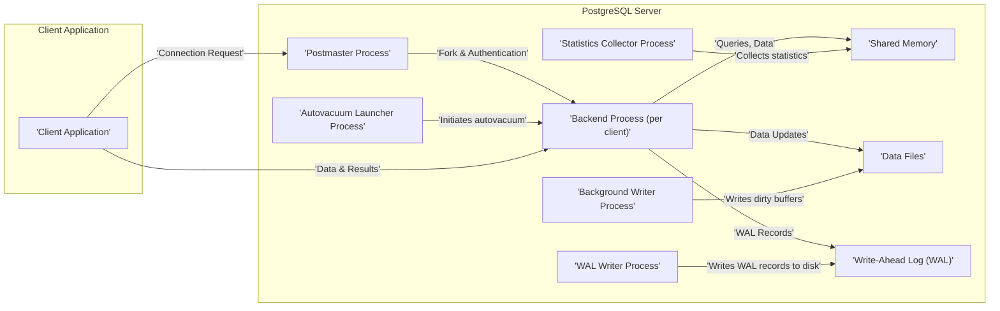
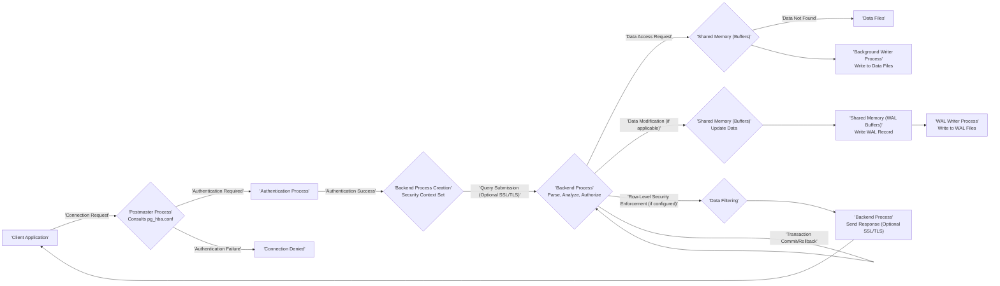

# Project Design Document: PostgreSQL Database System for Threat Modeling (Improved)

**1. Introduction**

This document provides an enhanced and detailed architectural design of the PostgreSQL database system, specifically tailored for its subsequent use in threat modeling activities. It meticulously outlines the key components, their interactions, data flows, and security-relevant aspects of the PostgreSQL system as represented by the codebase at [https://github.com/postgres/postgres](https://github.com/postgres/postgres). This improved document aims to provide an even more comprehensive and nuanced understanding of the system's structure to facilitate the identification of a broader range of potential vulnerabilities and attack vectors.

**2. Project Overview**

The project under analysis remains the PostgreSQL relational database management system (RDBMS). PostgreSQL is a complex system with numerous interacting components. This design document focuses on the core architectural elements most relevant to security and data flow, providing greater depth and clarity compared to the previous version. The scope includes the server processes, client interactions, storage mechanisms, crucial configuration aspects (`postgresql.conf` and `pg_hba.conf`), and key security features.

**3. Architectural Overview**

PostgreSQL adheres to a client/server architecture. Multiple client applications can concurrently connect to a single PostgreSQL server instance. The server is composed of several cooperating processes, each with specific responsibilities.

**4. Detailed Design**

This section provides a more detailed explanation of the key components of the PostgreSQL system, emphasizing their security relevance.

*   **Postmaster Process:**
    *   The principal server process initiated upon PostgreSQL server startup.
    *   Primary responsibilities include:
        *   Listening for incoming connection requests on the configured port (default 5432).
        *   **Authentication of clients** based on rules defined in `pg_hba.conf`. This file is critical for controlling access and is a key area for security configuration.
        *   **Authorization upon initial connection**, ensuring the connecting user has basic rights.
        *   Forking a new **backend process** for each successful client connection.
        *   Managing and supervising other background server processes.
        *   Reading and interpreting the `postgresql.conf` configuration file, which dictates numerous server behaviors, including security settings.
        *   Handling graceful server shutdown and restarts.

*   **Backend Process:**
    *   A dedicated process spawned by the Postmaster to serve a single client connection.
    *   Core responsibilities encompass:
        *   Receiving and executing SQL queries submitted by the connected client.
        *   Accessing and manipulating database objects (tables, indexes, etc.) within **shared memory** and **data files**.
        *   Enforcing transaction management (ACID properties) and concurrency control mechanisms (e.g., MVCC - Multi-Version Concurrency Control).
        *   Generating **Write-Ahead Log (WAL) records** for any data modifications to ensure durability and recoverability.
        *   Communicating query results and status updates back to the client application.
        *   **Enforcing row-level security (RLS) policies** if configured on the accessed tables.
        *   Operating within the security context of the connected user, subject to their granted privileges.

*   **Background Writer Process:**
    *   A background process responsible for periodically writing **dirty buffers** (modified data pages) from **shared memory** to the permanent **data files** on disk.
    *   This asynchronous write operation helps to:
        *   Ensure data durability by persisting changes to disk.
        *   Reduce the I/O load on backend processes, improving performance.
        *   Free up space in shared memory for new data.

*   **WAL Writer Process:**
    *   A critical background process dedicated to writing **Write-Ahead Log (WAL) records** from the **WAL buffers** in **shared memory** to the physical **WAL files** on disk.
    *   This process is fundamental for:
        *   Ensuring the atomicity and durability of transactions.
        *   Providing a mechanism for crash recovery by replaying committed transactions from the WAL.
        *   Supporting point-in-time recovery (PITR).

*   **Autovacuum Launcher Process:**
    *   Manages the automatic vacuuming and analyzing of the database.
    *   Key functions include:
        *   Launching **autovacuum worker processes** to reclaim storage occupied by deleted or updated tuples (dead rows).
        *   Updating table and index statistics used by the query planner to optimize query execution plans.
        *   Preventing transaction ID wraparound, a critical maintenance task.

*   **Statistics Collector Process:**
    *   Gathers and aggregates statistics about database activity.
    *   Collects information such as:
        *   Table and index access patterns.
        *   Data distribution within tables and columns.
    *   These statistics are stored in **shared memory** and are used by the query planner to make informed decisions about the most efficient query execution strategies.

*   **Shared Memory:**
    *   A contiguous block of memory accessible by all PostgreSQL server processes.
    *   Contains critical data structures and caches, including:
        *   **Shared buffers:** Caches frequently accessed data pages from disk.
        *   **WAL buffers:** Temporarily stores WAL records before they are written to disk.
        *   **Lock tables:** Manages concurrency control by tracking locks held on database objects.
        *   **Predicate locks:** Enables fine-grained locking for concurrent transactions.
        *   **Other control information** and metadata.

*   **Data Files:**
    *   Physical files on the file system where the actual database tables and indexes are persistently stored.
    *   Organized into:
        *   **Tablespaces:** Logical containers for database objects, allowing for flexible storage management.
        *   **Databases:** Collections of schemas and other database objects.
        *   Files within each database representing tables, indexes, and other structures.

*   **Write-Ahead Log (WAL):**
    *   A sequential, on-disk record of every change made to the database's data files.
    *   Ensures transaction durability and atomicity.
    *   Used for:
        *   **Crash recovery:** Replaying committed transactions after a server crash.
        *   **Point-in-time recovery (PITR):** Restoring the database to a specific point in time.
        *   **Replication:** Streaming changes to standby servers.

*   **Client Application:**
    *   Any software application (e.g., web application, desktop application, command-line tool like `psql`) that connects to the PostgreSQL server to interact with the database.
    *   Communicates with the **backend process** using the PostgreSQL frontend/backend protocol.
    *   Responsible for:
        *   Establishing a connection to the server.
        *   Submitting SQL queries.
        *   Receiving and processing query results.
        *   Handling user authentication credentials.

**5. Data Flow**

The following outlines a more detailed data flow for a client executing a typical query, highlighting security-relevant steps.

1. **Client Connection Request:** The client application initiates a connection request to the PostgreSQL server, typically including username and connection parameters.
2. **Postmaster Receives Connection and Consults `pg_hba.conf`:** The Postmaster process receives the connection request and immediately consults the `pg_hba.conf` file. This file dictates the authentication method required for connections from specific hosts, users, and databases.
3. **Authentication Process:** Based on the `pg_hba.conf` entry, the Postmaster initiates the appropriate authentication mechanism (e.g., password check, Kerberos ticket verification, SSL certificate validation). This step is crucial for verifying the client's identity.
4. **Successful Authentication and Backend Process Creation:** If authentication is successful, the Postmaster forks a new **backend process** and securely passes the client connection to it. The backend process inherits the security context of the authenticated user.
5. **Query Submission:** The client application sends an SQL query to its assigned **backend process**. This communication can be encrypted using SSL/TLS.
6. **Query Parsing and Analysis:** The backend process parses and analyzes the SQL query, checking for syntax errors and validating the user's privileges to access the requested objects. This involves checking the user's roles and granted permissions.
7. **Query Optimization and Planning:** The query planner optimizes the query execution plan based on available statistics.
8. **Data Access:** The backend process attempts to access the required data from the **shared buffers** in **shared memory**. If the data is not present, it reads it from the **data files** on disk. Access to data files is controlled by operating system permissions.
9. **Data Modification (if applicable):** If the query involves data modification (INSERT, UPDATE, DELETE):
    *   The backend process modifies the data in the **shared buffers**.
    *   A **WAL record** describing the change is generated and written to the **WAL buffers** in **shared memory**. This ensures that changes are logged before being permanently applied.
10. **WAL Write to Disk:** The **WAL Writer process** asynchronously writes the **WAL records** from the **WAL buffers** to the physical **WAL files** on disk, ensuring transaction durability.
11. **Data Write to Disk (eventually):** The **Background Writer process** (or a backend process under certain conditions) eventually writes the modified data from the **shared buffers** to the **data files** on disk.
12. **Row-Level Security Enforcement:** If **row-level security (RLS)** policies are defined on the accessed tables, the backend process enforces these policies, filtering the data based on the connected user's attributes.
13. **Response to Client:** The backend process sends the query results back to the client application. This communication can also be encrypted.
14. **Transaction Commit/Rollback:** If the query is part of a transaction, the client can issue a `COMMIT` or `ROLLBACK` command. The backend process handles this, ensuring atomicity and consistency by either making the changes permanent (commit) or discarding them (rollback).

**6. Security Considerations**

This section expands on the security considerations, providing more specific details relevant to threat modeling.

*   **Authentication Mechanisms and Vulnerabilities:** PostgreSQL supports various authentication methods, each with potential vulnerabilities:
    *   **Password Authentication:** Susceptible to brute-force attacks, dictionary attacks, and credential stuffing if not properly protected (e.g., strong passwords, rate limiting). `pg_hba.conf` misconfiguration can expose password hashes.
    *   **Kerberos Authentication:** Relies on the security of the Kerberos infrastructure. Misconfigurations or vulnerabilities in the KDC can lead to unauthorized access.
    *   **LDAP Authentication:** Security depends on the security of the LDAP server and the communication channel. Cleartext passwords over insecure connections are a risk.
    *   **Certificate-based Authentication (SSL/TLS client certificates):** Requires proper management and revocation of certificates. Compromised private keys can lead to unauthorized access.
    *   **Peer Authentication:** Based on operating system-level authentication, vulnerabilities in the OS can be exploited.
    *   **GSSAPI/SSPI:** Relies on the underlying security provider (e.g., Kerberos).

*   **Authorization and Privilege Escalation:** PostgreSQL's role-based access control is crucial. Misconfigured permissions can lead to:
    *   **Unauthorized data access:** Users gaining access to sensitive data they shouldn't.
    *   **Data modification or deletion:** Users altering or removing critical data.
    *   **Privilege escalation:** Attackers gaining higher privileges by exploiting vulnerabilities in stored procedures or functions with elevated rights.

*   **Connection Security (SSL/TLS):** While SSL/TLS encrypts communication, vulnerabilities can arise from:
    *   **Weak cipher suites:** Using outdated or insecure encryption algorithms.
    *   **Man-in-the-middle (MITM) attacks:** If not properly configured or if client verification is disabled.
    *   **Self-signed certificates:** Can be bypassed by attackers.

*   **Data at Rest Encryption:** Protecting data files on disk is essential. Potential threats include:
    *   **Unauthorized access to physical storage:** If disks are not encrypted, attackers gaining physical access can read the data.
    *   **Compromised backups:** Backups should also be encrypted.

*   **Row-Level Security (RLS) Bypasses:** While RLS provides fine-grained access control, potential vulnerabilities include:
    *   **Policy flaws:** Incorrectly written policies that allow unintended access.
    *   **Performance issues:** Complex policies can impact query performance.

*   **Network Security:** Firewall rules and network segmentation are critical to limit access to the PostgreSQL server. Vulnerabilities include:
    *   **Open ports:** Exposing the server to unnecessary network traffic.
    *   **Lack of network segmentation:** Allowing lateral movement within the network if the server is compromised.

*   **Extension Security:** Untrusted or vulnerable extensions can introduce significant security risks:
    *   **Code injection:** Malicious extensions could execute arbitrary code on the server.
    *   **Data breaches:** Extensions might bypass security controls.

*   **Configuration Security (`postgresql.conf` and `pg_hba.conf`):** Misconfigurations are a common source of vulnerabilities:
    *   **Weak authentication settings in `pg_hba.conf`:** Allowing insecure authentication methods.
    *   **Permissive access rules in `pg_hba.conf`:** Granting access to unauthorized hosts or users.
    *   **Insecure settings in `postgresql.conf`:** Exposing sensitive information or enabling risky features.

*   **Logging and Auditing:** Insufficient logging can hinder security investigations. Potential issues:
    *   **Disabled or minimal logging:** Not enough information to detect or investigate incidents.
    *   **Logs stored insecurely:** Logs themselves becoming targets for attackers.

*   **Vulnerability Management:** Outdated PostgreSQL versions may contain known security vulnerabilities. Regular patching is crucial.

**7. Assumptions and Dependencies**

*   This design document primarily focuses on the core PostgreSQL server components as found in the official repository. Specific extensions or third-party tools are generally excluded, unless explicitly mentioned for security considerations.
*   The analysis assumes a standard deployment of PostgreSQL on a typical server operating system (e.g., Linux), without significant custom modifications to the core codebase.
*   The security considerations are intended to be comprehensive but may need to be further tailored based on the specific deployment environment, organizational security policies, and regulatory requirements.
*   The provided Mermaid diagrams are simplified representations and may not capture every intricate detail of the system's interactions.

**8. Conclusion**

This improved design document provides a more detailed and nuanced architectural overview of the PostgreSQL database system, specifically tailored for threat modeling. By elaborating on the key components, data flows, and security considerations, this document aims to facilitate a more thorough and effective identification of potential vulnerabilities and attack vectors. This enhanced understanding is crucial for developing robust security strategies and mitigating potential risks associated with the PostgreSQL database system.