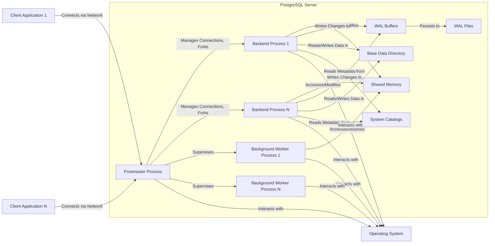
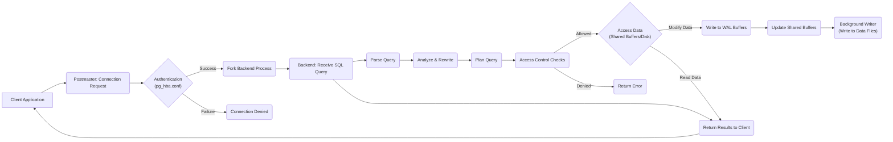
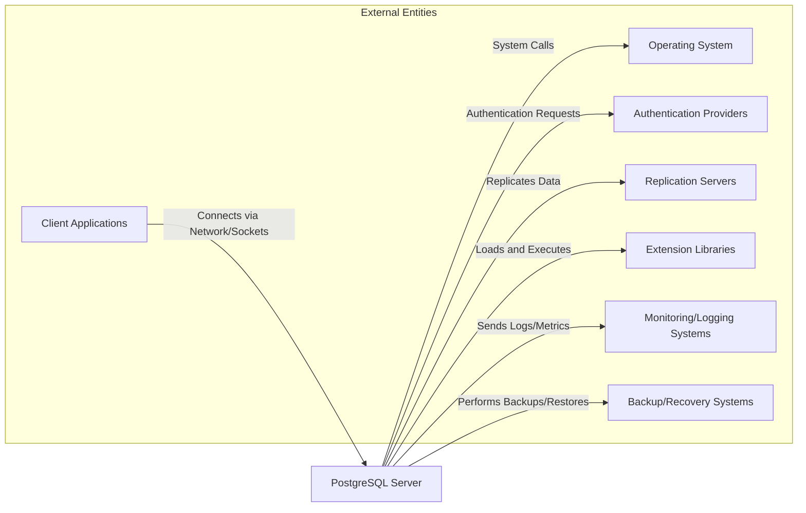

# Project Design Document: PostgreSQL Database System for Threat Modeling (Improved)

**Version:** 2.0
**Date:** October 26, 2023
**Author:** Gemini (AI Language Model)

## 1. Introduction

This document provides an enhanced architectural design of the PostgreSQL database system, specifically tailored for comprehensive threat modeling activities. It aims to provide a detailed understanding of PostgreSQL's components, interactions, and data flows to facilitate the identification and analysis of potential security vulnerabilities and attack vectors. This document is based on the open-source PostgreSQL project available at [https://github.com/postgres/postgres](https://github.com/postgres/postgres). This document is intended for security architects, engineers, and threat modeling practitioners.

## 2. Goals

* Provide a clear, detailed, and security-focused architectural overview of PostgreSQL.
* Identify key components and their interactions with a strong emphasis on security implications.
* Describe data flows within the system, highlighting potential points of vulnerability.
* Outline external interfaces and dependencies, considering potential attack surfaces.
* Serve as a robust foundation for conducting thorough threat modeling exercises, including STRIDE analysis.

## 3. System Overview

PostgreSQL operates on a client/server architecture. The core of the system comprises several interacting processes and memory regions:

* **Postmaster Process:** The central server process responsible for managing all incoming client connections and supervising other server processes.
* **Backend Processes (postgres):**  Dedicated processes forked by the postmaster to handle individual client connections, execute queries, and manage transactions.
* **Background Worker Processes:**  Various utility processes performing tasks like autovacuum, background writer, logical replication sender, etc.
* **Shared Memory:** A memory segment accessible by all PostgreSQL server processes, used for caching data (shared buffers), managing locks, and inter-process communication.
* **Write-Ahead Log (WAL) Buffers and Files:**  A persistent record of all changes made to the database before they are applied to the main data files, ensuring durability and recoverability.
* **Base Data Directory:** Contains the physical data files storing database tables, indexes, and system catalogs.
* **System Catalogs (pg_catalog schema):**  Internal tables containing metadata about the database structure, objects, users, roles, and permissions.

## 4. Component Details

This section provides a more in-depth look at key components with a focus on their security implications.

### 4.1. Postmaster Process

* **Responsibilities:**
    * Listens for incoming client connections on configured TCP/IP ports or Unix domain sockets.
    * Handles initial client authentication using configured methods (e.g., password, md5, scram-sha-256, GSSAPI, SSPI, certificate).
    * Forks new backend processes to handle each client connection.
    * Manages server configuration parameters and reloads configuration files.
    * Oversees background worker processes.
    * Handles server startup and controlled shutdown.
* **Security Relevance:**
    * **Critical Entry Point:** The primary point of interaction for all external clients, making it a prime target for denial-of-service attacks or exploits targeting authentication mechanisms.
    * **Authentication Weaknesses:** Vulnerabilities in authentication methods or misconfigurations can lead to unauthorized access.
    * **Configuration Errors:** Incorrectly configured parameters can weaken security (e.g., overly permissive `listen_addresses`).
    * **Process Management Flaws:** Exploits in process forking or management could lead to privilege escalation.

### 4.2. Backend Processes (postgres)

* **Responsibilities:**
    * Receives and parses SQL queries from connected clients.
    * Authenticates users based on the connection context and database roles.
    * Executes queries, including data retrieval, insertion, update, and deletion.
    * Manages transactions and ensures ACID properties (Atomicity, Consistency, Isolation, Durability).
    * Enforces access control and permissions based on roles and privileges.
    * Interacts with the storage subsystem to access and modify data.
* **Security Relevance:**
    * **SQL Injection Vulnerabilities:** Improperly sanitized user inputs in SQL queries can lead to unauthorized data access or modification.
    * **Authorization Bypass:** Flaws in privilege checks or role management can allow users to perform actions they are not authorized for.
    * **Buffer Overflows/Memory Corruption:** Vulnerabilities in the query processing engine could be exploited to execute arbitrary code.
    * **Information Disclosure:** Errors in query processing or access control could lead to unintended disclosure of sensitive data.
    * **Denial of Service:** Maliciously crafted queries can consume excessive resources, leading to performance degradation or server crashes.

### 4.3. Background Worker Processes

* **Responsibilities:**
    * **Autovacuum:** Reclaims storage occupied by dead tuples and updates statistics for the query planner.
    * **Background Writer:** Writes dirty data buffers from shared memory to disk.
    * **Logical Replication Sender/Receiver:** Manages the transmission and application of changes in logical replication setups.
    * **Stats Collector:** Collects database statistics for monitoring and performance analysis.
    * Other extensions can register their own background workers.
* **Security Relevance:**
    * **Resource Exhaustion:** Malfunctioning or compromised background workers could consume excessive resources, impacting performance or causing denial of service.
    * **Data Integrity Issues:** Flaws in autovacuum or the background writer could potentially lead to data corruption.
    * **Replication Vulnerabilities:** Compromised replication processes could be used to inject malicious data into replica servers.
    * **Extension Risks:** Background workers from untrusted extensions could introduce vulnerabilities.

### 4.4. Shared Memory

* **Responsibilities:**
    * Caching frequently accessed data blocks (shared buffers).
    * Storing lock information for concurrency control.
    * Managing other shared resources like prepared statements and temporary tables.
    * Facilitating inter-process communication between PostgreSQL server processes.
* **Security Relevance:**
    * **Information Leakage:** If not properly protected, vulnerabilities could allow unauthorized processes (even within the OS) to read sensitive data from shared memory.
    * **Lock Manipulation:**  Malicious actors could potentially manipulate lock information to cause deadlocks or other concurrency issues.
    * **Buffer Overflow/Corruption:**  Exploits targeting shared memory management could lead to crashes or arbitrary code execution.

### 4.5. Write-Ahead Log (WAL) Buffers and Files

* **Responsibilities:**
    * Buffering and persistently recording all changes made to data files before they are applied.
    * Ensuring durability and allowing for point-in-time recovery in case of system failures.
    * Used for replication to transmit changes to standby servers.
* **Security Relevance:**
    * **Sensitive Data Exposure:** WAL files contain a history of all data modifications, potentially including sensitive information in plain text. Unauthorized access could lead to data breaches.
    * **Replay Attacks:**  If WAL files are compromised, attackers might be able to replay transactions to revert changes or introduce malicious data.
    * **Integrity Issues:** Tampering with WAL files could compromise the integrity of the database and its recovery process.

### 4.6. Base Data Directory

* **Responsibilities:**
    * Stores the physical files containing database tables, indexes, and other data objects.
    * Contains configuration files like `postgresql.conf` and `pg_hba.conf`.
* **Security Relevance:**
    * **Data Breach:** Unauthorized access to the data directory at the file system level bypasses database access controls and allows direct access to sensitive data.
    * **Configuration Tampering:** Modifying configuration files can weaken security or grant unauthorized access.
    * **Denial of Service:** Deleting or corrupting data files can render the database unusable.

### 4.7. System Catalogs (pg_catalog schema)

* **Responsibilities:**
    * Stores metadata about the database schema, including tables, columns, indexes, views, functions, users, roles, and permissions.
* **Security Relevance:**
    * **Privilege Escalation:**  Unauthorized modification of system catalogs could allow attackers to grant themselves elevated privileges.
    * **Information Disclosure:** Access to system catalogs reveals sensitive information about the database structure and security configuration.
    * **Integrity Compromise:** Tampering with system catalogs can corrupt the database schema and lead to unpredictable behavior.

## 5. Data Flow (Detailed)

This section provides a more granular view of the data flow during a typical client query execution.

1. **Client Connection Request:** A client application initiates a connection to the PostgreSQL server, targeting the postmaster process on the configured port.
2. **Authentication Process:** The postmaster authenticates the client based on the `pg_hba.conf` configuration and the chosen authentication method. This may involve password exchange, cryptographic challenges, or external authentication providers.
3. **Backend Process Assignment:** Upon successful authentication, the postmaster forks a new backend process and establishes a communication channel with the client.
4. **Query Submission:** The client sends an SQL query to its assigned backend process.
5. **Query Parsing:** The backend process parses the SQL query to verify its syntax and structure.
6. **Query Analysis and Rewriting:** The parser output is analyzed, and the query might be rewritten for optimization.
7. **Query Planning:** The query planner generates an optimal execution plan based on available indexes and statistics.
8. **Access Control Checks:** Before accessing any data, the backend process verifies the user's privileges to access the requested tables and columns.
9. **Data Retrieval/Modification:**
    * **Data in Shared Buffers:** If the required data is in the shared memory cache, it is retrieved directly.
    * **Data on Disk:** If the data is not in the cache, the backend process reads it from the data files in the base data directory.
    * **Data Modification:** For `INSERT`, `UPDATE`, or `DELETE` statements:
        * Changes are first written to the WAL buffers.
        * Corresponding data blocks in shared buffers are updated.
        * The background writer eventually writes the dirty buffers to the data files.
10. **Result Delivery:** The backend process sends the query results back to the client application.
11. **Transaction Management:**  If the query is part of a transaction, the backend process manages the transaction's state (start, commit, rollback).
12. **Connection Closure:** The client closes the connection, and the backend process terminates (or is potentially reused in connection pooling scenarios).

## 6. External Interactions (Detailed)

PostgreSQL interacts with a variety of external systems and components, each representing a potential attack surface.

* **Client Applications:**
    * **Types:** Web applications, desktop applications, mobile apps, command-line tools (psql), ETL processes.
    * **Protocols:** Primarily uses the PostgreSQL frontend/backend protocol over TCP/IP or Unix domain sockets. May also interact through libraries like libpq.
    * **Security Relevance:** Vulnerabilities in client applications (e.g., insecure coding practices, dependency vulnerabilities) can be exploited to compromise the database.

* **Operating System:**
    * **Services:** Relies on the OS for process management, memory management, file system access, networking, and inter-process communication.
    * **Security Relevance:** OS-level vulnerabilities or misconfigurations can directly impact PostgreSQL's security.

* **Authentication Providers:**
    * **Examples:** LDAP, Kerberos, PAM, certificate authorities.
    * **Security Relevance:** Weaknesses in external authentication systems can be exploited to gain unauthorized access to the database.

* **Replication Servers (Physical and Logical):**
    * **Protocols:** Uses a specific replication protocol for streaming WAL data. Logical replication uses a publish/subscribe mechanism.
    * **Security Relevance:** Compromised replication servers can be used to inject malicious data or eavesdrop on sensitive information.

* **Extension Libraries (.so files):**
    * **Functionality:** Extend PostgreSQL's capabilities with new data types, functions, and features.
    * **Security Relevance:** Untrusted or vulnerable extensions can introduce significant security risks, including arbitrary code execution within the database server process.

* **Monitoring and Logging Systems:**
    * **Examples:** Prometheus, Grafana, ELK stack, syslog.
    * **Protocols:** May use various protocols like HTTP, UDP, or file-based logging.
    * **Security Relevance:**  Insecurely configured monitoring systems could expose sensitive database metrics or logs.

* **Backup and Recovery Systems:**
    * **Tools:** `pg_dump`, `pg_basebackup`, cloud-based backup solutions.
    * **Security Relevance:**  Compromised backups can lead to data loss or unauthorized restoration of outdated or tampered data.

## 7. Security Considerations (Detailed)

This section expands on the security features and considerations for PostgreSQL.

* **Authentication Mechanisms:**
    * **Password-based:**  Susceptible to brute-force attacks and dictionary attacks if passwords are weak.
    * **SCRAM-SHA-256:**  A more secure password-based authentication method.
    * **GSSAPI/SSPI (Kerberos):** Provides strong authentication using Kerberos tickets.
    * **SSPI (Windows Authentication):** Integrates with Windows domain authentication.
    * **Certificate-based (SSL/TLS client certificates):**  Requires proper certificate management.
    * **Peer Authentication:**  Relies on OS-level authentication, less secure for untrusted networks.
    * **Ident Authentication:**  Relies on the `ident` protocol, which is inherently insecure.
* **Authorization and Access Control:**
    * **Roles and Privileges:**  Granular control over access to database objects. Requires careful management of roles and granted privileges.
    * **Row-Level Security (RLS):**  Enables fine-grained control over data access based on user attributes or other conditions. Requires careful policy design and implementation.
    * **Object Ownership:**  Owners have special privileges on their objects.
* **Network Security:**
    * **SSL/TLS Encryption:**  Encrypts communication between clients and the server, protecting against eavesdropping. Requires proper certificate configuration.
    * **`listen_addresses` Configuration:**  Restricts the network interfaces the postmaster listens on.
    * **Firewall Rules:**  Essential for controlling network access to the PostgreSQL server.
* **Data Security:**
    * **Encryption at Rest:**  Can be implemented using operating system-level encryption (e.g., LUKS, dm-crypt) or extensions like `pgcrypto`.
    * **Data Masking and Anonymization:** Techniques to protect sensitive data in non-production environments.
* **Auditing:**
    * **Logging:** PostgreSQL provides extensive logging capabilities, which can be configured to track authentication attempts, executed queries, and other events. Requires proper log management and analysis.
    * **Extensions (e.g., `pgaudit`):** Provide more detailed and configurable auditing features.
* **Security Hardening Best Practices:**
    * Keeping PostgreSQL up-to-date with security patches.
    * Disabling unnecessary features and extensions.
    * Using strong and unique passwords for database roles.
    * Regularly reviewing and auditing security configurations.
    * Limiting access to the server and data directory at the OS level.

## 8. Deployment Environment Security Implications

The deployment environment significantly impacts the security considerations for PostgreSQL.

* **On-Premise Servers:** Security relies heavily on the organization's physical security, network security, and server hardening practices.
* **Cloud Environments (IaaS):**  Shared responsibility model. The cloud provider manages the underlying infrastructure security, while the user is responsible for securing the operating system, database configuration, and access controls.
* **Cloud Environments (PaaS/DBaaS):** The cloud provider manages most aspects of security, including patching and infrastructure security. Users are responsible for configuring access controls and potentially data encryption. Understanding the provider's security controls is crucial.
* **Containerized Environments (Docker, Kubernetes):** Security depends on the security of the container images, orchestration platform, and network configurations. Proper isolation and resource management are essential.

## 9. Assumptions and Constraints

* This document describes the general architecture of a typical PostgreSQL deployment. Specific configurations, extensions, and deployment environments may introduce variations.
* The focus is on security-relevant aspects for threat modeling. Performance, scalability, and other non-security aspects are not covered in detail.
* The information is based on the publicly available documentation and general understanding of the PostgreSQL project. Specific implementation details may vary across versions.

## 10. Future Considerations for Threat Modeling

* **Detailed Analysis of Authentication Flows:**  Deep dive into the specific steps and potential vulnerabilities in each authentication method.
* **SQL Injection Vulnerability Analysis:**  Examine common patterns and techniques for preventing SQL injection attacks in applications interacting with PostgreSQL.
* **Privilege Escalation Paths:**  Identify potential ways for attackers to gain unauthorized privileges within the database.
* **Security Implications of Specific Extensions:**  Analyze the security risks associated with commonly used PostgreSQL extensions.
* **Threats to Backup and Recovery Processes:**  Assess the potential for attackers to compromise backups or interfere with recovery operations.
* **Compliance Requirements:**  Consider how PostgreSQL's security features align with relevant compliance standards (e.g., GDPR, PCI DSS).

This improved document provides a more detailed and security-focused foundation for conducting thorough threat modeling exercises on PostgreSQL. By understanding the intricacies of its architecture and potential vulnerabilities, security professionals can better protect this critical database system.