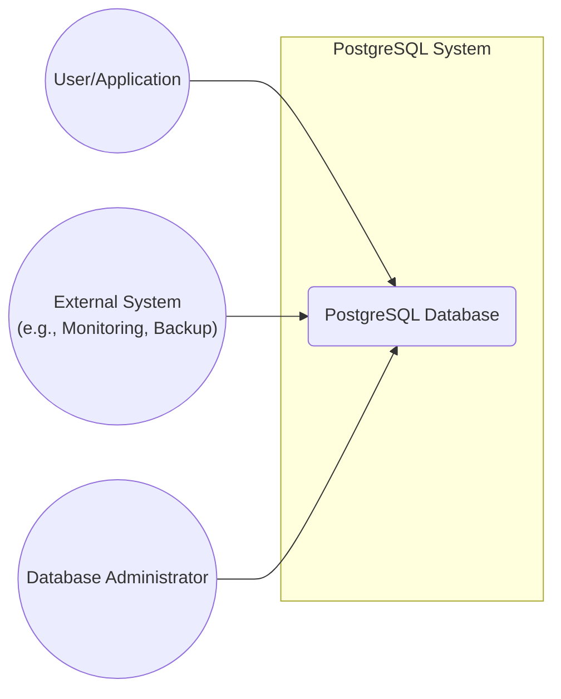
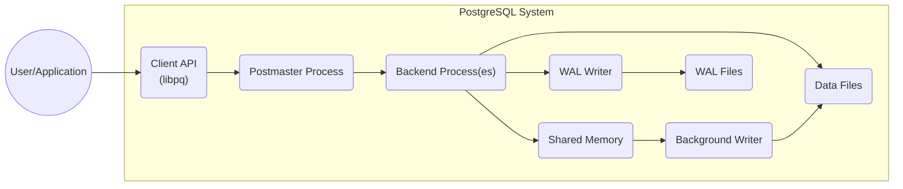
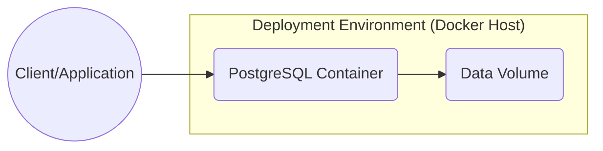
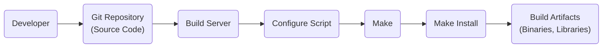

Okay, let's craft a design document for the PostgreSQL project, keeping in mind its nature as a mature, widely-used, open-source database system.

# BUSINESS POSTURE

PostgreSQL is a powerful, open source object-relational database system.  It's a critical piece of infrastructure for countless businesses, ranging from small startups to large enterprises.

Priorities and Goals:

*   Data Integrity and Reliability:  Ensuring data is stored accurately and consistently, even in the face of hardware or software failures. This is paramount.
*   Performance and Scalability:  Providing fast query execution and the ability to handle increasing workloads and data volumes.
*   Extensibility and Standards Compliance:  Allowing users to extend functionality through custom functions, data types, and operators, while adhering to SQL standards.
*   Security: Protecting sensitive data from unauthorized access and modification.
*   Open Source and Community Driven:  Maintaining a vibrant and active community of developers and users.

Business Risks:

*   Data Breaches:  Unauthorized access to sensitive data stored in PostgreSQL databases could lead to significant financial and reputational damage for users.
*   Data Corruption:  Bugs or failures that lead to data loss or corruption could disrupt business operations and erode trust.
*   Denial of Service:  Attacks that prevent legitimate users from accessing the database could cripple applications and services.
  *   Performance Degradation:  Poorly optimized queries or configurations could lead to slow performance, impacting user experience and business efficiency.
*   Supply Chain Attacks: Vulnerabilities introduced through compromised dependencies or build processes could expose users to risks.

# SECURITY POSTURE

Existing Security Controls:

*   security control: Authentication: PostgreSQL supports various authentication methods, including password-based authentication (SCRAM-SHA-256 is the default and most secure), Kerberos, GSSAPI, SSPI, and certificate-based authentication. Described in documentation and source code.
*   security control: Authorization:  A robust role-based access control (RBAC) system allows granular control over database object permissions (SELECT, INSERT, UPDATE, DELETE, etc.). Described in documentation and source code.
*   security control: Row-Level Security (RLS):  Allows defining policies that restrict which rows specific users can access. Described in documentation and source code.
*   security control: Encryption:  Supports SSL/TLS encryption for client-server communication. Data at rest encryption is possible via extensions or operating system level tools. Described in documentation and source code.
*   security control: Auditing:  Extensions like `pgAudit` provide detailed logging of database activity, which can be used for security monitoring and forensics. Described in documentation.
*   security control: Regular Security Updates:  The PostgreSQL Global Development Group (PGDG) actively addresses security vulnerabilities and releases updates promptly. Described in documentation and release notes.
*   security control: Secure Coding Practices: The PostgreSQL development community follows secure coding guidelines to minimize vulnerabilities. Evident in source code and development discussions.
*   security control: Input Validation: PostgreSQL rigorously validates input to prevent SQL injection and other injection attacks. Evident in source code.

Accepted Risks:

*   accepted risk:  Default configurations may not be fully secure: Users are responsible for hardening their PostgreSQL installations according to their specific security requirements.
*   accepted risk:  Third-party extensions may introduce vulnerabilities: Users should carefully vet any extensions they install.
*   accepted risk:  Operating system vulnerabilities: PostgreSQL relies on the underlying operating system for some security features, so OS vulnerabilities can impact database security.

Recommended Security Controls:

*   security control: Implement a robust password policy, enforcing strong passwords and regular password changes.
*   security control: Enable and configure auditing to track database activity and detect suspicious behavior.
*   security control: Regularly review and update database configurations to ensure they adhere to security best practices.
*   security control: Implement network segmentation to isolate the database server from other parts of the network.
*   security control: Use a dedicated, non-privileged operating system user to run the PostgreSQL server.
*   security control: Regularly apply security patches and updates to both PostgreSQL and the underlying operating system.

Security Requirements:

*   Authentication:
    *   Support strong password hashing algorithms (e.g., SCRAM-SHA-256).
    *   Provide options for multi-factor authentication (MFA) through extensions or external tools.
    *   Integrate with existing authentication systems (e.g., LDAP, Kerberos).
*   Authorization:
    *   Implement granular role-based access control (RBAC).
    *   Support row-level security (RLS) to restrict access to specific rows based on user attributes.
    *   Provide mechanisms to audit authorization decisions.
*   Input Validation:
    *   Prevent SQL injection attacks through rigorous input validation and parameterized queries.
    *   Protect against other injection attacks (e.g., command injection).
*   Cryptography:
    *   Support TLS/SSL encryption for client-server communication.
    *   Provide options for data-at-rest encryption (e.g., through extensions or OS-level tools).
    *   Use strong cryptographic algorithms and key management practices.

# DESIGN

## C4 CONTEXT

Element Descriptions:

*   Element:
    *   Name: User/Application
    *   Type: User
    *   Description: Represents any user or application that interacts with the PostgreSQL database.
    *   Responsibilities: Sending queries, retrieving data, performing transactions.
    *   Security controls: Authentication, authorization, potentially client-side encryption.

*   Element:
    *   Name: External System
    *   Type: External System
    *   Description: Represents external systems that interact with PostgreSQL, such as monitoring tools, backup services, or other databases.
    *   Responsibilities: Monitoring database health, performing backups, replicating data.
    *   Security controls: Authentication, authorization, secure communication protocols (e.g., SSH, TLS).

*   Element:
    *   Name: Database Administrator
    *   Type: User
    *   Description: Represents a human administrator responsible for managing the PostgreSQL database.
    *   Responsibilities: Configuring the database, managing users and permissions, performing backups and restores, monitoring performance.
    *   Security controls: Strong authentication, multi-factor authentication, restricted access to the database server.

*   Element:
    *   Name: PostgreSQL Database
    *   Type: System
    *   Description: The core PostgreSQL database system.
    *   Responsibilities: Storing data, processing queries, enforcing data integrity, managing transactions.
    *   Security controls: Authentication, authorization, row-level security, encryption, auditing, input validation.

## C4 CONTAINER

Element Descriptions:

*   Element:
    *   Name: User/Application
    *   Type: User
    *   Description: Represents any user or application that interacts with the PostgreSQL database.
    *   Responsibilities: Sending queries, retrieving data, performing transactions.
    *   Security controls: Authentication, authorization, potentially client-side encryption.

*   Element:
    *   Name: Client API (libpq)
    *   Type: Library
    *   Description: The client library (libpq) provides an interface for applications to connect to and interact with the PostgreSQL server.
    *   Responsibilities: Establishing connections, sending queries, receiving results, handling errors.
    *   Security controls: Supports TLS/SSL encryption, authentication mechanisms.

*   Element:
    *   Name: Postmaster Process
    *   Type: Process
    *   Description: The main PostgreSQL server process that listens for incoming connections and manages backend processes.
    *   Responsibilities: Accepting connections, creating backend processes, managing shared memory.
    *   Security controls: Listens on a specific port, can be configured to restrict connections based on IP address.

*   Element:
    *   Name: Backend Process(es)
    *   Type: Process
    *   Description:  Processes created by the Postmaster to handle individual client connections.
    *   Responsibilities:  Executing queries, managing transactions, interacting with data files and shared memory.
    *   Security controls:  Run under a specific user account, enforce authorization rules.

*   Element:
    *   Name: Shared Memory
    *   Type: Memory
    *   Description:  A shared memory area used for inter-process communication and caching.
    *   Responsibilities:  Storing shared data structures, buffers, and locks.
    *   Security controls:  Access controlled by the operating system.

*   Element:
    *   Name: WAL Writer
    *   Type: Process
    *   Description:  A background process that writes changes to the Write-Ahead Log (WAL).
    *   Responsibilities:  Ensuring data durability by writing transaction logs to disk.
    *   Security controls:  Runs under a specific user account.

*   Element:
    *   Name: Background Writer
    *   Type: Process
    *   Description:  A background process that writes dirty buffers from shared memory to data files.
    *   Responsibilities:  Maintaining data consistency and improving performance.
    *   Security controls:  Runs under a specific user account.

*   Element:
    *   Name: Data Files
    *   Type: Files
    *   Description:  The files that store the actual database data.
    *   Responsibilities:  Persistently storing data.
    *   Security controls:  File system permissions, potentially encryption at rest.

*   Element:
    *   Name: WAL Files
    *   Type: Files
    *   Description:  The files that store the Write-Ahead Log (WAL), used for crash recovery and replication.
    *   Responsibilities:  Ensuring data durability and enabling point-in-time recovery.
    *   Security controls:  File system permissions.

## DEPLOYMENT

Possible Deployment Solutions:

1.  Bare Metal:  Installing PostgreSQL directly on a physical server.
2.  Virtual Machine:  Installing PostgreSQL on a virtual machine (e.g., VMware, KVM, Hyper-V).
3.  Container:  Deploying PostgreSQL in a container (e.g., Docker, Podman).
4.  Cloud-Managed Service:  Using a cloud provider's managed PostgreSQL service (e.g., AWS RDS for PostgreSQL, Azure Database for PostgreSQL, Google Cloud SQL for PostgreSQL).

Chosen Solution (for detailed description): Container (Docker)

Element Descriptions:

*   Element:
    *   Name: Client/Application
    *   Type: External System
    *   Description: Represents any user or application that interacts with the PostgreSQL database.
    *   Responsibilities: Sending queries, retrieving data, performing transactions.
    *   Security controls: Authentication, authorization, potentially client-side encryption.

*   Element:
    *   Name: PostgreSQL Container
    *   Type: Container
    *   Description: A Docker container running the PostgreSQL server.
    *   Responsibilities: Running the PostgreSQL database processes.
    *   Security controls: Container isolation, resource limits, potentially running as a non-root user within the container.

*   Element:
    *   Name: Data Volume
    *   Type: Storage
    *   Description: A Docker volume used to persist the database data.
    *   Responsibilities: Storing the PostgreSQL data files and WAL files.
    *   Security controls: File system permissions, potentially encryption at rest.

*   Element:
      * Name: Docker Host
      * Type: Server
      * Description: Physical or virtual machine that runs Docker daemon and containers.
      * Responsibilities: Provide resources for containers, manage networking.
      * Security controls: OS hardening, firewall, regular security updates.

## BUILD

The PostgreSQL build process is complex and involves multiple steps, from source code to executable binaries. It relies heavily on GNU Autotools (autoconf, automake) and Makefiles.

Security Controls in Build Process:

*   Source Code Management: PostgreSQL uses Git for version control, allowing tracking of all code changes and facilitating code review.
*   Build Automation: The build process is automated using Makefiles, ensuring consistency and reproducibility.
*   Compiler Warnings: The build process is configured to enable compiler warnings, helping to identify potential coding errors.
*   Static Analysis: While not explicitly integrated into the core build process, developers often use static analysis tools (e.g., linters, code analyzers) to identify potential vulnerabilities.
*   Testing: PostgreSQL has an extensive test suite that is run during the build process to ensure code quality and identify regressions.
*   Release Signing: Official PostgreSQL releases are digitally signed, allowing users to verify the integrity and authenticity of the software.

# RISK ASSESSMENT

Critical Business Processes:

*   Data storage and retrieval: The core function of PostgreSQL is to reliably store and retrieve data. Any disruption to this process can have severe consequences.
*   Transaction processing: PostgreSQL supports ACID transactions, ensuring data consistency and integrity. Failures in transaction processing can lead to data corruption or loss.
*   Online applications: Many applications rely on PostgreSQL for their backend data storage. Downtime or performance issues can directly impact these applications and their users.

Data Sensitivity:

*   Personally Identifiable Information (PII): PostgreSQL databases often store PII, such as names, addresses, email addresses, and financial information. This data is highly sensitive and subject to privacy regulations (e.g., GDPR, CCPA).
*   Financial Data: Databases may contain financial transactions, account balances, and other sensitive financial information.
*   Business-Critical Data: Databases may store proprietary business data, intellectual property, or other information that is critical to the organization's operations.
*   Authentication Credentials: PostgreSQL stores user credentials (hashed passwords) which, if compromised, could lead to unauthorized access.

The sensitivity of the data stored in a PostgreSQL database varies greatly depending on the specific application. However, it's crucial to assume that any data stored in PostgreSQL is potentially sensitive and should be protected accordingly.

# QUESTIONS & ASSUMPTIONS

Questions:

*   Are there any specific compliance requirements (e.g., PCI DSS, HIPAA) that need to be considered?
*   What is the expected scale of the database (number of users, data volume, transaction rate)?
*   What are the specific availability and recovery requirements (RPO/RTO)?
*   Are there any existing security tools or infrastructure that should be integrated with PostgreSQL (e.g., SIEM, vulnerability scanners)?

Assumptions:

*   BUSINESS POSTURE: The primary goal is to provide a stable, reliable, and secure database system. Cost optimization is secondary to these goals.
*   SECURITY POSTURE: A defense-in-depth approach is desired, with multiple layers of security controls.
*   DESIGN: The system should be designed for extensibility and maintainability. The open-source nature of PostgreSQL is a key consideration.
*   The underlying operating system is properly secured and maintained.
*   Users will follow security best practices when configuring and using PostgreSQL.
*   Regular security audits and penetration testing will be conducted.