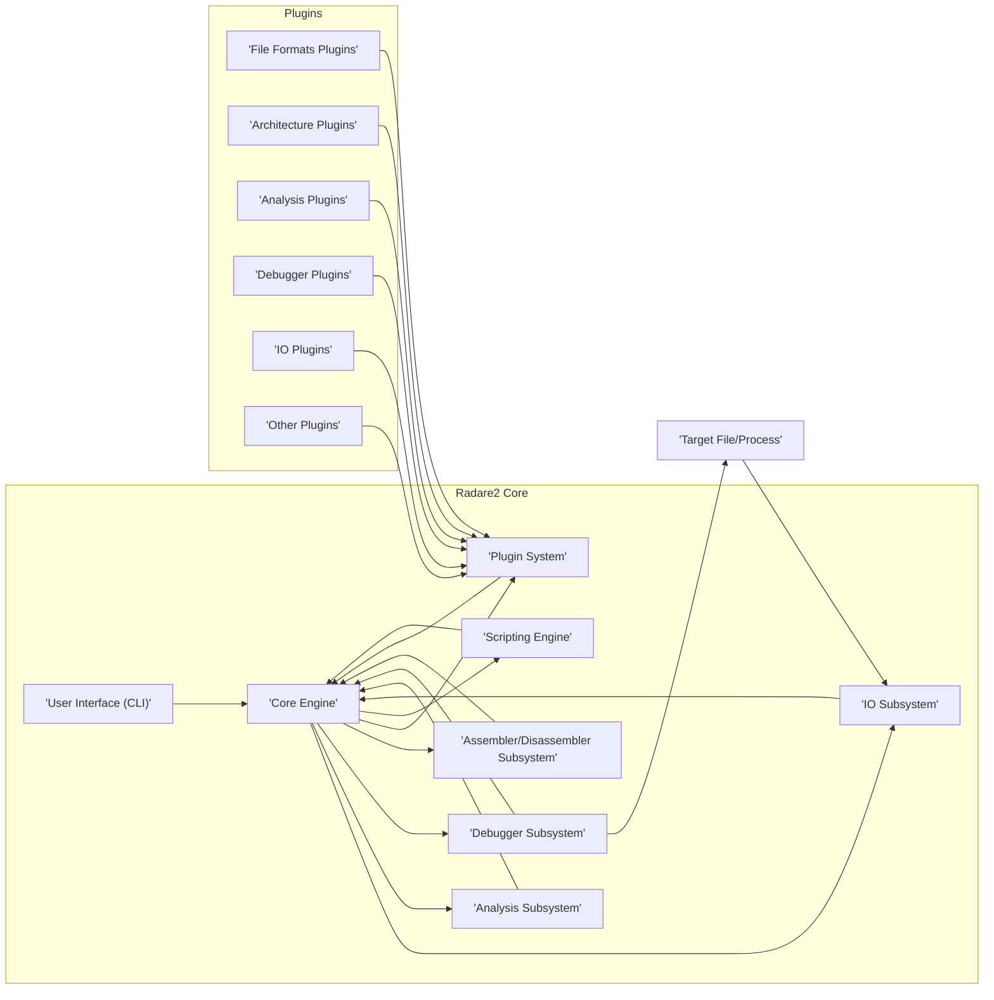
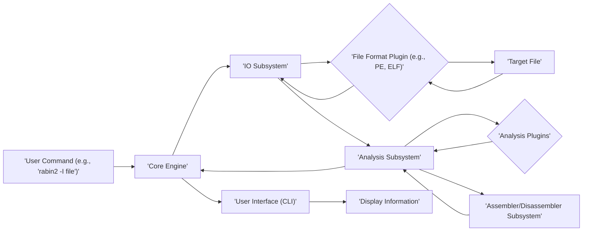
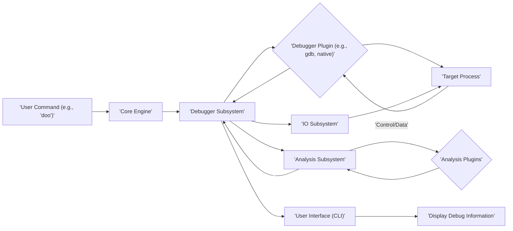

# Project Design Document: Radare2 Reverse Engineering Framework

**Version:** 1.1
**Date:** October 26, 2023
**Author:** AI Software Architect

## 1. Introduction

This document provides a detailed architectural design of the Radare2 reverse engineering framework. It outlines the key components, their interactions, and the overall system structure. This document serves as a foundation for subsequent threat modeling activities, enabling a comprehensive understanding of potential security vulnerabilities within the framework.

### 1.1. Purpose

The primary purpose of this document is to provide a clear and comprehensive architectural overview of Radare2. This will facilitate:

* Understanding the system's structure and components.
* Identifying potential attack surfaces and vulnerabilities.
* Guiding threat modeling exercises.
* Serving as a reference for developers and security analysts.
* Onboarding new contributors to the project.

### 1.2. Scope

This document covers the core architectural components of Radare2, including its main subsystems, data flow, and key interactions. It focuses on the logical architecture and provides sufficient detail to understand the system's behavior from a security perspective. Implementation details of specific plugins or functionalities are included when they are crucial for understanding the overall system design and potential security implications.

### 1.3. Target Audience

This document is intended for:

* Security architects and engineers involved in threat modeling and security assessments.
* Developers working on Radare2, including core developers and plugin authors.
* Security researchers analyzing Radare2 for vulnerabilities.
* Quality assurance engineers testing Radare2's functionality and security.
* Anyone seeking a high-level and detailed understanding of Radare2's architecture.

## 2. System Overview

Radare2 is a portable reversing framework written in C. It provides a command-line interface and a rich set of tools for analyzing, disassembling, debugging, and manipulating binary files. Its modular design, based on plugins, allows for extensive customization and extension of its capabilities, making it a versatile tool for reverse engineering, malware analysis, and vulnerability research.

## 3. Architectural Design

Radare2's architecture is centered around a core engine that manages various subsystems and interacts with plugins. The following diagram illustrates the high-level architecture:

### 3.1. Key Components

* **Core Engine:** The central component responsible for:
    * Command parsing and dispatching.
    * Managing the state of the analysis and debugging sessions.
    * Coordinating interactions between different subsystems and plugins.
    * Providing core utilities and data structures.
* **User Interface (CLI):** The primary interface for interacting with Radare2, responsible for:
    * Accepting user commands.
    * Displaying output from commands and analysis.
    * Providing a navigable and interactive environment.
* **IO Subsystem:** Handles all input and output operations, including:
    * Reading data from files, memory, and remote targets.
    * Writing data to files and memory.
    * Managing file descriptors and memory mappings.
    * Utilizing IO plugins to support various protocols (e.g., file, http, gdbserver) and storage mechanisms.
* **Analysis Subsystem:** Provides functionalities for understanding the structure and behavior of binary files:
    * Disassembly of code into assembly instructions.
    * Control flow graph (CFG) generation.
    * Data flow analysis.
    * Function and symbol identification.
    * Utilizing analysis plugins for specific analysis techniques (e.g., emulation, decompilation, vulnerability detection).
* **Debugger Subsystem:** Enables dynamic analysis and interaction with running processes:
    * Setting breakpoints (hardware and software).
    * Stepping through code execution (step-in, step-over, step-out).
    * Inspecting and modifying memory and registers.
    * Handling signals and exceptions.
    * Utilizing debugger plugins to support different debugging protocols and target architectures (e.g., native, gdb, windbg).
* **Assembler/Disassembler Subsystem:** Responsible for:
    * Converting assembly code into machine code (assembling).
    * Converting machine code into assembly mnemonics (disassembling).
    * Supporting various processor architectures through architecture plugins.
* **Plugin System:** A core extensibility mechanism that allows for:
    * Dynamically loading and unloading plugins.
    * Defining interfaces for different plugin types (e.g., file formats, architectures, analysis).
    * Enabling community contributions and customization of Radare2's functionality.
* **Scripting Engine:** Enables automation and scripting of Radare2 operations, allowing users to:
    * Automate repetitive tasks.
    * Extend Radare2's functionality with custom scripts.
    * Integrate Radare2 with other tools and workflows.
    * Supporting languages like Python, Lua, and JavaScript through embedded interpreters or external processes.

### 3.2. Data Flow

The data flow within Radare2 varies depending on the specific operation being performed. Here are examples for common scenarios:

* **Analyzing a File:**
    * The user provides a command to analyze a file (e.g., `rabin2 -I <file>`).
    * The **Core Engine** receives the command.
    * The **IO Subsystem** is invoked, potentially using a **File Format Plugin** to parse the file.
    * The file data is loaded into memory.
    * The **Analysis Subsystem** is invoked, utilizing relevant **Analysis Plugins** and the **Assembler/Disassembler Subsystem** to extract information.
    * The results are passed back to the **Core Engine**.
    * The **User Interface (CLI)** displays the information to the user.

* **Debugging a Process:**
    * The user provides a command to start debugging (e.g., `r2 -d <program>`).
    * The **Core Engine** receives the command.
    * The **Debugger Subsystem** is invoked, utilizing a relevant **Debugger Plugin** to attach to or launch the target process.
    * The **IO Subsystem** might be used for reading process memory.
    * The user interacts with the debugger through commands (e.g., setting breakpoints, stepping).
    * The **Debugger Subsystem** interacts with the target process, and the **Analysis Subsystem** can be used to analyze code and memory in the debugged process.
    * Information about the debugging session is passed back to the **Core Engine**.
    * The **User Interface (CLI)** displays debug information to the user.

## 4. Key Security Considerations

Several aspects of Radare2's architecture are relevant from a security perspective and require careful consideration during development and usage:

* **Handling Untrusted Input (File Parsing):**
    * Radare2 frequently processes potentially malicious binary files with crafted structures.
    * Vulnerabilities in **File Format Plugins** or the **IO Subsystem's** core parsing logic could lead to:
        * **Crashes:** Denial of service due to unexpected input.
        * **Information Leaks:** Exposure of sensitive data from the host system.
        * **Remote Code Execution (RCE):** Exploitation of memory corruption bugs to execute arbitrary code on the user's machine.
* **Plugin Security (Extensibility Risks):**
    * The plugin architecture allows for extending functionality but introduces risks if plugins are malicious or poorly written.
    * Potential threats include:
        * **Malicious Plugins:** Intentionally designed to harm the user's system or steal data.
        * **Vulnerable Plugins:** Containing security flaws that can be exploited.
        * **API Misuse:** Plugins incorrectly using Radare2's APIs, leading to unexpected behavior or vulnerabilities.
* **Debugger Interactions (Process Manipulation):**
    * When debugging, Radare2 interacts directly with target processes, which could be malicious.
    * Vulnerabilities in **Debugger Plugins** or the **Debugger Subsystem** could be exploited to:
        * **Gain Control Over the Target Process:** Inject code, modify its behavior, or extract sensitive information.
        * **Escape the Debugging Environment:** Potentially affecting the host system.
* **Scripting Engine Security (Code Execution Risks):**
    * The **Scripting Engine** allows users to automate tasks, but executing untrusted scripts can be dangerous.
    * Potential risks include:
        * **Arbitrary Code Execution:** Malicious scripts executing commands on the user's system.
        * **Access to Sensitive Information:** Scripts accessing and potentially exfiltrating data.
        * **Denial of Service:** Scripts consuming excessive resources.
* **Information Disclosure (Data Handling):**
    * Radare2 analyzes sensitive information within binary files and process memory.
    * Bugs in **Analysis Plugins** or the **Core Engine** could lead to:
        * **Unintended Information Leakage:** Displaying or storing sensitive data inappropriately.
        * **Exposure of Internal State:** Revealing information that could be used to exploit other vulnerabilities.
* **Memory Safety (C Language Vulnerabilities):**
    * As a C-based application, Radare2 is susceptible to memory safety issues if not carefully implemented.
    * Common vulnerabilities include:
        * **Buffer Overflows:** Writing beyond the allocated memory boundaries.
        * **Use-After-Free:** Accessing memory that has been freed.
        * **Integer Overflows:** Arithmetic operations resulting in unexpected values.
* **Command Injection:**
    * If Radare2 uses external commands based on user input without proper sanitization, it could be vulnerable to command injection attacks.
* **Side-Channel Attacks:**
    * While less common, vulnerabilities could exist that allow attackers to infer information based on timing or resource consumption during analysis or debugging.

## 5. Security Architecture Principles

The following security principles guide the design and development of Radare2:

* **Principle of Least Privilege:** Components and plugins should only have the necessary permissions and access to perform their intended functions.
* **Input Validation:** All external input, including files, user commands, and plugin data, should be rigorously validated to prevent unexpected behavior and vulnerabilities.
* **Secure Coding Practices:** Adherence to secure coding practices is crucial to prevent memory safety issues and other common vulnerabilities.
* **Sandboxing and Isolation:** Where feasible, sandboxing or isolation techniques should be employed to limit the impact of potentially malicious plugins or target processes.
* **Regular Security Audits:** Periodic security audits and penetration testing are necessary to identify and address potential vulnerabilities.
* **Security Awareness Training:** Developers and users should be educated about security risks and best practices.

## 6. Dependencies

Radare2 relies on various external libraries and tools, which can impact its security posture:

* **zlib:** Used for data compression. Vulnerabilities in zlib could affect Radare2's ability to handle compressed files securely.
* **libmagic:** Used for file type identification. Incorrectly identifying file types could lead to the wrong plugins being used, potentially causing errors or vulnerabilities.
* **capstone:** A popular disassembly engine that can be used as a plugin. Security vulnerabilities in capstone could be inherited by Radare2.
* **keystone:** An assembly engine that can be used as a plugin. Similar to capstone, vulnerabilities in keystone could affect Radare2.
* **Various scripting language interpreters (e.g., Python, Lua, JavaScript):**  Security vulnerabilities in these interpreters could be exploited through Radare2's scripting engine.
* **Build tools (e.g., GCC, Make):**  While not runtime dependencies, vulnerabilities in build tools could potentially be exploited to inject malicious code during the build process.

Maintaining up-to-date versions of these dependencies and being aware of their security advisories is crucial.

## 7. Deployment

Radare2 is typically deployed as a command-line tool on various operating systems (Linux, macOS, Windows). Common deployment scenarios include:

* **Local Installation:** Users install Radare2 directly on their machines for individual use.
* **Containerized Environments:** Radare2 can be deployed within Docker or other container technologies for isolated and reproducible environments.
* **Integration with Security Tools:** Radare2 can be integrated into larger security analysis platforms and workflows.

The deployment environment can influence the overall security posture. For example, running Radare2 in a sandboxed environment can mitigate the impact of potential vulnerabilities.

## 8. Future Considerations

Potential future architectural changes or additions that could impact security include:

* **Web Interface:** Introducing a web interface would expose new attack surfaces related to web application security (e.g., cross-site scripting, cross-site request forgery).
* **GUI Enhancements:**  Changes to the graphical user interface (if any) might introduce new vulnerabilities related to UI interactions and event handling.
* **New Plugin Types:**  The introduction of new plugin types requires careful consideration of their security implications and the interfaces they expose.
* **Cloud Integration:** Integrating with cloud services could introduce new security challenges related to authentication, authorization, data storage, and network communication.
* **Improved Plugin Sandboxing:** Implementing more robust sandboxing mechanisms for plugins could mitigate the risks associated with malicious or vulnerable plugins.

## 9. Conclusion

This document provides a detailed architectural overview of the Radare2 framework, emphasizing its key components, data flow, and security considerations. Understanding this architecture is essential for effective threat modeling and for developing secure and robust software. The modular plugin-based design offers significant power and flexibility but also necessitates a strong focus on plugin security and secure coding practices throughout the development lifecycle. Continuous security assessment and proactive mitigation strategies are crucial for maintaining the security integrity of the Radare2 project.