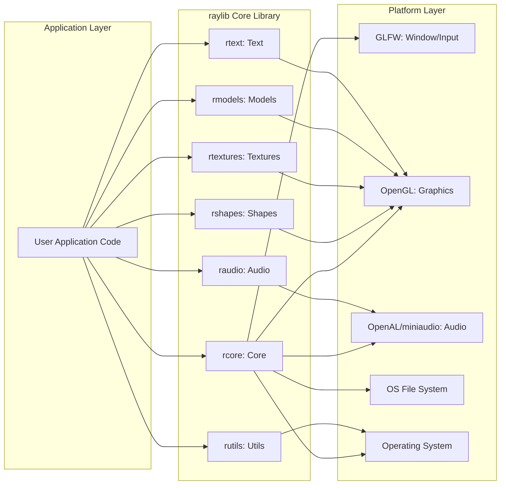
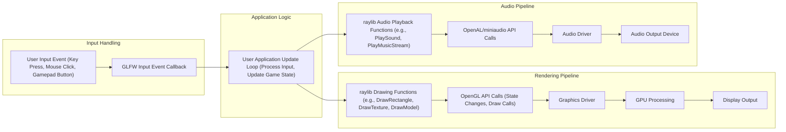

## Project Design Document: raylib (Improved)

**1. Introduction**

This document provides a detailed design overview of the raylib project, an open-source, simple, and easy-to-use library for enjoying video games programming. This document aims to provide a comprehensive understanding of the project's architecture, components, and data flow, which will serve as a solid foundation for subsequent threat modeling activities. The focus is on providing sufficient detail to identify potential attack surfaces and vulnerabilities.

**2. Project Overview**

*   **Project Name:** raylib
*   **Project Repository:** [https://github.com/raysan5/raylib](https://github.com/raysan5/raylib)
*   **Project Description:** raylib is a free and open-source, cross-platform library written in C, designed for developing 2D and 3D games and multimedia applications. It offers a straightforward and accessible API, abstracting away the complexities of low-level graphics and audio programming. Bindings are available for numerous other programming languages, extending its reach.
*   **Key Features:**
    *   User-friendly and intuitive API design.
    *   Broad cross-platform compatibility (Windows, Linux, macOS, Android, iOS, Web via Emscripten).
    *   Comprehensive support for both 2D and 3D graphics rendering.
    *   Integrated audio playback and recording capabilities.
    *   Robust input handling for keyboard, mouse, and gamepad devices.
    *   Flexible font rendering system supporting various font formats.
    *   Support for loading and rendering various 3D model formats.
    *   Basic physics simulation functionalities.
    *   Collection of utility functions for common mathematical operations and data structure management.

**3. Goals and Objectives**

*   To empower developers with a simple and accessible library for game creation.
*   To offer a truly cross-platform solution, minimizing platform-specific code.
*   To prioritize ease of use and a gentle learning curve for newcomers to game development.
*   To provide a rich set of functionalities covering the essential aspects of game development.
*   To foster a vibrant community through open-source contributions and extensions.

**4. Target Audience**

*   Individuals exploring game development as a hobby.
*   Students learning the fundamentals of game programming principles.
*   Independent game developers seeking a lightweight and efficient library.
*   Educators utilizing raylib as a teaching tool for game development concepts.

**5. High-Level Architecture**

*   **Application Layer:** This is the domain of the game developer, where custom game logic, rendering instructions, and input handling are implemented using the raylib API.
*   **raylib Core Library:** This layer encapsulates the core functionalities of raylib, organized into distinct modules for better maintainability and organization.
    *   **`rcore` (Core Module):**  Responsible for the fundamental aspects of the application lifecycle, including initialization, the main game loop, window management, input event processing, and basic utility functions.
    *   **`rshapes` (Shapes Module):** Provides functions for drawing primitive 2D geometric shapes, both filled and outlined, often used for basic game elements or debugging visualizations.
    *   **`rtextures` (Textures Module):** Manages the loading, creation, manipulation, and drawing of 2D images (textures) used to add visual detail to game objects.
    *   **`raudio` (Audio Module):** Handles the loading, playback, manipulation, and recording of audio data, supporting various audio file formats.
    *   **`rmodels` (Models Module):**  Deals with the loading, rendering, and manipulation of 3D models, including applying textures and materials.
    *   **`rtext` (Text Module):**  Provides functionalities for loading and rendering text using various font formats, essential for displaying game information and user interfaces.
    *   **`rutils` (Utils Module):** Contains a collection of general-purpose utility functions, including mathematical operations (vectors, matrices), color manipulation, and basic data structures.
*   **Platform Layer:** This layer provides an abstraction over the underlying operating system and hardware, ensuring cross-platform compatibility.
    *   **GLFW:** A library used for creating and managing operating system windows, handling user input events (keyboard, mouse, gamepad), and managing the OpenGL context.
    *   **OpenGL:** A widely adopted cross-language, cross-platform API for rendering 2D and 3D vector graphics. raylib utilizes OpenGL for its rendering pipeline.
    *   **OpenAL/miniaudio:** Libraries used for handling audio playback and recording. raylib can be configured to use either the more feature-rich OpenAL or its own lightweight audio backend, miniaudio.
    *   **OS File System:** The operating system's file system is accessed for loading various assets required by the game, such as images, audio files, 3D models, and fonts.
    *   **Operating System:** The underlying operating system provides the fundamental services and resources necessary for the application to execute.

**6. Component Breakdown**

*   **`rcore` (Core Module):**
    *   **Functionality:** Manages the core application loop, window creation and destruction using GLFW, input event polling and processing (keyboard, mouse, gamepad button and axis states), timing functions for frame rate control, logging and error reporting mechanisms, and basic memory management utilities.
    *   **Security Considerations:** Improper handling of input events could lead to vulnerabilities if not sanitized or validated. Memory management errors (e.g., buffer overflows) within this core module could have significant impact.
*   **`rshapes` (Shapes Module):**
    *   **Functionality:** Provides functions for drawing basic 2D geometric primitives like rectangles, circles, lines, and polygons. Supports drawing textured rectangles and provides basic color manipulation for shapes. Relies on the OpenGL context initialized by the Core Module.
    *   **Security Considerations:** While seemingly simple, vulnerabilities could arise if drawing functions don't properly handle large or invalid input parameters, potentially leading to rendering issues or even crashes.
*   **`rtextures` (Textures Module):**
    *   **Functionality:** Handles the loading of image files from various formats (e.g., PNG, JPG, BMP) into GPU memory as textures. Provides functions for creating textures from raw pixel data, managing texture parameters (filtering, wrapping modes), and drawing textured primitives. Often utilizes external libraries like `stb_image` for image decoding.
    *   **Security Considerations:** This module is a significant attack surface. Vulnerabilities in image decoding libraries or improper handling of image data could lead to buffer overflows, arbitrary code execution, or denial-of-service attacks if malicious image files are loaded.
*   **`raudio` (Audio Module):**
    *   **Functionality:** Manages the loading of audio files from various formats (e.g., WAV, OGG, MP3), playback of sound effects and music streams, control over audio parameters (volume, pitch, panning), and potentially audio recording capabilities. Utilizes either OpenAL or the miniaudio library as a backend.
    *   **Security Considerations:** Similar to textures, vulnerabilities in audio decoding libraries or improper handling of audio data could lead to security issues. Careless handling of audio buffers could also introduce vulnerabilities.
*   **`rmodels` (Models Module):**
    *   **Functionality:** Handles the loading of 3D model files from various formats (e.g., OBJ, GLTF, FBX), rendering of 3D models with applied textures and materials, management of camera perspectives and transformations, and potentially basic animation support. May rely on external libraries like `tinyobjloader` or Assimp for model loading.
    *   **Security Considerations:** Model loading is another potential attack vector. Maliciously crafted model files could exploit vulnerabilities in the loading libraries, leading to buffer overflows or other memory corruption issues. Complex model structures could also be used for denial-of-service attacks.
*   **`rtext` (Text Module):**
    *   **Functionality:** Provides functions for loading and rendering text using various font formats (e.g., TTF, OTF). Supports different text rendering styles, sizes, and colors. May utilize libraries like `stb_truetype` for font rasterization.
    *   **Security Considerations:**  Vulnerabilities in font parsing libraries could be exploited by loading specially crafted font files. Improper handling of text input could also lead to buffer overflows if the rendered text exceeds allocated buffer sizes.
*   **`rutils` (Utils Module):**
    *   **Functionality:** Contains a collection of general-purpose utility functions, including vector and matrix math operations, color manipulation functions, basic data structure implementations (e.g., dynamic arrays), and potentially file system utility functions.
    *   **Security Considerations:** While seemingly benign, vulnerabilities in utility functions, especially those dealing with memory management or file operations, could be exploited if used incorrectly or with malicious input.

**7. Data Flow**

*   **Input Handling:** A user action (e.g., pressing a key, clicking the mouse, pressing a gamepad button) generates an input event. GLFW captures this event and triggers a corresponding callback function within the raylib Core Module.
*   **Application Logic:** The user application's update loop receives processed input information from raylib. Based on this input and the current game state, the application logic updates game variables, object positions, and other relevant data.
*   **Rendering Pipeline:** When the application needs to render the scene, it calls various raylib drawing functions. These functions translate into a series of OpenGL API calls, which instruct the graphics driver on how to render the scene. The graphics driver communicates with the GPU to perform the actual rendering, and the final output is displayed on the screen.
*   **Audio Pipeline:** When the application needs to play audio, it calls raylib audio playback functions. These functions utilize either OpenAL or miniaudio to send audio data to the audio driver. The audio driver then sends the audio signal to the audio output device (e.g., speakers, headphones).

**8. External Interfaces**

*   **Operating System APIs:** raylib interacts with the underlying operating system for core functionalities such as memory allocation, thread management, and system time access. Improper OS API usage could lead to instability or security issues.
*   **GLFW:**  Provides the interface for window creation, input handling, and OpenGL context management. Vulnerabilities in GLFW could directly impact raylib applications.
*   **OpenGL:** The primary graphics rendering API. Security vulnerabilities in OpenGL drivers or the OpenGL implementation itself could be a concern.
*   **OpenAL/miniaudio:**  Provides the interface for audio playback and recording. Vulnerabilities in these libraries could be exploited.
*   **Build Tools (Compilers, Linkers):**  The build process relies on compilers and linkers. Compromised build tools could introduce malicious code into the compiled raylib library.
*   **User Application Code:** The primary way users interact with raylib is through its API. Incorrect usage of the API by the user can lead to vulnerabilities in their applications, though not directly in raylib itself.
*   **File System:** Used for loading assets. As discussed, this is a significant attack surface if file loading is not handled securely.

**9. Deployment Model**

*   raylib is typically distributed as a statically or dynamically linked library. Developers include the raylib header files and link against the appropriate library file for their target platform.
*   Cross-platform deployment requires compiling raylib separately for each target operating system and architecture.
*   Language bindings provide an interface to the core C library, allowing developers to use raylib in other programming languages. The security of these bindings is crucial.
*   For web deployments using Emscripten, the entire raylib library and the application are compiled to JavaScript/WebAssembly. Security considerations for web applications then apply.

**10. Security Considerations (Detailed)**

*   **Input Validation Vulnerabilities:**
    *   **File Loading:**  Loading images, audio, and models from untrusted sources poses a significant risk. Maliciously crafted files could exploit vulnerabilities in the respective decoding libraries (e.g., `stb_image`, audio codecs, model loaders), leading to buffer overflows, arbitrary code execution, or denial of service. *Example: A specially crafted PNG file could trigger a buffer overflow in `stb_image` when loaded using `LoadTexture()`.*
    *   **User Input:** While raylib abstracts input, improper handling of input values within the application logic could lead to issues. *Example:  Failing to sanitize text input could lead to buffer overflows if the text is used in rendering functions without proper bounds checking.*
*   **Memory Management Errors:**
    *   **Buffer Overflows:** As a C library, raylib is susceptible to buffer overflows if memory is not managed carefully. This is especially relevant in functions that handle string manipulation, data loading, or processing of external data. *Example: A function that copies a string without checking the destination buffer size could lead to a buffer overflow.*
    *   **Use-After-Free:**  Incorrectly freeing memory and then attempting to access it can lead to crashes or exploitable vulnerabilities.
    *   **Double-Free:** Freeing the same memory location twice can corrupt the heap and lead to security issues.
*   **Dependency Vulnerabilities:**
    *   raylib relies on external libraries like GLFW, OpenGL drivers, and OpenAL/miniaudio. Known vulnerabilities in these dependencies could be exploited in applications using raylib. It's crucial to keep these dependencies updated. *Example: A known vulnerability in a specific version of GLFW could be exploited if an older version is used.*
*   **Platform-Specific Vulnerabilities:**
    *   Different operating systems and graphics drivers may have their own security vulnerabilities that could be indirectly exploitable through raylib.
*   **Denial of Service (DoS):**
    *   **Resource Exhaustion:**  Loading excessively large assets or performing computationally intensive operations could lead to resource exhaustion and denial of service. *Example: Loading an extremely high-resolution texture could consume excessive GPU memory.*
    *   **Algorithmic Complexity:**  Inefficient algorithms in certain raylib functions could be exploited to cause performance degradation or DoS.
*   **Code Injection (Primarily relevant for language bindings):**
    *   If language bindings are not implemented securely, there might be a risk of injecting arbitrary code into the application. This is less of a concern for direct C usage but important for bindings to languages like Lua or Python.
*   **Integer Overflows:**  Performing arithmetic operations on integer values without proper bounds checking could lead to unexpected behavior or vulnerabilities.

This improved design document provides a more detailed and nuanced understanding of the raylib project, highlighting potential areas of security concern that should be thoroughly investigated during the threat modeling process.
