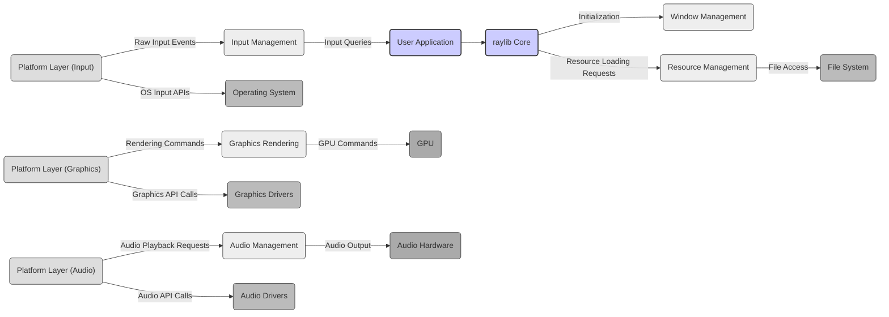

# Project Design Document: raylib - A Simple and Easy-to-Use Library for Games Development

**Version:** 1.1
**Date:** October 26, 2023
**Author:** AI Software Architect

## 1. Introduction

This document provides a detailed architectural design of the raylib project, an open-source, simple, and easy-to-use library for enjoying games programming. This document aims to clearly outline the project's components, their interactions, and data flow, serving as a foundation for subsequent threat modeling activities. The information presented here is based on the project's public repository: [https://github.com/raysan5/raylib](https://github.com/raysan5/raylib). This revised version provides more detail on component responsibilities and potential security considerations.

## 2. Goals and Objectives

The primary goals of raylib are:

*   **Simplicity:** Provide a straightforward API that is easy to learn and use, even for beginners, minimizing the learning curve for game development.
*   **Ease of Use:** Abstract away complex platform-specific details related to windowing, input, and rendering, allowing developers to focus on core game logic and creativity.
*   **Portability:** Support a wide range of platforms, including desktop (Windows, Linux, macOS), web (HTML5), and mobile (Android, iOS), enabling cross-platform game development with minimal code changes.
*   **Modularity:** Offer a well-structured and modular architecture, facilitating extension and customization by users and contributors, promoting code reusability and maintainability.
*   **Performance:** Deliver good performance for both 2D and 3D graphics rendering, ensuring smooth and responsive gameplay experiences.

## 3. Architectural Overview

raylib is primarily a C library, designed to be linked directly into user applications. It provides a comprehensive set of functions for managing application lifecycle, user interaction, visual presentation, and audio feedback. The core architecture can be visualized as a layered system, with each layer providing distinct functionalities and abstracting underlying complexities.

```mermaid
graph LR
    subgraph "User Application"
        A("User Code")
    end
    subgraph "raylib Library"
        B("Core") --> C("Window Management")
        B --> D("Input Management")
        B --> E("Graphics Rendering")
        B --> F("Audio Management")
        B --> G("Resource Management")
        B --> H("Utilities")
        C --> I("Platform Layer")
        D --> I
        E --> I
        F --> I
        G --> I
    end
    subgraph "Operating System"
        I("Platform Layer") --> J("OS Services")
        I --> K("Graphics Drivers")
        I --> L("Audio Drivers")
    end
    A -- "raylib API Calls" --> B
    J -- "System Calls" --> "Hardware"
    K -- "Driver Calls" --> "GPU"
    L -- "Driver Calls" --> "Audio Hardware"
```

## 4. Component Description

The raylib library is composed of several interconnected components, each with specific responsibilities:

*   **Core:**
    *   Responsible for the overall lifecycle management of the library and the user application.
    *   Provides functions for initialization (`InitWindow`, `CloseWindow`), the main game loop, and time management.
    *   Manages global library state and configuration.
    *   Offers basic data structures and type definitions used throughout the library.
*   **Window Management:**
    *   Handles the creation, manipulation, and destruction of the application window.
    *   Provides functions for setting window properties such as size, title, icon, and full-screen status.
    *   Manages window events (resize, focus changes, etc.).
    *   Abstracts platform-specific windowing APIs.
*   **Input Management:**
    *   Manages user input from various sources, including keyboard, mouse, gamepads, and touchscreens.
    *   Provides functions to query the state of keys, mouse buttons, mouse position, gamepad buttons and axes, and touch points.
    *   Handles input events and provides a consistent input interface across different platforms.
*   **Graphics Rendering:**
    *   The core of raylib's visual capabilities, responsible for drawing and managing graphical content.
    *   **2D Rendering:** Provides functions for drawing basic shapes (lines, rectangles, circles, triangles), text rendering with various fonts, sprite drawing, and texture manipulation.
    *   **3D Rendering:** Supports 3D model loading and rendering (including various formats), camera management (perspective and orthographic), lighting, materials, and basic shader support.
    *   **Texture Management:** Handles loading, creation, and manipulation of textures.
    *   **Shader Management:** Allows loading and using custom shaders for advanced rendering effects.
    *   **Framebuffer Management:** Provides functionality for rendering to off-screen buffers for post-processing effects.
*   **Audio Management:**
    *   Provides functionality for loading, playing, and manipulating audio.
    *   Supports loading and playing sound effects and music files in various formats.
    *   Offers controls for volume, panning, and pitch adjustment.
    *   Supports audio streaming for large audio files.
    *   Manages audio device initialization and playback.
*   **Resource Management:**
    *   Handles the loading, unloading, and management of various assets used by the application.
    *   Manages memory allocated for textures, sounds, fonts, models, and other resources.
    *   May implement caching mechanisms to improve performance by reusing loaded resources.
    *   Provides functions for loading resources from files or memory.
*   **Utilities:**
    *   A collection of helper functions and data structures for common tasks.
    *   **Math Library:** Includes vector and matrix operations for 2D and 3D calculations.
    *   **Color Manipulation:** Provides functions for creating and manipulating color values.
    *   **File I/O:** Offers basic file reading and writing capabilities.
    *   **Text Handling:** Includes functions for text formatting and manipulation.
    *   **Collision Detection:** Basic functions for checking collisions between geometric shapes.
*   **Platform Layer:**
    *   An abstraction layer that provides a consistent interface to the underlying operating system and hardware.
    *   Implements platform-specific code for window creation, input handling, graphics context initialization (OpenGL, OpenGL ES, WebGL, etc.), and audio device management.
    *   Shields the core raylib components from platform-specific details, ensuring portability.

## 5. Data Flow

The typical data flow within a raylib application involves the following steps:

*   **Initialization:** The user application initiates the process by calling initialization functions in the `Core` component (e.g., `InitWindow`). This triggers the `Window Management` and `Platform Layer` to create the application window and initialize the graphics context.
*   **Input Handling:** The `Platform Layer` receives raw input events (keyboard presses, mouse movements, etc.) from the operating system. These events are then processed and translated into a platform-independent format by the `Input Management` component. The user application can then query the state of input devices through the `Input Management` API.
*   **Resource Loading:** When the application needs to display images, play sounds, or render 3D models, it uses the `Resource Management` component to load these assets from the file system or embedded resources. The `Resource Management` component handles file I/O and potentially utilizes external libraries for decoding specific file formats.
*   **Game Logic Processing:** The user application updates the game state based on input and internal logic. This involves calculations, AI updates, and other game-specific operations.
*   **Graphics Rendering Pipeline:**
    *   The user application uses functions from the `Graphics Rendering` component to prepare for drawing. This includes setting up the camera, loading shaders, and preparing textures.
    *   Drawing commands (e.g., `DrawRectangle`, `DrawModel`) are issued by the user application.
    *   The `Graphics Rendering` component processes these commands and interacts with the `Platform Layer` to submit rendering calls to the graphics drivers.
    *   The graphics drivers then communicate with the GPU to perform the actual rendering operations.
    *   Rendered output is displayed in the application window.
*   **Audio Playback Pipeline:**
    *   The user application uses the `Audio Management` component to load and control audio playback.
    *   Audio data is loaded by the `Resource Management` component.
    *   Playback commands (e.g., `PlaySound`, `PlayMusicStream`) are issued.
    *   The `Audio Management` component interacts with the `Platform Layer` and audio drivers to output audio through the audio hardware.
*   **Termination:** When the application exits, the user code calls termination functions in the `Core` component (e.g., `CloseWindow`). This triggers the cleanup of resources by the respective components and the `Platform Layer`, releasing system resources.



## 6. External Dependencies

raylib's functionality depends on several external components and libraries at runtime and during the build process:

*   **Operating System:** Provides the fundamental environment for raylib to execute, offering services for memory management, process management, and file system access.
*   **Graphics Drivers (OpenGL, OpenGL ES, DirectX, Metal, WebGL):** Essential for hardware-accelerated rendering. raylib abstracts the underlying graphics API through its `Platform Layer`, but the appropriate drivers must be installed on the target system. The specific driver dependency varies based on the platform and the graphics backend chosen during compilation.
*   **Audio Drivers (OpenAL, PulseAudio, WASAPI, DirectSound, Web Audio API):** Necessary for audio playback. Similar to graphics drivers, raylib abstracts the audio API, but compatible drivers are required. The specific driver dependency depends on the platform.
*   **Build Tools (CMake, Make, Visual Studio, etc.):** Used during the development and compilation phase to build the raylib library and user applications. CMake is the primary build system used by raylib.
*   **Compiler (GCC, Clang, MSVC, Emscripten):** Required to compile the C source code of raylib and user applications. The specific compiler depends on the target platform. Emscripten is used for compiling to WebAssembly.
*   **Optional Libraries (Linked Conditionally Based on Features and Platform):**
    *   **GLFW:** Can be used as an alternative windowing and input backend, offering cross-platform compatibility.
    *   **dr_libs (dr_wav, dr_flac, dr_mp3, stb_vorbis):** Used for decoding various audio file formats (WAV, FLAC, MP3, Vorbis). These are often included directly within the raylib repository as single header files.
    *   **stb_image:** A single-header library used for loading various image file formats (PNG, JPG, BMP, etc.). Often included directly within the raylib repository.
    *   **tinyobjloader:** A small library for loading OBJ 3D model files.
    *   **zlib:** Used for data compression, potentially for handling compressed resources.

## 7. Deployment

raylib applications are typically deployed through the following methods:

*   **Static Linking:** The compiled raylib library (a `.lib` or `.a` file) is linked directly into the user application's executable during the linking phase. This creates a standalone executable that includes all necessary raylib code. This is the most common and straightforward deployment method for desktop applications.
*   **Dynamic Linking (Shared Library):** On some platforms (Windows, Linux, macOS), raylib can be built as a shared library (e.g., `.dll`, `.so`, `.dylib`). The user application then links against this shared library at runtime. This reduces the size of the executable but requires the shared library to be present on the target system.
*   **WebAssembly (for HTML5):** When targeting web browsers, raylib is compiled to WebAssembly using Emscripten. The application, along with the compiled raylib library, is deployed as a set of HTML, JavaScript, and WebAssembly files that can be served by a web server. The browser then executes the WebAssembly code.
*   **Mobile Platforms (Android, iOS):** Deployment on mobile platforms involves creating platform-specific packages (e.g., `.apk` for Android, `.ipa` for iOS) that include the compiled raylib library and application code. These packages are then distributed through app stores or other distribution channels.

## 8. Security Considerations (For Threat Modeling)

Based on the architectural design, the following security considerations are relevant for threat modeling:

*   **Input Validation Vulnerabilities (Input Management):**
    *   Improper validation of user input (keyboard, mouse, gamepad, touch) could lead to unexpected behavior or crashes if the application does not handle malformed or malicious input correctly. This could be exploited for denial-of-service.
    *   Buffer overflows could occur if input strings or data exceed expected limits when processed.
*   **Resource Loading Vulnerabilities (Resource Management):**
    *   Loading untrusted or maliciously crafted resource files (images, audio, models) could lead to vulnerabilities in the parsing libraries (e.g., `stb_image`, `dr_libs`, `tinyobjloader`). This could result in buffer overflows, arbitrary code execution, or denial-of-service.
    *   Path traversal vulnerabilities could occur if the application allows users to specify file paths for loading resources, potentially allowing access to sensitive files outside the intended directories.
*   **Graphics Driver Vulnerabilities (Graphics Rendering & Platform Layer):**
    *   raylib relies on external graphics drivers. Vulnerabilities in these drivers could potentially be triggered by specific rendering commands or shader code generated by raylib or the user application, leading to system instability or potential exploits.
*   **External Library Vulnerabilities (Dependencies):**
    *   Vulnerabilities in the optional external libraries used by raylib (GLFW, dr_libs, stb_image, etc.) could be inherited by applications using raylib. Regular updates and security audits of these dependencies are important.
*   **Memory Management Errors (Core, Resource Management, Graphics Rendering, Audio Management):**
    *   As a C library, raylib involves manual memory management. Errors such as buffer overflows, use-after-free, and double-free vulnerabilities could exist in raylib's codebase, potentially leading to crashes or arbitrary code execution.
*   **Platform-Specific Vulnerabilities (Platform Layer):**
    *   The `Platform Layer` interacts directly with operating system APIs. Vulnerabilities in these APIs or incorrect usage by raylib could introduce security risks.
*   **Shader Vulnerabilities (Graphics Rendering):**
    *   If the application allows users to provide custom shaders, vulnerabilities in these shaders could potentially be exploited to gain unauthorized access or cause denial-of-service.
*   **Audio Processing Vulnerabilities (Audio Management):**
    *   Processing of audio data from untrusted sources could lead to vulnerabilities in the audio decoding or processing logic.

This detailed design document provides a comprehensive overview of the raylib project's architecture and serves as a solid foundation for conducting thorough threat modeling activities to identify and mitigate potential security risks.
