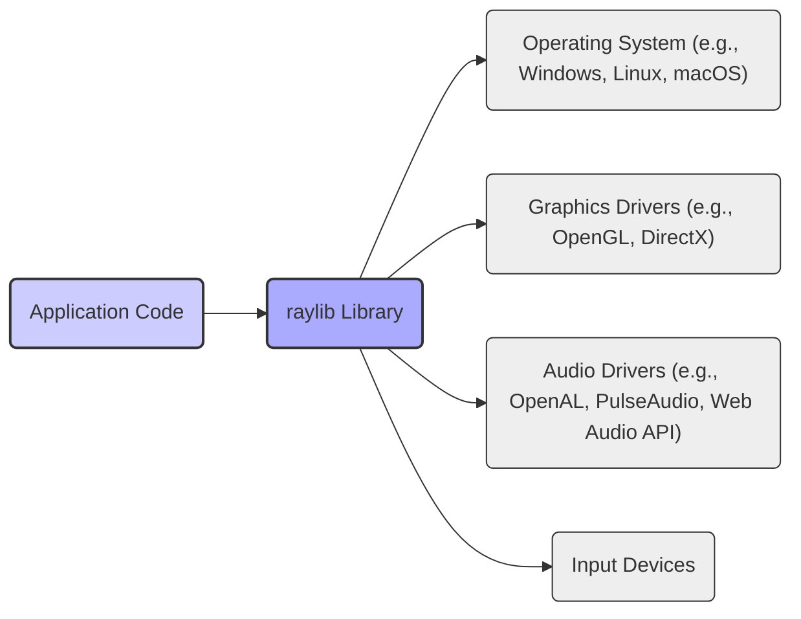
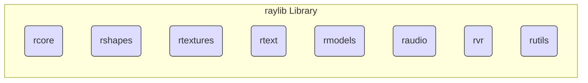
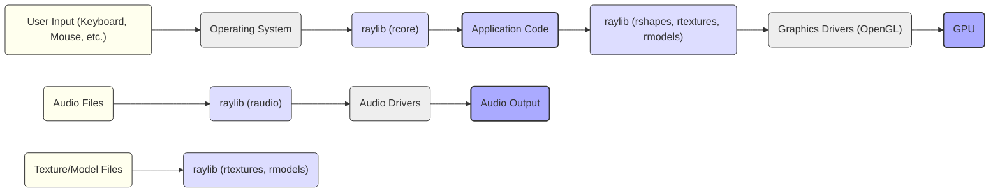

# Project Design Document: raylib

**Version:** 1.1
**Date:** October 26, 2023
**Author:** Gemini (AI Language Model)

## 1. Introduction

This document provides a detailed design overview of the raylib project, an open-source, simple, and easy-to-use library for game development written in C. This document aims to capture the key architectural components, data flow, and external interactions of raylib to facilitate future threat modeling activities. It focuses on providing the necessary information for security analysis.

## 2. Goals and Objectives

The primary goals of raylib are:

*   **Ease of Use:** Provide a straightforward API for both novice and experienced game developers.
*   **Simplicity:** Offer a minimal and focused set of functionalities, avoiding unnecessary complexity and dependencies.
*   **Cross-Platform Compatibility:** Support a wide range of operating systems and platforms, including desktop, mobile, and web.
*   **Modularity:** Design the library with a modular architecture to enhance maintainability, extensibility, and independent development of components.
*   **Performance:** Deliver efficient performance for both 2D and 3D game development tasks.

## 3. High-Level Architecture

raylib is fundamentally a C library that offers a collection of functions for managing various aspects of game creation. It acts as an abstraction layer, shielding developers from platform-specific API complexities and providing a consistent interface across different operating systems.

**Components:**

*   **'Application Code':** The game developer's code that utilizes the raylib API to implement game logic, rendering, and other functionalities.
*   **'raylib Library':** The core C library providing functionalities for graphics rendering, audio management, input handling, window management, resource loading, and more.
*   **'Operating System (OS)':** The underlying operating system on which the application is executed. Raylib interacts with the OS for window creation, input events, and file system access.
*   **'Graphics Drivers':** Software that enables communication between the operating system and the graphics processing unit (GPU). Raylib primarily uses OpenGL, but platform-specific backends might utilize other APIs.
*   **'Audio Drivers':** Software responsible for managing audio input and output devices. Raylib supports various audio backends.
*   **'Input Devices':** Physical devices such as keyboards, mice, touchscreens, and gamepads that provide user input to the application.

## 4. Detailed Component Design

The raylib library is internally structured into several distinct modules, each responsible for a specific set of functionalities. This modularity aids in organization and maintainability.

*   **'Core Module (rcore)':**
    *   Window creation and management (including resizing, focus, and closing).
    *   Input handling for keyboard, mouse, touch, and gamepad devices.
    *   Timing and frame control mechanisms (e.g., setting target FPS).
    *   Basic data structures (vectors, colors, rectangles) and utility functions.
    *   Limited file system access for basic file operations.
    *   Threading support for asynchronous operations.
*   **'Shapes Module (rshapes)':**
    *   Functions for drawing primitive 2D shapes (rectangles, circles, lines, triangles, polygons).
    *   Collision detection algorithms for basic shapes.
*   **'Textures Module (rtextures)':**
    *   Loading and managing textures from various image file formats.
    *   Texture manipulation functions (drawing, cropping, resizing, pixel access).
    *   Framebuffer objects (FBOs) for off-screen rendering and post-processing effects.
    *   Render textures for drawing to textures.
*   **'Text Module (rtext)':**
    *   Loading and rendering fonts from TTF and XNA font formats.
    *   Functions for drawing text strings with various formatting options.
    *   Text measurement utilities.
*   **'Models Module (rmodels)':**
    *   Loading and rendering 3D models from various file formats (OBJ, GLTF, IQM, VOX).
    *   Camera management (perspective and orthographic projections).
    *   Material and mesh manipulation.
    *   Skeletal animation support.
    *   Billboard rendering.
*   **'Audio Module (raudio)':**
    *   Loading and playing audio files in various formats (WAV, OGG, MP3).
    *   Sound effects and music streaming capabilities.
    *   Audio device management and control.
    *   Spatial audio support.
*   **'VR Module (rvr)':**
    *   Support for Virtual Reality devices (e.g., Oculus, OpenVR).
    *   VR rendering setup and management.
    *   VR input handling.
*   **'Utils Module (rutils)':**
    *   A collection of general-purpose utility functions (color manipulation, math functions, string manipulation, etc.).

## 5. Data Flow

The flow of data within a raylib application typically involves these key processes:

*   **'User Input Handling':**
    *   User actions on input devices (keyboard presses, mouse movements, gamepad inputs) are captured by the 'Operating System'.
    *   The 'rcore' module periodically polls the OS for these input events.
    *   The state of input devices is updated and made accessible to the 'Application Code' through raylib API functions (e.g., `IsKeyPressed()`, `GetMousePosition()`).
*   **'Graphics Rendering Pipeline':**
    *   The 'Application Code' utilizes raylib drawing functions from modules like 'rshapes', 'rtextures', and 'rmodels' to define the visual elements of the game.
    *   raylib translates these high-level drawing commands into low-level graphics API calls, primarily targeting OpenGL.
    *   The 'Graphics Drivers' process these API calls, performing calculations and sending rendering instructions to the 'GPU'.
    *   Texture data, managed by 'rtextures', is loaded from files and uploaded to the GPU memory.
    *   Model data, managed by 'rmodels', is loaded from files and transferred to the GPU.
    *   The GPU renders the scene, and the final output is displayed on the screen.
*   **'Audio Processing Flow':**
    *   Audio files (sound effects and music), managed by 'raudio', are loaded from the file system into memory.
    *   The 'raudio' module interacts with 'Audio Drivers' to play audio data through the audio output device.
    *   The 'Application Code' controls audio playback (e.g., playing sounds, setting volume) through raylib API functions.
*   **'Asset Loading Process':**
    *   Assets such as textures, models, and audio files are loaded from the file system.
    *   The respective modules ('rtextures', 'rmodels', 'raudio') handle the loading, parsing, and processing of these file formats.

## 6. External Interfaces

raylib interacts with the external environment through the following key interfaces:

*   **'Operating System APIs':** raylib relies heavily on OS-specific APIs for core functionalities such as window management, input handling, file system operations, threading, and dynamic library loading.
*   **'Graphics APIs (OpenGL, potentially others)':** For rendering graphics, raylib primarily utilizes OpenGL. Platform-specific implementations might use other APIs like DirectX on Windows or WebGL in web browsers.
*   **'Audio APIs (OpenAL, PulseAudio, Web Audio API, potentially others)':** For audio playback and management, raylib supports various audio backends, including OpenAL, PulseAudio on Linux, and the Web Audio API in web environments.
*   **'File System':** raylib interacts with the file system to load various asset files, including textures, models, fonts, and audio files. This interaction involves reading data from files.
*   **'Build System (CMake, Makefiles)':** The build system is used to compile the raylib library from its source code and to link it with the user's application code.
*   **'Package Managers (e.g., vcpkg, Conan, NuGet)':** Users may install raylib and its dependencies through various package managers, simplifying the integration process.

## 7. Security Considerations

This section outlines potential security considerations relevant to raylib and applications built with it. These points should be further investigated during a thorough threat modeling exercise.

*   **'Memory Management Vulnerabilities (Buffer Overflows, Use-After-Free)':** As raylib is implemented in C, manual memory management is employed. Improper handling of memory allocation and deallocation can lead to buffer overflows when processing external data (e.g., loading large textures or models) or use-after-free vulnerabilities if memory is accessed after it has been freed.
*   **'Integer Overflows':** Calculations involving sizes, indices, or counts, especially when dealing with external data or user input, could be susceptible to integer overflows. This can lead to unexpected behavior, memory corruption, or exploitable conditions.
*   **'File Handling Vulnerabilities (Path Traversal, Arbitrary File Read/Write)':**  Improper sanitization of file paths provided by the application or read from configuration files could allow attackers to read or write arbitrary files on the system. This is particularly relevant during asset loading.
*   **'Dependency Vulnerabilities':** raylib relies on external libraries and system-level components (e.g., OpenGL drivers, audio libraries). Vulnerabilities in these dependencies could indirectly affect the security of raylib applications. Keeping dependencies updated is crucial.
*   **'Input Validation Issues':** Insufficient validation of user input (e.g., text input fields, file paths provided by the user) could lead to various exploits, including buffer overflows or injection attacks if the input is used in system calls or external commands (though raylib itself doesn't directly execute external commands).
*   **'Denial of Service (DoS)':** Maliciously crafted assets (e.g., excessively large textures or models, malformed audio files) could consume excessive resources (memory, CPU), leading to application crashes or unresponsiveness.
*   **'Build System and Supply Chain Security':** Compromises in the build environment or the supply chain of dependencies could introduce malicious code into the raylib library itself. Verifying the integrity of downloaded source code and binaries is important.
*   **'Resource Exhaustion':**  Uncontrolled allocation of resources (e.g., textures, audio buffers) could lead to resource exhaustion and application failure. Proper resource management is essential.
*   **'VR Specific Vulnerabilities':** When using the VR module, vulnerabilities related to handling VR device input or rendering could potentially be exploited, although this area requires more specialized threat modeling.

## 8. Deployment

raylib is typically deployed as a library that is linked with the user's application. The deployment method can vary depending on the target platform and the developer's preferences.

*   **'Static Linking':** The raylib library code is compiled directly into the application's executable. This results in a larger executable but eliminates the need to distribute separate raylib library files.
*   **'Dynamic Linking':** The application relies on a shared raylib library file (e.g., a `.dll` on Windows, a `.so` on Linux, a `.dylib` on macOS) at runtime. This reduces the size of the application executable but requires the raylib library to be present on the target system.

The deployment process generally involves:

*   Compiling the raylib library for the target platform.
*   Integrating the compiled raylib library (either statically or dynamically) with the application's build process.
*   Distributing the necessary raylib library files (for dynamic linking) along with the application executable.
*   Ensuring that the required dependencies (e.g., graphics drivers) are available on the target system.

## 9. Future Considerations

*   **'Enhanced Security Measures':** Implementing more robust input validation, memory safety checks, and mitigations against common vulnerabilities.
*   **'Expanding Platform Support':** Continuously adding and maintaining support for new platforms and devices, while considering platform-specific security implications.
*   **'API Refinements':**  Improving the API based on user feedback and security best practices to reduce the likelihood of misuse leading to vulnerabilities.
*   **'Feature Enhancements':** Adding new functionalities and modules to extend raylib's capabilities.
*   **'Regular Security Audits':** Conducting periodic security audits and penetration testing to proactively identify and address potential vulnerabilities in the library.

This document provides a detailed design overview of the raylib project, specifically tailored for threat modeling purposes. The identified components, data flows, external interfaces, and security considerations offer a solid foundation for understanding potential attack surfaces and vulnerabilities within raylib and applications built upon it.