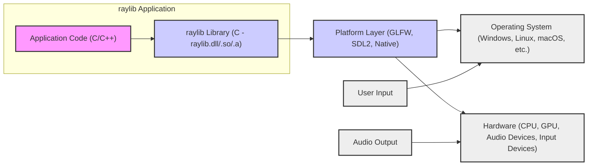
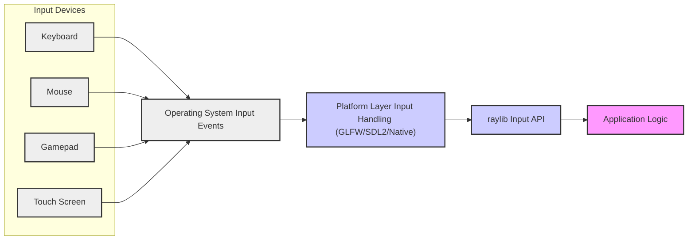
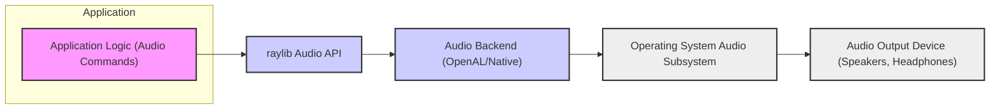
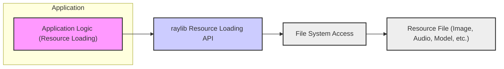

# Project Design Document: raylib - A Simple and Easy-to-use Library to Enjoy Videogames Programming

**Version:** 1.1
**Date:** 2023-10-27 (Improved)
**Author:** Gemini (AI Expert in Software, Cloud and Cybersecurity Architecture)
**Project:** raylib Threat Modeling Design Document
**GitHub Repository:** [https://github.com/raysan5/raylib](https://github.com/raysan5/raylib)

## 1. Introduction

### 1.1 Project Overview

raylib is a simple and easy-to-use cross-platform library to enjoy videogames programming. It is written in C and encourages learning to code video games and graphics programming. raylib is designed to be lightweight, dependency-free, and highly portable, supporting multiple platforms including Windows, Linux, macOS, Android, iOS, Web (HTML5), and Raspberry Pi. It provides a comprehensive suite of functions for graphics, audio, input, window management, and more, making it a powerful tool for game development, educational purposes, and prototyping. raylib is primarily designed for offline, single-user applications, although user-developed applications built with raylib *could* incorporate networking features.

### 1.2 Document Purpose

This document serves as a detailed design specification of the raylib library for the purpose of threat modeling. It outlines the system architecture, components, data flow, technology stack, and deployment model of raylib. This document will be used as a basis for identifying potential security threats, vulnerabilities, and attack vectors within the raylib ecosystem. The target audience for this document includes security professionals, developers, and anyone involved in assessing or improving the security posture of applications built using raylib.

### 1.3 Target Audience

*   Security Engineers and Architects
*   Software Developers using raylib
*   Quality Assurance and Testing Teams
*   Project Managers and Stakeholders

## 2. System Architecture

### 2.1 High-Level Architecture Diagram

**Description:**

The diagram illustrates the high-level architecture of a raylib application, including external interactions.

*   **Application Code (C/C++):** This represents the user-developed game or application logic built using the raylib API. It interacts directly with the raylib library.
*   **raylib Library (C - raylib.dll/.so/.a):** This is the core raylib library, providing functions for graphics rendering, audio playback, input handling, and window management. It acts as an abstraction layer between the application code and the underlying platform.
*   **Platform Layer (GLFW, SDL2, Native):** raylib utilizes platform layers like GLFW, SDL2, or native platform APIs to handle window creation, input events, and context creation. This layer ensures cross-platform compatibility.
*   **Operating System (Windows, Linux, macOS, etc.):** The operating system provides the environment for the application to run, managing system resources and providing system-level services. It also receives user input.
*   **Hardware (CPU, GPU, Audio Devices, Input Devices):** The physical hardware components that execute the application and provide input and output functionalities. Audio output is directed to hardware.
*   **User Input:** Represents the external source of user interactions (keyboard, mouse, gamepad, etc.).
*   **Audio Output:** Represents the external audio output devices (speakers, headphones).

### 2.2 Component Description

#### 2.2.1 Core raylib Library

*   **Purpose:** Provides the main API for game development, encompassing graphics, audio, input, and window management.
*   **Functionality:**
    *   **Graphics Rendering:** 2D and 3D rendering capabilities using OpenGL (or OpenGL ES, WebGL depending on the platform). Includes functions for drawing shapes, textures, models, text, and managing cameras and shaders.
    *   **Audio Management:** Audio playback and recording using libraries like OpenAL or platform-specific audio APIs. Supports loading and playing various audio formats.
    *   **Input Handling:** Manages keyboard, mouse, gamepad, and touch input events. Provides functions to query input states and detect input actions. Input is primarily processed to control application state and rendering.
    *   **Window Management:** Creates and manages application windows, handles window events, and manages display settings. Window management is crucial for user interaction and presentation.
    *   **Resource Management:** Loads and manages resources like textures, audio files, fonts, and models from the file system or embedded data. Efficient resource management is important for performance and preventing resource exhaustion.
    *   **Math Utilities:** Provides basic math functions and data structures (vectors, matrices, quaternions) used internally and exposed to the user.
    *   **File System Operations:** Functions for basic file loading and saving, primarily for resource management and potentially user data persistence (depending on application design). File system access needs to be handled securely to prevent unauthorized access.
    *   **Timers and Time Management:** Functions for measuring time and controlling application frame rate, essential for smooth animation and game logic.

#### 2.2.2 Platform Layer

*   **Purpose:** Abstract the differences between operating systems and hardware, providing a consistent interface for raylib to interact with the underlying platform. This layer is critical for cross-platform compatibility but also introduces potential platform-specific security considerations.
*   **Implementations:**
    *   **GLFW:**  A popular open-source library for OpenGL, OpenGL ES and Vulkan development. Used by raylib for window creation, input handling, and OpenGL context management on desktop platforms. GLFW's security is important as raylib relies on it for core functionalities.
    *   **SDL2:** Another cross-platform development library providing low level access to audio, keyboard, mouse, joystick, and graphics hardware via OpenGL and Direct3D. Can be used as an alternative platform layer. SDL2's security posture is also relevant.
    *   **Native Platform APIs:** For platforms like Web (WebGL, JavaScript APIs), Android (Java/NDK), iOS (Objective-C/Swift), and Raspberry Pi, raylib might directly use native platform APIs for specific functionalities. Security considerations for native APIs are platform-dependent and must be carefully evaluated.

#### 2.2.3 Dependencies

*   **OpenGL (or OpenGL ES, WebGL):**  Graphics API used for rendering. raylib relies on the system's OpenGL drivers. Vulnerabilities in OpenGL drivers could impact raylib applications.
*   **OpenAL (or platform-specific audio APIs):** Audio API used for audio playback. Security of the audio API implementation is relevant.
*   **GLFW or SDL2 (or native platform libraries):** For window management and input. Security of these libraries is crucial.
*   **Standard C Libraries:**  raylib relies on standard C libraries provided by the compiler and operating system. Security of standard C libraries is generally assumed, but vulnerabilities can still occur.
*   **Optional Libraries (for extended functionality):**  Depending on build configuration and user extensions, raylib might optionally use libraries for image loading (stb\_image), audio decoding (stb\_vorbis, dr\_libs), etc. Security of these optional libraries needs to be considered if they are used.

## 3. Data Flow

### 3.1 Input Data Flow

**Description:**

*   Input events originate from various input devices (keyboard, mouse, gamepad, touch screen). These are external and potentially untrusted sources of data.
*   The Operating System captures these hardware events and translates them into OS-level input events. OS input handling can have its own vulnerabilities.
*   The Platform Layer (GLFW, SDL2, or native APIs) receives these OS input events and normalizes them into a platform-independent format. This normalization is important but must be done securely.
*   raylib's Input API then processes these normalized input events and makes them available to the application logic through functions like `IsKeyPressed()`, `GetMousePosition()`, etc. This API is the interface for applications to receive input.
*   The Application Logic uses these input states to control game logic, user interactions, and other application behaviors. Improper handling of input in application logic is a common source of vulnerabilities.

### 3.2 Rendering Data Flow

```mermaid
graph LR
    subgraph "Application"
        App_Logic_Render["Application Logic (Rendering Commands)"]
    end
    App_Logic_Render --> RL_Graphics["raylib Graphics API"]
    RL_Graphics --> RGL["rgl - raylib OpenGL Abstraction"]
    RGL --> GL_Driver["OpenGL Driver"]
    GL_Driver --> GPU["Graphics Processing Unit (GPU)"]
    GPU --> Display["Display Device"]

    style App_Logic_Render fill:#f9f,stroke:#333,stroke-width:2px;
    style RL_Graphics fill:#ccf,stroke:#333,stroke-width:2px;
    style RGL fill:#ccf,stroke:#333,stroke-width:2px;
    style GL_Driver fill:#eee,stroke:#333,stroke-width:2px;
    style GPU fill:#eee,stroke:#333,stroke-width:2px;
    style Display fill:#eee,stroke:#333,stroke-width:2px;

    classDef component fill:#ccf,stroke:#333,stroke-width:2px;
    classDef external fill:#eee,stroke:#333,stroke-width:2px;
    classDef application fill:#f9f,stroke:#333,stroke-width:2px;

    class RL_Graphics,RGL component;
    class GL_Driver,GPU,Display external;
    class App_Logic_Render application;
```

**Description:**

*   The Application Logic generates rendering commands using raylib's Graphics API (e.g., `DrawRectangle()`, `DrawTexture()`, `BeginDrawing()`, `EndDrawing()`). Rendering commands are based on application state and potentially user input.
*   raylib's Graphics API translates these high-level commands into lower-level OpenGL commands through the `rgl` (raylib OpenGL Abstraction) layer. This abstraction simplifies OpenGL usage but needs to be secure and efficient.
*   `rgl` manages OpenGL state and function calls, simplifying OpenGL usage for raylib.  Bugs in `rgl` could lead to rendering issues or security problems.
*   The OpenGL Driver, provided by the GPU vendor, receives these OpenGL commands and interacts with the GPU. OpenGL driver vulnerabilities are a known security concern.
*   The GPU processes the rendering commands and generates the final image. GPU hardware and firmware security is also a consideration, though less directly related to raylib itself.
*   The Display Device (monitor, screen) receives the rendered image from the GPU and displays it to the user. Display devices themselves are generally not a direct security threat in this context.

### 3.3 Audio Data Flow

**Description:**

*   The Application Logic generates audio commands using raylib's Audio API (e.g., `PlaySound()`, `UpdateMusicStream()`). Audio commands are based on application state and potentially user events.
*   raylib's Audio API uses an Audio Backend (like OpenAL or native platform audio APIs) to handle audio playback. The choice of audio backend affects security and compatibility.
*   The Audio Backend interacts with the Operating System's Audio Subsystem to manage audio devices and playback. OS audio subsystems can have vulnerabilities.
*   The Operating System's Audio Subsystem sends the audio data to the Audio Output Device (speakers, headphones) for the user to hear. Audio output devices are generally not a direct security threat.

### 3.4 Resource Loading Data Flow

**Description:**

*   The Application Logic requests to load resources (images, audio, models, fonts) using raylib's Resource Loading API (e.g., `LoadTexture()`, `LoadSound()`, `LoadModel()`). Resource loading is often triggered at application startup or during gameplay.
*   raylib's Resource Loading API interacts with the File System to access the requested resource files. File system access is a critical security boundary.
*   The File System retrieves the resource file from storage (disk, network, embedded resources). The source of resource files is a key security consideration. Untrusted sources can introduce malicious files.
*   raylib then processes the loaded file, decodes it (if necessary), and makes the resource available for use in the application. This might involve using libraries like `stb_image` for image loading or `dr_libs` for audio decoding. Vulnerabilities in resource processing and decoding libraries are a significant threat.

## 4. Technology Stack

*   **Programming Languages:**
    *   **Core raylib Library:** C (Known for memory management challenges if not handled carefully)
    *   **Examples and Tools:** C, C++, potentially other languages for bindings.
*   **Graphics API:**
    *   OpenGL (versions 2.1, 3.3, or ES depending on platform and build options). OpenGL versions and driver implementations can have security implications.
    *   WebGL (for web platform). WebGL security relies on browser sandbox.
*   **Audio API:**
    *   OpenAL (cross-platform). OpenAL implementations can have vulnerabilities.
    *   Native platform audio APIs (e.g., DirectSound, WASAPI, CoreAudio, Android AudioTrack). Security depends on the specific platform API implementation.
*   **Window and Input Management:**
    *   GLFW (cross-platform, default on desktop). GLFW security is important as it handles input and window events.
    *   SDL2 (cross-platform, alternative option). SDL2 security is also relevant.
    *   Native platform APIs (for web, mobile, and embedded platforms). Platform-specific API security varies.
*   **Image Loading (Internal or via libraries):**
    *   `stb_image` (commonly used for image loading in examples and potentially internally). `stb_image` is generally considered safe but vulnerabilities can be found in any library.
    *   Native platform image loading APIs. Security depends on the platform API.
*   **Audio Decoding (Internal or via libraries):**
    *   `stb_vorbis`, `dr_libs` (for OGG, WAV, etc. decoding in examples and potentially internally). Audio decoding libraries can be vulnerable to maliciously crafted audio files.
    *   Native platform audio decoding APIs. Security depends on the platform API.
*   **Build Systems:**
    *   `make` (traditional build system). Build system security is less direct but can be relevant in complex projects.
    *   `cmake` (cross-platform build system, increasingly supported). CMake security is also generally less direct.
    *   Platform-specific IDEs and build tools (e.g., Visual Studio, Xcode, Android Studio). Security of IDEs and build tools is generally managed by the tool providers.
*   **Supported Platforms:**
    *   Windows (Common desktop platform, known for various security challenges)
    *   Linux (Open-source, generally considered more secure than Windows in some aspects)
    *   macOS (Apple's desktop OS, with its own security model)
    *   Web (HTML5 via WebAssembly and JavaScript - raylib.js). Web platform security relies heavily on browser sandbox.
    *   Android (Mobile platform, with permission-based security model)
    *   iOS (Apple's mobile platform, known for stricter security controls)
    *   Raspberry Pi (Embedded Linux, security depends on the Linux distribution and configuration)
    *   Other platforms through community ports and contributions. Security of community ports needs careful review.

## 5. Deployment Model

raylib applications are typically deployed as:

*   **Native Executables:** For desktop platforms (Windows, Linux, macOS, Raspberry Pi), applications are compiled into native executables. Distribution through archives or installers. Executables run with the privileges of the user executing them.
*   **Web Applications (raylib.js):** For web deployment, compiled to WebAssembly (WASM). Deployed to web servers. Web applications run within the browser sandbox, limiting access to system resources.
*   **Mobile Applications (Android, iOS):** For mobile platforms, integrated into platform-specific project structures. Deployed through app stores or sideloading. Mobile applications operate within the mobile OS security model, with permissions and sandboxing.

## 6. Security Considerations (For Threat Modeling)

Based on the design and data flow, potential security considerations for threat modeling, categorized using STRIDE, include:

*   **Input Validation (Tampering, Denial of Service, potentially Elevation of Privilege):**
    *   **Vulnerability:** Improper or missing validation of user inputs (keyboard, mouse, gamepad, touch) can lead to various issues.
        *   **Buffer Overflows:**  If input data is copied into fixed-size buffers without bounds checking.
        *   **Format String Vulnerabilities:** If input data is directly used in format strings (less likely in typical raylib usage, but possible in user extensions).
        *   **Denial of Service:**  Malicious input designed to cause excessive processing or resource consumption.
        *   **Logic Errors:** Input that causes unexpected application behavior or bypasses intended logic.
    *   **Areas:** Input handling functions in `src/core.c`, platform layer input processing (GLFW/SDL2/Native input callbacks), application-level input processing logic.
    *   **Mitigation:** Implement robust input validation at multiple levels:
        *   **Bounds checking:** Ensure input values are within expected ranges.
        *   **Format validation:** Verify input data conforms to expected formats.
        *   **Sanitization:** Remove or escape potentially harmful characters from input.
        *   **Rate limiting:** Prevent excessive input to mitigate DoS.

*   **Resource Loading and File Handling (Tampering, Information Disclosure, Denial of Service, potentially Elevation of Privilege):**
    *   **Vulnerability:** Loading resources from untrusted sources or improper file handling can lead to:
        *   **Path Traversal:**  Exploiting vulnerabilities to access files outside the intended application directory.
        *   **Malicious File Execution (less direct for raylib itself, more for applications):** If applications load and execute code based on resource files (unlikely in typical raylib usage, but possible in application extensions).
        *   **Denial of Service:**  Maliciously crafted resource files (images, audio, models) designed to cause excessive memory allocation, CPU usage, or parsing errors.
        *   **Information Disclosure:**  Resource files might contain sensitive information if not properly managed.
    *   **Areas:** Resource loading functions in `src/utils.c` (e.g., `LoadTexture`, `LoadSound`, `LoadModel`), image loading (potentially `stb_image`), audio loading/decoding (potentially `stb_vorbis`, `dr_libs`), model loading, file system access operations.
    *   **Mitigation:**
        *   **Resource Origin Control:**  Load resources only from trusted sources.
        *   **Path Sanitization:**  Validate and sanitize file paths to prevent path traversal.
        *   **File Format Validation:**  Verify resource file formats to prevent processing of unexpected or malicious file types.
        *   **Resource Limits:**  Implement limits on resource sizes and quantities to prevent DoS.
        *   **Secure File Permissions:** Ensure resource files are stored with appropriate permissions.

*   **Dependency Security (Tampering, Denial of Service, Information Disclosure, Elevation of Privilege):**
    *   **Vulnerability:** raylib relies on external libraries like GLFW, SDL2, OpenGL drivers, OpenAL, and potentially others. Vulnerabilities in these dependencies can directly impact raylib applications.
    *   **Areas:** Platform layer components (GLFW, SDL2), OpenGL driver interactions, OpenAL backend, any external libraries used for resource loading or other functionalities (e.g., `stb_image`, `dr_libs`).
    *   **Mitigation:**
        *   **Dependency Scanning:** Regularly scan dependencies for known vulnerabilities using vulnerability scanners.
        *   **Dependency Updates:** Keep dependencies updated to the latest secure versions.
        *   **Minimal Dependencies:**  Minimize the number of external dependencies where possible.
        *   **Secure Dependency Acquisition:** Obtain dependencies from trusted sources.

*   **Platform-Specific Security Issues (Varies by STRIDE category, depending on platform):**
    *   **Vulnerability:** Each target platform (Windows, Linux, macOS, Web, Android, iOS) has its own security mechanisms and potential vulnerabilities. Platform-specific APIs used by raylib or the platform layer might have security implications.
        *   **Permissions Issues (Mobile, Desktop):** Incorrectly configured permissions can lead to unauthorized access.
        *   **Sandbox Escapes (Web, Mobile):** Vulnerabilities that allow escaping the browser or mobile OS sandbox.
        *   **API Misuse:** Incorrect usage of platform APIs can introduce vulnerabilities.
    *   **Areas:** Platform layer implementations, interactions with OS APIs, web deployment environment (browser sandbox for raylib.js), mobile platform security models (permissions, sandboxing).
    *   **Mitigation:**
        *   **Platform Security Best Practices:** Follow platform-specific security guidelines and best practices.
        *   **Principle of Least Privilege:** Request and use only necessary platform permissions.
        *   **Sandbox Awareness:** Understand and respect platform sandboxing mechanisms.
        *   **Platform-Specific Testing:** Conduct security testing on each target platform.

*   **Memory Management (Denial of Service, Elevation of Privilege, Information Disclosure):**
    *   **Vulnerability:** Improper memory management in the C codebase can lead to:
        *   **Memory Leaks:**  Unintentional memory consumption leading to DoS.
        *   **Use-After-Free:** Accessing memory after it has been freed, leading to crashes, DoS, or potentially code execution.
        *   **Double-Free:** Freeing memory twice, leading to crashes, DoS, or potentially code execution.
        *   **Buffer Overflows (related to input validation but also internal memory operations):** Writing beyond the allocated bounds of a buffer.
    *   **Areas:** Core raylib library code, especially resource management, dynamic memory allocation (using `malloc`, `free`, etc.), string handling, data structure implementations.
    *   **Mitigation:**
        *   **Secure Coding Practices:**  Adhere to secure C coding practices to prevent memory errors.
        *   **Memory Safety Tools:**  Use memory safety tools (e.g., Valgrind, AddressSanitizer) during development and testing to detect memory errors.
        *   **Code Reviews:** Conduct thorough code reviews to identify potential memory management issues.

*   **WebAssembly Security (raylib.js) (Sandbox Escape, Denial of Service, Information Disclosure within sandbox):**
    *   **Vulnerability:** While WebAssembly provides a sandbox, vulnerabilities in the WASM runtime, in the JavaScript glue code (raylib.js), or in interactions between WASM and JavaScript could potentially be exploited.
        *   **Sandbox Escape:**  Circumventing the browser sandbox to gain access to system resources or execute arbitrary code outside the sandbox.
        *   **DoS within Sandbox:**  Exploiting vulnerabilities to cause excessive resource consumption within the browser sandbox, leading to denial of service for the web application.
        *   **Information Disclosure within Sandbox:**  Accessing or leaking sensitive information within the browser sandbox.
    *   **Areas:** raylib.js JavaScript code, WebAssembly compilation and runtime environment (browser engine), interactions between WASM and JavaScript, browser security policies.
    *   **Mitigation:**
        *   **Secure WASM Compilation:**  Use secure compilation practices for WebAssembly.
        *   **Secure JavaScript Glue Code:**  Ensure raylib.js code is secure and minimizes potential vulnerabilities.
        *   **Browser Security Policies:**  Rely on and enforce browser security policies (Content Security Policy - CSP, etc.).
        *   **Regular Browser Updates:** Encourage users to keep their browsers updated to benefit from the latest security patches.

*   **Denial of Service (DoS) (Denial of Service):**
    *   **Vulnerability:** Resource exhaustion (memory, CPU, GPU, network bandwidth if networking is added in applications) through malicious input or resource requests.
        *   **Resource Exhaustion:**  Causing the application to consume excessive resources, making it unresponsive or crashing it.
        *   **Algorithmic Complexity Exploits:**  Providing input that triggers computationally expensive algorithms, leading to CPU exhaustion.
        *   **Rendering Complexity DoS:**  Creating scenes with excessive geometry, textures, or shader complexity to overload the GPU.
    *   **Areas:** Resource loading, rendering pipeline, audio processing, input handling, application logic in general.
    *   **Mitigation:**
        *   **Resource Limits:** Implement limits on resource usage (e.g., maximum texture size, maximum number of objects).
        *   **Algorithmic Optimization:**  Optimize algorithms to reduce computational complexity.
        *   **Rate Limiting (Input, Resource Requests):**  Limit the rate of input processing and resource loading requests.
        *   **Error Handling and Recovery:** Implement robust error handling to prevent crashes and allow recovery from DoS attempts.

This improved design document provides a more structured and detailed foundation for conducting a thorough threat modeling exercise for raylib and applications built upon it. The STRIDE categorization helps to systematically analyze potential threats and vulnerabilities. The next step would be to use this document to perform a detailed threat modeling session, identify specific threats, assess risks, and develop appropriate mitigation strategies.