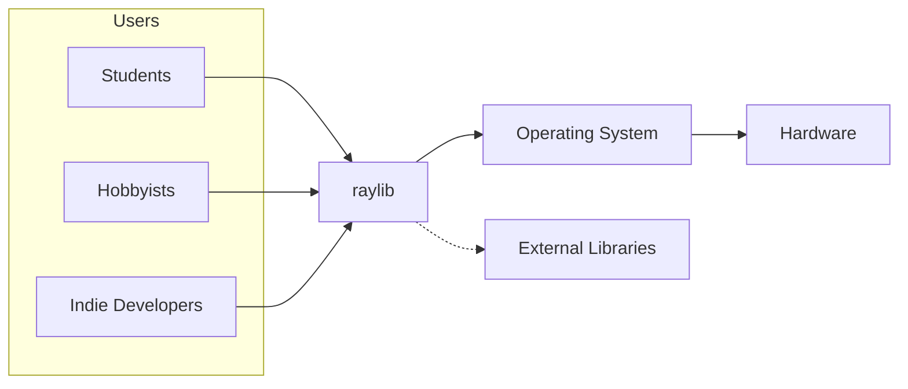
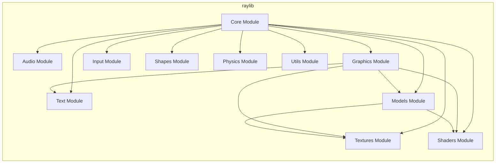

Okay, let's create a design document for the raylib project, focusing on aspects relevant for threat modeling.

# BUSINESS POSTURE

raylib is a simple and easy-to-use library to enjoy videogames programming. It's primarily targeted at students, hobbyists, and indie developers looking for a straightforward way to create games and graphical applications without the complexity of larger engines.  The project prioritizes ease of use, a clean API, and cross-platform compatibility.

Business Priorities:

*   Provide a user-friendly and accessible game development library.
*   Maintain a clean, well-documented, and easy-to-understand codebase.
*   Support a wide range of platforms (Windows, macOS, Linux, Web, Android, iOS, Raspberry Pi).
*   Foster a welcoming and helpful community.
*   Ensure the library remains lightweight and performant.
*   Provide examples and tools to help users get started quickly.

Business Goals:

*   Increase adoption among target audiences (students, hobbyists, indie developers).
*   Maintain a high level of user satisfaction.
*   Expand platform support and feature set based on community feedback.
*   Establish raylib as a viable alternative to more complex game development libraries.

Most Important Business Risks:

*   Malicious code injection: Given that raylib is a library that gets compiled into other applications, a vulnerability in raylib could be exploited to compromise applications built with it. This is the most significant risk.
*   Denial of Service (DoS): While raylib itself isn't a network service, vulnerabilities could lead to crashes or hangs in applications using it, effectively causing a DoS for those applications.
*   Data breaches: While raylib doesn't directly handle sensitive user data in most cases, if used improperly in an application, it could be involved in data breaches (e.g., displaying sensitive information without proper authorization checks).
*   Supply chain attacks: Compromise of the build system or distribution channels could lead to malicious versions of raylib being distributed.
*   Reputational damage: Security vulnerabilities or significant bugs could damage the reputation of raylib and discourage adoption.

# SECURITY POSTURE

Existing Security Controls:

*   security control: Code reviews: The project appears to use pull requests on GitHub, which implies some level of code review before merging changes. (Described in GitHub repository's contribution guidelines).
*   security control: Static analysis: Some static analysis is mentioned in the build files (e.g., `STATIC_ANALYZER` flag), suggesting the use of tools like clang-tidy or similar. (Described in build files and makefiles).
*   security control: Community feedback: The open-source nature of the project allows for community scrutiny and reporting of potential security issues. (Described in GitHub issues and discussions).
*   security control: Fuzzing: Some fuzzing is used, as indicated by the presence of fuzzing-related files and mentions in the repository. (Described in `src/fuzzing`).
*   security control: Examples and documentation: The extensive examples and documentation help users understand how to use the library correctly, potentially avoiding some security pitfalls. (Described in `examples` directory and website).

Accepted Risks:

*   accepted risk: Limited formal security audits: There's no indication of regular, professional security audits.
*   accepted risk: Reliance on third-party libraries: raylib depends on several external libraries (e.g., OpenGL, GLFW), which introduce their own security risks.
*   accepted risk: User-controlled input: raylib processes user input (keyboard, mouse, gamepad), which is a common source of vulnerabilities if not handled carefully.

Recommended Security Controls:

*   Integrate SAST tools into the CI/CD pipeline (e.g., GitHub Actions) to automatically scan for vulnerabilities on every commit.
*   Implement DAST to test the compiled library and examples for runtime vulnerabilities.
*   Establish a clear security policy and vulnerability disclosure process.
*   Consider using a Software Bill of Materials (SBOM) to track dependencies and their vulnerabilities.
*   Perform regular penetration testing, especially focusing on input handling and external library interactions.

Security Requirements:

*   Authentication: Not directly applicable to raylib itself, as it's a library, not a service. However, applications built with raylib might require authentication, which should be handled securely by the application developer.
*   Authorization: Similar to authentication, authorization is the responsibility of the application developer using raylib. raylib doesn't provide authorization mechanisms directly.
*   Input Validation: raylib must carefully validate all input it receives, including user input (keyboard, mouse, gamepad), file data (textures, models), and data from external libraries. This is crucial to prevent vulnerabilities like buffer overflows, format string bugs, and injection attacks.
*   Cryptography: If raylib is used for any cryptographic operations (e.g., encrypting save files), it should use well-vetted cryptographic libraries and follow best practices.  It's generally recommended *not* to implement custom cryptography.

# DESIGN

## C4 CONTEXT



C4 Context Element List:

*   1.  Name: Students
    *   Type: User
    *   Description: Students learning game development.
    *   Responsibilities: Use raylib to create games and graphical applications.
    *   Security controls: N/A (Users of the library)

*   2.  Name: Hobbyists
    *   Type: User
    *   Description: Individuals creating games for fun.
    *   Responsibilities: Use raylib to create games and graphical applications.
    *   Security controls: N/A (Users of the library)

*   3.  Name: Indie Developers
    *   Type: User
    *   Description: Small independent game developers.
    *   Responsibilities: Use raylib to create games and graphical applications.
    *   Security controls: N/A (Users of the library)

*   4.  Name: raylib
    *   Type: System
    *   Description: The core raylib library.
    *   Responsibilities: Provide a simple API for graphics, input, audio, and other game development functionalities.
    *   Security controls: Input validation, static analysis, fuzzing, code reviews.

*   5.  Name: Operating System
    *   Type: System
    *   Description: The underlying operating system (Windows, macOS, Linux, etc.).
    *   Responsibilities: Provide system resources and APIs to raylib.
    *   Security controls: OS-level security mechanisms (e.g., ASLR, DEP).

*   6.  Name: Hardware
    *   Type: System
    *   Description: The physical hardware (CPU, GPU, input devices).
    *   Responsibilities: Execute the compiled code.
    *   Security controls: Hardware-level security features (e.g., secure boot).

*   7.  Name: External Libraries
    *   Type: System
    *   Description: Libraries that raylib depends on (e.g., OpenGL, GLFW).
    *   Responsibilities: Provide specific functionalities (e.g., graphics rendering, window management).
    *   Security controls: Rely on the security of the external libraries themselves.

## C4 CONTAINER



C4 Container Element List:

*   1.  Name: Core Module
    *   Type: Container
    *   Description: The central module of raylib, providing basic functionalities and initialization.
    *   Responsibilities: Initialize and manage other modules, provide core functions.
    *   Security controls: Input validation, error handling.

*   2.  Name: Audio Module
    *   Type: Container
    *   Description: Handles audio loading, playback, and management.
    *   Responsibilities: Load and play audio files, manage audio streams.
    *   Security controls: Input validation (audio file formats), resource management.

*   3.  Name: Graphics Module
    *   Type: Container
    *   Description: Provides functions for drawing 2D and 3D graphics.
    *   Responsibilities: Render graphics, manage windows and contexts.
    *   Security controls: Input validation (drawing parameters), resource management.

*   4.  Name: Input Module
    *   Type: Container
    *   Description: Handles user input (keyboard, mouse, gamepad).
    *   Responsibilities: Process and provide input events.
    *   Security controls: Input validation, sanitization.

*   5.  Name: Text Module
    *   Type: Container
    *   Description: Provides functions for text rendering and manipulation.
    *   Responsibilities: Render text, handle fonts.
    *   Security controls: Input validation (text strings), resource management.

*   6.  Name: Shapes Module
    *   Type: Container
    *   Description: Provides functions for drawing basic shapes.
    *   Responsibilities: Draw shapes (rectangles, circles, etc.).
    *   Security controls: Input validation (shape parameters).

*   7.  Name: Textures Module
    *   Type: Container
    *   Description: Handles texture loading, management, and drawing.
    *   Responsibilities: Load and manage textures, draw textures.
    *   Security controls: Input validation (texture file formats), resource management.

*   8.  Name: Models Module
    *   Type: Container
    *   Description: Handles 3D model loading, management, and drawing.
    *   Responsibilities: Load and manage 3D models, draw models.
    *   Security controls: Input validation (model file formats), resource management.

*   9.  Name: Shaders Module
    *   Type: Container
    *   Description: Handles shader loading, management, and application.
    *   Responsibilities: Load and manage shaders, apply shaders to rendering.
    *   Security controls: Input validation (shader code), resource management.

*   10. Name: Physics Module
    *   Type: Container
    *   Description: Provides basic 2D physics functionalities.
    *   Responsibilities: Simulate physics interactions.
    *   Security controls: Input validation (physics parameters).

*   11. Name: Utils Module
    *   Type: Container
    *   Description: Provides utility functions and helpers.
    *   Responsibilities: Provide various utility functions.
    *   Security controls: Input validation (where applicable).

## DEPLOYMENT

raylib is a library, so "deployment" in the traditional sense (like deploying a web server) doesn't apply directly. Instead, raylib is *integrated* into other applications. However, we can describe how raylib itself is built and distributed, and how applications using it would be deployed.

Possible Deployment Solutions:

1.  Static Linking: The raylib library is compiled directly into the application executable. This is the simplest approach for distribution.
2.  Dynamic Linking: The raylib library is distributed as a separate dynamic library (DLL on Windows, .so on Linux, .dylib on macOS) that the application loads at runtime. This allows for smaller application executables and easier updates to raylib, but requires the dynamic library to be present on the target system.
3.  WebAssembly (WASM): For web deployment, raylib is compiled to WebAssembly, allowing it to run in web browsers.
4.  Package Managers: raylib is available through various package managers (vcpkg, apt, pacman, etc.), simplifying installation for developers.

Chosen Solution (Static Linking - for simplicity and broadest applicability):

```mermaid
graph LR
    subgraph Development Machine
        A[Source Code]
        B[Build System (CMake/Make)]
        C[Compiler (GCC/Clang/MSVC)]
        D[Static Library (raylib.a/.lib)]
    end
    subgraph Application Project
        E[Application Source Code]
        F[Application Build System]
        G[Compiler]
        H[Application Executable]
    end
    A --> B
    B --> C
    C --> D
    D --> F
    E --> F
    F --> G
    G --> H

```

Deployment Element List:

*   1.  Name: Source Code
    *   Type: File
    *   Description: The raylib source code.
    *   Responsibilities: Provide the implementation of the library.
    *   Security controls: Code reviews, static analysis.

*   2.  Name: Build System (CMake/Make)
    *   Type: Tool
    *   Description: The build system used to configure and build raylib.
    *   Responsibilities: Manage the build process, dependencies, and configuration.
    *   Security controls: Secure configuration, dependency management.

*   3.  Name: Compiler (GCC/Clang/MSVC)
    *   Type: Tool
    *   Description: The compiler used to compile the source code.
    *   Responsibilities: Translate the source code into machine code.
    *   Security controls: Compiler security flags (e.g., stack protection, ASLR).

*   4.  Name: Static Library (raylib.a/.lib)
    *   Type: File
    *   Description: The compiled static library.
    *   Responsibilities: Provide the compiled code for linking into applications.
    *   Security controls: Integrity checks (e.g., checksums).

*   5.  Name: Application Source Code
    *   Type: File
    *   Description: The source code of the application using raylib.
    *   Responsibilities: Implement the application's logic.
    *   Security controls: Application-specific security controls.

*   6.  Name: Application Build System
    *   Type: Tool
    *   Description: The build system used to build the application.
    *   Responsibilities: Manage the application's build process.
    *   Security controls: Secure configuration, dependency management.

*   7.  Name: Compiler
    *   Type: Tool
    *   Description: The compiler used to compile the application.
    *   Responsibilities: Translate the application's source code into machine code.
    *   Security controls: Compiler security flags.

*   8.  Name: Application Executable
    *   Type: File
    *   Description: The final executable of the application.
    *   Responsibilities: Run the application.
    *   Security controls: Code signing, integrity checks.

## BUILD

```mermaid
graph LR
    subgraph Developer Workstation
        A[Developer]
        B[IDE/Text Editor]
        C[Git]
        D[Source Code]
    end
    subgraph GitHub Repository
        E[raylib Repository]
    end
    subgraph CI/CD (GitHub Actions)
        F[Build Server]
        G[CMake/Make]
        H[Compiler (GCC/Clang/MSVC)]
        I[Static Analysis Tools]
        J[Tests]
        K[Artifacts (raylib.a, .lib, .so, .dll, .dylib)]
    end
     subgraph Package Managers/Distribution
        L[vcpkg]
        M[apt]
        N[pacman]
        O[Website/Releases]
    end
    A --> B
    B --> D
    D --> C
    C --> E
    E --> F: Pull Request/Push
    F --> G
    G --> H
    H --> I
    H --> J
    J --> K
    K --> L
    K --> M
    K --> N
    K --> O

```

Build Process Description:

1.  Developers write code using an IDE or text editor.
2.  Changes are tracked using Git and pushed to the GitHub repository.
3.  Pull requests trigger the CI/CD pipeline (GitHub Actions).
4.  The build server checks out the code.
5.  CMake or Make is used to configure the build.
6.  The compiler (GCC, Clang, or MSVC) compiles the code.
7.  Static analysis tools (like clang-tidy) are run to check for potential issues.
8.  Tests are executed to ensure functionality and stability.
9.  Build artifacts (static libraries, dynamic libraries) are generated.
10. Artifacts are made available through package managers (vcpkg, apt, pacman) and on the raylib website/releases page.

Build Security Controls:

*   security control: CI/CD Pipeline: Automated build and testing on every commit/pull request. (Implemented in GitHub Actions).
*   security control: Static Analysis: Use of static analysis tools to identify potential vulnerabilities. (Implemented in build scripts and CI/CD).
*   security control: Dependency Management: Tracking and managing dependencies to minimize the risk of using vulnerable libraries. (Partially addressed through CMake/Make and package managers).
*   security control: Code Signing: While not explicitly mentioned, code signing of releases would be a recommended security control to ensure authenticity and integrity.

# RISK ASSESSMENT

Critical Business Processes:

*   Game/Application Development: The primary process is enabling users to create games and applications.  A vulnerability in raylib could disrupt this process for many users.
*   Community Engagement: Maintaining a healthy and active community is crucial for the project's success. Security issues could damage trust and discourage participation.
*   Cross-Platform Development: Supporting multiple platforms is a key feature. Vulnerabilities specific to certain platforms could hinder this.

Data Protection:

*   Source Code: The raylib source code itself is the primary data asset.  Compromise of the repository could lead to malicious code injection. Sensitivity: Medium (publicly available, but integrity is critical).
*   User-Provided Data (within applications built with raylib): raylib doesn't directly handle sensitive user data, but applications built with it might.  This could include game saves, user profiles, or any other data the application manages. Sensitivity: Varies greatly depending on the application. raylib's responsibility is to provide the tools for secure handling, but the application developer is ultimately responsible.
*   Build Artifacts: The compiled libraries (static and dynamic) are important to protect.  Compromise could lead to widespread distribution of malicious code. Sensitivity: High.

# QUESTIONS & ASSUMPTIONS

Questions:

*   Are there any specific compliance requirements (e.g., GDPR, CCPA) that applications built with raylib are expected to meet? (This would influence guidance to developers using the library).
*   What is the expected level of security expertise of the average raylib user? (This helps tailor security recommendations).
*   Are there plans for more formal security audits or penetration testing in the future?
*   What is the process for handling security vulnerability reports?
*   Is there a specific threat model already in place (even informally) that's used by the core developers?

Assumptions:

*   BUSINESS POSTURE: The primary users of raylib are students, hobbyists, and indie developers, who may have limited security expertise.
*   BUSINESS POSTURE: The project prioritizes ease of use and accessibility over maximum security.
*   SECURITY POSTURE: There is a reliance on community contributions and open-source scrutiny for security.
*   SECURITY POSTURE: The project has limited resources for dedicated security personnel or extensive security testing.
*   DESIGN: The build process relies heavily on GitHub Actions for automation.
*   DESIGN: Most users will likely use static linking for simplicity.
*   DESIGN: The project uses CMake as primary build system.