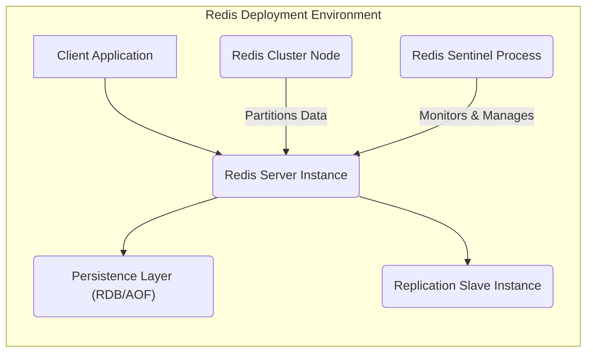
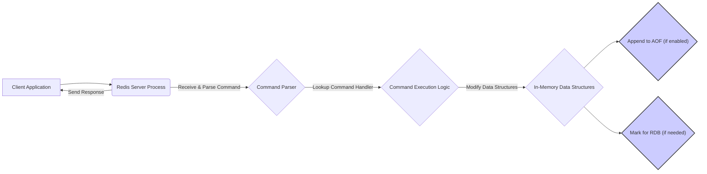
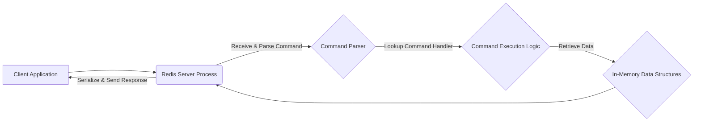
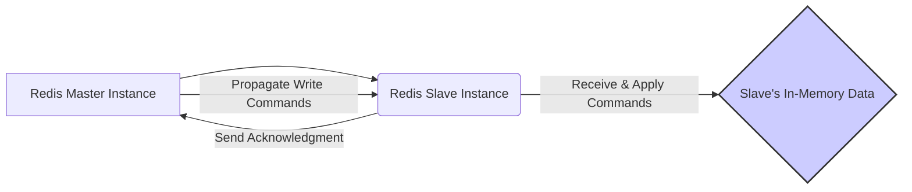
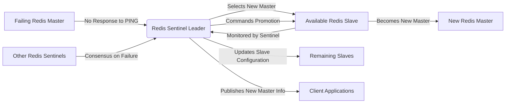

## Project Design Document: Redis (Improved)

**1. Introduction**

This document provides an enhanced architectural design of the Redis project, an open-source, in-memory data structure store, utilized as a database, cache, and message broker. This improved version aims to offer a more detailed and structured overview of the system's components, data flow, and crucial architectural decisions, specifically tailored for effective threat modeling. The design is based on the publicly available source code and documentation of the Redis project found at [https://github.com/redis/redis](https://github.com/redis/redis). This document builds upon the previous version by adding more granular details and clarifying certain aspects.

**2. Project Goals**

The fundamental goals of the Redis project are to deliver:

*   **Exceptional Performance:**  Achieving minimal latency and high throughput for data read and write operations.
*   **Versatile Data Structures:** Supporting a rich set of data structures including strings, lists, sets, sorted sets, hashes, streams, bitmaps, hyperloglogs, and geospatial indexes, catering to diverse use cases.
*   **Robust Persistence Options:** Offering flexible mechanisms for persisting data to disk, ensuring durability through both point-in-time snapshots (RDB) and append-only logs (AOF).
*   **Horizontal Scalability:** Enabling the distribution of data and workload across multiple nodes through Redis Cluster, facilitating handling of larger datasets and higher traffic volumes.
*   **High Availability and Reliability:** Providing mechanisms for ensuring continuous operation and data availability through replication and the Sentinel monitoring system.
*   **Developer Simplicity:** Offering an intuitive API and straightforward configuration, making it easy for developers to integrate and use Redis.
*   **Functional Extensibility:** Allowing developers to extend Redis's core capabilities through the use of custom modules, adding specialized functionalities.

**3. High-Level Architecture**

Redis employs a client-server model where client applications interact with a central Redis server instance. To enhance scalability and availability, Redis supports replication for data redundancy and clustering for data sharding.

**4. Detailed Component Breakdown**

This section provides a more in-depth breakdown of the key components within the Redis system:

*   **Redis Server Core Process:**
    *   The primary process responsible for listening for client connections on a specified port.
    *   Manages the event loop, handling incoming client requests in a non-blocking manner.
    *   Parses and validates client commands.
    *   Executes commands against the in-memory data structures.
    *   Manages memory allocation and implements eviction policies (e.g., LRU, LFU) when `maxmemory` is reached.
    *   Orchestrates background tasks such as RDB saving, AOF rewriting, and expiring keys.
    *   Coordinates replication with slave instances, sending updates and handling acknowledgments.
    *   Participates in cluster operations, managing data sharding and communication with other cluster nodes.
    *   Provides an interface for loading and managing Redis modules.
    *   Handles Lua script execution within the server context.
*   **Client Libraries (e.g., redis-py, Jedis, node-redis):**
    *   Provide language-specific APIs for interacting with the Redis server using the Redis protocol.
    *   Handle connection pooling and management for efficient communication.
    *   Serialize client commands into the Redis protocol format.
    *   Deserialize responses from the Redis server.
    *   Often provide higher-level abstractions and utilities for common Redis operations.
*   **Persistence Subsystem:**
    *   **RDB (Redis Database) Mechanism:**
        *   Creates point-in-time snapshots of the entire dataset in memory and writes it to a binary file on disk (`dump.rdb` by default).
        *   Can be triggered manually using the `SAVE` or `BGSAVE` commands, or automatically based on configured save points (e.g., save after N seconds if M keys changed).
        *   `BGSAVE` performs the save operation in a background process, minimizing blocking of the main server process.
    *   **AOF (Append Only File) Mechanism:**
        *   Appends every write operation (command) received by the server to a log file (`appendonly.aof` by default).
        *   Offers different `fsync` policies (`always`, `everysec`, `no`) to control the frequency of writing to disk, balancing durability and performance.
        *   Supports AOF rewriting (`BGREWRITEAOF`) to compact the AOF file by creating a new, smaller file containing the minimal set of commands to recreate the current dataset.
*   **Replication Components:**
    *   **Master Instance:** The primary Redis server that handles both read and write operations.
    *   **Slave Instance(s):**  Read-only copies of the master instance. They receive updates from the master and apply them to their own datasets.
    *   **Replication Handshake:** The initial synchronization process where a slave requests a full copy of the master's data.
    *   **Command Propagation:** The ongoing process where the master sends write commands to its slaves.
    *   **Asynchronous Replication:**  Slaves acknowledge receipt of commands, but the master doesn't wait for all slaves to acknowledge before proceeding.
*   **Redis Sentinel Cluster:**
    *   **Sentinel Processes:** Independent processes that monitor the health and status of Redis master and slave instances.
    *   **Quorum:** The minimum number of Sentinels required to agree on the failure of a master.
    *   **Leader Election:** When a master fails, Sentinels elect a leader among themselves to coordinate the failover process.
    *   **Failover Process:** The process of promoting a slave to become the new master when the current master is deemed unavailable.
    *   **Configuration Updates:** Sentinels automatically update the configuration of other Sentinels and clients about the new master.
*   **Redis Cluster Components:**
    *   **Master Nodes:**  Hold a subset of the cluster's data.
    *   **Slave Nodes (Replicas):** Provide redundancy for master nodes within the cluster.
    *   **Hash Slots:** The key space is divided into 16384 hash slots. Each master node is responsible for a range of these slots.
    *   **Cluster Bus:** A separate TCP bus used for communication between cluster nodes (gossip protocol, failure detection, data migration).
    *   **Client Redirection:** When a client sends a request to a node that doesn't hold the key, the node redirects the client to the correct node using `MOVED` or `ASK` redirects.
*   **Redis Modules:**
    *   Dynamically loadable libraries that extend Redis functionality.
    *   Can introduce new data types, commands, and features.
    *   Examples: `RedisJSON` for JSON document storage, `RediSearch` for full-text indexing, `RedisBloom` for probabilistic data structures.
*   **Configuration File (redis.conf):**
    *   A text file containing configurable parameters for the Redis server instance.
    *   Includes settings for networking (port, bind address), persistence (RDB, AOF), replication, security (requirepass, ACL), memory management, and performance tuning.
*   **Command Line Interface (redis-cli):**
    *   A utility for interacting with the Redis server from the command line.
    *   Allows executing Redis commands, monitoring server statistics, and performing administrative tasks.
*   **Pub/Sub Engine:**
    *   Enables asynchronous message passing between publishers and subscribers.
    *   Clients can subscribe to specific channels and receive messages published to those channels.
    *   Supports pattern matching for subscribing to multiple channels.
*   **Streams Data Structure:**
    *   A log-like data structure that allows for storing and consuming sequences of data entries.
    *   Supports consumer groups for distributing messages among multiple consumers in a reliable way.
*   **Lua Scripting Engine:**
    *   Allows executing Lua scripts directly on the Redis server.
    *   Enables atomic execution of complex operations, reducing network round trips.
    *   Scripts have access to Redis commands and data.

**5. Data Flow Diagrams**

This section provides more detailed illustrations of data flow within the Redis system for various operations.

*   **Detailed Client Write Operation:**

*   **Detailed Client Read Operation:**

*   **Replication Data Flow:**

*   **Sentinel-Initiated Failover Sequence:**

**6. Security Considerations (Expanded)**

This section provides a more detailed examination of security considerations for the Redis project:

*   **Authentication and Authorization:**
    *   **Password Authentication (`requirepass`):**  A global password required for clients to authenticate using the `AUTH` command. Susceptible to brute-force attacks if the password is weak.
    *   **Access Control Lists (ACLs - Redis 6+):**  A more granular mechanism for controlling access to Redis resources. Allows defining users with specific permissions for commands, keys, and channels. Mitigates the risk of unauthorized command execution.
    *   **Security Best Practice:** Always enable authentication. Utilize strong, randomly generated passwords or leverage ACLs for fine-grained control.
*   **Network Security:**
    *   **Port Exposure:** The default Redis port (6379) is well-known. Leaving it open to the public internet is a significant risk.
    *   **Lack of Encryption (Pre-Redis 6):**  Communication between clients and the server was unencrypted, making it vulnerable to eavesdropping.
    *   **TLS/SSL Support (Redis 6+):**  Provides encryption for client-server communication, protecting data in transit.
    *   **Security Best Practice:**  Restrict network access using firewalls. Utilize TLS/SSL for encryption. Consider using a VPN for added security.
*   **Command Security:**
    *   **Dangerous Commands:** Commands like `FLUSHALL`, `CONFIG`, `EVAL` can be abused by malicious actors.
    *   **Command Renaming (`rename-command`):**  A mechanism to disable or rename potentially dangerous commands.
    *   **ACL Command Restrictions:** ACLs can restrict which users can execute specific commands.
    *   **Security Best Practice:**  Disable or rename dangerous commands. Use ACLs to restrict command access based on user roles.
*   **Data Security:**
    *   **Data at Rest:** Data stored in RDB and AOF files is not encrypted by default.
    *   **Data in Transit (Pre-Redis 6):**  Vulnerable to interception without TLS.
    *   **Security Best Practice:**  Encrypt the underlying storage where persistence files are located. Use TLS for client-server communication. Consider application-level encryption for sensitive data.
*   **Replication Security:**
    *   **Replication Password (`masterauth`):**  Used for authenticating slaves to the master.
    *   **Unencrypted Replication Traffic (Pre-Redis 6):**  Vulnerable to eavesdropping.
    *   **Security Best Practice:**  Set a strong `masterauth` password. Use TLS for replication traffic (Redis 6+). Secure the network between master and slave instances.
*   **Sentinel Security:**
    *   **Sentinel Authentication (`sentinel auth-pass`):**  Protects Sentinel communication.
    *   **Sentinel Network Exposure:**  Sentinels should also be protected by firewalls.
    *   **Security Best Practice:**  Enable Sentinel authentication. Restrict network access to Sentinel instances.
*   **Cluster Security:**
    *   **Cluster Bus Security (Redis 7+):**  Introduced authentication for the cluster bus communication.
    *   **Network Segmentation:**  Isolating the cluster network can enhance security.
    *   **Security Best Practice:**  Utilize cluster bus authentication. Implement network segmentation for the cluster.
*   **Module Security:**
    *   **Untrusted Modules:**  Malicious modules can compromise the Redis instance.
    *   **Security Best Practice:**  Only use trusted and well-vetted Redis modules. Understand the permissions and capabilities of any loaded module.
*   **Denial of Service (DoS) Attacks:**
    *   **Connection Flooding:**  Overwhelming the server with connection requests.
    *   **Command Abuse:**  Executing resource-intensive commands repeatedly.
    *   **Memory Exhaustion:**  Storing large amounts of data to exhaust server memory.
    *   **Security Best Practice:**  Implement connection limits (`maxclients`). Use `maxmemory` and eviction policies. Implement rate limiting at the network level.
*   **Lua Scripting Security:**
    *   **Script Abuse:**  Malicious scripts can execute arbitrary commands.
    *   **Security Best Practice:**  Restrict access to the `EVAL` command. Carefully review and sanitize Lua scripts. Consider using the `SCRIPT KILL` command to terminate long-running scripts.
*   **Configuration Security:**
    *   **Unprotected Configuration File:**  The `redis.conf` file contains sensitive information.
    *   **Security Best Practice:**  Restrict access to the `redis.conf` file. Avoid storing passwords directly in the configuration file; use environment variables or secure configuration management.

**7. Deployment Considerations (Enhanced)**

*   **Deployment Environments:**
    *   **Bare Metal Servers:**  Provides maximum control over hardware and operating system.
    *   **Virtual Machines (VMs):**  Offers flexibility and isolation.
    *   **Containerized Environments (Docker, Kubernetes):**  Enables portability and scalability.
    *   **Cloud-Managed Services (AWS ElastiCache, Azure Cache for Redis, Google Cloud Memorystore):**  Simplifies deployment, management, and scaling.
*   **Resource Allocation:**
    *   **Memory:**  Crucial for performance. Allocate sufficient memory based on the expected data size and workload. Configure `maxmemory` and eviction policies.
    *   **CPU:**  Impacts command processing speed. Allocate sufficient CPU cores, especially for write-heavy workloads.
    *   **Network Bandwidth:**  Important for replication and client communication. Ensure adequate bandwidth.
    *   **Disk I/O:**  Affects persistence performance (RDB and AOF). Use fast storage for persistence files.
*   **Monitoring and Alerting:**
    *   **Key Metrics:** Monitor CPU usage, memory usage, network traffic, connection counts, replication lag, and error rates.
    *   **Alerting Thresholds:**  Set up alerts for critical metrics to proactively identify and address issues.
    *   **Monitoring Tools:**  Utilize tools like Prometheus, Grafana, and cloud provider monitoring services.
*   **High Availability and Disaster Recovery:**
    *   **Replication:**  Essential for read scalability and basic data redundancy.
    *   **Redis Sentinel:**  Provides automatic failover for improved availability.
    *   **Redis Cluster:**  Offers horizontal scalability and fault tolerance.
    *   **Backup and Restore:**  Regularly back up RDB and AOF files for disaster recovery.
*   **Security Hardening:**
    *   Follow security best practices outlined in the Security Considerations section.
    *   Keep Redis software updated with the latest security patches.
    *   Regularly audit security configurations.

**8. Assumptions and Limitations**

*   This document is based on the general architecture of the Redis project as of the current date and may not reflect the absolute latest bleeding-edge changes or highly specific, custom configurations.
*   The focus remains on the core Redis server and its primary components. Detailed implementation specifics of individual client libraries or intricate external integrations are not exhaustively covered.
*   The security considerations provide a comprehensive overview but should be further investigated and meticulously tailored to the specific nuances of individual deployment environments and precise use case requirements during a dedicated threat modeling exercise.

This improved design document provides a more detailed and structured understanding of the Redis project's architecture, making it a more effective resource for threat modeling and security analysis. The enhanced component descriptions, refined data flow diagrams, and expanded security considerations offer a deeper insight into the system's inner workings and potential vulnerabilities.
