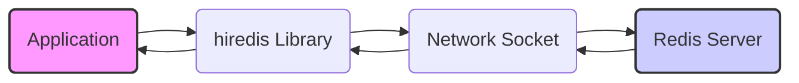

# Project Design Document: hiredis - Minimalistic Redis Client Library in C

**Version:** 1.1
**Date:** October 26, 2023
**Author:** AI Software Architect

## 1. Introduction

This document provides an enhanced design overview of the `hiredis` library, a minimalistic C client library for the Redis database. This document aims to clearly articulate the architecture, components, and data flow within `hiredis`, making it suitable for subsequent threat modeling activities. This revision includes more detailed explanations and ensures adherence to markdown formatting guidelines.

## 2. Goals and Non-Goals

**Goals:**

* Provide a lightweight and efficient C library for interacting with Redis servers.
* Offer both synchronous and asynchronous API interfaces to accommodate various application architectures.
* Support core Redis commands and data types, ensuring compatibility with standard Redis functionalities.
* Be easily embeddable within other applications due to its minimal footprint and lack of complex dependencies.
* Maintain a small codebase with minimal dependencies to reduce the attack surface and simplify maintenance.

**Non-Goals:**

* Implement a full-fledged ORM (Object-Relational Mapper) for Redis; the focus is on low-level communication.
* Provide advanced features like connection pooling or automatic reconnection. These are considered application-level concerns for greater flexibility.
* Offer language bindings for other programming languages. This is the responsibility of separate projects that build upon `hiredis`.
* Include a built-in command-line interface; the library is designed for programmatic interaction.

## 3. Architectural Overview

`hiredis` is architected as a lean communication layer, focusing on the efficient exchange of data between a client application and a Redis server according to the Redis protocol.

**Key Architectural Principles:**

* **Simplicity:** The library prioritizes a straightforward design to minimize complexity, making it easier to understand, audit, and maintain, thus reducing potential vulnerabilities.
* **Efficiency:** Focus on performance through direct socket interaction, minimizing overhead in data serialization and deserialization, and employing efficient memory management techniques.
* **Flexibility:** Provide both synchronous and asynchronous interfaces, allowing developers to choose the interaction model that best suits their application's concurrency requirements.
* **Statelessness (within a connection):** Each connection instance manages its own state independently. This simplifies concurrency management for the application and reduces the risk of state-related errors.

## 4. Component Design

`hiredis` is composed of several interconnected components, each with specific responsibilities:

* **Connection Management:**
    * **Responsibility:** Establishing, maintaining, and closing network connections to the Redis server.
    * **Details:** Handles socket creation (TCP or Unix domain sockets), connection establishment (including error handling during connection attempts), setting connection timeouts (for read and write operations), and gracefully closing connections.
    * **Key Functions:** `redisConnect`, `redisConnectWithTimeout`, `redisFree`.
* **Command Formatting:**
    * **Responsibility:**  Transforming user-provided command arguments into the Redis Serialization Protocol (RESP) format.
    * **Details:**  Takes command names and arguments as input and constructs the byte stream that adheres to the RESP specification for transmission to the Redis server. This involves correctly formatting strings, integers, and bulk data.
    * **Key Functions:** `redisCommand`, `redisFormatCommand`, `redisFormatCommandArgv`.
* **Response Parsing:**
    * **Responsibility:** Interpreting the raw byte stream received from the Redis server according to the RESP format.
    * **Details:**  Parses the incoming byte stream and converts it into C data structures that represent the different Redis data types (e.g., strings, integers, arrays, errors, null values). Handles different RESP types and potential parsing errors.
    * **Key Functions:** `redisReaderCreate`, `redisReaderFeed`, `redisReaderGetReply`.
* **Synchronous API:**
    * **Responsibility:** Providing a blocking interface for sending commands and receiving their responses.
    * **Details:**  Offers functions that encapsulate the entire process of formatting a command, sending it to the server, waiting for the response, and parsing the response before returning the result to the caller. This simplifies basic Redis interactions.
    * **Key Functions:** `redisCommand`, `redisBufferWrite`, `redisBufferRead`.
* **Asynchronous API:**
    * **Responsibility:**  Offering a non-blocking interface for interacting with the Redis server, suitable for event-driven applications.
    * **Details:**  Provides functions to initiate commands without blocking the calling thread. It relies on an event loop (managed by the application) to handle socket events (readiness for reading or writing). Uses callback functions to notify the application when responses are available.
    * **Key Functions:** `redisAsyncConnect`, `redisAsyncCommand`, `redisAsyncHandleRead`, `redisAsyncHandleWrite`, `redisAsyncSetConnectCallback`, `redisAsyncSetDisconnectCallback`.
* **Error Handling:**
    * **Responsibility:** Detecting and reporting errors that occur during various stages of interaction with the Redis server.
    * **Details:**  Provides mechanisms to identify errors related to connection issues, command execution failures on the server, and problems during response parsing. Populates an error structure with an error code and a descriptive message.
    * **Key Structures/Functions:** `redisContext`, `redisContext->err`, `redisContext->errstr`.
* **Memory Management:**
    * **Responsibility:**  Allocating and deallocating memory for connection structures, command buffers, and response objects.
    * **Details:**  Employs careful memory management practices to prevent memory leaks and ensure efficient resource utilization. Provides functions for freeing allocated resources.
    * **Key Functions:** `redisFree`, `redisReplyFree`.

## 5. Data Flow

The data flow illustrates how commands and responses are exchanged between the application and the Redis server using `hiredis`.

The typical data flow for a synchronous command execution:

```mermaid
graph LR
    A("Application calls 'redisCommand()' or similar") --> B("Command Formatting: Arguments are formatted into RESP");
    B --> C("Send command via network socket (write operation)");
    C --> D("Redis Server receives the command");
    D --> E("Redis Server processes the command");
    E --> F("Redis Server sends the response in RESP format");
    F --> G("Receive response via network socket (read operation)");
    G --> H("Response Parsing: RESP data is parsed into C data structures");
    H --> I("Application receives the parsed response");
    style A fill:#f9f,stroke:#333,stroke-width:2px
    style D fill:#ccf,stroke:#333,stroke-width:2px
```

For asynchronous operations, the flow involves an event loop and callbacks:

```mermaid
graph LR
    A("Application calls 'redisAsyncCommand()' or similar") --> B("Command Formatting: Arguments are formatted into RESP");
    B --> C("Command is buffered for sending");
    C --> D("Application's event loop detects socket is ready for writing");
    D --> E("Send command via network socket (write operation)");
    E --> F("Redis Server receives the command");
    F --> G("Redis Server processes the command");
    G --> H("Redis Server sends the response in RESP format");
    H --> I("Application's event loop detects socket is ready for reading");
    I --> J("Receive response via network socket (read operation)");
    J --> K("Response Parsing: RESP data is parsed");
    K --> L("Callback function is invoked with the parsed response");
    style A fill:#f9f,stroke:#333,stroke-width:2px
    style F fill:#ccf,stroke:#333,stroke-width:2px
```

## 6. Security Considerations (Pre-Threat Modeling)

Identifying potential security concerns early is crucial for building robust systems. Here are some considerations for `hiredis`:

* **Buffer Overflows:**
    * **Threat:**  Insufficient bounds checking during command formatting or response parsing could lead to writing beyond allocated buffer boundaries, potentially causing crashes or enabling arbitrary code execution.
    * **Mitigation:**  Careful memory management and strict bounds checking are essential in all data handling routines.
* **Format String Vulnerabilities:**
    * **Threat:** If user-controlled data is directly used in format strings (e.g., with `printf`-like functions), attackers could potentially execute arbitrary code or leak sensitive information.
    * **Mitigation:** Avoid using user-provided data directly in format strings. Use parameterized logging or sanitization techniques.
* **Denial of Service (DoS):**
    * **Threat:** Maliciously crafted commands with extremely large arguments or a flood of connection requests could overwhelm the `hiredis` library or the Redis server, making the application unavailable.
    * **Mitigation:** Implement appropriate timeouts, rate limiting (at the application level), and resource management to prevent resource exhaustion.
* **Connection Security (Lack of Native Encryption):**
    * **Threat:**  `hiredis` itself does not provide encryption. Data transmitted over the network is vulnerable to eavesdropping and tampering if not secured by other means.
    * **Mitigation:**  Applications using `hiredis` should establish secure connections using TLS/SSL via external libraries or by connecting to a Redis instance configured with TLS.
* **Integer Overflows:**
    * **Threat:**  Overflows in integer arithmetic when handling lengths or sizes in command formatting or response parsing could lead to unexpected behavior, including buffer overflows or incorrect memory allocation.
    * **Mitigation:**  Use appropriate data types and perform checks to prevent integer overflows during calculations involving sizes and lengths.
* **Memory Leaks:**
    * **Threat:** Failure to properly deallocate memory after use can lead to memory leaks, potentially causing the application to crash or become unstable over time.
    * **Mitigation:** Implement robust memory management practices, ensuring that all allocated memory is eventually freed, especially in error handling paths.
* **Input Validation (Application Responsibility):**
    * **Threat:** While `hiredis` focuses on protocol handling, the application using it must validate user inputs before sending them as Redis commands. Failure to do so can lead to injection attacks or unexpected behavior on the Redis server.
    * **Mitigation:**  Applications should implement thorough input validation and sanitization to prevent malicious or malformed data from being sent to the Redis server.

## 7. Deployment Considerations

`hiredis` is designed to be easily integrated into applications requiring Redis connectivity.

* **Linking:** The `hiredis` library (either a static library `.a` or a shared library `.so` or `.dll`) needs to be linked with the application during the compilation and linking process.
* **Dependencies:** `hiredis` has minimal external dependencies, primarily relying on the standard C library (`libc`) for core functionalities like socket operations and memory management. This simplifies deployment and reduces the risk of dependency conflicts.
* **Configuration:** Connection parameters such as the Redis server's hostname or IP address, port number, and socket path (for Unix domain sockets) are typically configured programmatically within the application using `hiredis`'s connection functions. Timeouts for connection and operations can also be configured.
* **Thread Safety:**  `hiredis` connection contexts are generally not thread-safe. Applications using `hiredis` in a multithreaded environment should either use a connection per thread or implement appropriate locking mechanisms to protect shared connection resources. The asynchronous API is designed to be used within a single event loop.

## 8. Dependencies

`hiredis` has a very lean dependency profile:

* **Standard C Library (`libc`):** Provides essential functions for memory management (`malloc`, `free`), string manipulation, and socket operations. This is a standard dependency on most systems.

## 9. Future Considerations (Potential Enhancements)

Exploring potential enhancements can further improve the library's functionality and security.

* **Native TLS/SSL Support:** Integrating TLS/SSL support directly within `hiredis` would simplify the process of establishing secure connections to Redis servers, reducing the burden on application developers to manage this externally. This would enhance the security posture by default.
* **Optional Connection Pooling:** While currently a non-goal to maintain simplicity, providing an optional connection pooling mechanism could significantly improve performance for applications that make frequent, short-lived Redis requests by reducing the overhead of establishing new connections repeatedly. This could be implemented as an optional module.
* **Enhanced Error Reporting:** Providing more granular and context-rich error messages could significantly aid in debugging and troubleshooting issues. This could include more specific error codes and more detailed descriptions of the error conditions.
* **Metrics and Monitoring Hooks:** Adding hooks or interfaces for collecting metrics related to connection status, command execution times, and error rates would enable better monitoring and observability of applications using `hiredis`. This could be integrated with common monitoring tools.
* **Improved Documentation and Examples:** Continuously improving the documentation and providing more comprehensive examples can make the library easier to use and reduce the likelihood of developers making mistakes that could lead to security vulnerabilities.

This enhanced design document provides a more detailed and structured overview of the `hiredis` library, suitable for in-depth threat modeling and further development.
