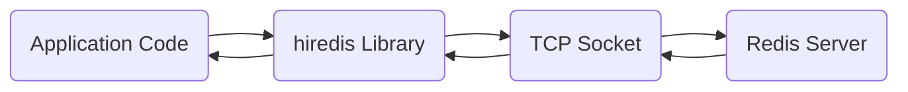
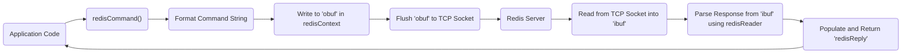

# Project Design Document: hiredis - Minimalistic C client for Redis

**Version:** 1.1
**Date:** October 26, 2023
**Author:** AI Software Architect

## 1. Introduction

This document provides an enhanced design overview of the `hiredis` library, a minimalistic C client library for the Redis database. This revised document aims to provide even greater clarity regarding the architecture, components, and data flow within `hiredis`, specifically tailored for effective threat modeling. We will delve deeper into potential security implications arising from the design choices and interactions.

## 2. Goals

* Provide a lightweight and efficient C library for interacting with Redis servers.
* Offer both synchronous and asynchronous API interfaces for flexible integration.
* Support core Redis features, including command execution, pipelining, and Pub/Sub functionality.
* Maintain a small and focused codebase with minimal external dependencies to reduce the attack surface.
* Ensure portability across various operating systems and architectures.

## 3. Non-Goals

* Implementing high-level data abstraction layers or Object-Relational Mapping (ORM) capabilities on top of Redis.
* Providing comprehensive, built-in connection pooling or advanced connection management features beyond basic connection handling and reconnection.
* Offering extensive security features directly within the library beyond fundamental socket operations. Secure communication (like TLS/SSL) is considered an external concern or handled by the application or underlying system libraries.
* Managing complex data serialization formats beyond the standard Redis protocol.

## 4. Architecture and Design

### 4.1. High-Level Architecture

* **Application Code:** The software application that integrates and utilizes the `hiredis` library to communicate with a Redis server instance.
* **hiredis Library:** The core C library responsible for managing connections, formatting and sending commands according to the Redis protocol, and parsing responses received from the server.
* **TCP Socket:** The fundamental network communication channel established over TCP/IP, facilitating data exchange between the client and the Redis server.
* **Redis Server:** The backend Redis database instance that receives and processes commands sent by the `hiredis` client and returns corresponding responses.

### 4.2. Component Descriptions

* **Connection Management:**
    * `redisConnect(const char *hostname, int port)`: Establishes a synchronous connection to a Redis server at the specified hostname and port.
    * `redisConnectWithTimeout(const char *hostname, int port, const struct timeval timeout)`: Establishes a synchronous connection with a specified timeout duration.
    * `redisConnectUnix(const char *path)`: Creates a synchronous connection to a Redis server using a Unix domain socket at the given path.
    * `redisConnectUnixWithTimeout(const char *path, const struct timeval timeout)`: Establishes a synchronous connection via a Unix domain socket with a timeout.
    * `redisFree(redisContext *c)`: Closes the connection represented by the `redisContext` and releases all associated memory.
    * `redisReconnect(redisContext *c)`: Attempts to re-establish a lost connection to the Redis server.
    * `redisEnableKeepAlive(redisContext *c, int interval)`: Enables TCP keep-alive probes on the socket to detect connection loss.
    * `redisSetTimeout(redisContext *c, const struct timeval timeout)`: Sets the timeout for socket read and write operations. The `redisContext` structure holds connection-specific information including the socket descriptor, read/write buffers, and error status.
* **Command Handling:**
    * `redisCommand(redisContext *c, const char *format, ...)`: Sends a formatted command string to the Redis server and waits for the complete response (synchronous operation).
    * `redisvCommand(redisContext *c, const char *format, va_list ap)`: Similar to `redisCommand` but accepts arguments using a `va_list` for variable arguments.
    * `redisAppendCommand(redisContext *c, const char *format, ...)`: Adds a command to the output buffer for pipelining. This allows sending multiple commands without waiting for a response after each one (asynchronous in terms of immediate response).
    * `redisAppendFormattedCommand(redisContext *c, const char *cmd, size_t len)`: Appends a pre-formatted command string of a specific length to the output buffer.
    * `redisBufferWrite(redisContext *c, int *done)`: Flushes the contents of the output buffer to the underlying socket.
* **Response Handling:**
    * `redisGetReply(redisContext *c, void **reply)`: Receives and parses a single reply from the Redis server. The parsed reply is stored in a `redisReply` structure. This is a blocking operation.
    * `redisBufferRead(redisContext *c)`: Reads data from the socket into the input buffer associated with the `redisContext`.
    * `redisReaderCreate()`: Initializes a `redisReader` structure, which is responsible for parsing the Redis protocol from the raw socket data.
    * `redisReaderFeed(redisReader *r, const char *buf, size_t len)`: Feeds raw data received from the socket to the `redisReader` for parsing.
    * `redisReaderGetReply(redisReader *r)`: Attempts to retrieve a parsed `redisReply` structure from the `redisReader`.
    * `redisReaderFree(redisReader *r)`: Releases the memory associated with a `redisReader` structure. The `redisReply` structure can represent different data types (strings, integers, arrays, errors, nil) based on the Redis protocol.
* **Asynchronous API (using `ae` event loop):**
    * `redisAsyncConnect(const char *hostname, int port, redisCallbackFn *connectCallback)`: Initiates an asynchronous connection to a Redis server, invoking a callback function upon connection establishment.
    * `redisAsyncConnectWithTimeout(const char *hostname, int port, const struct timeval timeout, redisCallbackFn *connectCallback)`: Asynchronous connection with a timeout.
    * `redisAsyncConnectUnix(const char *path, redisCallbackFn *connectCallback)`: Asynchronous connection via Unix domain socket.
    * `redisAsyncConnectUnixWithTimeout(const char *path, const struct timeval timeout, redisCallbackFn *connectCallback)`: Asynchronous Unix domain socket connection with a timeout.
    * `redisAsyncDisconnect(redisAsyncContext *ac)`: Disconnects an asynchronous connection.
    * `redisAsyncCommand(redisAsyncContext *ac, redisCallbackFn *fn, void *privdata, const char *format, ...)`: Sends a command asynchronously, invoking a callback function with the reply when it is received.
    * Callback functions (`redisCallbackFn`) are defined by the user to handle connection events (connect, disconnect) and incoming replies. The `redisAsyncContext` manages the asynchronous connection state.
* **Error Handling:**
    * `redisGetError(const redisContext *c)`: Retrieves a human-readable error string associated with the connection.
    * `redisSetError(redisContext *c, int type, const char *str)`: Sets the error state for a given connection.
    * Error codes are defined as macros in `hiredis.h` (e.g., `REDIS_ERR_IO`, `REDIS_ERR_EOF`).
* **Data Structures (Key Members for Threat Modeling):**
    * `redisContext`:
        * `int fd`: The file descriptor of the socket connection.
        * `int flags`: Flags indicating the connection state (e.g., connected, in error).
        * `char *obuf`: Output buffer used for sending commands. Understanding the size and management of this buffer is crucial for assessing potential buffer overflow vulnerabilities.
        * `int obuf_len`: Current length of data in the output buffer.
        * `int obuf_pos`: Current write position in the output buffer.
        * `char *ibuf`: Input buffer for receiving responses. Similar buffer size and management concerns as the output buffer.
        * `int ibuf_len`: Current length of data in the input buffer.
        * `int ibuf_pos`: Current read position in the input buffer.
        * `int err`: Error code.
        * `char errstr[128]`: Error message string.
    * `redisReply`:
        * `int type`: Type of the reply (e.g., `REDIS_REPLY_STRING`, `REDIS_REPLY_ARRAY`).
        * `long long integer`: Integer value (if type is `REDIS_REPLY_INTEGER`).
        * `struct redisReply **element`: Array of `redisReply` pointers (if type is `REDIS_REPLY_ARRAY`). Understanding the allocation and bounds checking of this array is important.
        * `char *str`: String value (if type is `REDIS_REPLY_STRING` or `REDIS_REPLY_ERROR`).
        * `size_t len`: Length of the string value.

### 4.3. Data Flow

#### 4.3.1. Synchronous Command Execution

1. **Application Code** initiates a command execution by calling `redisCommand()` with the desired command and arguments.
2. **`redisCommand()`** formats the command string according to the Redis protocol specification.
3. The formatted command is written into the **output buffer (`obuf`)** within the `redisContext` structure.
4. The contents of the **output buffer are flushed** to the **Redis Server** via the established TCP socket.
5. The **Redis Server** processes the received command and sends the corresponding response back to the client's socket.
6. Data from the socket is read into the **input buffer (`ibuf`)** of the `redisContext`.
7. The **`redisReader`** parses the response data from the input buffer according to the Redis protocol.
8. A **`redisReply`** structure is populated with the parsed response data and then **returned** to the application code.

#### 4.3.2. Asynchronous Command Execution

```mermaid
graph LR
    A("Application Code") --> B("redisAsyncCommand()");
    B --> C("Format Command String");
    C --> D("Append to Output Buffer in redisAsyncContext");
    D --> E("Event Loop (ae) monitors socket");
    E -- "Socket Write Ready" --> F("Flush Output Buffer");
    F --> G("Redis Server");
    G --> H("Socket Read Event");
    H --> I("Receive Response into Input Buffer");
    I --> J("Parse Response using redisReader");
    J --> K("Invoke Callback Function with 'redisReply'");
    K --> A;
```

1. **Application Code** calls `redisAsyncCommand()` providing the command, arguments, and a callback function.
2. **`redisAsyncCommand()`** formats the command string.
3. The formatted command is appended to the **output buffer** associated with the asynchronous connection context (`redisAsyncContext`).
4. The **event loop (`ae`)** monitors the socket for write readiness.
5. When the socket is ready for writing, the event loop triggers the flushing of the output buffer.
6. The output buffer is **flushed** to the **Redis Server**.
7. The **Redis Server** sends the response back to the client.
8. The event loop detects a **socket read event** when data arrives.
9. The response is **received** from the socket into an input buffer.
10. The response data is **parsed** using the `redisReader`.
11. The user-provided **callback function** is invoked with the parsed **`redisReply`** structure as an argument.

## 5. Security Considerations (for Threat Modeling)

This section details potential security vulnerabilities and attack vectors relevant to `hiredis`, providing a basis for threat modeling activities.

* **Buffer Overflows:**
    * **Response Parsing (`redisReader`):** Maliciously crafted or excessively large responses from the Redis server could potentially overflow the input buffer (`ibuf`) in `redisContext` if bounds checking within `redisReader` is insufficient or flawed. This could lead to arbitrary code execution.
    * **Command Formatting:** While `hiredis` primarily formats commands based on arguments passed to its functions, improper handling or validation of these arguments *before* passing them to `redisCommand` or `redisAppendFormattedCommand` in the application code could lead to the creation of overly long command strings, potentially overflowing the output buffer (`obuf`).
* **Denial of Service (DoS):**
    * **Resource Exhaustion:** Sending a large number of requests (especially using pipelining without proper flow control) can overwhelm the Redis server. While `hiredis` itself doesn't directly cause this, its efficient nature can facilitate such attacks if the application doesn't implement appropriate safeguards.
    * **Memory Exhaustion (Client-Side):** If the application doesn't handle large or numerous responses correctly (e.g., by allocating unbounded memory for array replies), it could lead to memory exhaustion on the client side.
* **Injection Attacks:**
    * **Command Injection:** If user-provided input is directly incorporated into command strings without proper sanitization *before* being passed to `hiredis` functions like `redisCommand` or especially `redisAppendFormattedCommand`, attackers could inject arbitrary Redis commands.
* **Man-in-the-Middle (MITM) Attacks:**
    * **Lack of Encryption:** `hiredis` by itself does not provide built-in encryption. Communication with the Redis server is typically in plain text, making it vulnerable to eavesdropping and data modification by attackers on the network path. Relying on external mechanisms like Stunnel or configuring TLS on the Redis server is crucial for mitigating this.
* **Information Disclosure:**
    * **Unencrypted Communication:** Successful MITM attacks can expose sensitive data transmitted between the client and the Redis server, including application data and potentially authentication credentials if used.
    * **Error Messages:** Verbose error messages returned by the Redis server (and potentially propagated by `hiredis`) might reveal information about the server's internal state or configuration.
* **Memory Management Issues:**
    * **Leaks:** Improper deallocation of memory associated with `redisContext` or `redisReply` structures in the application code can lead to memory leaks over time.
    * **Use-After-Free:**  Incorrectly managing the lifecycle of `redisReply` objects, especially in asynchronous scenarios, could lead to use-after-free vulnerabilities.
* **Dependency Vulnerabilities:**
    * While `hiredis` has minimal dependencies, vulnerabilities in the underlying standard C library (`libc`) could potentially be exploited.
* **Connection Security:**
    * **Authentication Bypass/Weak Authentication:** If the Redis server is not properly configured with strong authentication (using the `AUTH` command, which `hiredis` supports via `redisAuth`), attackers could connect and execute commands without authorization.
* **Integer Overflows/Underflows:**
    * Potential vulnerabilities might exist in calculations related to buffer sizes or timeouts if not handled with sufficient care within the `hiredis` codebase itself.

## 6. Dependencies

* Standard C library (`libc`).
* Optionally, the `ae` event loop library (from the Redis project) is required for using the asynchronous API features. `hiredis` can be compiled without `ae` for purely synchronous usage.

## 7. Deployment Considerations

* `hiredis` is typically compiled and linked directly into the application that requires Redis connectivity.
* Applications using `hiredis` must ensure network connectivity to the target Redis server.
* **Security Best Practices:**
    * **Enable TLS/SSL:**  Secure communication between the application and Redis server using TLS/SSL is highly recommended to prevent MITM attacks. This is usually configured on the Redis server side and might require additional libraries or configurations in the application.
    * **Strong Authentication:** Configure strong authentication on the Redis server and use the `redisAuth()` function in `hiredis` to authenticate connections.
    * **Input Sanitization:**  Thoroughly sanitize any user-provided input before incorporating it into Redis commands to prevent command injection vulnerabilities.
    * **Resource Limits:** Implement appropriate resource limits and flow control mechanisms in the application to prevent DoS attacks against the Redis server and the client application itself.
    * **Regular Updates:** Keep both `hiredis` and the Redis server updated to the latest versions to patch any known security vulnerabilities.

## 8. Future Considerations

* Exploring integration with other asynchronous I/O libraries beyond `ae` for greater flexibility.
* Potential for adding optional built-in support for secure connections (e.g., via a separate module or build option).
* Further optimization of memory management and buffer handling to minimize potential vulnerabilities.
* Enhancements to error reporting and debugging capabilities.

This improved design document provides a more detailed and security-focused overview of the `hiredis` library, serving as a robust foundation for comprehensive threat modeling. The added information on data structure members and explicit security considerations aims to facilitate a deeper understanding of potential attack surfaces.